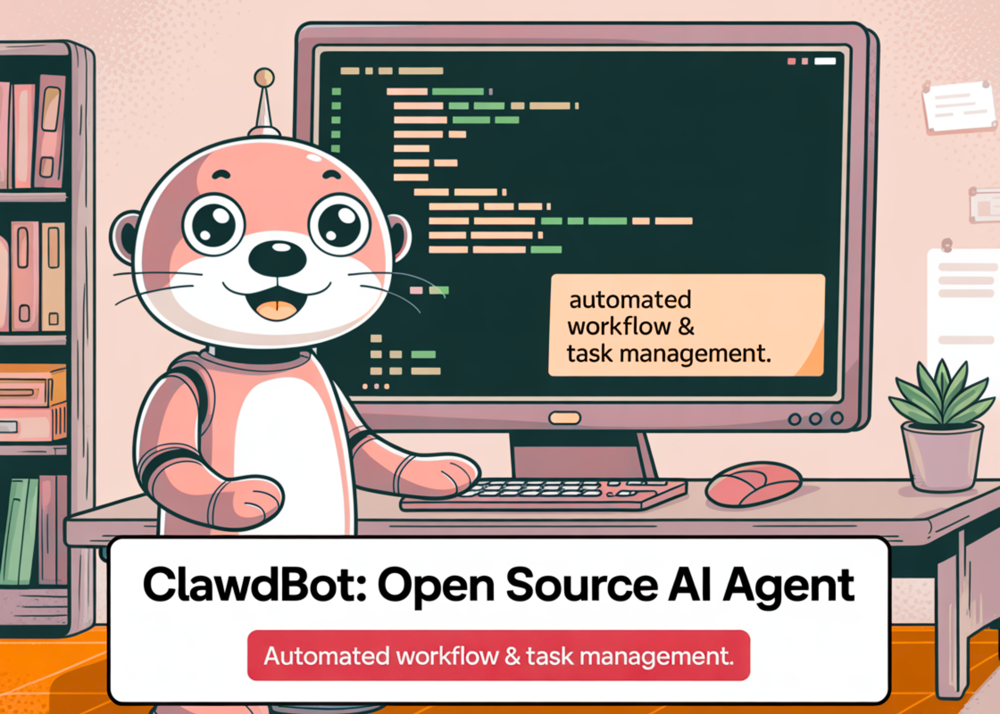

# What is Clawdbot? How a Local First Agent Stack Turns Chats into Real Automations

> Clawdbot is an open source personal AI assistant that you run on your own hardware. It connects large language models from providers such as Anthropic and OpenAI to real tools such as messaging apps, files, shell, browser and smart home devices, while keeping the orchestration layer under your control. The interesting part is not that […]

[Clawdbot ](https://github.com/clawdbot/clawdbot?tab=readme-ov-file)is an open source personal AI assistant that you run on your own hardware. It connects large language models from providers such as Anthropic and OpenAI to real tools such as messaging apps, files, shell, browser and smart home devices, while keeping the orchestration layer under your control.

The interesting part is not that [Clawdbot ](https://clawd.bot/)chats. It is that the project ships a concrete architecture for local first agents, and a typed workflow engine called Lobster that turns model calls into deterministic pipelines.

### Architecture: Gateway, Nodes and Skills

At the center of Clawdbot is the Gateway process. The Gateway exposes a WebSocket control plane on `ws://127.0.0.1:18789` and a local HTTP interface for the control UI and web chat.

Your messages from WhatsApp, Telegram, Signal, Slack, Discord, iMessage and other channels are delivered to the Gateway. The Gateway decides which agent should handle the message, which tools it may call, and which model provider to use. It then sends the reply back over the same channel.

**The runtime is split into a few core concepts:**

- **Gateway**: Routing, model calls, tool invocation, sessions, presence and scheduling.

- **Nodes**: Processes that give Clawdbot access to local resources such as file system, browser automation, microphone, camera or platform specific APIs on macOS, Windows, Linux, iOS and Android.

- **Channels**: Integrations for chat systems like WhatsApp, Telegram, Discord, Slack, Signal, Microsoft Teams, Matrix, Zalo and more. These are configured as channel backends that attach to the Gateway.

- **Skills and plugins**: Tools that the agent can call, described in a standard `SKILL.md` format and distributed through ClawdHub.

This separation lets you run the Gateway on a five dollar virtual server or a spare machine at home, while keeping heavy model compute on remote APIs or local model backends when needed.

### Skills and the SKILL.md standard

Clawdbot uses an open skills format described in `SKILL.md`. A skill is defined in Markdown with a small header and an ordered procedure. For example, a deployment skill might specify steps such as checking git status, running tests and deploying only after success.

```
`---
name: deploy-production
description: Deploy the current branch to production. Use only after tests pass.
disable-model-invocation: true
---
1. Check git status ensuring clean working directory.
2. Run `npm test`
3. If tests pass, run `npm run deploy`
`
```

The Gateway reads these definitions and exposes them to agents as tools with explicit capabilities and safety constraints. Skills are published to ClawdHub and can be installed or composed into larger workflows.

This means that operational runbooks can move from ad-hoc wiki pages into machine executable skills, while still being auditable as text.

### Lobster: Typed Workflow Runtime for Agents

Lobster is the workflow runtime that powers Local Lobster and many advanced Clawdbot automations. It is described as a typed workflow shell that lets Clawdbot run multi step tool sequences as a single deterministic operation with explicit approval gates.

**Instead of having the model call many tools in a loop, Lobster moves orchestration into a small domain specific runtime:**

- Pipelines are defined as JSON or YAML, or as a compact shell like pipeline string.

- Steps exchange typed JSON data, not unstructured text.

- The runtime enforces timeouts, output limits and sandbox policies.

- Workflows can pause on side effects and resume later with a `resumeToken`.

**A simple inbox triage workflow looks like this:**

```
`name: inbox-triage
steps:
  - id: collect
    command: inbox list --json
  - id: categorize
    command: inbox categorize --json
    stdin: $collect.stdout
  - id: approve
    command: inbox apply --approve
    stdin: $categorize.stdout
    approval: required
  - id: execute
    command: inbox apply --execute
    stdin: $categorize.stdout
    condition: $approve.approved
`
```

Clawdbot treats this file as a skill. When you ask it to clean your inbox, it calls one Lobster pipeline instead of improvising many tool calls. The model decides _when_ to run the pipeline and with which parameters, but the pipeline itself stays deterministic and auditable.

Local Lobster is the reference agent that uses Lobster to drive local workflows and is described in coverage as an open source agent that redefines personal AI by pairing local first workflows with proactive behavior.

### Proactive local first behavior

A key reason Clawdbot is trending and visible on X and in developer communities is that it behaves like an operator, not just a chat window.

**Because the Gateway can run scheduled jobs and track state across sessions, common patterns include:**

- Daily briefings that summarize calendars, tasks and important mail.

- Periodic recaps such as weekly shipped work summaries.

- Monitors that watch for conditions, then message you first on your preferred channel.

- File and repository automations that run locally but are triggered by natural language.

All of this runs with routing and tool policy on your machine or server. Model calls still go to providers like Anthropic, OpenAI, Google, xAI or local backends, but the assistant brain, memory and integrations are under your control.

### Installation and developer workflow

The project provides a one line installer that fetches a script from `clawd.bot` and bootstraps Node, the Gateway and core components. For more control, you can install via npm or clone the TypeScript repository and build with pnpm.

**Typical steps:**

```
`curl -fsSL https://clawd.bot/install.sh | bash

# or

npm i -g clawdbot
clawdbot onboard
`
```

After onboarding you connect a channel such as Telegram or WhatsApp, choose a model provider and enable skills. From there you can write your own `SKILL.md` files, build Lobster workflows and expose them through chat, web chat or the macOS companion application.

### Some Examples

> Just ask [@clawdbot](https://twitter.com/clawdbot?ref_src=twsrc%5Etfw) to build and deploy a website with a chat message [https://t.co/I5bQDCK2Ne](https://t.co/I5bQDCK2Ne) [pic.twitter.com/EOa1GlPxJe](https://t.co/EOa1GlPxJe)— Peter Yang (@petergyang) [January 25, 2026](https://twitter.com/petergyang/status/2015248263918850243?ref_src=twsrc%5Etfw)

> Just had Clawdbot set up Ollama with a local model. Now it handles website summaries and simple tasks locally instead of burning API credits.Blown away that an AI just installed another AI to save me money. [pic.twitter.com/RRvXQAgBfX](https://t.co/RRvXQAgBfX)— Max 🇺🇦 (@talkaboutdesign) [January 25, 2026](https://twitter.com/talkaboutdesign/status/2015301102887989479?ref_src=twsrc%5Etfw)

> Clawdbot is controlling LMStudio remotely from telegram, downloading Qwen, which it will then use to power some of my tasks with Clawdbot. 🤯🤯 [pic.twitter.com/ll2adg19Za](https://t.co/ll2adg19Za)— Matthew Berman (@MatthewBerman) [January 25, 2026](https://twitter.com/MatthewBerman/status/2015279167907287494?ref_src=twsrc%5Etfw)

> Clawdbot now takes an idea, manages codex and claude, debates them on reviews autonomously, and lets me know when it’s done. Amazing. A whole feature deployed while I’m out on a walk. [pic.twitter.com/ws3UDQG2S0](https://t.co/ws3UDQG2S0)— Aaron Ng (@localghost) [January 25, 2026](https://twitter.com/localghost/status/2015246928850870523?ref_src=twsrc%5Etfw)
