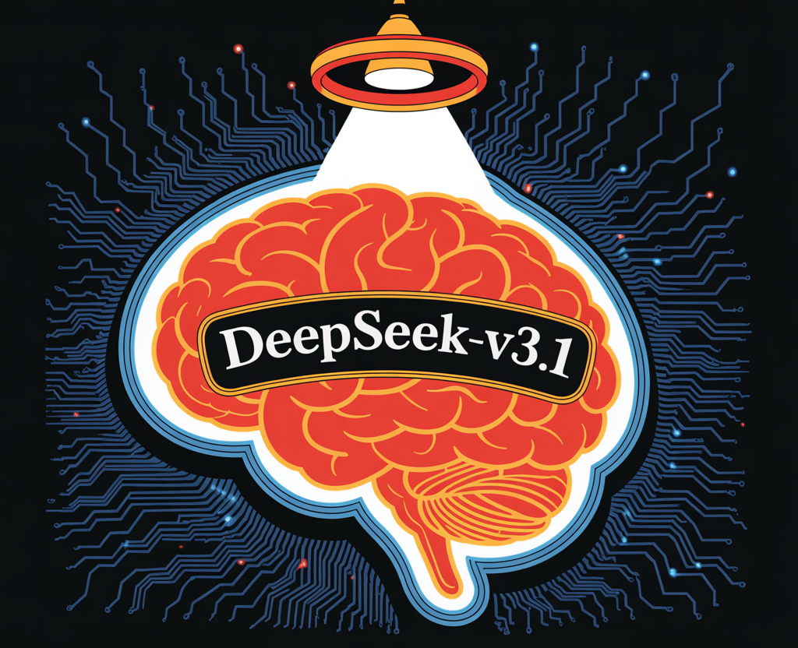

# What is DeepSeek-V3.1 and Why is Everyone Talking About It?

> The Chinese AI startup DeepSeek releases DeepSeek-V3.1, it’s latest flagship language model. It builds on the architecture of DeepSeek-V3, adding significant enhancements to reasoning, tool use, and coding performance. Notably, DeepSeek models have rapidly gained a reputation for delivering OpenAI and Anthropic-level performance at a fraction of the cost. Model Architecture and Capabilities Performance Benchmarks […]

The Chinese AI startup **DeepSeek** releases **DeepSeek-V3.1**, it’s latest flagship language model. It builds on the architecture of **DeepSeek-V3**, adding significant enhancements to reasoning, tool use, and coding performance. Notably, DeepSeek models have rapidly gained a reputation for **delivering OpenAI and Anthropic-level performance at a fraction of the cost**.

### Model Architecture and Capabilities

- **Hybrid Thinking Mode:** DeepSeek-V3.1 supports both **thinking** (chain-of-thought reasoning, more deliberative) and **non-thinking** (direct, stream-of-consciousness) generation, switchable via the chat template. This is a departure from previous versions and offers flexibility for varied use cases.

- **Tool and Agent Support:** The model has been optimized for **tool calling** and **agent tasks** (e.g., using APIs, code execution, search). Tool calls use a structured format, and the model supports custom code agents and search agents, with detailed templates provided in the repository.

- **Massive Scale, Efficient Activation:** The model boasts **671B total parameters**, with **37B activated per token**—a **Mixture-of-Experts (MoE)** design that lowers inference costs while maintaining capacity. The **context window** is **128K tokens**, much larger than most competitors.

- **Long Context Extension:** DeepSeek-V3.1 uses a **two-phase long-context extension** approach. The first phase (32K) was trained on **630B tokens** (10x more than V3), and the second (128K) on **209B tokens** (3.3x more than V3). The model is trained with **FP8 microscaling** for efficient arithmetic on next-gen hardware.

- **Chat Template:** The template supports **multi-turn conversations** with explicit tokens for system prompts, user queries, and assistant responses. The **thinking** and **non-thinking** modes are triggered by `` and `` tokens in the prompt sequence.

### Performance Benchmarks

DeepSeek-V3.1 is **evaluated across a wide range of benchmarks** (see table below), including general knowledge, coding, math, tool use, and agent tasks. Here are highlights:

**Metric****V3.1-NonThinking****V3.1-Thinking****Competitors****MMLU-Redux (EM)**91.893.793.4 (R1-0528)**MMLU-Pro (EM)**83.784.885.0 (R1-0528)**GPQA-Diamond (Pass@1)**74.980.181.0 (R1-0528)**LiveCodeBench (Pass@1)**56.474.873.3 (R1-0528)**AIMÉ 2025 (Pass@1)**49.888.487.5 (R1-0528)**SWE-bench (Agent mode)**54.5—30.5 (R1-0528)

The **thinking mode** consistently matches or exceeds previous state-of-the-art versions, especially in coding and math. The **non-thinking mode** is faster but slightly less accurate, making it ideal for latency-sensitive applications.

### Tool and Code Agent Integration

- **Tool Calling**: Structured tool invocations are supported in non-thinking mode, allowing for scriptable workflows with external APIs and services.

- **Code Agents**: Developers can build custom code agents by following the provided trajectory templates, which detail the interaction protocol for code generation, execution, and debugging. DeepSeek-V3.1 can use external search tools for up-to-date information, a feature critical for business, finance, and technical research applications.

### Deployment

- **Open Source, MIT License**: All model weights and code are **freely available** on Hugging Face and ModelScope under the **MIT license**, encouraging both research and commercial use.

- **Local Inference**: The model structure is compatible with DeepSeek-V3, and detailed instructions for local deployment are provided. Running requires significant GPU resources due to the model’s scale, but the open ecosystem and community tools lower barriers to adoption.

### Summary

DeepSeek-V3.1 represents a milestone in the democratization of advanced AI, demonstrating that open-source, cost-efficient, and highly capable language models. Its blend of **scalable reasoning**, **tool integration**, and **exceptional performance** in coding and math tasks positions it as a practical choice for both research and applied AI development.

---

Check out the **[Model on Hugging Face](https://huggingface.co/deepseek-ai/DeepSeek-V3.1)**. Feel free to check out our **[GitHub Page for Tutorials, Codes and Notebooks](https://github.com/Marktechpost/AI-Tutorial-Codes-Included)**. Also, feel free to follow us on **[Twitter](https://x.com/intent/follow?screen_name=marktechpost)** and don’t forget to join our **[100k+ ML SubReddit](https://www.reddit.com/r/machinelearningnews/)** and Subscribe to **[our Newsletter](https://www.aidevsignals.com/)**.
