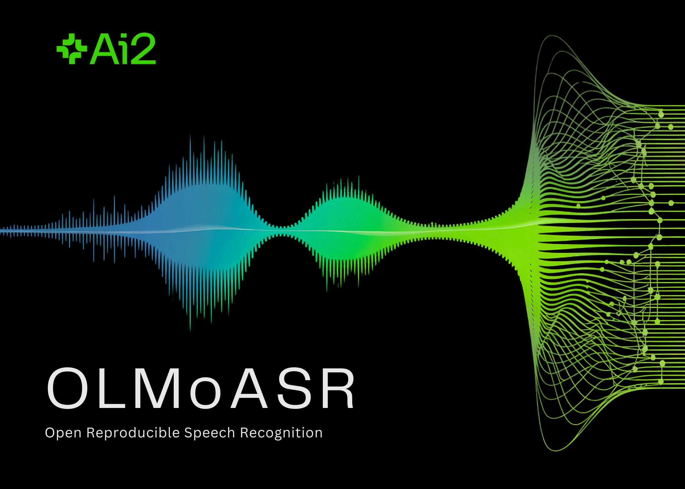

# What is OLMoASR and How Does It Compare to OpenAI’s Whisper in Speech Recognition?

> The Allen Institute for AI (AI2) has released OLMoASR, a suite of open automatic speech recognition (ASR) models that rival closed-source systems such as OpenAI’s Whisper. Beyond just releasing model weights, AI2 has published training data identifiers, filtering steps, training recipes, and benchmark scripts—an unusually transparent move in the ASR space. This makes OLMoASR one […]

The Allen Institute for AI (AI2) has released **OLMoASR**, a suite of open **automatic speech recognition (ASR)** models that rival closed-source systems such as OpenAI’s Whisper. Beyond just releasing model weights, AI2 has published training data identifiers, filtering steps, training recipes, and benchmark scripts—an unusually transparent move in the ASR space. This makes OLMoASR one of the most trending and extensible platforms for speech recognition research.

## Why Open Automatic Speech Recognition ASR?

Most speech recognition models available today—whether from OpenAI, Google, or Microsoft—are only accessible via APIs. While these services provide high performance, they operate as **black boxes**: the training datasets are opaque, the filtering methods are undocumented, and the evaluation protocols are not always aligned with research standards.

This lack of transparency poses challenges for reproducibility and scientific progress. Researchers cannot verify claims, test variations, or adapt models to new domains without re-building large datasets themselves. OLMoASR addresses this problem by opening the entire pipeline. The release is not just about enabling practical transcription—it’s about **pushing ASR toward a more open, scientific foundation**.

## Model Architecture and Scaling

OLMoASR uses a **transformer encoder–decoder architecture**, the dominant paradigm in modern ASR.

- The **encoder** ingests audio waveforms and produces hidden representations.

- The **decoder** generates text tokens conditioned on the encoder’s outputs.

This design is similar to Whisper, but OLMoASR makes the implementation fully open.

**The family of models covers six sizes, all trained on English:**

- **tiny.en** – 39M parameters, designed for lightweight inference

- **base.en** – 74M parameters

- **small.en** – 244M parameters

- **medium.en** – 769M parameters

- **large.en-v1** – 1.5B parameters, trained on 440K hours

- **large.en-v2** – 1.5B parameters, trained on 680K hours

This range allows developers to trade off between inference cost and accuracy. Smaller models are suited for embedded devices or real-time transcription, while the larger models maximize accuracy for research or batch workloads.

## Data: From Web Scraping to Curated Mixes

One of the core contributions of OLMoASR is the **open release of training datasets**, not just the models.

### OLMoASR-Pool (~3M hours)

This massive collection contains weakly supervised speech paired with transcripts scraped from the web. It includes around **3 million hours of audio** and **17 million text transcripts**. Like Whisper’s original dataset, it is noisy, containing misaligned captions, duplicates, and transcription errors.

### OLMoASR-Mix (~1M hours)

To address quality issues, AI2 applied **rigorous filtering**:

- **Alignment heuristics** to ensure audio and transcripts match

- **Fuzzy deduplication** to remove repeated or low-diversity examples

- **Cleaning rules** to eliminate duplicate lines and mismatched text

The result is a **high-quality, 1M-hour dataset** that boosts **zero-shot generalization**—critical for real-world tasks where data may differ from training distributions.

This two-tiered data strategy mirrors practices in large-scale language model pretraining: use vast noisy corpora for scale, then refine with filtered subsets to improve quality.

## Performance Benchmarks

AI2 benchmarked OLMoASR against Whisper across both short-form and long-form speech tasks, using datasets like **LibriSpeech, TED-LIUM3, Switchboard, AMI, and VoxPopuli**.


### Medium Model (769M)

- **12.8% WER** (word error rate) on short-form speech

- **11.0% WER** on long-form speech

This nearly matches Whisper-medium.en, which achieves **12.4%** and **10.5%** respectively.

### Large Models (1.5B)

- **large.en-v1 (440K hours)**: 13.0% WER short-form vs Whisper large-v1 at 12.2%

- **large.en-v2 (680K hours)**: 12.6% WER, closing the gap to less than 0.5%

### Smaller Models

Even the **tiny** and **base** versions perform competitively:

- **tiny.en**: ~20.5% WER short-form, ~15.6% WER long-form

- **base.en**: ~16.6% WER short-form, ~12.9% WER long-form

This gives developers flexibility to choose models based on compute and latency requirements.

## How to use?

Transcribing audio takes just a few lines of code:

Copy CodeCopiedUse a different Browser
```
import olmoasr

model = olmoasr.load_model("medium", inference=True)
result = model.transcribe("audio.mp3")
print(result)

```

The output includes both the transcription and **time-aligned segments**, making it useful for captioning, meeting transcription, or downstream NLP pipelines.

## Fine-Tuning and Domain Adaptation

Since AI2 provides full training code and recipes, OLMoASR can be **fine-tuned for specialized domains**:

- **Medical speech recognition** – adapting models on datasets like MIMIC-III or proprietary hospital recordings

- **Legal transcription** – training on courtroom audio or legal proceedings

- **Low-resource accents** – fine-tuning on dialects not well covered in OLMoASR-Mix

This adaptability is critical: ASR performance often drops when models are used in specialized domains with domain-specific jargon. Open pipelines make domain adaptation straightforward.

## Applications

OLMoASR opens up exciting opportunities across academic research and real-world AI development:

- **Educational Research**: Researchers can explore the intricate relationships between model architecture, dataset quality, and filtering techniques to understand their effects on speech recognition performance.

- **Human-Computer Interaction**: Developers gain the freedom to embed speech recognition capabilities directly into conversational AI systems, real-time meeting transcription platforms, and accessibility applications—all without dependency on proprietary APIs or external services.

- **Multimodal AI Development**: When combined with large language models, OLMoASR enables the creation of advanced multimodal assistants that can seamlessly process spoken input and generate intelligent, contextually-aware responses.

- **Research Benchmarking**: The open availability of both training data and evaluation metrics positions OLMoASR as a standardized reference point, allowing researchers to compare new approaches against a consistent, reproducible baseline in future ASR studies.

## Conclusion

The release of OLMoASR brings high-quality speech recognition can be developed and released in a way that prioritizes transparency and reproducibility. While the models are currently limited to English and still demand significant compute for training, they provide a solid foundation for adaptation and extension. This release sets a clear reference point for future work in open ASR and makes it easier for researchers and developers to study, benchmark, and apply speech recognition models in different domains.

---

Check out the **[MODEL on Hugging Face](https://huggingface.co/allenai/OLMoASR), [GitHub Page](https://github.com/allenai/OLMoASR) **and** [TECHNICAL DETAILS](https://allenai.org/blog/olmoasr)_._** Feel free to check out our **[GitHub Page for Tutorials, Codes and Notebooks](https://github.com/Marktechpost/AI-Tutorial-Codes-Included)**. Also, feel free to follow us on **[Twitter](https://x.com/intent/follow?screen_name=marktechpost)** and don’t forget to join our **[100k+ ML SubReddit](https://www.reddit.com/r/machinelearningnews/)** and Subscribe to **[our Newsletter](https://www.aidevsignals.com/)**.
