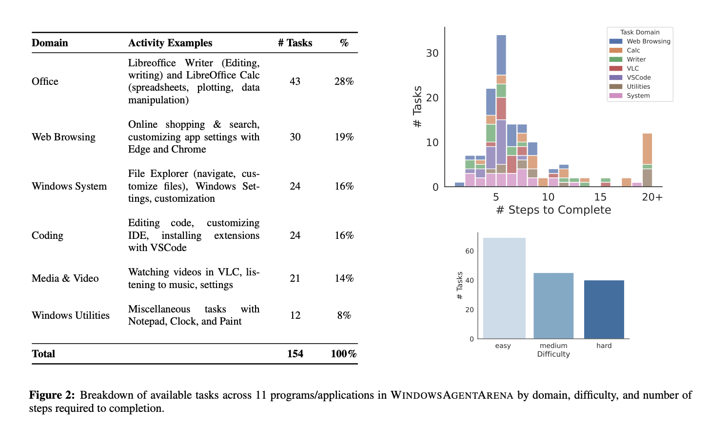

# Windows Agent Arena (WAA): A Scalable Open-Sourced Windows AI Agent Platform for Testing and Benchmarking Multi-modal, Desktop AI Agent

> Artificial intelligence (AI) has been advancing in developing agents capable of executing complex tasks across digital platforms. These agents, often powered by large language models (LLMs), have the potential to dramatically enhance human productivity by automating tasks within operating systems. AI agents that can perceive, plan, and act within environments like the Windows operating system […]

Artificial intelligence (AI) has been advancing in developing agents capable of executing complex tasks across digital platforms. These agents, often powered by large language models (LLMs), have the potential to dramatically enhance human productivity by automating tasks within operating systems. AI agents that can perceive, plan, and act within environments like the Windows operating system (OS) offer immense value as personal and professional tasks increasingly move into the digital realm. The ability of these agents to interact across a range of applications and interfaces means they can handle tasks that typically require human oversight, ultimately aiming to make human-computer interaction more efficient.

A significant issue in developing such agents is accurately evaluating their performance in environments that mirror real-world conditions. While effective in specific domains like web navigation or text-based tasks, most existing benchmarks fail to capture the complexity and diversity of tasks that real users face daily on platforms like Windows. These benchmarks either focus on limited types of interactions or suffer from slow processing times, making them unsuitable for large-scale evaluations. To bridge this gap, there is a need for tools that can test agents’ capabilities in more dynamic, multi-step tasks across diverse domains in a highly scalable manner. Moreover, current tools cannot parallelize tasks efficiently, making full evaluations take days rather than minutes.

Several benchmarks have been developed to evaluate AI agents, including OSWorld, which primarily focuses on Linux-based tasks. While these platforms provide useful insights into agent performance, they do not scale well for multi-modal environments like Windows. Other frameworks, such as WebLinx and Mind2Web, assess agent abilities within web-based environments but need more depth to comprehensively test agent behavior in more complex, OS-based workflows. These limitations highlight the need for a benchmark to capture the full scope of human-computer interaction in a widely-used OS like Windows while ensuring rapid evaluation through cloud-based parallelization.

Researchers from Microsoft, Carnegie Mellon University, and Columbia University introduced the [**WindowsAgentArena**](https://github.com/microsoft/WindowsAgentArena), a comprehensive and reproducible benchmark specifically designed for evaluating AI agents in a Windows OS environment. This innovative tool allows agents to operate within a real Windows OS, engaging with applications, tools, and web browsers, replicating the tasks that human users commonly perform. By leveraging Azure’s scalable cloud infrastructure, the platform can parallelize evaluations, allowing a complete benchmark run in just 20 minutes, contrasting the days-long evaluations typical of earlier methods. This parallelization increases the speed of evaluations and ensures more realistic agent behavior by allowing them to interact with various tools and environments simultaneously.

The benchmark suite includes over 154 diverse tasks that span multiple domains, including document editing, web browsing, system management, coding, and media consumption. These tasks are carefully designed to mirror everyday Windows workflows, with agents required to perform multi-step tasks such as creating document shortcuts, navigating through file systems, and customizing settings in complex applications like VSCode and LibreOffice Calc. The WindowsAgentArena also introduces a novel evaluation criterion that rewards agents based on task completion rather than simply following pre-recorded human demonstrations, allowing for more flexible and realistic task execution. The benchmark can seamlessly integrate with Docker containers, providing a secure environment for testing and allowing researchers to scale their evaluations across multiple agents.

To demonstrate the effectiveness of the WindowsAgentArena, researchers developed a new multi-modal AI agent named **Navi**. Navi is designed to operate autonomously within the Windows OS, utilizing a combination of chain-of-thought prompting and multi-modal perception to complete tasks. The researchers tested Navi on the WindowsAgentArena benchmark, where the agent achieved a success rate of 19.5%, significantly lower than the 74.5% success rate achieved by unassisted humans. While this performance highlights AI agents’ challenges in replicating human-like efficiency, it also underscores the potential for improvement as these technologies evolve. Navi also demonstrated strong performance in a secondary web-based benchmark, Mind2Web, further proving its adaptability across different environments.

The methods used to enhance Navi’s performance are noteworthy. The agent relies on visual markers and screen parsing techniques, such as Set-of-Marks (SoMs), to understand & interact with the graphical aspects of the screen. These SoMs allow the agent to accurately identify buttons, icons, and text fields, making it more effective in completing tasks that involve multiple steps or require detailed screen navigation. Navi benefits from UIA tree parsing, a method that extracts visible elements from the Windows UI Automation tree, enabling more precise agent interactions.

In conclusion, WindowsAgentArena is a significant advancement in evaluating AI agents in real-world OS environments. It addresses the limitations of previous benchmarks by offering a scalable, reproducible, and realistic testing platform that allows for rapid, parallelized evaluations of agents in the Windows OS ecosystem. With its diverse set of tasks and innovative evaluation metrics, this benchmark gives researchers and developers the tools to push the boundaries of AI agent development. Navi’s performance, though not yet matching human efficiency, showcases the benchmark’s potential in accelerating progress in multi-modal agent research. Its advanced perception techniques, like SoMs and UIA parsing, further pave the way for more capable and efficient AI agents in the future.

---

Check out the **[Paper](https://arxiv.org/abs/2409.08264)**, **[Code](https://github.com/microsoft/WindowsAgentArena?tab=readme-ov-file)**, and **[Project Page](https://microsoft.github.io/WindowsAgentArena/)**. All credit for this research goes to the researchers of this project. Also, don’t forget to follow us on **[Twitter](https://twitter.com/Marktechpost)** and join our **[Telegram Channel](https://pxl.to/at72b5j)** and [**LinkedIn Gr**](https://www.linkedin.com/groups/13668564/)[**oup**](https://www.linkedin.com/groups/13668564/). **If you like our work, you will love our**[** newsletter..**](https://marktechpost-newsletter.beehiiv.com/subscribe)

Don’t Forget to join our **[50k+ ML SubReddit](https://www.reddit.com/r/machinelearningnews/)**

**[⏩ ⏩ FREE AI WEBINAR: ‘SAM 2 for Video: How to Fine-tune On Your Data’ (Wed, Sep 25, 4:00 AM – 4:45 AM EST)](https://encord.com/webinar/sam2-for-video/?utm_medium=affiliate&utm_source=newsletter&utm_campaign=marktechpost&utm_content=sam2video)**
