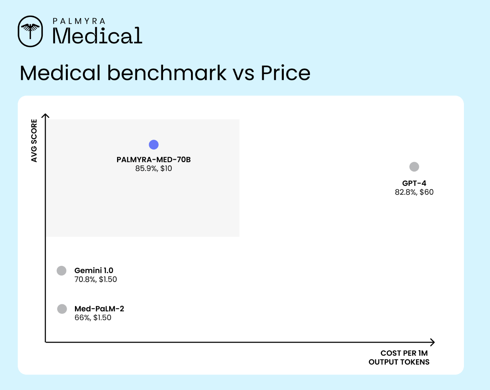

# Writer Releases Palmyra-Med and Palmyra-Fin Models: Outperforming Other Comparable Models, like GPT-4, Med-PaLM-2, and Claude 3.5 Sonnet

> The field of generative AI is increasingly focusing on creating models tailored to specific industries, enhancing performance in areas such as healthcare and finance. This specialization aims to meet the unique demands of these sectors, which require high accuracy and compliance due to their complex and regulated nature. In healthcare and finance, traditional AI models […]

The field of generative AI is increasingly focusing on creating models tailored to specific industries, enhancing performance in areas such as healthcare and finance. This specialization aims to meet the unique demands of these sectors, which require high accuracy and compliance due to their complex and regulated nature.

In healthcare and finance, traditional AI models often fall short of providing the precision and efficiency needed for industry-specific tasks. Medical and financial applications demand models that can handle specialized data accurately and cost-effectively. Existing general-purpose models may need to fully address these fields’ intricacies, leading to performance gaps and higher costs for industry applications.

Currently, medical and financial AI models, such as GPT-4 and Med-PaLM-2, are widely used. While these powerful models often need more specialized capabilities for advanced medical diagnostics and detailed financial analysis. This limitation highlights the need for more refined and focused models to deliver superior performance in these sectors.

To address these needs, the Writer Team has developed two new domain-specific models: Palmyra-Med and Palmyra-Fin. Palmyra-Med is designed for medical applications, while Palmyra-Fin targets financial tasks. These models are part of Writer’s suite of language models and are engineered to offer exceptional performance in their respective domains. Palmyra-Med-70B is distinguished by its high accuracy in medical benchmarks, achieving an average score of 85.9%. This surpasses competitors such as Med-PaLM-2 and performs particularly well in clinical knowledge, genetics, and biomedical research. Its cost efficiency is truly praiseworthy, priced at $10 per million output tokens, substantially lower than the $60 charged by models like GPT-4.

Palmyra-Fin-70B, designed for financial applications, has demonstrated outstanding results. It passed the CFA Level III exam with a score of 73%, outperforming general-purpose models like GPT-4, which scored only 33%. Furthermore, in the long-fin-eval benchmark, Palmyra-Fin-70B outperformed other models, including Claude 3.5 Sonnet and Mixtral-8x7b. This model excels in financial trend analysis, investment evaluations, and risk assessments, showcasing its ability to handle complex financial data precisely.

Palmyra-Med-70B uses advanced techniques to achieve its high benchmark scores. It integrates a specialized dataset and fine-tuning methodologies, including Direct Preference Optimization (DPO), to enhance its performance in medical tasks. The model’s accuracy in various benchmarks—such as 90.9% in MMLU Clinical Knowledge and 83.7% in MMLU Anatomy—demonstrates its deep understanding of clinical procedures and human anatomy. It scores 94.0% and 80% in genetics and biomedical research, respectively, underscoring its ability to interpret complex medical data and assist in research.

Palmyra-Fin-70B’s approach involves extensive training on financial data and custom fine-tuning. The model’s performance on the CFA Level III exam and its results in the long-fin-eval benchmark highlight its strong grasp of economic concepts and capability to process and analyze large amounts of financial information effectively. The model’s 100% accuracy in needle-in-haystack tasks reflects its ability to retrieve precise information from extensive financial documents.

In conclusion, Palmyra-Med and Palmyra-Fin represent significant advancements in specialized AI models for the medical and financial industries. Developed by Writer, these models offer enhanced accuracy and efficiency, addressing the specific needs of these sectors with a focus on cost-effectiveness and superior performance. They set a new standard for domain-specific AI applications, providing valuable tools for professionals in healthcare and finance.

---

Check out the [**Details**,](https://writer.com/blog/palmyra-med-fin-models/) **[Palmyra-Fin-70B-32K Model](https://huggingface.co/Writer/Palmyra-Fin-70B-32K)**, and **[Palmyra-Med-70b-32k Model](https://huggingface.co/Writer/Palmyra-Med-70B-32K)**. All credit for this research goes to the researchers of this project. Also, don’t forget to follow us on **[Twitter](https://twitter.com/Marktechpost)** and join our **[Telegram Channel](https://pxl.to/at72b5j)** and [**LinkedIn Gr**](https://www.linkedin.com/groups/13668564/)[**oup**](https://www.linkedin.com/groups/13668564/). **If you like our work, you will love our**[** newsletter..**](https://marktechpost-newsletter.beehiiv.com/subscribe)

Don’t Forget to join our **[47k+ ML SubReddit](https://www.reddit.com/r/machinelearningnews/)**

**Find Upcoming [AI Webinars here](https://www.marktechpost.com/ai-webinars-list-llms-rag-generative-ai-ml-vector-database/)**

---

> [Arcee AI Released DistillKit: An Open Source, Easy-to-Use Tool Transforming Model Distillation for Creating Efficient, High-Performance Small Language Models](https://www.marktechpost.com/2024/08/01/arcee-ai-released-distillkit-an-open-source-easy-to-use-tool-transforming-model-distillation-for-creating-efficient-high-performance-small-language-models/)
