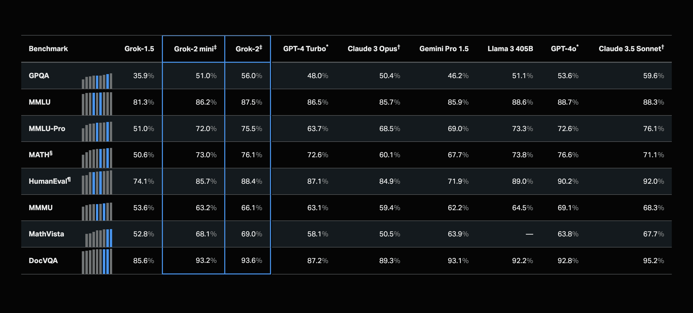

# xAI Released Grok-2 Beta: An AI Model with Unparalleled Reasoning, Benchmark-Topping Performance, and Advanced Capabilities

> The release of Grok-2, a very advanced language model that redefines AI reasoning and performance benchmarks, marks a quantum jump toward that goal. This beta release contains Grok-2 and a distilled version called Grok-2 mini, both major improvements over Grok-1.5. The release is part of xAI’s greater strategy to dominate the AI landscape with models […]

The release of [**Grok-2**](https://x.ai/blog/grok-2), a very advanced language model that redefines AI reasoning and performance benchmarks, marks a quantum jump toward that goal. This beta release contains Grok-2 and a distilled version called Grok-2 mini, both major improvements over Grok-1.5. The release is part of xAI’s greater strategy to dominate the AI landscape with models that excel in chat, coding, and complex reasoning tasks.

**Introduction of Grok-2 and Grok-2 Mini.**

Grok-2 is an all-rounder in applications as it does state-of-the-art text and vision understanding. Users were provided with beta versions of the models on the \ud835\udd4f platform, and the full release of the enterprise API is slated for later this month. It introduces Grok-2 mini, a small but highly capable variant, to balance computational efficiency and quality in the output. The model would do well in situations where speed and resource usage are of the essence.

**Benchmark Performance: Outrunning Competition**

Grok-2 has already been run on many highly competitive benchmarks and exceeds their standards. Even a preliminary variant of Grok-2, “sus-column-r,” has already been tested in the LMSYS chatbot arena, arguably the best-known benchmark for language models. Grok-2 outperformed the Claude 3.5 Sonnet and very prominent models like GPT-4-Turbo in this setting. More precisely, Grok-2 scored an overall Elo, placing it at the top of the leaderboard, thus establishing cutting-edge reasoning and response generation capabilities.

**Key Benchmark Scores:**

- **Graduate-Level Science Knowledge (GPQA):** Grok-2 achieved a score of 56.0%, outperforming GPT-4 Turbo (48.0%) and Claude 3.5 Sonnet (50.4%).

- **General Knowledge (MMLU):** Grok-2 scored 87.5%, slightly ahead of GPT-4 Turbo at 86.5% and significantly better than Claude 3.5 Sonnet at 85.7%.

- **Math Competition Problems (MATH):** Grok-2 excelled with a score of 76.1%, surpassing GPT-4 Turbo (72.6%) and far outpacing Claude 3.5 Sonnet at 60.1%.

- **Visual Math Reasoning (MathVista): **Grok-2 achieved 69.0%, establishing itself as a leader in this critical area ahead of both GPT-4 Turbo (58.1%) and Claude 3.5 Sonnet (50.5%).

- **Document-Based Question Answering (DocVQA):** Grok-2 reached 93.6%, outperforming GPT-4 Turbo at 87.2% and Claude 3.5 Sonnet at 89.3%.

*[**Image Source**](https://x.ai/blog/grok-2)*

**Advanced Evaluation and Capabilities**

Internally, xAI conducted rigorous testing for the abilities of Grok-2. The AI Tutors tested many real-world activities, and the responses were compared to produce the best response under very strict guidelines. The testing involved two areas: following instructions and the accuracy of facts. Grok-2 significantly improved using this content retrieved to reason and advanced tool-use capabilities. On graduate levels of reasoning assessment, it performed well in finding missing information, working through complex sequences of events, and filtering out irrelevant data—critical for tasks that require deep comprehension and accurate execution.

**Expanded Capabilities and User Experience**

The release of Grok-2 is about performance enhancements and providing a richer user experience on the \ud835\udd4f platform. Over the past few months, xAI has continuously improved the platform, and Grok-2’s release marks the introduction of a redesigned interface and new features. Premium and Premium+ users now have access to Grok-2 and Grok-2 mini, which integrate real-time information to provide more dynamic and accurate responses.

Grok-2 is more than just a model for text-based tasks; it also excels in vision-based applications. For example, Grok-2’s performance in MathVista, a benchmark for visual math reasoning, and DocVQA, a document-based question-answering task, demonstrate its ability to handle multimodal data effectively. These capabilities make Grok-2 a versatile tool for various applications, from academic research to complex problem-solving.

*[**Image Source**](https://x.ai/blog/grok-2)*

**Enterprise API and Future Developments**

For developers, xAI is launching Grok-2 and Grok-2 mini through a new enterprise API platform, which will become available later this month. The API is built on a bespoke tech stack that supports multi-region inference deployments, ensuring low-latency global access. This infrastructure is curated to meet the requirements of enterprises with enhanced security features, including mandatory multi-factor authentication (e.g., Yubikey, Apple TouchID, TOTP) and advanced analytics tools for traffic and billing management.

Looking ahead, xAI has ambitious plans to expand Grok-2’s capabilities further. The company is preparing to introduce multimodal understanding as a core feature of the Grok experience, both on the \ud835\udd4f platform and through the API. This will allow Grok-2 to handle a wider range of data types and deliver even more sophisticated responses.

**Conclusion**

The release of Grok-2 was a gigantic step toward advancing xAI and put the company at the forefront of artificial intelligence. Advanced reasoning coupled with strong performance on a wide array of benchmarks puts Grok-2 at the forefront of tools in the AI landscape. Introducing the Grok-2 mini adds versatility by giving users a model that balances speed and quality. How far xAI has come with the rapid progress made by its small, highly talented team underscores a commitment to impactful innovation in the future of AI. Grok-2 will continue to mature and become a fundamental tool for casual and technical users, providing a peerless understanding of text and vision.

---

Check out the **[Details](https://x.ai/blog/grok-2).** All credit for this research goes to the researchers of this project. Also, don’t forget to follow us on **[Twitter](https://twitter.com/Marktechpost)** and join our **[Telegram Channel](https://pxl.to/at72b5j)** and [**LinkedIn Gr**](https://www.linkedin.com/groups/13668564/)[**oup**](https://www.linkedin.com/groups/13668564/). **If you like our work, you will love our**[** newsletter..**](https://marktechpost-newsletter.beehiiv.com/subscribe)

Don’t Forget to join our **[48k+ ML SubReddit](https://www.reddit.com/r/machinelearningnews/)**

**Find Upcoming [AI Webinars here](https://www.marktechpost.com/ai-webinars-list-llms-rag-generative-ai-ml-vector-database/)**

---

> [Arcee AI Introduces Arcee Swarm: A Groundbreaking Mixture of Agents MoA Architecture Inspired by the Cooperative Intelligence Found in Nature Itself](https://www.marktechpost.com/2024/08/15/arcee-ai-introduces-arcee-swarm-a-groundbreaking-mixture-of-agents-moa-architecture-inspired-by-the-cooperative-intelligence-found-in-nature-itself/)
