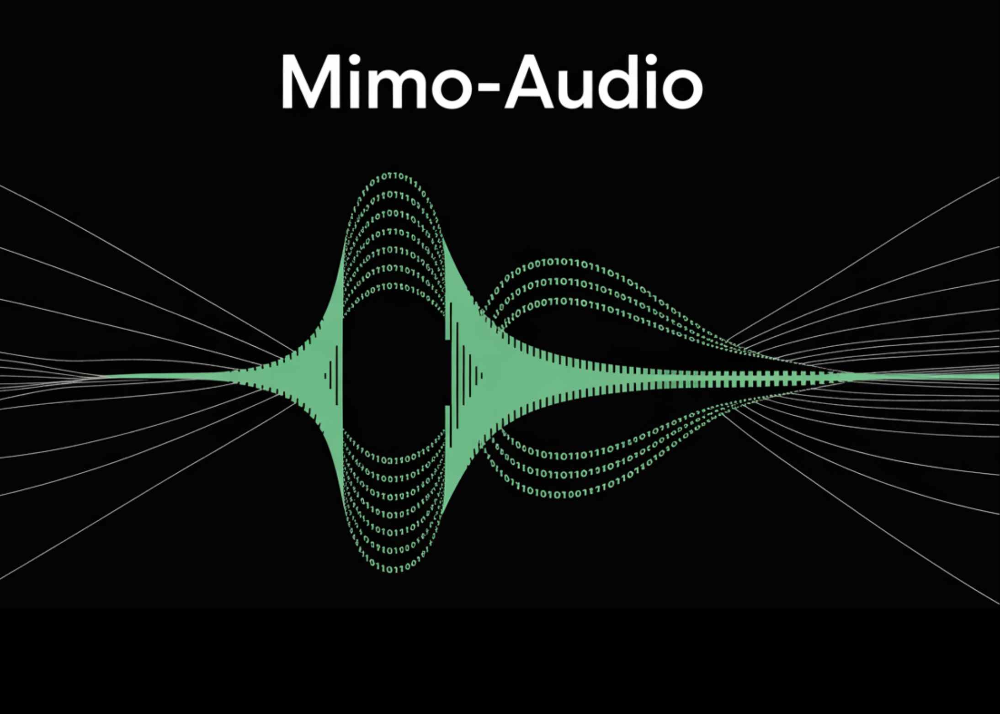

# Xiaomi Released MiMo-Audio, a 7B Speech Language Model Trained on 100M+ Hours with High-Fidelity Discrete Tokens

> Xiaomi’s MiMo team released MiMo-Audio, a 7-billion-parameter audio-language model that runs a single next-token objective over interleaved text and discretized speech, scaling pretraining beyond 100 million hours of audio. What’s actually new? Instead of relying on task-specific heads or lossy acoustic tokens, MiMo-Audio uses a bespoke RVQ (residual vector quantization) tokenizer that targets both semantic […]

Xiaomi’s MiMo team released MiMo-Audio, a 7-billion-parameter audio-language model that runs a single next-token objective over interleaved text and discretized speech, scaling pretraining beyond 100 million hours of audio.

### What’s actually new?

Instead of relying on task-specific heads or lossy acoustic tokens, MiMo-Audio uses a bespoke RVQ (residual vector quantization) tokenizer that targets both semantic fidelity and high-quality reconstruction. The tokenizer runs at 25 Hz and outputs 8 RVQ layers (≈200 tokens/s), giving the LM access to “lossless” speech features it can model autoregressively alongside text.

### Architecture: patch encoder → 7B LLM → patch decoder

To handle the audio/text rate mismatch, the system packs four timesteps per patch for LM consumption (downsampling 25 Hz → 6.25 Hz), then reconstructs full-rate RVQ streams with a causal patch decoder. A delayed multi-layer RVQ generation scheme staggers predictions per codebook to stabilize synthesis and respect inter-layer dependencies. All three parts—patch encoder, MiMo-7B backbone, and patch decoder—are trained under a single next-token objective.

*https://xiaomimimo.github.io/MiMo-Audio-Demo/*

### Scale is the algorithm

Training proceeds in two big phases: (1) an “understanding” stage that optimizes text-token loss over interleaved speech-text corpora, and (2) a joint “understanding + generation” stage that turns on audio losses for speech continuation, S2T/T2S tasks, and instruction-style data. The report emphasizes a compute/data threshold where few-shot behavior appears to “switch on,” echoing emergence curves seen in large text-only LMs.

### Benchmarks: speech intelligence and general audio

MiMo-Audio is evaluated on speech-reasoning suites (e.g., SpeechMMLU) and broad audio understanding benchmarks (e.g., MMAU), reporting strong scores across speech, sound, and music and a reduced “modality gap” between text-only and speech-in/speech-out settings. Xiaomi also releases **MiMo-Audio-Eval**, a public toolkit to reproduce these results. Listen-and-respond demos (speech continuation, voice/emotion conversion, denoising, and speech translation) are available online.

*https://xiaomimimo.github.io/MiMo-Audio-Demo/*

### Why this is important?

The approach is intentionally simple—no multi-head task tower, no bespoke ASR/TTS objectives at pretraining time—just GPT-style next-token prediction over _lossless_ audio tokens plus text. The key engineering ideas are (i) a tokenizer the LM can actually use without throwing away prosody and speaker identity; (ii) patchification to keep sequence lengths manageable; and (iii) delayed RVQ decoding to preserve quality at generation time. For teams building spoken agents, those design choices translate into few-shot speech-to-speech editing and robust speech continuation with minimal task-specific finetuning.

### 6 Technical Takeaways:

- **High-Fidelity Tokenization**MiMo-Audio uses a custom RVQ tokenizer operating at 25 Hz with 8 active codebooks, ensuring speech tokens preserve prosody, timbre, and speaker identity while keeping them LM-friendly.

- **Patchified Sequence Modeling**The model reduces sequence length by grouping 4 timesteps into one patch (25 Hz → 6.25 Hz), letting the 7B LLM handle long speech efficiently without discarding detail.

- **Unified Next-Token Objective**Rather than separate heads for ASR, TTS, or dialogue, MiMo-Audio trains under a single next-token prediction loss across interleaved text and audio, simplifying architecture while supporting multi-task generalization.

- **Emergent Few-Shot Abilities**Few-shot behaviors such as speech continuation, voice conversion, emotion transfer, and speech translation emerge once training surpasses a large-scale data threshold (~100M hours, trillions of tokens).

- **Benchmark Leadership**MiMo-Audio sets state-of-the-art scores on SpeechMMLU (S2S 69.1, T2S 71.5) and MMAU (66.0 overall), while minimizing the text-to-speech modality gap to just 3.4 points.

- **Open Ecosystem Release**Xiaomi provides the tokenizer, 7B checkpoints (base and instruct), MiMo-Audio-Eval toolkit, and public demos, enabling researchers and developers to test and extend speech-to-speech intelligence in open-source pipelines.

### Summary

MiMo-Audio demonstrates that high-fidelity, RVQ-based “lossless” tokenization combined with patchified next-token pretraining at scale is sufficient to unlock few-shot speech intelligence without task-specific heads. The 7B stack—tokenizer → patch encoder → LLM → patch decoder—bridges the audio/text rate gap (25→6.25 Hz) and preserves prosody and speaker identity via delayed multi-layer RVQ decoding. Empirically, the model narrows the text↔speech modality gap, generalizes across speech/sound/music benchmarks, and supports in-context S2S editing and continuation.

---

Check out the **[Paper](https://github.com/XiaomiMiMo/MiMo-Audio/blob/main/MiMo-Audio-Technical-Report.pdf), [Technical details](https://xiaomimimo.github.io/MiMo-Audio-Demo/) **and **[GitHub Page](https://github.com/XiaomiMiMo/MiMo-Audio)_._** Feel free to check out our **[GitHub Page for Tutorials, Codes and Notebooks](https://github.com/Marktechpost/AI-Tutorial-Codes-Included)**. Also, feel free to follow us on **[Twitter](https://x.com/intent/follow?screen_name=marktechpost)** and don’t forget to join our **[100k+ ML SubReddit](https://www.reddit.com/r/machinelearningnews/)** and Subscribe to **[our Newsletter](https://www.aidevsignals.com/)**.
