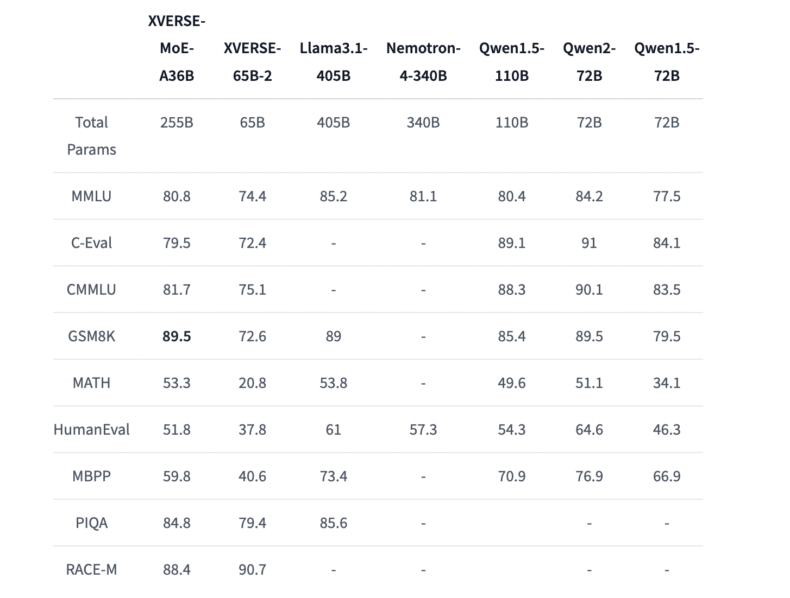

# XVERSE-MoE-A36B Released by XVERSE Technology: A Revolutionary Multilingual AI Model Setting New Standards in Mixture-of-Experts Architecture and Large-Scale Language Processing

> XVERSE Technology made a significant leap forward by releasing the XVERSE-MoE-A36B, a large multilingual language model based on the Mixture-of-Experts (MoE) architecture. This model stands out due to its remarkable scale, innovative structure, advanced training data approach, and diverse language support. The release represents a pivotal moment in AI language modeling, positioning XVERSE Technology at […]

XVERSE Technology made a significant leap forward by releasing the[** XVERSE-MoE-A36B**](https://huggingface.co/xverse/XVERSE-MoE-A36B), a large multilingual language model based on the Mixture-of-Experts (MoE) architecture. This model stands out due to its remarkable scale, innovative structure, advanced training data approach, and diverse language support. The release represents a pivotal moment in AI language modeling, positioning XVERSE Technology at the forefront of AI innovation.

**A Deep Dive into the Architecture**

XVERSE-MoE-A36B is built on a decoder-only transformer network, a well-known architecture in language modeling, but it introduces an enhanced version of the Mixture-of-Experts approach. The total parameter scale of the model is an astounding 255 billion, with an activated subset of 36 billion parameters that come into play during usage. This selective activation mechanism is what differentiates the MoE architecture from traditional models.

Unlike traditional MoE models, which maintain uniform expert sizes across the board, XVERSE-MoE-A36B uses more fine-grained experts. Each expert in this model is only a quarter of a standard feed-forward network (FFN) size. Furthermore, it incorporates both shared and non-shared experts. Shared experts are always active during computations, providing consistent performance, while non-shared experts are selectively activated through a router mechanism based on the task at hand. This structure allows the model to optimize computational resources and deliver more specialized responses, increasing efficiency and accuracy.

*[**Image Source**](https://huggingface.co/xverse/XVERSE-MoE-A36B)*

**Impressive Language Capabilities**

One of the core strengths of XVERSE-MoE-A36B is its multilingual capabilities. The model has been trained on a large-scale, high-quality dataset with over 40 languages, emphasizing Chinese and English. This multilingual training ensures that the model excels in these two dominant languages and performs well in various other languages, including Russian, Spanish, and more.

The model’s ability to maintain superior performance across different languages is attributed to the precise sampling ratios used during training. By finely tuning the data balance, XVERSE-MoE-A36B achieves outstanding results in both Chinese and English while ensuring reasonable competence in other languages. Using long training sequences (up to 8,000 tokens) allows the model to efficiently handle extensive and complex tasks.

**Innovative Training Strategy**

The development of XVERSE-MoE-A36B involved several innovative approaches to training. One of the most notable aspects of the model’s training strategy was its dynamic data-switching mechanism. This process involved periodically switching the training dataset to dynamically introduce new, high-quality data. By doing this, the model could continuously refine its language understanding, adapting to the ever-evolving linguistic patterns and content in the data it encountered.

In addition to this dynamic data introduction, the training also incorporated adjustments to the learning rate scheduler, ensuring that the model could quickly learn from newly introduced data without overfitting or losing generalization capability. This approach allowed XVERSE Technology to balance accuracy and computational efficiency throughout training.

**Overcoming Computational Challenges**

Training and deploying a model as large as XVERSE-MoE-A36B presents significant computational challenges, particularly regarding memory consumption and communication overhead. XVERSE Technology tackled these issues with overlapping computation and communication strategies alongside CPU-Offload techniques. By designing an optimized fusion operator and addressing the unique expert routing and weight calculation logic of the MoE model, the developers were able to enhance computational efficiency significantly. This optimization reduced memory overhead and increased throughput, making the model more practical for real-world applications where computational resources are often a limiting factor.

**Performance and Benchmarking**

To evaluate the performance of XVERSE-MoE-A36B, extensive testing was conducted across several widely recognized benchmarks, including MMLU, C-Eval, CMMLU, RACE-M, PIQA, GSM8K, Math, MBPP, and HumanEval. The model was compared against other open-source MoE models of similar scale, and the results were impressive. XVERSE-MoE-A36B consistently outperformed many of its counterparts, achieving top scores in tasks ranging from general language understanding to specialized mathematical reasoning. For instance, it scored 80.8% on the MMLU benchmark, 89.5% on GSM8K, and 88.4% on RACE-M, showcasing its versatility across different domains and tasks. These results highlight the robustness of the model in both general-purpose and domain-specific tasks, positioning it as a leading contender in the field of large language models.

*[**Image Source**](https://huggingface.co/xverse/XVERSE-MoE-A36B)*

**Applications and Potential Use Cases**

The XVERSE-MoE-A36B model is designed for various applications, from natural language understanding to advanced AI-driven conversational agents. Given its multilingual capabilities, it holds particular promise for businesses and organizations operating in international markets, where communication in multiple languages is necessary. In addition, the model’s advanced expert routing mechanism makes it highly adaptable to specialized domains, such as legal, medical, or technical fields, where precision and contextual understanding are paramount. The model can deliver more accurate and contextually appropriate responses by selectively activating only the most relevant experts for a given task.

**Ethical Considerations and Responsible Use**

As with all large language models, releasing XVERSE-MoE-A36B comes with ethical responsibilities. XVERSE Technology has emphasized the importance of responsible use, particularly in avoiding disseminating harmful or biased content. While the model has been designed to minimize such risks, the developers strongly advise users to conduct thorough safety tests before deploying the model in sensitive or high-stakes applications. The company has warned against using the model for malicious purposes, like spreading misinformation or conducting activities that could harm public or national security. XVERSE Technology has clarified that it will not assume responsibility for model misuse.

**Conclusion**

The release of XVERSE-MoE-A36B marks a significant milestone in developing large language models. It offers groundbreaking architectural innovations, training strategies, and multilingual capabilities. XVERSE Technology has once again demonstrated its commitment to advancing the field of AI, providing a powerful tool for businesses, researchers, & developers alike.

With its impressive performance across multiple benchmarks and its ability to handle various languages and tasks, XVERSE-MoE-A36B is set to play a key role in the future of AI-driven communication and problem-solving solutions. However, as with any powerful technology, its users are responsible for using it ethically and safely, ensuring its potential is harnessed for the greater good.

---

Check out the **[Model](https://huggingface.co/xverse/XVERSE-MoE-A36B)**. All credit for this research goes to the researchers of this project. Also, don’t forget to follow us on **[Twitter](https://twitter.com/Marktechpost)** and join our **[Telegram Channel](https://pxl.to/at72b5j)** and [**LinkedIn Gr**](https://www.linkedin.com/groups/13668564/)[**oup**](https://www.linkedin.com/groups/13668564/). **If you like our work, you will love our**[** newsletter..**](https://marktechpost-newsletter.beehiiv.com/subscribe)

Don’t Forget to join our **[50k+ ML SubReddit](https://www.reddit.com/r/machinelearningnews/)**

**[⏩ ⏩ FREE AI WEBINAR: ‘SAM 2 for Video: How to Fine-tune On Your Data’ (Wed, Sep 25, 4:00 AM – 4:45 AM EST)](https://encord.com/webinar/sam2-for-video/?utm_medium=affiliate&utm_source=newsletter&utm_campaign=marktechpost&utm_content=sam2video)**
