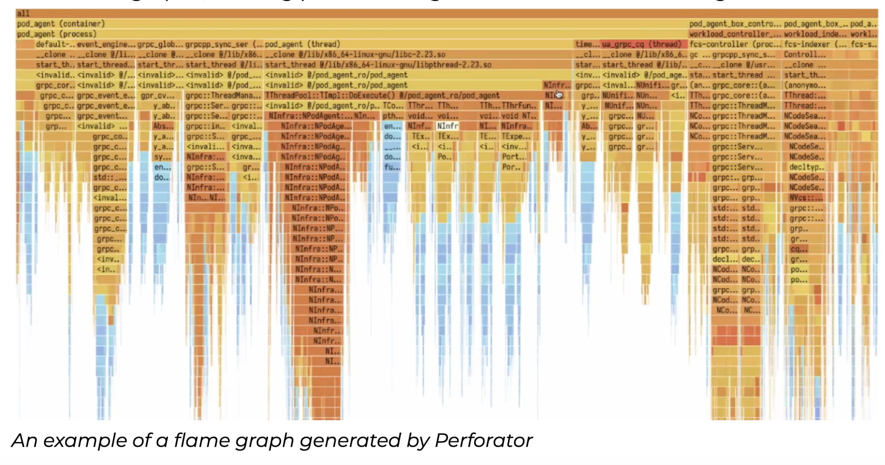

# Yandex Develops and Open-Sources Perforator: An Open-Source Tool that can Save Businesses Billions of Dollars a Year on Server Infrastructure

> Yandex, a global tech company, develops and open-sources Perforator, an innovative tool for continuous real-time monitoring and analysis of servers and applications. Perforator helps developers identify the most resource-intensive sections of code and provides detailed statistics for subsequent optimization. By identifying code inefficiencies and supporting profile-guided optimization, Perforator delivers accurate data that enables businesses to […]

Yandex, a global tech company, develops and open-sources [Perforator](https://github.com/yandex/perforator), an innovative tool for continuous real-time monitoring and analysis of servers and applications.

Perforator helps developers identify the most resource-intensive sections of code and provides detailed statistics for subsequent optimization. By identifying code inefficiencies and supporting profile-guided optimization, Perforator delivers accurate data that enables businesses to manually optimize their applications and reduce infrastructure costs by up to 20%. Depending on company size, this could translate to millions or even billions saved annually. 

“Perforator helps businesses get the most out of their servers without sacrificing performance,” said Sergey Skvortsov, a senior developer at Yandex who leads the team behind the tool. “Using Perforator, businesses can optimize their code, reduce server load, and ultimately lower energy and equipment costs.”

### Why use Perforator?

Resource optimization is crucial for large data centers, big tech corporations, as well as small businesses and startups with limited resources. Instead of investing in additional equipment, companies can leverage Perforator to optimize their existing infrastructure without sacrificing performance. The tool has already been used for profiling in many Yandex services for over a year, and now it is accessible to companies, developers, and researchers worldwide.

Companies can deploy Perforator on their own servers, minimizing reliance on external cloud providers while maintaining full control over their data. This makes Perforator a strong fit for organizations with stringent data security requirements operating within closed infrastructures.

“Perforator can benefit companies of all sizes, from small businesses with 10-100 servers, which can save millions of dollars per year, to larger enterprises with thousands of servers and more, where savings can reach hundreds of millions or even billions of dollars annually” Sergey Skvortsov noted. “Regardless of your company size, Perforator can help you reduce infrastructure costs, freeing up resources for further innovation and growth.”

### How Perforator works

Perforator provides detailed insights into server resource usage and analyzes the impact of code on performance, highlighting which applications consume the most system resources. Perforator uses eBPF technology to run small programs within the Linux kernel in a way that is safe and does not slow down the system. eBPF allows for improved monitoring, security, and performance optimization without changing the source code.

Perforator supports native programming languages such as C, C++, Go, Rust, Python, and Java. The solution enables in-depth analytics and data visualization with flame graphs, making problem diagnostics much more manageable.

*_An example of a flame graph generated by Perforator_*

“Perforator has been battle-tested in Yandex’s demanding environment for over a year and provides a wide range of features that make it a reliable and versatile solution for monitoring and optimizing server performance,” Sergey Skvortsov added.

One of Perforator’s key advantages is its support for profile-guided optimization (PGO), which automatically accelerates C++ programs by up to 10%. Additionally, Perforator is designed to run seamlessly on individual computers, making it accessible not only to large businesses but also to startups and tech enthusiasts. Furthermore, Perforator offers essential features tailored for large organizations, including A/B testing capabilities that help make better-informed decisions.

### Open-source solution for developers and businesses

The decision to make Perforator open source reflects Yandex’s commitment to fostering community collaboration in developing system technologies.

_“We believe that open-sourcing such fundamental system technologies helps drive tech innovation worldwide.” _— Sergey Skvortsov.

“We aim for our  technologies to benefit the world and provide value to both developers and businesses. Additionally, the openness of the technology enables us to make decisions regarding the development of the profiling infrastructure together with the community.”

### What’s next?

In the near future, Perforator will be enhanced with additional capabilities, including improved integration with Python and Java and more precise analysis of events.

Perforator’s source code is now available on [GitHub](https://github.com/yandex/perforator), alongside other Yandex open-source solutions, such as YaFSDP, a tool designed to accelerate the training of large language models. 

Perforator is the latest addition to Yandex’s collection of open-source tools. You can view all of the company’s open-source projects, including YaFSDP, AQLM, YTsaurus, and more, on [this page](https://opensource.yandex/en/).

### About Yandex

Yandex is a global technology company that builds intelligent products and services powered by [machine learning](https://www.marktechpost.com/2025/01/14/what-is-machine-learning-ml/). Its goal is to help consumers and businesses better navigate the online and offline world. Since 1997, Yandex has delivered world-class, locally relevant search and information services and developed market-leading on-demand transportation services, navigation products, and other mobile applications for millions of consumers worldwide.

### Key Takeaways:

- Yandex introduces Perforator, a tool that can identify and evaluate code inefficiencies across a company’s entire code base.

- Perforator helps developers identify the most resource-intensive sections of code and provides detailed statistics for subsequent optimization.

- The solution can help businesses reduce CPU resource usage by 20% annually.

- By leveraging Perforator, companies can potentially save millions or even billions, depending on company size, and allocate resources for further innovation and growth.

- Perforator can be accessed for free on [GitHub](https://github.com/yandex/perforator).

---

_Note: Thanks to the Yandex team for the thought leadership/ Resources for this article. Yandex team has supported and sponsored this content/article._
