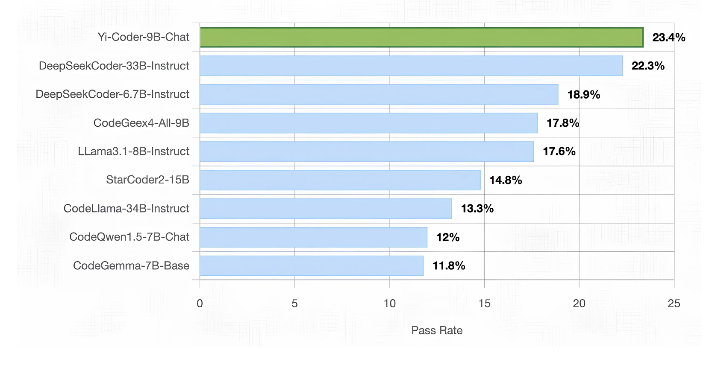

# Yi-Coder Released by 01.AI: A Powerful Small-Scale Code LLM Series, Delivering Exceptional Performance in Code Generation, Editing, and Long-Context Comprehension

> The landscape of large language models (LLMs) for coding has been enriched with the release of Yi-Coder by 01.AI, a series of open-source models designed for efficient and powerful coding performance. Despite its relatively small size, Yi-Coder delivers state-of-the-art results, positioning itself as a formidable code generation and completion player. Available in two configurations, 1.5 […]

The landscape of large language models (LLMs) for coding has been enriched with the release of [**Yi-Coder**](https://01-ai.github.io/blog.html?post=en/2024-09-05-A-Small-but-Mighty-LLM-for-Code.md)** **by 01.AI, a series of open-source models designed for efficient and powerful coding performance. Despite its relatively small size, Yi-Coder delivers state-of-the-art results, positioning itself as a formidable code generation and completion player. Available in two configurations, 1.5 billion and 9 billion parameters, Yi-Coder proves that bigger isn’t always better, offering an impressive range of capabilities tailored for developers seeking high-performance models with minimal resource overhead. The four variants open-sourced on Hugging Face till now are:

- [**Yi-Coder-9B-Chat**](https://huggingface.co/01-ai/Yi-Coder-9B-Chat)**: **This model is designed for text generation, focusing on code-related tasks offering interactive and conversational capabilities. It delivers state-of-the-art performance in competitive programming and long-context code generation and was recently updated to enhance its efficiency.

- [**Yi-Coder-9B**](https://huggingface.co/01-ai/Yi-Coder-9B)**:** The larger base model in the series, Yi-Coder-9B, offers powerful code generation and comprehension across 52 programming languages. Updated to optimize its long-context processing further, it excels at precisely handling complex, project-level tasks.

- [**Yi-Coder-1.5B-Chat**](https://huggingface.co/01-ai/Yi-Coder-1.5B-Chat)**:** A smaller, lightweight model designed for chat-based coding tasks, Yi-Coder-1.5B-Chat delivers impressive results in code editing and interactive code completion. The recent update focuses on improving its real-time performance and accuracy in conversational coding applications.

- [**Yi-Coder-1.5B**](https://huggingface.co/01-ai/Yi-Coder-1.5B)**: **This base model offers an efficient solution for developers needing fast code generation with fewer computational resources. The recent update enhances its ability to tackle basic programming tasks, making it a highly versatile tool for developers with limited hardware.

*[**Image Source**](https://01-ai.github.io/blog.html?post=en/2024-09-05-A-Small-but-Mighty-LLM-for-Code.md)*

Yi-Coder-9B, the larger of the two models, stands out due to its advanced training. It builds upon Yi-9B with an additional 2.4 trillion high-quality tokens sourced from a comprehensive repository-level code corpus on GitHub and code-related data filtered from CommonCrawl. These tokens cover 52 major programming languages, enabling Yi-Coder to offer unmatched proficiency across various coding environments. The ability to handle long-context modeling with a maximum context window of 128K tokens makes Yi-Coder ideal for handling complex, project-level code generation and comprehension tasks.

One of Yi-Coder’s most impressive aspects is its competitive performance, particularly with the Yi-Coder-9B-Chat model. In rigorous evaluations, Yi-Coder-9B-Chat achieved a 23.4% pass rate on LiveCodeBench, a platform designed to benchmark LLMs using real-time competitive programming problems sourced from LeetCode, AtCoder, and CodeForces. Notably, Yi-Coder’s performance surpassed much larger models, including DeepSeek-Coder-33B-Instruct and CodeGeex4-All-9B, making it the only model under 10 billion parameters to break the 20% threshold.

*[**Image Source**](https://01-ai.github.io/blog.html?post=en/2024-09-05-A-Small-but-Mighty-LLM-for-Code.md)*

In addition to its competitive programming strengths, Yi-Coder excelled in standard code generation benchmarks such as HumanEval, MBPP, and CRUXEval-O. With an 85.4% pass rate on HumanEval and a 73.8% pass rate on MBPP, Yi-Coder-9B-Chat outperformed many of its peers, showcasing its ability to handle basic and complex coding tasks. It also became the first open-source LLM to surpass 50% accuracy on CRUXEval-O, further cementing its status as a high-performing model in the coding community.

Yi-Coder is not limited to code generation; it also excels in code editing tasks. Using CodeEditorBench, a benchmark designed to evaluate a model’s ability to perform debugging, translation, language switching, and code polishing, Yi-Coder consistently outperformed its competitors. The model demonstrated impressive win rates against other open-source models, particularly debugging and code translation. This makes Yi-Coder attractive for developers looking to streamline their code refinement processes.

*[**Image Source**](https://01-ai.github.io/blog.html?post=en/2024-09-05-A-Small-but-Mighty-LLM-for-Code.md)*

Another critical area where Yi-Coder shines is cross-file code completion, a key requirement for modern Integrated Development Environments (IDEs). On the CrossCodeEval benchmark, which tests models’ ability to understand and complete code with cross-file dependencies, Yi-Coder outperformed similarly sized models in both retrieval and non-retrieval contexts. This result can be attributed to its extensive training on repository-level code corpora, allowing it to capture long-term dependencies and efficiently complete code tasks that span multiple files.

Long-context comprehension is one of Yi-Coder’s most unique strengths. In a synthetic task called “Needle in the code,” Yi-Coder demonstrated its ability to handle sequences as long as 128K tokens, twice the length used in comparable evaluations like those of CodeQwen1.5. The model flawlessly completed this task, demonstrating its proficiency in extracting key information from extensive codebases, a crucial skill for developers working on large-scale projects.

*[**Image Source**](https://01-ai.github.io/blog.html?post=en/2024-09-05-A-Small-but-Mighty-LLM-for-Code.md)*

In addition to its coding capabilities, Yi-Coder has shown promise in mathematical reasoning. By leveraging program-aided language models (PAL), Yi-Coder-9B achieved an average accuracy of 70.3% across seven mathematical reasoning benchmarks, surpassing the performance of the larger DeepSeek-Coder-33B. This demonstrates that strong coding abilities can translate into other domains, such as solving complex mathematical problems.

In conclusion, Yi-Coder’s release marks an important step forward in the evolution of code-focused LLMs. Despite its relatively small parameter count, the model offers a competitive edge over larger alternatives, excelling in long-context comprehension, mathematical reasoning, and code editing. Its availability in base and chat versions provides flexibility for users seeking efficient inference and training options. By open-sourcing Yi-Coder, 01.AI has significantly contributed to the development community. The model’s remarkable performance across various coding tasks and its efficient architecture positions Yi-Coder as a powerful tool for developers looking to push the boundaries of what small LLMs can achieve in software development.

---

Check out the **[Details](https://01-ai.github.io/blog.html?post=en/2024-09-05-A-Small-but-Mighty-LLM-for-Code.md) and [Model Series](https://huggingface.co/collections/01-ai/yi-coder-66bdb00f5bdd611f9a008f30).** All credit for this research goes to the researchers of this project. Also, don’t forget to follow us on **[Twitter](https://twitter.com/Marktechpost)** and [**LinkedIn**](https://www.linkedin.com/company/marktechpost/?viewAsMember=true). Join our **[Telegram Channel](https://www.zyphra.com/post/zamba2-mini)**. **If you like our work, you will love our**[** newsletter..**](https://marktechpost-newsletter.beehiiv.com/subscribe)

Don’t Forget to join our **[50k+ ML SubReddit](https://www.reddit.com/r/machinelearningnews/)**
