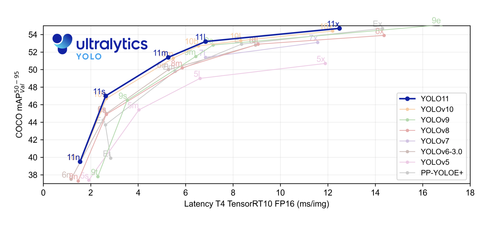

# YOLO11 Released by Ultralytics: Unveiling Next-Gen Features for Real-time Image Analysis and Autonomous Systems

> Ultralytics has once again set a new standard in computer vision with the introduction of YOLO11, the latest addition to its groundbreaking YOLO series. Renowned for its real-time object detection expertise, YOLO11 elevates the capabilities of its predecessors by combining speed, precision, and versatility. Featuring a restructured architecture and enhanced data processing techniques, it delivers […]

Ultralytics has once again set a new standard in computer vision with the introduction of [**YOLO11**](https://docs.ultralytics.com/models/yolo11/), the latest addition to its groundbreaking YOLO series. Renowned for its real-time object detection expertise, YOLO11 elevates the capabilities of its predecessors by combining speed, precision, and versatility. Featuring a restructured architecture and enhanced data processing techniques, it delivers unmatched performance in identifying complex visual patterns across various applications.

One of the key highlights of YOLO11 is its improved architecture, which has been fine-tuned for greater accuracy and speed. Ultralytics has focused on optimizing the network structure to minimize computational overhead without compromising performance. This has resulted in a model that is both lightweight and capable of handling complex scenarios with precision. Introducing new layers and modules in the architecture allows YOLO11 to detect smaller objects and manage overlapping instances more effectively. This enhancement is particularly beneficial for industries such as autonomous driving, robotics, and surveillance, where precision in object detection is crucial.

Another standout feature of YOLO11 is the integration of advanced data augmentation techniques. This version introduces a more sophisticated approach to data preprocessing, enabling the model to learn better representations from diverse datasets. By employing techniques like mosaic augmentation, where multiple images are combined into one during training, YOLO11 can generalize well across various visual environments. Such improvements ensure the model performs robustly even in challenging conditions such as low-light scenarios or images with occlusions.

YOLO11 has incorporated a novel loss function that prioritizes detecting small and medium-sized objects. Traditional object detection models often need help identifying smaller objects due to the imbalance between object sizes in training datasets. YOLO11 addresses this issue by introducing a more balanced loss function that weights smaller objects appropriately, leading to higher accuracy across a wider range of object sizes. This feature makes YOLO11 particularly suitable for applications like drone surveillance, where detecting small objects from a high altitude is necessary.

YOLO11’s release also emphasizes compatibility and ease of use. Ultralytics has made significant efforts to streamline the deployment process, ensuring that the model can be integrated seamlessly into various development environments. Introducing a more user-friendly API and support for numerous programming languages makes it accessible to a broader audience, from researchers to industry professionals. Also, YOLO11 offers pre-trained weights and models for various tasks, enabling users to get started quickly without extensive retraining.

A key area where YOLO11 outperforms its predecessors is real-time performance. With reduced latency and improved throughput, the model can process high-resolution images in real time, making it an ideal solution for time-sensitive applications. This efficiency is achieved through optimized convolutional layers and the integration of attention mechanisms that allow the model to focus on relevant portions of an image more effectively. As a result, YOLO11 can deliver high-speed object detection without sacrificing accuracy, which is a critical requirement in domains like sports analytics and retail automation.

Ultralytics has also strongly emphasized YOLO11’s scalability. The model has been designed to operate efficiently across various hardware platforms, from powerful GPUs to edge devices with limited computational resources. This scalability is crucial for deploying YOLO11 in real-world scenarios where hardware constraints are often a limiting factor. By enabling the model to run on less powerful devices without a significant drop in performance, Ultralytics has opened up new possibilities for deploying YOLO11 in applications such as smart cameras and IoT devices.

With technical improvements, YOLO11 has been trained on a larger and more diverse dataset, incorporating data from different sources to enhance its generalization capabilities. This extensive training dataset ensures that YOLO11 can perform well on images with varied backgrounds, object classes, and environmental conditions. Including new object categories in the training dataset also expands the model’s applicability, making it suitable for a broader range of tasks beyond traditional object detection.

YOLO11’s release also highlights Ultralytics’ commitment to community involvement and open-source development. By publicly making the model architecture and codebase available, Ultralytics encourages collaboration and innovation within the research community. This approach accelerates the development of new features and capabilities and ensures that the model remains at the forefront of technological advancements. The vibrant community support and the availability of extensive documentation and tutorials make it easier for newcomers to understand and utilize the model effectively.

**Key Takeaways from the Release of YOLO11:**

- **Improved Architecture: **YOLO11 features a refined network structure that balances computational efficiency with high performance, allowing it to handle complex object detection scenarios easily.

- **Advanced-Data Augmentation: **Introducing mosaic augmentation and other preprocessing techniques enables YOLO11 to perform robustly in diverse visual environments.

- **Novel Loss Function:** A new loss function prioritizes detecting small and medium-sized objects, enhancing the model’s accuracy across a wider range of object sizes.

- **Real-time Performance:** Reduced latency and improved throughput make YOLO11 ideal for time-sensitive applications. It maintains high-speed object detection without compromising on accuracy.

- **Scalability:** Designed to operate efficiently across various hardware platforms, YOLO11 can be deployed on devices with limited computational power, from high-end GPUs to edge devices.

- **Community and open-source Support:** Ultralytics continues to support community involvement by making YOLO11’s architecture and codebase available, fostering collaboration and innovation.

In conclusion, Ultralytics’s release of YOLO11, with its improved architecture, advanced data augmentation techniques, novel loss function, and enhanced real-time performance, YOLO11 sets a new benchmark for what is achievable in computer vision. Its scalability and ease of use further broaden its appeal, making it a versatile tool for various applications across different industries.

---

Check out the **[Details](https://docs.ultralytics.com/models/yolo11/)**. All credit for this research goes to the researchers of this project. Also, don’t forget to follow us on **[Twitter](https://twitter.com/Marktechpost)** and join our **[Telegram Channel](https://pxl.to/at72b5j)** and [**LinkedIn Gr**](https://www.linkedin.com/groups/13668564/)[**oup**](https://www.linkedin.com/groups/13668564/). **If you like our work, you will love our**[** newsletter..**](https://marktechpost-newsletter.beehiiv.com/subscribe)

Don’t Forget to join our **[50k+ ML SubReddit](https://www.reddit.com/r/machinelearningnews/)**

Interested in promoting your company, product, service, or event to over 1 Million AI developers and researchers? **[Let’s collaborate!](https://forms.gle/r9BSJGtQEa3ScNgD7)**
