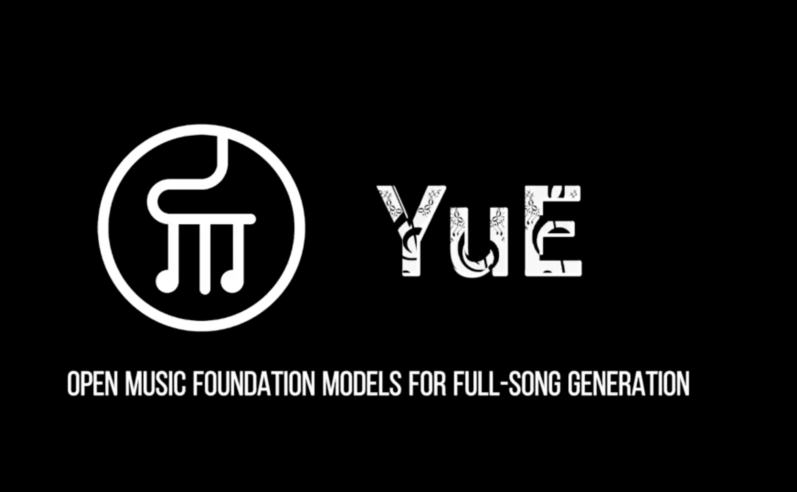

# YuE: An Open-Source Music Generation AI Model Family Capable of Creating Full-Length Songs with Coherent Vocals, Instrumental Harmony, and Multi-Genre Creativity

> Significant progress has been made in short-form instrumental compositions in AI and music generation. However, creating full songs with lyrics, vocals, and instrumental accompaniment is still challenging for existing models. Generating a full-length song from lyrics poses several challenges. The music is long, requiring AI models to maintain consistency and coherence over several minutes. The […]

Significant progress has been made in short-form instrumental compositions in AI and music generation. However, creating full songs with lyrics, vocals, and instrumental accompaniment is still challenging for existing models. Generating a full-length song from lyrics poses several challenges. The music is long, requiring AI models to maintain consistency and coherence over several minutes. The music incorporates intricate harmonic structures, instrumentation, and rhythmic patterns rather than speech or sound effects. AI-generated lyrics often suffer from incoherence when merged with musical elements, and paired lyrics-audio datasets are scarce for effectively training AI models.

This is where [**YuE**](https://map-yue.github.io/), an open-source foundation model family by the Multimodal Art Projection team, emerges, rivaling [**Suno AI**](https://suno.com/) in song generation. These models are designed to create full-length songs lasting several minutes, from lyrics with capabilities to vary background music, genre, and lyrics. The model family comes with different variants with parameters up to 7 billion. Some of the models of the YuE series on Hugging Face include:

- [YuE-s1-7B-anneal-en-cot](https://huggingface.co/m-a-p/YuE-s1-7B-anneal-en-cot)

- [YuE-s1-7B-anneal-en-icl](https://huggingface.co/m-a-p/YuE-s1-7B-anneal-en-icl)

- [YuE-s1-7B-anneal-jp-kr-cot](https://huggingface.co/m-a-p/YuE-s1-7B-anneal-jp-kr-cot)

- [YuE-s1-7B-anneal-jp-kr-icl](https://huggingface.co/m-a-p/YuE-s1-7B-anneal-jp-kr-icl)

- [YuE-s1-7B-anneal-zh-cot](https://huggingface.co/m-a-p/YuE-s1-7B-anneal-zh-cot)

- [YuE-s1-7B-anneal-zh-icl](https://huggingface.co/m-a-p/YuE-s1-7B-anneal-zh-icl)

- [YuE-s2-1B-general](https://huggingface.co/m-a-p/YuE-s2-1B-general)

- [YuE-upsampler](https://huggingface.co/m-a-p/YuE-upsampler)

YuE employs advanced techniques to tackle the challenges of full-length song generation, leveraging the LLaMA family of language models for an enhanced lyrics-to-song generation process. A core advancement is its dual-token technique, which enables synchronized vocal and instrumental modeling without modifying the fundamental LLaMA architecture. This ensures that the vocal and instrumental elements are harmonious throughout the generated song. Also, YuE incorporates a powerful audio tokenizer, which reduces training costs and accelerates convergence. This ensures that the generated audio maintains musical integrity while optimizing computational efficiency.

Another unique technique used in YuE is **_Lyrics-Chain-of-Thoughts (Lyrics-CoT)_**, which allows the model to generate lyrics progressively in a structured manner, ensuring that the lyrical content remains consistent and meaningful throughout the song. YuE also follows a structured three-stage training scheme, which enhances scalability, musicality, and lyric control. This structured training ensures that the model can generate songs of varying lengths and complexities, improves the natural feel of the generated music, and enhances the alignment between the generated lyrics and the overall song structure.

*[**Image Source**](https://map-yue.github.io/)*

YuE stands out from prior AI-based music generation models because it can generate full-length songs incorporating vocal melodies and instrumental accompaniment. Unlike existing models that struggle with long-form compositions, YuE maintains musical coherence throughout an entire song. The generated vocals follow natural singing patterns and tonal shifts, engaging the music. At the same time, the instrumental elements are carefully aligned with the vocal track, producing a natural and balanced song. The model family also supports multiple musical genres and languages.

When it comes to using it, YuE models are designed to run on high-performance GPUs for seamless full-song generation. At least 80GB GPU memory (e.g., NVIDIA A100) is recommended for best results. Depending on the GPU used, a 30-second segment typically takes 150-360 seconds. Users can leverage the Hugging Face Transformers library to generate music using YuE. The model also supports Music In-Context Learning (ICL), allowing users to provide a reference song so the AI can generate new music similarly.

YuE is released under a Creative Commons Attribution Non-Commercial 4.0 License. It encourages artists and content creators to sample, modify, and incorporate its outputs into their works while crediting the model as YuE by HKUST/M-A-P. YuE opens the door to numerous applications in AI-generated music. It can assist musicians and composers in generating song ideas and full-length compositions, create soundtracks for films, video games, and virtual content, generate customized songs based on user-provided lyrics or themes, and aid music education by demonstrating AI-generated compositions across various styles and languages.

In conclusion, YuE represents a breakthrough in AI-powered music generation, addressing the long-standing challenges of lyrics-to-song conversion. With its advanced techniques, scalable architecture, and open-source approach, YuE is set to redefine the landscape of AI-driven music production. As further enhancements and community contributions emerge, YuE has the potential to become the leading foundation model for full-song generation.

---

Also, don’t forget to follow us on **[Twitter](https://x.com/intent/follow?screen_name=marktechpost)** and join our **[Telegram Channel](https://arxiv.org/abs/2406.09406)** and [**LinkedIn Gr**](https://www.linkedin.com/groups/13668564/)[**oup**](https://www.linkedin.com/groups/13668564/). Don’t Forget to join our **[70k+ ML SubReddit](https://www.reddit.com/r/machinelearningnews/)**.

**🚨 [Meet IntellAgent](https://pxl.to/82homag): [An Open-Source Multi-Agent Framework to Evaluate Complex Conversational AI System](https://pxl.to/82homag)** _(Promoted)_
