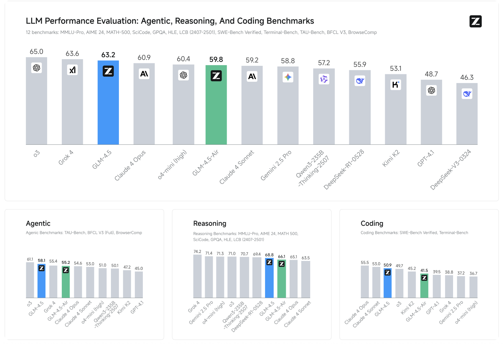

# Zhipu AI Just Released GLM-4.5 Series: Redefining Open-Source Agentic AI with Hybrid Reasoning

> The landscape of AI foundation models is evolving rapidly, but few entries have been as significant in 2025 as the arrival of Z.ai’s GLM-4.5 series: GLM-4.5 and its lighter sibling GLM-4.5-Air. Unveiled by Zhipu AI, these models set remarkably high standards for unified agentic capabilities and open access, aiming to bridge the gap between reasoning, […]

The landscape of AI foundation models is evolving rapidly, but few entries have been as significant in 2025 as the arrival of Z.ai’s GLM-4.5 series: **GLM-4.5** and its lighter sibling **GLM-4.5-Air**. Unveiled by Zhipu AI, these models set remarkably high standards for unified agentic capabilities and open access, aiming to bridge the gap between reasoning, coding, and intelligent agents—and to do so at both massive and manageable scales.

### Model Architecture and Parameters

ModelTotal ParametersActive ParametersNotabilityGLM-4.5355B32BAmong the largest open weights, top benchmark performanceGLM-4.5-Air106B12BCompact, efficient, targeting mainstream hardware compatibility

GLM-4.5 is built on a **Mixture of Experts (MoE)** architecture, with a total of 355 billion parameters (32 billion active at a time). This model is crafted for cutting-edge performance, targeting high-demand reasoning and agentic applications. GLM-4.5-Air, with 106B total and 12B active parameters, provides similar capabilities with a dramatically reduced hardware and compute footprint.

### Hybrid Reasoning: Two Modes in One Framework

Both models introduce a **hybrid reasoning approach**:

- **Thinking Mode**: Enables complex step-by-step reasoning, tool use, multi-turn planning, and autonomous agent tasks.

- **Non-Thinking Mode**: Optimized for instant, stateless responses, making the models versatile for conversational and quick-reaction use cases.

This dual-mode design addresses both sophisticated cognitive workflows and low-latency interactive needs within a single model, empowering next-generation AI agents.

### Performance Benchmarks

Z.ai benchmarked GLM-4.5 on **12 industry-standard tests** (including MMLU, GSM8K, HumanEval):

- **GLM-4.5**: Average benchmark score of 63.2, ranked third overall (second globally, top among all open-source models).

- **GLM-4.5-Air**: Delivers a competitive 59.8, establishing itself as the leader among ~100B-parameter models.

- Outperforms notable rivals in specific areas: tool-calling success rate of 90.6%, outperforming Claude 3.5 Sonnet and Kimi K2.

- Particularly strong results in Chinese-language tasks and coding, with consistent SOTA results across open benchmarks.

### Agentic Capabilities and Architecture

GLM-4.5 advances “**Agent-native**” design: core agentic functionalities (reasoning, planning, action execution) are built directly into the model architecture. This means:

- **Multi-step task decomposition and planning**

- **Tool use and integration with external APIs**

- **Complex data visualization and workflow management**

- **Native support for reasoning and perception-action cycles**

These capabilities enable end-to-end agentic applications previously reserved for smaller, hard-coded frameworks or closed-source APIs.

### Efficiency, Speed, and Cost

- **Speculative Decoding & Multi-Token Prediction (MTP)**: With features like MTP, GLM-4.5 achieves 2.5×–8× faster inference than previous models, with generation speeds >100 tokens/sec on the high-speed API and up to 200 tokens/sec claimed in practice.

- **Memory & Hardware:** GLM-4.5-Air’s 12B active design is compatible with consumer GPUs (32–64GB VRAM) and can be quantized to fit broader hardware. This enables high-performance LLMs to run locally for advanced users.

- **Pricing**: API calls start as low as $0.11 per million input tokens and $0.28 per million output tokens—industry-leading prices for the scale and quality offered.

### Open-Source Access & Ecosystem

A keystone of the GLM-4.5 series is its **MIT open-source license**: the base models, hybrid (thinking/non-thinking) models, and FP8 versions are all released for unrestricted commercial use and secondary development. Code, tool parsers, and reasoning engines are integrated into major LLM frameworks, including transformers, vLLM, and SGLang, with detailed repositories available on GitHub and Hugging Face.

The models can be used through major inference engines, with fine-tuning and on-premise deployment fully supported. This level of openness and flexibility contrasts sharply with the increasingly closed stance of Western rivals.

### Key Technical Innovations

- **Multi-Token Prediction (MTP)** layer for speculative decoding, dramatically boosting inference speed on CPUs and GPUs.

- Unified architecture for reasoning, coding, and multimodal perception-action workflows.

- Trained on 15 trillion tokens, with support for up to 128k input and 96k output context windows.

- Immediate compatibility with research and production tooling, including instructions for tuning and adapting the models for new use cases.

In summary, **GLM-4.5 and GLM-4.5-Air** represent a major leap for open-source, agentic, and reasoning-focused foundation models. They set new standards for accessibility, performance, and unified cognitive capabilities—providing a robust backbone for the next generation of intelligent agents and developer applications.

---

Check out the **[GLM 4.5](https://huggingface.co/zai-org/GLM-4.5), [GLM 4.5 Air](https://huggingface.co/zai-org/GLM-4.5-Air), [GitHub Page](https://github.com/zai-org/GLM-4.5) and [Technical details](https://z.ai/blog/glm-4.5)_._** All credit for this research goes to the researchers of this project. Also, feel free to follow us on **[Twitter](https://x.com/intent/follow?screen_name=marktechpost)** and don’t forget to join our **[100k+ ML SubReddit](https://www.reddit.com/r/machinelearningnews/)** and Subscribe to **[our Newsletter](https://www.aidevsignals.com/)**.
