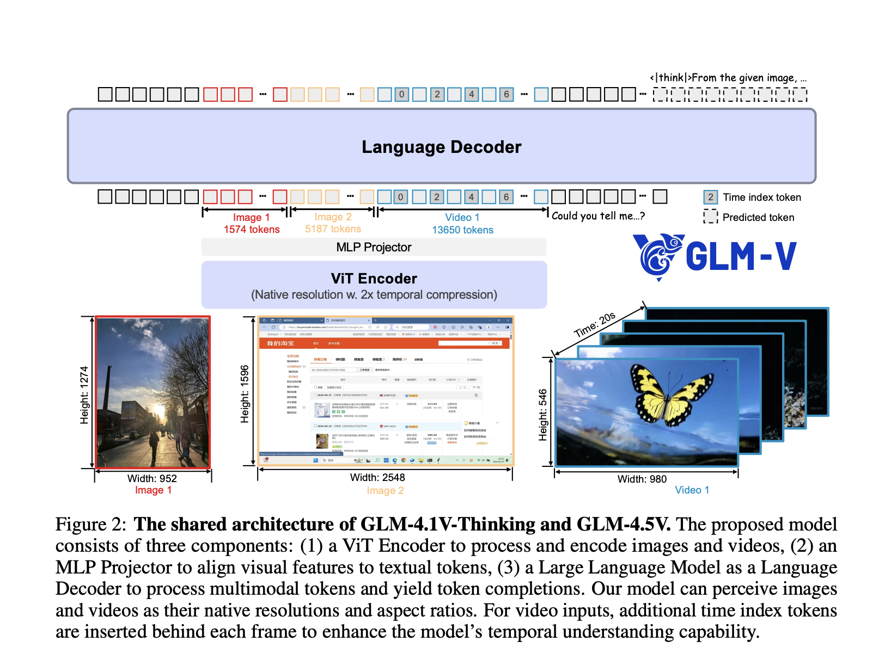

# Zhipu AI Releases GLM-4.5V: Versatile Multimodal Reasoning with Scalable Reinforcement Learning

> Zhipu AI has officially released and open-sourced GLM-4.5V, a next-generation vision-language model (VLM) that significantly advances the state of open multimodal AI. Based on Zhipu’s 106-billion parameter GLM-4.5-Air architecture—with 12 billion active parameters via a Mixture-of-Experts (MoE) design—GLM-4.5V delivers strong real-world performance and unmatched versatility across visual and textual content. Key Features and Design Innovations […]

Zhipu AI has officially released and open-sourced GLM-4.5V, a next-generation vision-language model (VLM) that significantly advances the state of open multimodal AI. Based on Zhipu’s 106-billion parameter GLM-4.5-Air architecture—with 12 billion active parameters via a Mixture-of-Experts (MoE) design—GLM-4.5V delivers strong real-world performance and unmatched versatility across visual and textual content.

### Key Features and Design Innovations

#### 1. Comprehensive Visual Reasoning

- **Image Reasoning:** GLM-4.5V achieves advanced scene understanding, multi-image analysis, and spatial recognition. It can interpret detailed relationships in complex scenes (such as distinguishing product defects, analyzing geographical clues, or inferring context from multiple images simultaneously).

- **Video Understanding:** It processes long videos, performing automatic segmentation and recognizing nuanced events thanks to a 3D convolutional vision encoder. This enables applications like storyboarding, sports analytics, surveillance review, and lecture summarization.

- **Spatial Reasoning:** Integrated 3D Rotational Positional Encoding (3D-RoPE) gives the model a robust perception of three-dimensional spatial relationships, crucial for interpreting visual scenes and grounding visual elements.

#### 2. Advanced GUI and Agent Tasks

- **Screen Reading & Icon Recognition:** The model excels at reading desktop/app interfaces, localizing buttons and icons, and assisting with automation—essential for RPA (robotic process automation) and accessibility tools.

- **Desktop Operation Assistance:** Through detailed visual understanding, GLM-4.5V can plan and describe GUI operations, assisting users in navigating software or performing complex workflows.

#### 3. Complex Chart and Document Parsing

- **Chart Understanding:** GLM-4.5V can analyze charts, infographics, and scientific diagrams within PDFs or PowerPoint files, extracting summarized conclusions and structured data even from dense, long documents.

- **Long Document Interpretation:** With support for up to 64,000 tokens of multimodal context, it can parse and summarize extended, image-rich documents (such as research papers, contracts, or compliance reports), making it ideal for business intelligence and knowledge extraction.

#### 4. Grounding and Visual Localization

- **Precise Grounding:** The model can accurately localize and describe visual elements—such as objects, bounding boxes, or specific UI elements—using world knowledge and semantic context, not just pixel-level cues. This enables detailed analysis for quality control, AR applications, and image annotation workflows.

### Architectural Highlights

- **Hybrid Vision-Language Pipeline:** The system integrates a powerful visual encoder, MLP adapter, and a language decoder, allowing seamless fusion of visual and textual information. Static images, videos, GUIs, charts, and documents are all treated as first-class inputs.

- **Mixture-of-Experts (MoE) Efficiency:** While housing 106B total parameters, the MoE design activates only 12B per inference, ensuring high throughput and affordable deployment without sacrificing accuracy.

- **3D Convolution for Video & Images:** Video inputs are processed using temporal downsampling and 3D convolution, enabling the analysis of high-resolution videos and native aspect ratios, while maintaining efficiency.

- **Adaptive Context Length:** Supports up to 64K tokens, allowing robust handling of multi-image prompts, concatenated documents, and lengthy dialogues in one pass.

- **Innovative Pretraining and RL:** The training regime combines massive multimodal pretraining, supervised fine-tuning, and **Reinforcement Learning with Curriculum Sampling (RLCS)** for long-chain reasoning mastery and real-world task robustness.

### “Thinking Mode” for Tunable Reasoning Depth

**A prominent feature is the “Thinking Mode” toggle:**

- **Thinking Mode ON**: Prioritizes deep, step-by-step reasoning, suitable for complex tasks (e.g., logical deduction, multi-step chart or document analysis).

- **Thinking Mode OFF**: Delivers faster, direct answers for routine lookups or simple Q&A. The user can control the model’s reasoning depth at inference, balancing speed against interpretability and rigor.

### Benchmark Performance and Real-World Impact

- **State-of-the-Art Results**: GLM-4.5V achieves SOTA across 41–42 public multimodal benchmarks, including MMBench, AI2D, MMStar, MathVista, and more, outperforming both open and some premium proprietary models in categories like STEM QA, chart understanding, GUI operation, and video comprehension.

- **Practical Deployments**: Businesses and researchers report transformative results in defect detection, automated report analysis, digital assistant creation, and accessibility technology with GLM-4.5V.

- **Democratizing Multimodal AI**: Open-sourced under the MIT license, the model equalizes access to cutting-edge multimodal reasoning that was previously gated by exclusive proprietary APIs.

### Example Use Cases

FeatureExample UseDescriptionImage ReasoningDefect detection, content moderationScene understanding, multiple-image summarizationVideo AnalysisSurveillance, content creationLong video segmentation, event recognitionGUI TasksAccessibility, automation, QAScreen/UI reading, icon location, operation suggestionChart ParsingFinance, research reportsVisual analytics, data extraction from complex chartsDocument ParsingLaw, insurance, scienceAnalyze & summarize long illustrated documentsGroundingAR, retail, roboticsTarget object localization, spatial referencing

### Summary

GLM-4.5V by Zhipu AI is a flagship open-source vision-language model setting new performance and usability standards for multimodal reasoning. With its powerful architecture, context length, real-time “thinking mode”, and broad capability spectrum, GLM-4.5V is redefining what’s possible for enterprises, researchers, and developers working at the intersection of vision and language.

---

Check out the **[Paper](https://github.com/zai-org/GLM-V/blob/main/resources/GLM-4.5V_technical_report.pdf), [Model on Hugging Face](https://huggingface.co/zai-org/GLM-4.5V)** and **[GitHub Page here](https://github.com/zai-org/GLM-V)**. Feel free to check out our **[GitHub Page for Tutorials, Codes and Notebooks](https://github.com/Marktechpost/AI-Tutorial-Codes-Included)**. Also, feel free to follow us on **[Twitter](https://x.com/intent/follow?screen_name=marktechpost)** and don’t forget to join our **[100k+ ML SubReddit](https://www.reddit.com/r/machinelearningnews/)** and Subscribe to **[our Newsletter](https://www.aidevsignals.com/)**.

[🇬 Star us on GitHub](https://github.com/Marktechpost/AI-Tutorial-Codes-Included)

[ 🇷 Join our ML Subreddit ](https://www.reddit.com/r/machinelearningnews/)

[**🇸 Sponsor us **](https://promotion.marktechpost.com/)
