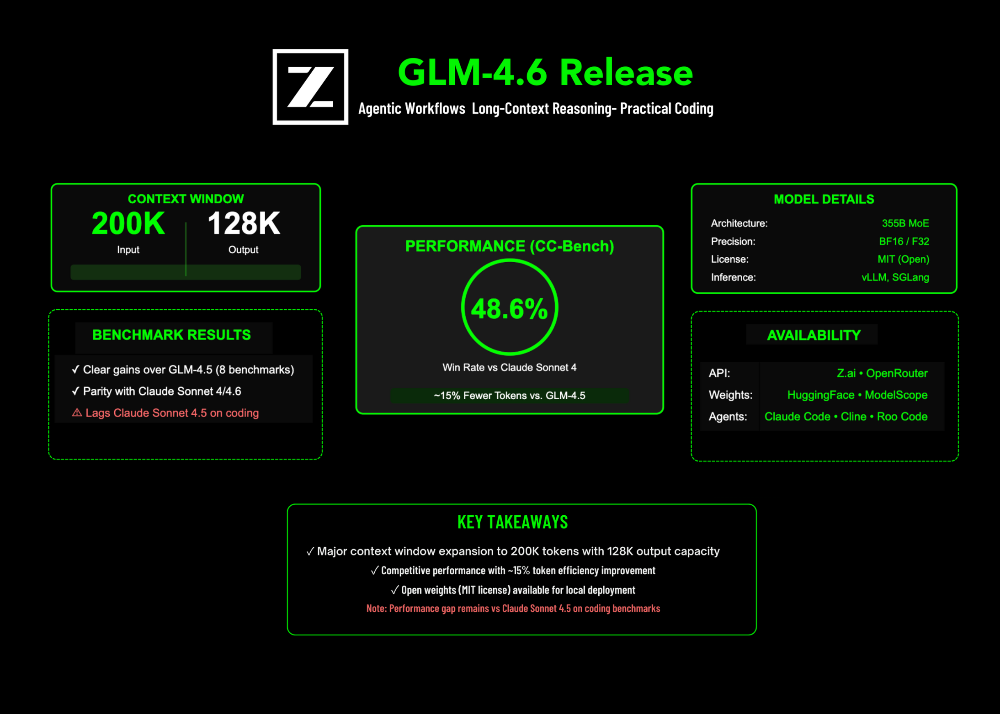

# Zhipu AI Releases GLM-4.6: Achieving Enhancements in Real-World Coding, Long-Context Processing, Reasoning, Searching and Agentic AI

> Zhipu AI has released GLM-4.6, a major update to its GLM series focused on agentic workflows, long-context reasoning, and practical coding tasks. The model raises the input window to 200K tokens with a 128K max output, targets lower token consumption in applied tasks, and ships with open weights for local deployment. So, what’s exactly is […]

Zhipu AI has released GLM-4.6, a major update to its GLM series focused on agentic workflows, long-context reasoning, and practical coding tasks. The model raises the input window to **200K tokens** with a **128K max output**, targets lower token consumption in applied tasks, and ships with **open weights** for local deployment.

*https://z.ai/blog/glm-4.6*

### So, what’s exactly is new?

- **Context + output limits**: **200K** input context and **128K** maximum output tokens.

- **Real-world coding results:** On the extended **CC-Bench** (multi-turn tasks run by human evaluators in isolated Docker environments), GLM-4.6 is reported **near parity with Claude Sonnet 4 (48.6% win rate)** and uses **~15% fewer tokens vs. GLM-4.5** to finish tasks. Task prompts and agent trajectories are published for inspection.

- **Benchmark positioning**: Zhipu summarizes “clear gains” over GLM-4.5 across eight public benchmarks and states parity with Claude Sonnet 4/4.6 on several; it also notes **GLM-4.6 still lags Sonnet 4.5 on coding**—a useful caveat for model selection.

- **Ecosystem availability**: GLM-4.6 is available via **Z.ai API** and **OpenRouter**; it integrates with popular coding agents (Claude Code, Cline, Roo Code, Kilo Code), and existing Coding Plan users can upgrade by switching the model name to `glm-4.6`.

- **Open weights + license**: Hugging Face model card lists **License: MIT** and **Model size: 355B params (MoE)** with BF16/F32 tensors. (MoE “total parameters” are not equal to active parameters per token; no active-params figure is stated for 4.6 on the card.)

- **Local inference**: **vLLM** and **SGLang** are supported for local serving; weights are on **Hugging Face** and **ModelScope**.

*https://z.ai/blog/glm-4.6*

### Summary

GLM-4.6 is an incremental but material step: a 200K context window, ~15% token reduction on CC-Bench versus GLM-4.5, near-parity task win-rate with Claude Sonnet 4, and immediate availability via Z.ai, OpenRouter, and open-weight artifacts for local serving.

---

### FAQs

**1) What are the context and output token limits?**
GLM-4.6 supports a **200K** input context and **128K** maximum output tokens.

**2) Are open weights available and under what license?**
Yes. The Hugging Face model card lists **open weights** with **License: MIT** and a **357B-parameter MoE** configuration (BF16/F32 tensors).

**3) How does GLM-4.6 compare to GLM-4.5 and Claude Sonnet 4 on applied tasks?**
On the extended **CC-Bench**, GLM-4.6 reports **~15% fewer tokens vs. GLM-4.5** and **near-parity with Claude Sonnet 4 (48.6% win-rate)**.

**4) Can I run GLM-4.6 locally?**
Yes. Zhipu provides weights on **Hugging Face/ModelScope** and documents local inference with **vLLM** and **SGLang**; community quantizations are appearing for workstation-class hardware.

---

Check out the **[GitHub Page](https://github.com/zai-org/GLM-4.5), [Hugging Face Model Card](https://huggingface.co/zai-org/GLM-4.6) **and** [Technical details](https://z.ai/blog/glm-4.6)**. Feel free to check out our **[GitHub Page for Tutorials, Codes and Notebooks](https://github.com/Marktechpost/AI-Tutorial-Codes-Included)**. Also, feel free to follow us on **[Twitter](https://x.com/intent/follow?screen_name=marktechpost)** and don’t forget to join our **[100k+ ML SubReddit](https://www.reddit.com/r/machinelearningnews/)** and Subscribe to **[our Newsletter](https://www.aidevsignals.com/)**.
