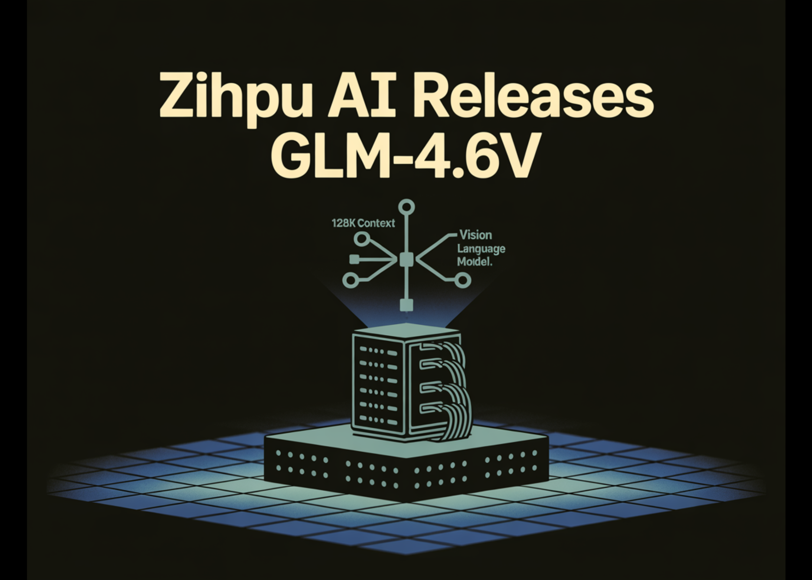

# Zhipu AI Releases GLM-4.6V: A 128K Context Vision Language Model with Native Tool Calling

> Zhipu AI has open sourced the GLM-4.6V series as a pair of vision language models that treat images, video and tools as first class inputs for agents, not as afterthoughts bolted on top of text. Model lineup and context length The series has 2 models. GLM-4.6V is a 106B parameter foundation model for cloud and […]

Zhipu AI has open sourced the GLM-4.6V series as a pair of vision language models that treat images, video and tools as first class inputs for agents, not as afterthoughts bolted on top of text.

### Model lineup and context length

The series has 2 models. **GLM-4.6V is a 106B** parameter foundation model for cloud and high performance cluster workloads. **GLM-4.6V-Flash** is a 9B parameter variant tuned for local deployment and low latency use.

GLM-4.6V extends the training context window to 128K tokens. In practice this supports roughly 150 pages of dense documents, 200 slide pages or one hour of video in a single pass because pages are encoded as images and consumed by the visual encoder.

### Native multimodal tool use

The main technical change is native **multimodal Function Calling**. Traditional tool use in LLM systems routes everything through text. Images or pages are first turned into descriptions, the model calls tools using text arguments and then reads textual responses. This wastes information and increases latency.

GLM-4.6V introduces **native multimodal Function Calling**. Images, screenshots and document pages pass directly as tool parameters. Tools can return search result grids, charts, rendered web pages or product images. The model consumes those visual outputs and fuses them with text in the same reasoning chain. This closes the loop from perception to understanding to execution and is explicitly positioned as the bridge between visual perception and executable action for multimodal agents.

To support this, Zhipu AI extends the Model Context Protocol with URL based multimodal handling. Tools receive and return URLs that identify specific images or frames, which avoids file size limits and allows precise selection inside multi image contexts.

### Rich text content, web search and frontend replication

**Zhipu AI research team describes 4 canonical scenarios:**

**First, rich text content understanding and creation**. GLM-4.6V reads mixed inputs such as papers, reports or slide decks and produces structured image text interleaved outputs. It understands text, charts, figures, tables and formulas in the same document. During generation it can crop relevant visuals or retrieve external images through tools, then run a visual audit step that filters low quality images and composes the final article with inline figures.

**Second, visual web search**. The model can detect user intent, plan which search tools to call and combine text to image and image to text search. It then aligns retrieved images and text, selects the relevant evidence and outputs a structured answer, for example a visual comparison of products or places.

**Third, frontend replication and visual interaction**. GLM-4.6V is tuned for design to code workflows. From a UI screenshot, it reconstructs pixel accurate HTML, CSS and JavaScript. Developers can then mark a region on the screenshot and issue natural language instructions, for example move this button left or change this card background. The model maps those instructions back to the code and returns an updated snippet.

**Fourth, multimodal document understanding at long context**. GLM-4.6V can read multi document inputs up to the 128K token context limit by treating pages as images. The research team reports a case where the model processes financial reports from 4 public companies, extracts core metrics and builds a comparison table, and a case where it summarises a full football match while keeping the ability to answer questions about specific goals and timestamps.

### Architecture, data and reinforcement learning

The GLM-4.6V models belong to the GLM-V family and based on the tech report for GLM-4.5V and GLM-4.1V-Thinking. The research team highlights three main technical ingredients.

**First, long sequence modeling**. GLM-4.6V extends the training context window to 128K tokens and runs continual pre training on massive long context image text corpora. It uses compression alignment ideas from Glyph so that visual tokens can carry dense information that is aligned with language tokens.

**Second, world knowledge enhancement.** Zhipu AI team adds a billion scale multimodal perception and world knowledge dataset at pre training time. This covers layered encyclopedic concepts and everyday visual entities. The stated goal is to improve both basic perception and cross modal question answering completeness, not only benchmarks.

**Third, agentic data synthesis and extended MCP**. The research team generates large synthetic traces where the model calls tools, processes visual outputs and iterates on plans. They extend MCP with URL based multimodal handling and an interleaved output mechanism. The generation stack follows a Draft, Image Selection, Final Polish sequence. The model can autonomously call cropping or search tools between these stages to place images at the right positions in the output.

Tool invocation is part of the reinforcement learning objective. GLM-4.6V uses RL to align planning, instruction following and format adherence in complex tool chains.

### Performance

*https://z.ai/blog/glm-4.6v*

### Key Takeaways

- GLM-4.6V is a 106B multimodal foundation model with a 128K token training context, and GLM-4.6V-Flash is a 9B variant optimized for local and low latency use.

- Both models support native multimodal Function Calling so tools can consume and return images, video frames and document pages directly, which links visual perception to executable actions for agents.

- GLM-4.6V is trained for long context multimodal understanding and interleaved generation, so it can read large mixed document sets and emit structured text with inline figures and tool selected images in one pass.

- The series achieves state of the art performance on major multimodal benchmarks at similar parameter scales and is released as open source weights under the MIT license on Hugging Face and ModelScope.

---

Check out the **[Model Card on HF](https://huggingface.co/collections/zai-org/glm-46v)** and **[Technical details](https://z.ai/blog/glm-4.6v)**. Feel free to check out our **[GitHub Page for Tutorials, Codes and Notebooks](https://github.com/Marktechpost/AI-Tutorial-Codes-Included)**. Also, feel free to follow us on **[Twitter](https://x.com/intent/follow?screen_name=marktechpost)** and don’t forget to join our **[100k+ ML SubReddit](https://www.reddit.com/r/machinelearningnews/)** and Subscribe to **[our Newsletter](https://www.aidevsignals.com/)**. Wait! are you on telegram? **[now you can join us on telegram as well.](https://t.me/machinelearningresearchnews)**
