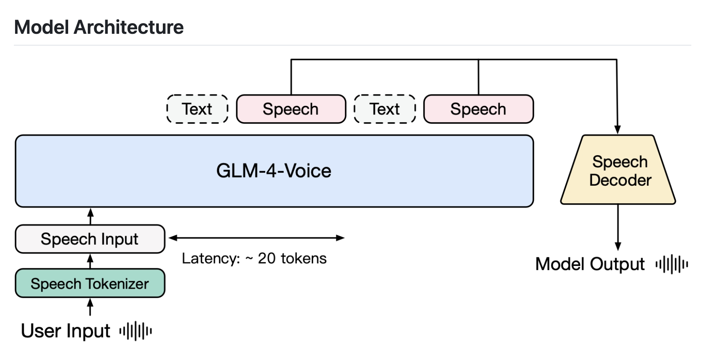

# Zhipu AI Releases GLM-4-Voice: A New Open-Source End-to-End Speech Large Language Model

> In the evolving landscape of artificial intelligence, one of the most persistent challenges has been bridging the gap between machines and human-like interaction. Modern AI models excel in text generation, image understanding, and even creating visual content, but speech—the primary medium of human communication—presents unique hurdles. Traditional speech recognition systems, though advanced, often struggle with […]

In the evolving landscape of artificial intelligence, one of the most persistent challenges has been bridging the gap between machines and human-like interaction. Modern AI models excel in text generation, image understanding, and even creating visual content, but speech—the primary medium of human communication—presents unique hurdles. Traditional speech recognition systems, though advanced, often struggle with understanding nuanced emotions, variations in dialect, and real-time adjustments. They can fall short in capturing the essence of natural human conversation, including interruptions, tone shifts, and emotional variance.

Zhipu AI recently released GLM-4-Voice, an open-source end-to-end speech large language model designed to address these limitations. It’s the latest addition to Zhipu’s extensive multi-modal large model family, which includes models capable of image understanding, video generation, and more. With GLM-4-Voice, Zhipu AI takes a significant step towards achieving seamless, human-like interaction between machines and users. This model represents an important milestone in the evolution of speech AI, providing an expansive toolkit for understanding and generating human speech in a natural and dynamic way. It aims to bring AI closer to having a full sensory understanding of the world, allowing it to respond to humans in a manner that feels less robotic and more empathetic.

GLM-4-Voice is a cohesive system that integrates speech recognition, language understanding, and speech generation, supporting both Chinese and English languages. This end-to-end integration allows it to bypass traditional, often cumbersome pipelines that require multiple models for transcription, translation, and generation. The model’s design incorporates advanced multi-modal techniques, enabling it to directly understand speech input and generate human-like responses efficiently.

A standout feature of GLM-4-Voice is its capability to adjust emotion, tone, speed, and even dialect based on user instructions, making it a versatile tool for various applications—from voice assistants to advanced dialogue systems. The model also boasts lower latency and real-time interruption support, crucial for smooth, natural interactions where users can speak over the AI or redirect conversations without disruptive pauses.

The significance of GLM-4-Voice extends beyond its technical prowess; it fundamentally improves the way humans and machines interact, making these interactions more intuitive and relatable. Current voice assistants, while advanced, often feel rigid because they cannot adjust dynamically to the flow of human conversation, particularly in emotional contexts. GLM-4-Voice tackles these issues head-on, allowing for the modulation of voice outputs to make conversations more expressive and natural.

Early tests indicate that GLM-4-Voice performs exceptionally well, with smoother voice transitions and better handling of interruptions compared to its predecessors. This real-time adaptability could bridge the gap between practical functionality and a genuinely pleasant user experience. According to initial data shared by Zhipu AI, GLM-4-Voice shows a marked improvement in responsiveness, with reduced latency that significantly enhances user satisfaction in interactive applications.

GLM-4-Voice marks a significant advancement in AI-driven speech models. By addressing the complexities of end-to-end speech interaction in both Chinese and English and offering an open-source platform, Zhipu AI enables further innovation. Features like adjustable emotional tones, dialect support, and lower latency position this model to impact personal assistants, customer service, entertainment, and education. GLM-4-Voice brings us closer to a more natural and responsive AI interaction, representing a promising step towards the future of multi-modal AI systems.

---

Check out the** [GitHub](https://github.com/THUDM/GLM-4-Voice) and [HF Page](https://huggingface.co/collections/THUDM/glm-4-665fcf188c414b03c2f7e3b7).** All credit for this research goes to the researchers of this project. Also, don’t forget to follow us on **[Twitter](https://twitter.com/Marktechpost)** and join our **[Telegram Channel](https://pxl.to/at72b5j)** and [**LinkedIn Gr**](https://www.linkedin.com/groups/13668564/)[**oup**](https://www.linkedin.com/groups/13668564/). **If you like our work, you will love our**[** newsletter..**](https://marktechpost-newsletter.beehiiv.com/subscribe) Don’t Forget to join our **[55k+ ML SubReddit](https://www.reddit.com/r/machinelearningnews/)**.

**[[Upcoming Live Webinar- Oct 29, 2024] ](https://go.predibase.com/predibase-inference-engine-102924-lp?utm_medium=3rdparty&utm_source=marktechpost)****[The Best Platform for Serving Fine-Tuned Models: Predibase Inference Engine (Promoted)](https://go.predibase.com/predibase-inference-engine-102924-lp?utm_medium=3rdparty&utm_source=marktechpost)**
