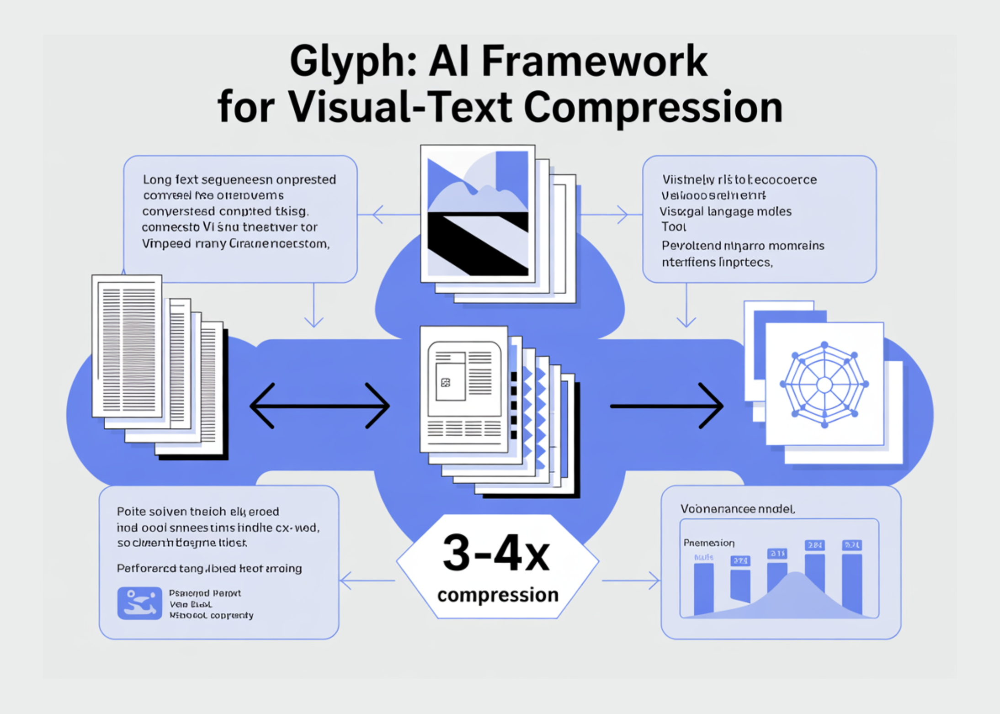

# Zhipu AI Releases ‘Glyph’: An AI Framework for Scaling the Context Length through Visual-Text Compression

> Can we render long texts as images and use a VLM to achieve 3–4× token compression, preserving accuracy while scaling a 128K context toward 1M-token workloads? A team of researchers from Zhipu AI release Glyph, an AI framework for scaling the context length through visual-text compression. It renders long textual sequences into images and processes […]

Can we render long texts as images and use a VLM to achieve 3–4× token compression, preserving accuracy while scaling a 128K context toward 1M-token workloads? A team of researchers from **Zhipu AI release [Glyph](https://github.com/thu-coai/Glyph?tab=readme-ov-file)**, an AI framework for scaling the context length through visual-text compression. It renders long textual sequences into images and processes them using vision–language models. The system renders ultra long text into page images, then a vision language model, VLM, processes those pages end to end. Each visual token encodes many characters, so the effective token sequence shortens, while semantics are preserved. Glyph can achieve 3-4x token compression on long text sequences without performance degradation, enabling significant gains in memory efficiency, training throughput, and inference speed.

*https://arxiv.org/pdf/2510.17800*

### Why Glyph?

Conventional methods expand positional encodings or modify attention, compute and memory still scale with token count. Retrieval trims inputs, but risks missing evidence and adds latency. Glyph changes the representation, it converts text to images and shifts burden to a VLM that already learns OCR, layout, and reasoning. This increases information density per token, so a fixed token budget covers more original context. Under extreme compression, the research team show a 128K context VLM can address tasks that originate from 1M token level text.

*https://arxiv.org/pdf/2510.17800*

### System design and training

The method has three stages, continual pre training, LLM driven rendering search, and post training. Continual pre training exposes the VLM to large corpora of rendered long text with diverse typography and styles. The objective aligns visual and textual representations, and transfers long context skills from text tokens to visual tokens. The rendering search is a genetic loop driven by an LLM. It mutates page size, dpi, font family, font size, line height, alignment, indent, and spacing. It evaluates candidates on a validation set to optimize accuracy and compression jointly. Post training uses supervised fine tuning and reinforcement learning with Group Relative Policy Optimization, plus an auxiliary OCR alignment task. The OCR loss improves character fidelity when fonts are small and spacing is tight.

*https://arxiv.org/pdf/2510.17800*

### Results, performance and efficiency…

LongBench and MRCR establish accuracy and compression under long dialogue histories and document tasks. The model achieves an average effective compression ratio about 3.3 on LongBench, with some tasks near 5, and about 3.0 on MRCR. These gains scale with longer inputs, since every visual token carries more characters. Reported speedups versus the text backbone at 128K inputs are about 4.8 times for prefill, about 4.4 times for decoding, and about 2 times for supervised fine tuning throughput. The Ruler benchmark confirms that higher dpi at inference time improves scores, since crisper glyphs help OCR and layout parsing. The research team reports dpi 72 with average compression 4.0 and maximum 7.7 on specific sub tasks, dpi 96 with average compression 2.2 and maximum 4.4, and dpi 120 with average 1.2 and maximum 2.8. The 7.7 maximum belongs to Ruler, not to MRCR.

*https://arxiv.org/pdf/2510.17800*

### So, what? Applications

Glyph benefits multimodal document understanding. Training on rendered pages improves performance on MMLongBench Doc relative to a base visual model. This indicates that the rendering objective is a useful pretext for real document tasks that include figures and layout. The main failure mode is sensitivity to aggressive typography. Very small fonts and tight spacing degrade character accuracy, especially for rare alphanumeric strings. The research team exclude the UUID subtask on Ruler. The approach assumes [server](https://www.marktechpost.com/2025/08/08/proxy-servers-explained-types-use-cases-trends-in-2025-technical-deep-dive/) side rendering and a VLM with strong OCR and layout priors.

### Key Takeaways

- Glyph renders long text into images, then a vision language model processes those pages. This reframes long-context modeling as a multimodal problem and preserves semantics while reducing tokens.

- The research team reports token compression is 3 to 4 times with accuracy comparable to strong 8B text baselines on long-context benchmarks.

- Prefill speedup is about 4.8 times, decoding speedup is about 4.4 times, and supervised fine tuning throughput is about 2 times, measured at 128K inputs.

- The system uses continual pretraining on rendered pages, an LLM driven genetic search over rendering parameters, then supervised fine tuning and reinforcement learning with GRPO, plus an OCR alignment objective.

- Evaluations include LongBench, MRCR, and Ruler, with an extreme case showing a 128K context VLM addressing 1M token level tasks. Code and model card are public on GitHub and Hugging Face.

### Editorial Comments

Glyph treats long context scaling as visual text compression, it renders long sequences into images and lets a VLM process them, reducing tokens while preserving semantics. The research team claims 3 to 4 times token compression with accuracy comparable to Qwen3 8B baselines, about 4 times faster prefilling and decoding, and about 2 times faster SFT throughput. The pipeline is disciplined, continual pre training on rendered pages, an LLM genetic rendering search over typography, then post training. The approach is pragmatic for million token workloads under extreme compression, yet it depends on OCR and typography choices, which remain knobs. Overall, visual text compression offers a concrete path to scale long context while controlling compute and memory.

---

Check out the **[Paper](https://arxiv.org/abs/2510.17800), [Weights](https://huggingface.co/zai-org/Glyph) and [Repo](https://github.com/thu-coai/Glyph?tab=readme-ov-file)**. Feel free to check out our **[GitHub Page for Tutorials, Codes and Notebooks](https://github.com/Marktechpost/AI-Tutorial-Codes-Included)**. Also, feel free to follow us on **[Twitter](https://x.com/intent/follow?screen_name=marktechpost)** and don’t forget to join our **[100k+ ML SubReddit](https://www.reddit.com/r/machinelearningnews/)** and Subscribe to **[our Newsletter](https://www.aidevsignals.com/)**. Wait! are you on telegram? **[now you can join us on telegram as well.](https://t.me/machinelearningresearchnews)**
