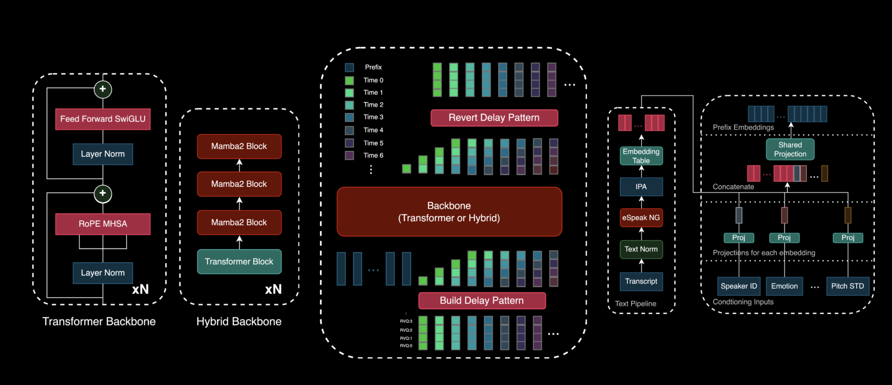

# Zyphra Introduces the Beta Release of Zonos: A Highly Expressive TTS Model with High Fidelity Voice Cloning

> Text-to-speech (TTS) technology has made significant strides in recent years, but challenges remain in creating natural, expressive, and high-fidelity speech synthesis. Many TTS systems struggle to replicate the nuances of human speech, such as intonation, emotion, and accent, often resulting in artificial-sounding voices. Additionally, precise voice cloning remains difficult, limiting the ability to generate personalized […]

Text-to-speech (TTS) technology has made significant strides in recent years, but challenges remain in creating natural, expressive, and high-fidelity speech synthesis. Many TTS systems struggle to replicate the nuances of human speech, such as intonation, emotion, and accent, often resulting in artificial-sounding voices. Additionally, precise voice cloning remains difficult, limiting the ability to generate personalized or diverse speech outputs. These challenges have driven continued research into more sophisticated TTS models capable of producing real-time, expressive, and realistic speech.

**Zyphra has introduced the beta release of Zonos-v0.1, featuring two real-time TTS models with high-fidelity voice cloning. The release includes a 1.6 billion-parameter transformer model and a similarly sized hybrid model, both available under the Apache 2.0 license. This open-source initiative seeks to advance TTS research by making high-quality speech synthesis technology more accessible to developers and researchers.**

The Zonos-v0.1 models are trained on approximately 200,000 hours of speech data, encompassing both neutral and expressive speech patterns. While the primary dataset consists of English-language content, significant portions of Chinese, Japanese, French, Spanish, and German speech have been incorporated, allowing for multilingual support. The models generate lifelike speech from text prompts using either speaker embeddings or audio prefixes. They can perform voice cloning with as little as 5 to 30 seconds of sample speech and offer controls over parameters such as speaking rate, pitch variation, audio quality, and emotions like sadness, fear, anger, happiness, and surprise. The synthesized speech is produced at a 44 kHz sample rate, ensuring high audio fidelity.

**Zonos-v0.1 includes several key features:**

- **Zero-shot TTS with Voice Cloning**: Users can generate speech by providing a short speaker sample alongside text input, making it possible to synthesize voices with minimal data.

- **Audio Prefix Inputs**: By incorporating an audio prefix, the models can better match speaker characteristics and even reproduce specific speaking styles, such as whispering.

- **Multilingual Support**: The system supports multiple languages, including English, Japanese, Chinese, French, and German, increasing its versatility for global applications.

- **Audio Quality and Emotion Control**: Users can fine-tune aspects such as pitch, frequency range, and emotional tone to create more expressive and natural speech outputs.

- **Efficient Performance**: Running at approximately twice real-time speed on an RTX 4090, the models are optimized for real-time applications.

- **User-friendly Interface**: A Gradio-based WebUI simplifies speech generation, making it accessible to a broader range of users.

- **Straightforward Deployment**: The models can be installed and deployed easily using a provided Docker setup, ensuring ease of integration into existing workflows.

**These features make Zonos-v0.1 a flexible tool for various TTS applications, from content creation to accessibility tools.**

Early evaluations suggest that Zonos-v0.1 delivers high-quality speech generation, often comparable to or exceeding leading proprietary systems. While objective audio evaluation remains complex, comparisons with other models—including proprietary solutions such as ElevenLabs and Cartesia, as well as open-source alternatives like FishSpeech-v1.5—highlight Zonos’s ability to produce clear, natural, and expressive speech. The hybrid model, in particular, offers reduced latency and lower memory usage compared to the transformer variant, benefiting from its Mamba2-based architecture, which minimizes reliance on attention mechanisms.

The beta release of Zonos-v0.1 represents an important step forward in open-source TTS development. By providing a high-fidelity, expressive, and real-time speech synthesis tool under an accessible license, Zyphra offers developers and researchers a powerful resource for advancing TTS applications. Its combination of voice cloning, multilingual support, and fine-grained audio control makes it a versatile addition to the field, with potential applications in assistive technologies, content creation, and beyond.

---

Check out **_the [Technical details](https://www.zyphra.com/post/beta-release-of-zonos-v0-1), [GitHub Page](https://github.com/Zyphra/Zonos), [Zyphra/Zonos-v0.1-transformer](https://huggingface.co/Zyphra/Zonos-v0.1-transformer)_** and **_[Zyphra/Zonos-v0.1-hybrid](https://huggingface.co/Zyphra/Zonos-v0.1-hybrid)._** All credit for this research goes to the researchers of this project. Also, don’t forget to follow us on **[Twitter](https://x.com/intent/follow?screen_name=marktechpost)** and join our **[Telegram Channel](https://arxiv.org/abs/2406.09406)** and [**LinkedIn Gr**](https://www.linkedin.com/groups/13668564/)[**oup**](https://www.linkedin.com/groups/13668564/). Don’t Forget to join our **[75k+ ML SubReddit](https://www.reddit.com/r/machinelearningnews/)**.

**[🚨 Recommended Open-Source AI Platform: ‘IntellAgent is a An Open-Source Multi-Agent Framework to Evaluate Complex Conversational AI System’ (Promoted)](https://pxl.to/82homag)**
