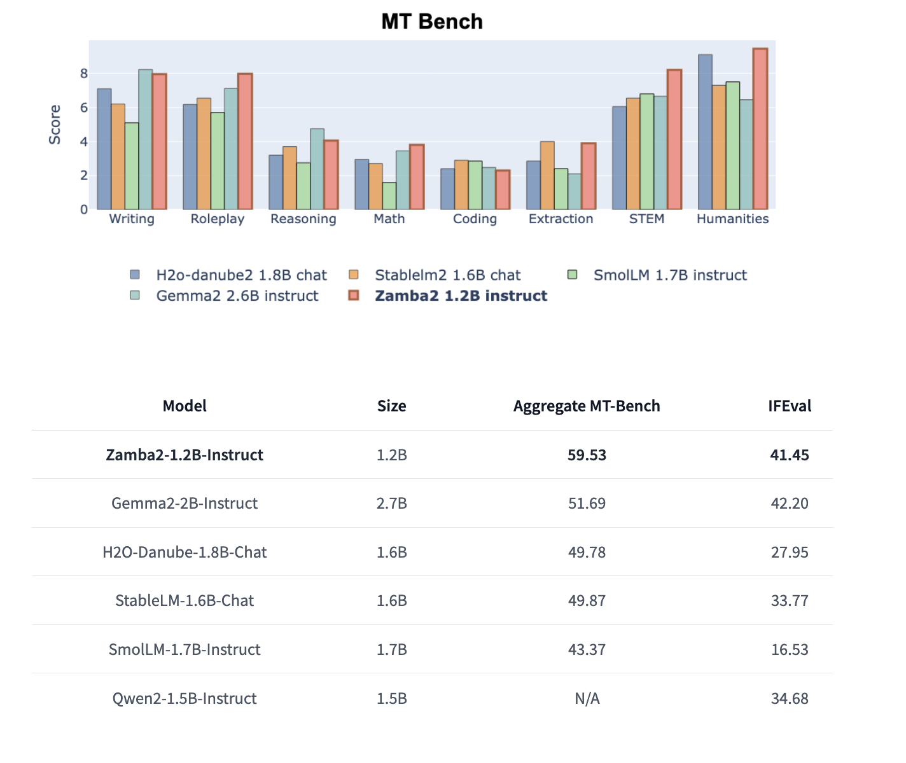

# Zyphra Releases Zamba2-1.2B-Instruct and Zamba2-2.7B-Instruct: A New State-of-the-Art Small Language Model Series that Outperforms Gemma2-2B-Instruct

> The AI research organization Zyphra has recently unveiled two groundbreaking language models, Zamba2-1.2B-Instruct and Zamba2-2.7B-Instruct. These models are part of the Zamba2 series and are significant advancements in natural language processing and AI-based instruction. Zamba2-1.2B-Instruct and Zamba2-2.7B-Instruct are designed to deliver enhanced multi-turn chat capabilities and exceptional instruction-following abilities, providing cutting-edge solutions for various applications […]

The AI research organization Zyphra has recently unveiled two groundbreaking language models, [**Zamba2-1.2B-Instruct**](https://huggingface.co/Zyphra/Zamba2-1.2B-instruct) and [**Zamba2-2.7B-Instruct**](https://huggingface.co/Zyphra/Zamba2-2.7B-instruct). These models are part of the Zamba2 series and are significant advancements in natural language processing and AI-based instruction. Zamba2-1.2B-Instruct and Zamba2-2.7B-Instruct are designed to deliver enhanced multi-turn chat capabilities and exceptional instruction-following abilities, providing cutting-edge solutions for various applications in the AI landscape.

**Overview of Zamba2-1.2B-Instruct and Its Capabilities**

The Zamba2-1.2B-Instruct model, as the name suggests, contains 1.22 billion parameters, which allows it to handle complex natural language tasks while maintaining an optimized computational footprint. This model is a fine-tuned variant of Zamba2-1.2B-Instruct, leveraging state-of-the-art datasets such as ultrachat_200k and Infinity-Instruct for superior performance. The fine-tuning process includes a two-stage methodology: Supervised Fine-Tuning (SFT) and Direct Preference Optimization (DPO) of the base model checkpoint. The DPO stage employs datasets like ultrafeedback_binarized and OpenHermesPreferences to improve the model’s ability to follow instructions accurately.

Zamba2-1.2B-Instruct features a unique hybrid state-space model (SSM) architecture, incorporating state-space elements (Mamba2) and transformer blocks. This hybrid structure offers exceptional versatility and computational efficiency. By integrating Mamba2 layers with transformer blocks, Zamba2-1.2B-Instruct achieves rapid generation times and low inference latency, making it suitable for applications requiring real-time responses.

**Performance Benchmarks of Zamba2-1.2B-Instruct**

Zamba2-1.2B-Instruct excels in numerous benchmarks, outperforming larger models in its category. For instance, in MT-Bench and IFEval scores, Zamba2-1.2B-Instruct outshines Gemma2-2B-Instruct, which is more than twice its size, as well as other competitive models like StableLM-1.6B-Chat and SmolLM-1.7B-Instruct. The hybrid SSM architecture contributes significantly to its robust performance, providing a balanced trade-off between computational resource requirements and output quality.

The model achieves high scores across various evaluation metrics, including an Aggregate MT-Bench score of 59.53 and an IFEval score of 41.45. These results are impressive, given that the model maintains a compact size with a significantly smaller memory footprint than its transformer-only counterparts.

**Zamba2-2.7B-Instruct: Pushing the Limits Further**

The release of Zamba2-2.7B-Instruct, a larger and more advanced variant of Zamba2, brings additional capabilities and improvements. With 2.69 billion parameters, this model leverages the same hybrid architecture of Mamba2 state-space elements combined with transformer blocks and introduces enhancements to its attention mechanisms and overall structure. Zamba2-2.7B-Instruct is obtained by fine-tuning Zamba2-2.7B on instruction-following and chat datasets, making it a powerful generalist model suitable for various applications.

Like its smaller counterpart, Zamba2-2.7B-Instruct utilizes a two-stage finetuning approach. The first stage involves SFT on ultrachat_200k and Infinity-Instruct, while the second stage employs DPO on datasets such as orca_dpo_pairs and ultrafeedback_binarized. The fine-tuning process is tailored to enhance the model’s performance on complex multi-turn dialogue and instruction-following tasks.

**Comparative Performance Analysis**

Zamba2-2.7B-Instruct demonstrates a substantial performance leap over models of a similar or even larger size. For example, it achieves an Aggregate MT-Bench score of 72.40 and an IFEval score of 48.02, significantly outperforming Mistral-7B-Instruct and Gemma2-2B-Instruct, which have Aggregate MT-Bench scores of 66.4 and 51.69, respectively. The model’s unique hybrid architecture ensures lower inference latency and faster generation times, making it an ideal solution for on-device applications where computational resources are limited.

Furthermore, Zamba2-2.7B-Instruct has a distinct advantage regarding Time to First Token (TTFT) and output generation speed. This efficiency is achieved by utilizing a backbone of Mamba2 layers interleaved with shared attention layers. Zamba2-2.7B-Instruct can maintain performance consistency across varying depths of its architecture by minimizing the parameter cost of these attention layers.

**Architectural Innovations**

Both models in the Zamba2 series implement innovative design choices that set them apart from others in their category. The backbone of the architecture consists of Mamba2 layers interleaved with shared attention layers, minimizing the overall parameter cost. This hybrid structure and the application of LoRA projection matrices allow each shared block to specialize in its unique position while maintaining a relatively small additional parameter overhead.

These design innovations result in powerful and efficient models, providing users with the best of both worlds: high performance and low computational requirements. This makes the Zamba2 series particularly well-suited for deployment in scenarios with constrained memory and compute resources, such as mobile and edge devices.

**Practical Applications and Future Directions**

With the release of Zamba2-1.2B-Instruct and Zamba2-2.7B-Instruct, Zyphra has made significant strides in AI-based instruction-following models. These models have many potential applications, including chatbots, personal assistants, and other conversational AI systems. Their high performance and low latency make them ideal for real-time interaction scenarios, while their small memory footprint ensures they can be deployed in resource-constrained environments.

Zyphra plans to continue developing the Zamba series, with future updates likely to include further optimizations and expansions of the hybrid SSM and transformer architecture. These developments are expected to push what is possible in natural language understanding and generation, solidifying Zyphra’s position as a leader in AI research and development. 

In conclusion, the release of Zamba2-1.2B-Instruct and Zamba2-2.7B-Instruct marks a new milestone for Zyphra, offering models that combine cutting-edge performance with efficient use of computational resources. As the AI field continues to evolve, Zyphra’s innovations in hybrid architectures will likely serve as a foundation for future advancements in AI and natural language processing.

---

Check out the **[Zyphra/Zamba2-1.2B-instruct](https://huggingface.co/Zyphra/Zamba2-1.2B-instruct)** and **[Zyphra/Zamba2-2.7B-instruct](https://huggingface.co/Zyphra/Zamba2-2.7B-instruct)**. All credit for this research goes to the researchers of this project. Also, don’t forget to follow us on **[Twitter](https://twitter.com/Marktechpost)** and join our **[Telegram Channel](https://pxl.to/at72b5j)** and [**LinkedIn Gr**](https://www.linkedin.com/groups/13668564/)[**oup**](https://www.linkedin.com/groups/13668564/). **If you like our work, you will love our**[** newsletter..**](https://marktechpost-newsletter.beehiiv.com/subscribe) Don’t Forget to join our **[50k+ ML SubReddit](https://www.reddit.com/r/machinelearningnews/)**

**Interested in promoting your company, product, service, or event to over 1 Million AI developers and researchers? [Let’s collaborate!](https://forms.gle/r9BSJGtQEa3ScNgD7)**
