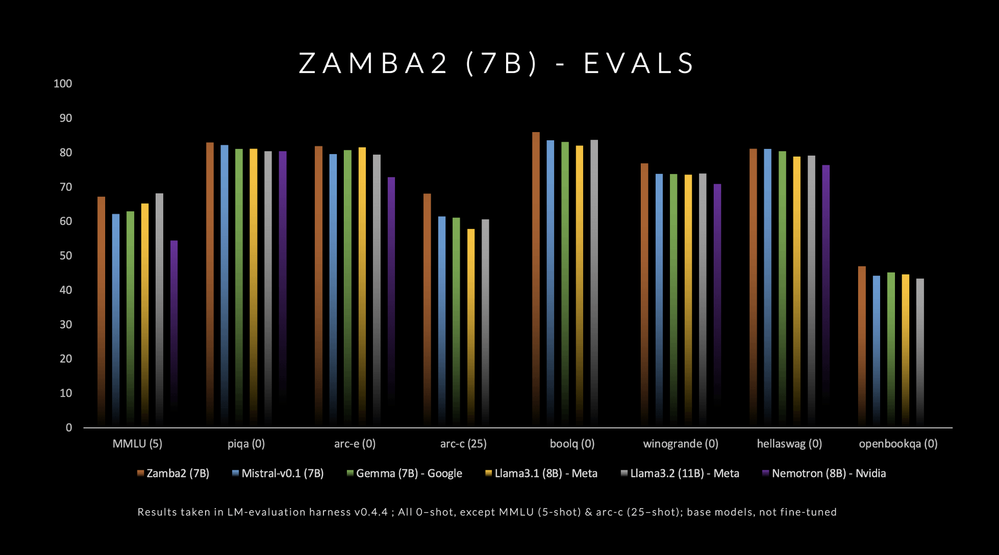

# Zyphra Releases Zamba2-7B: A State-of-the-Art Small Language Model

> Zyphra has officially released Zamba2-7B, a state-of-the-art small language model that promises unprecedented performance in the 7B parameter range. This model outperforms existing competitors, including Mistral-7B, Google’s Gemma-7B, and Meta’s Llama3-8B, in both quality and speed. Zamba2-7B is specifically designed for environments that require powerful language capabilities but have hardware limitations, such as on-device processing […]

Zyphra has officially released Zamba2-7B, a state-of-the-art [small language model](https://www.marktechpost.com/2025/01/12/what-are-small-language-models-slms/) that promises unprecedented performance in the 7B parameter range. This model outperforms existing competitors, including Mistral-7B, Google’s Gemma-7B, and Meta’s Llama3-8B, in both quality and speed. Zamba2-7B is specifically designed for environments that require powerful language capabilities but have hardware limitations, such as on-device processing or consumer GPUs. By focusing on efficiency without sacrificing quality, Zyphra is trying to democratize access to advanced AI for a broader audience, from enterprises to individual developers.

The architecture of Zamba2-7B incorporates significant technical innovations that enhance both efficiency and expressivity. Unlike its predecessor, Zamba1, Zamba2-7B uses two shared attention blocks interleaved throughout the network, providing a more sophisticated approach to information flow and cross-sequence dependencies. The Mamba2 blocks form the backbone of the architecture, which allows better parameter utilization compared to traditional transformer models. The use of LoRA (Low-Rank Adaptation) projection on shared MLP blocks is another advancement that helps the model adapt more precisely, thus increasing the versatility of each layer while keeping the model size compact. As a result, Zamba2-7B achieves a 25% reduction in time to the first token and a 20% improvement in tokens processed per second compared to its competitors.

Zamba2-7B is particularly important due to its impressive efficiency and adaptability, which have been validated through rigorous testing. The model was trained on a massive pre-training dataset of three trillion tokens, which includes high-quality and extensively filtered open datasets. Additionally, Zyphra has incorporated an “annealing” pre-training phase, which rapidly decays the learning rate over a curated set of high-quality tokens. This strategy has resulted in superior benchmark performance, as the model comfortably surpasses its competitors in both inference speed and quality. The results indicate that Zamba2-7B is exceptionally suited for tasks involving natural language understanding and generation without the significant computational overhead typically associated with high-quality models.

In conclusion, Zamba2-7B represents a significant step forward in the development of small language models that do not compromise on quality or performance. By blending innovative architectural improvements with efficient training techniques, Zyphra has succeeded in creating a model that is not only accessible but also highly capable of meeting a variety of NLP needs. With the release of Zamba2-7B under an open-source license, Zyphra invites researchers, developers, and enterprises to explore its capabilities, pushing the frontier of what smaller models can achieve. The open availability of Zamba2-7B could well make advanced NLP accessible to a wider community, thereby advancing the field in exciting new ways.

---

Check out the **[Details, ](https://www.zyphra.com/post/zamba2-7b)and [Huggingface integration is available here](https://github.com/Zyphra/transformers_zamba2)**. All credit for this research goes to the researchers of this project. Also, don’t forget to follow us on **[Twitter](https://twitter.com/Marktechpost)** and join our **[Telegram Channel](https://pxl.to/at72b5j)** and [**LinkedIn Gr**](https://www.linkedin.com/groups/13668564/)[**oup**](https://www.linkedin.com/groups/13668564/). **If you like our work, you will love our**[** newsletter..**](https://marktechpost-newsletter.beehiiv.com/subscribe) Don’t Forget to join our **[50k+ ML SubReddit](https://www.reddit.com/r/machinelearningnews/)**.

**[[Upcoming Live Webinar- Oct 29, 2024] ](https://go.predibase.com/predibase-inference-engine-102924-lp?utm_medium=3rdparty&utm_source=marktechpost)****[The Best Platform for Serving Fine-Tuned Models: Predibase Inference Engine (Promoted)](https://go.predibase.com/predibase-inference-engine-102924-lp?utm_medium=3rdparty&utm_source=marktechpost)**
