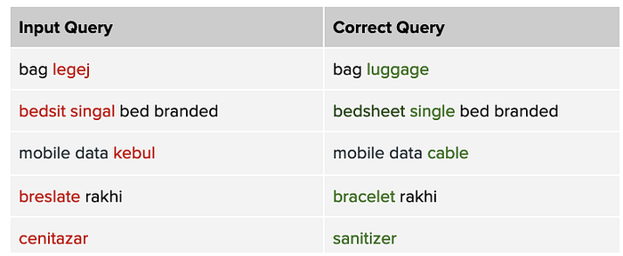
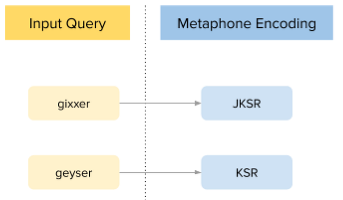
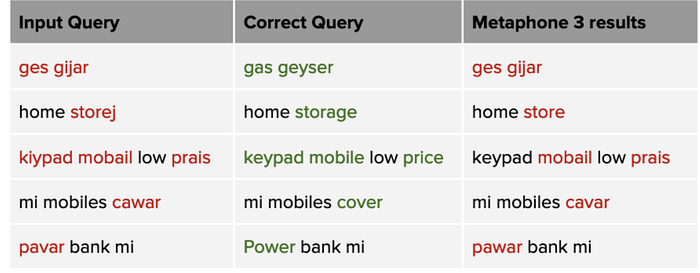
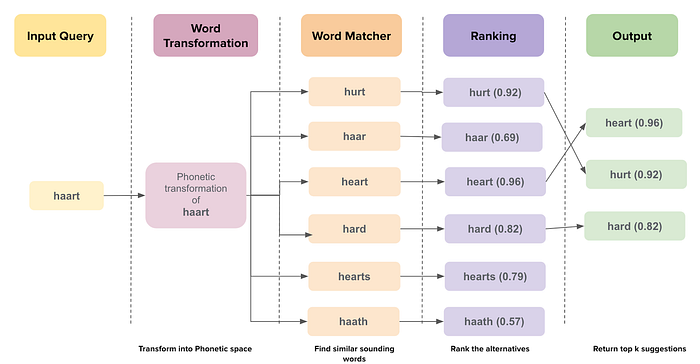
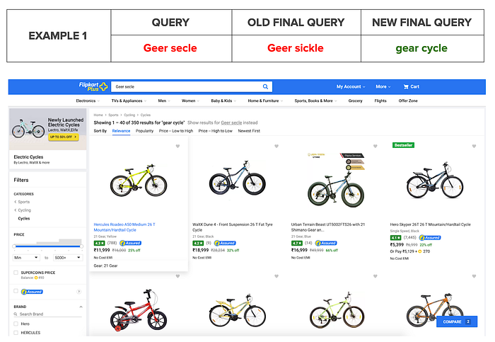
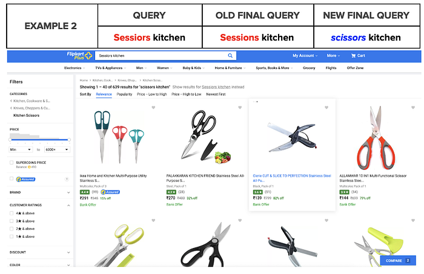
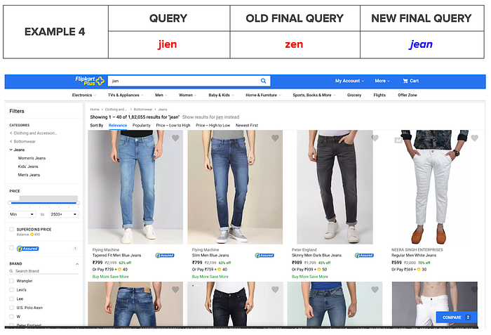
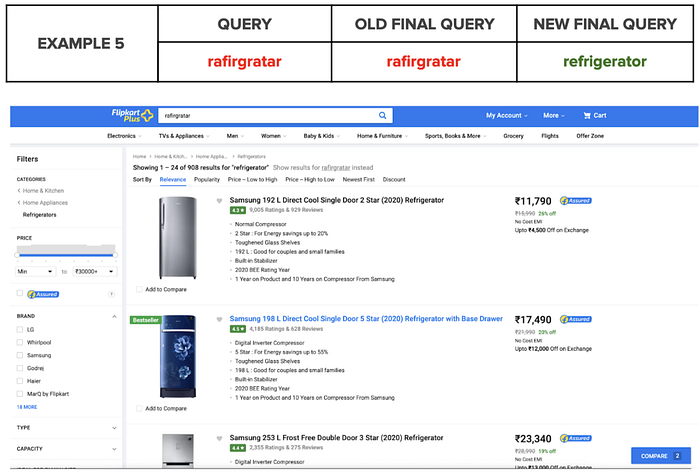
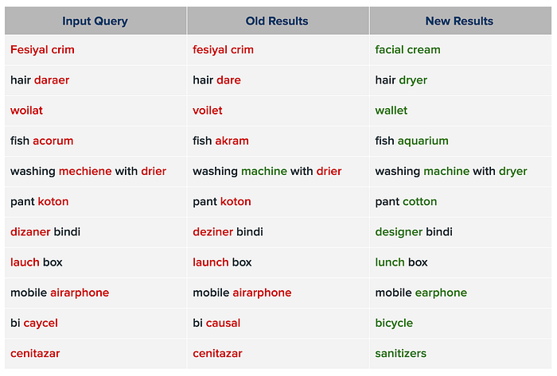

# Adapting Search to Indian Phonetics

In the last few years, India has witnessed accelerated growth in internet and smartphone users. Thanks to cost-effective data plans, improved connectivity, and Government’s digital initiatives, India has the second-largest number of internet users in the world with more users in rural than in urban areas. With the plan to connect all the villages with fibre in the coming years, e-commerce will find a place in every corner of the country.

*Image source: pexels and canva*

These next set of customers from rural and semi-urban India, equipped with smartphones and the internet have their own needs and aspirations. These customers traditionally shopped in offline stores, and have now been attracted to the convenience of shopping online.

These new customers are different from the previous set of urban customers. They have strong connections with their regional and cultural aspects, which influence their purchase needs. They prefer the use of their regional languages and dialects for communication and are largely less proficient in English. Hence, we decided to improve our way of understanding search query tokens to help serve these customers better.

## Evolving E-commerce Search Query Trends

We observed the following significant changes in the way our customers write search queries while looking for products on our website.

### Increased colloquial terms

Customers are more comfortable with their regional languages and dialects than English. For example, we observed the queries to have a lot more colloquial flavour with a mix of Hindi — English (Hinglish), and [vernacular terms](https://tech.flipkart.com/building-multilingual-flipkart-for-bharat-f33c28ed629c) like ‘_Anarkali dress with banarasi dupatta’_ or ‘_floral print lehenga’_.

### Increased spelling mistakes in the query

The queries from these customers are prone to spelling errors, as most of them are new to typing and to the English language. The users probably do not know how to spell or translate a few of the terms correctly.

For example, they write ‘**_doble badsheet plan black colour_**_’ _instead of ‘**_double bed sheet plain black colour_**’ and ‘**_allluminiyam kadai’_**_ _instead of ‘**_aluminium pan_**’.

---

## Tackling Spelling First

In our effort to show relevant products for customer’s search, it is important for our Search to understand the query. There are many approaches that can be taken to address the issues observed by these customers: [Vernacular support](https://tech.flipkart.com/building-multilingual-flipkart-for-bharat-f33c28ed629c), [voice search](https://tech.flipkart.com/the-future-of-voice-powered-shopping-in-the-land-of-language-db50c99edd77), graphical cues and others. For all these approaches, it is important to correct the spelling mistakes upfront. If we do not correct the spelling errors, our search might not understand the customer’s query correctly. This could potentially result in the customers not being able to find the products they are looking for.

Some observations:

1. Customers do not realise they made a spelling error. They assume that they have typed the correct query and search failed. The customer wanted to look for a ‘**_Linen_**’ shirt, which he spelt as **‘_Lenan_’.**
2. We have observed customers struggle to see the expected results with repeated typing of misspelt query strings in various ways by adding or subtracting words. For example, In our user study, we observed that one of the customers was unsure what was the right spelling — ‘**_Seeling_**’ for ‘**_Ceiling_**’.

The scope and the approach presented here is limited to tackling the spelling issues with phonetic errors.

## Phonetic Errors

With Flipkart’s focus on acquiring next 200 million customers by venturing into Tier II and Tier III cities, it was a paramount requirement for the spell module to adapt to this change.

The pronunciation of English words in these cities is tuned to regional languages and dialects. The typed words might be phonetically correct, but may not be spelt correctly. Below are a few of the examples to highlight the type of spelling mistakes observed.

We know these types of spelling mistakes as ‘Phonetic Errors’. We resolved to rectify the phonetically incorrect queries to surface the right results.

The focus on understanding the way mistakes are made in Tier II and Tier III cities and the ability to correct these spelling mistakes required some radical changes in the existing system.

The traditional approaches for spell correction using edit distance ([Levenshtein Distance](https://en.wikipedia.org/wiki/Levenshtein_distance#:~:text=Informally%2C%20the%20Levenshtein%20distance%20between,considered%20this%20distance%20in%201965.), S[ymspell](https://github.com/wolfgarbe/SymSpell), etc) are not suitable for Phonetic errors as the rules used for transformation of one word to another may not always be applicable for phonetic mistakes. For example, the user wants to search for “_scissors_” and he types in as “_sessiors_”. The edit distance between these two words is 3. However, there is a much easier transformation which is just 1 edit distance away: “_sessions_”, that is guaranteed to emerge as winner over “_scissors_”.

There are multiple algorithms available in the market which transform orthographic (set of conventions for writing a language is called Orthography) text into phonetic representation, the famous one’s being Soundex, Metaphone, Double Metaphone and Metaphone 3. All of them have their own codes to convert from textual representation to phonetic representation.

## What had to change?

Our previous phonetic module was based on Metaphone 3 algorithm, which generated alternate phonetic pairs for a token, based on its phonetic similarity in the Metaphone domain.

### Example

*Metaphone transformation of “gixxer” and “geyser”*

Although the input tokens ‘**_geyser_**’ and ‘**_gixxer_**’ are very far in phonetic space, their Metaphone transform does not capture the difference precisely. The Metaphone encodings are only a single letter edit distance away.

> Metaphone was primarily built with static rules tuned for the native English speakers, while a significant portion of the input queries is in Hinglish. It does not capture the Indian characteristics of the tokens (e.g. role of Hindi/ Bengali phonemes in pronunciation etc.) and cannot correct several phonetics errors that are otherwise intuitive to the Indian population.

Below are a few examples to drive this point.

## How did we change?

With the above-mentioned problem statement, it was clear that our search needed to understand the following:

1. **Capturing the Indian nuances**: Decipher the phonetics mistakes focusing on Indian pronunciation. Example: **_dijainer_** -> **_designer._**
2. **Contextual awareness**: Capture and understand the context of the words appearing together to correct them into meaningful queries. Example: **_casual snickers -> casual sneakers._**

### Capturing the Indian nuances

To build a system to suit the Indian market, we had to do away with algorithms focusing on native English speakers and instead custom build a module that is able to understand Indian phonetic nuances.

Our in-house algorithm, **Sonic,** generates the corresponding word transformations in phonetic space for each token in the query. Dictionary and [**Symspell**](https://github.com/wolfgarbe/SymSpell) lookup generate phonetically similar sounding alternatives for the words. Sonic ranks these alternatives using a custom weighted algorithm ranker and chooses the top k candidates based on their weighted score.

Here is an illustration of how the Phonetics module goes about generating and ranking the alternatives.

### Contextual Awareness

Operating at word level has its limitations. Sometimes the meaning of the complete query is lost due to individual word correction. It was important to understand the context of the words appearing together to correct them into meaningful queries. For example,

“**_layater gas”_** should be corrected to “**_lighter gas”_**, not to “**_later gas”_**.

To solve this, a deep learning model with contextual embedding fits the bill. In this model, we assume misspelt query as an input sequence and we try to predict the correctly spelt query as an output sequence. This model has the context of a query and can solve unseen spelling mistakes which models operating at word level cannot, as of today.

## Outcome

Here are some of the examples of the improvements we see by incorporating the above models.

## More examples

## Conclusion

With these changes, we have improved our spell correction and are surfacing better results. However, we have just touched the tip of the iceberg by delving into spelling mistakes observed in Tier 2 & 3. In the next iterations, we plan to focus on improving our knowledge base and transformations to capture the regional dialect flavours of India, thus bettering our phonetic understanding. As we progress and achieve success, we look forward to sharing our wins with you.

---
**Tags:** Phonetics · Spell Correction · Search · Ecommerce Search · Product Development
