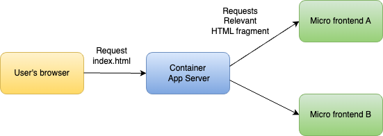
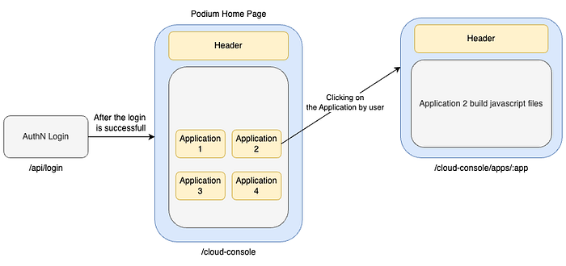
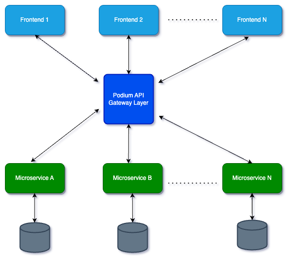
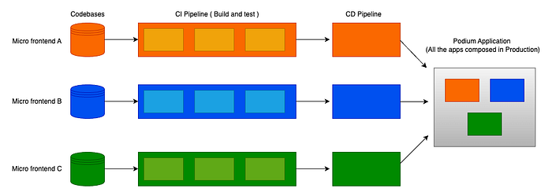

# Addressing Fragmented UI(s) with Micro Frontends

## Introduction

In the constantly changing landscape of web development, maintaining a cohesive and seamless user-experience across a vast variety of applications involving different teams takes significant effort.

Flipkart’s Developer Console (Podium) is a unified platform developed by Flipkart to streamline and centralize access to various internal developer tools. It has a comprehensive suite of tools and services designed to facilitate software development, deployment and management.

Podium was based on traditional monolithic front end architecture within a single codebase. As many applications began onboarding to Podium maintaining a single code base became exponentially complex.

This article explains how we adopted the micro frontends architecture in Podium to address the inherent issues of fragmented UI in existing applications, paving the way for a more agile, scalable, and maintainable development and release environment.

## The Challenges in Monolithic Architecture

Traditional monolithic frontend architecture bundles all functionalities into a single codebase. This was helpful during the initial phases of development in Podium but later on, it posed several challenges:

**Complexity in codebase**:

As the application grew, the level of friction between parts of the codebase increased, leading to several issues.

Different components of the application became highly dependent on each other. This made it challenging to update one part of the application without affecting the other parts of the application.

Complexity rose significantly. The codebase became harder to navigate and understand, making it difficult for developers to add new features. This also slowed down the development process, as understanding the connection between the components took more time and effort.

Maintenance became more burdensome. Even small changes required testing across all components to ensure no side effects occurred. It also increased the chances of regression issues, where new updates broke the existing functionality.

**Deployment Bottlenecks**:

Deploying updates or new features required redeploying the entire application every time, which was time-consuming.

The build pipeline needs to run a full suite of tests. This extended duration can delay the deployment process for large applications. In order to update one component, we need to deploy the entire application, which can cause regression. As a result, the risk associated with redeployment increases, which discourages the frequent updates.

**Team autonomy**:

To deploy new features or updates, teams need to synchronize their release schedule. This was challenging, as different teams had different timelines and priorities.

Changes made by one team can affect other parts of the application, requiring thorough communication and coordination to ensure that updates do not cause conflicts or bugs.

**Scalability Issues**:

Scaling the individual application involves allocating more resources to the entire application, even if only a specific component requires scaling.

Identifying and resolving performance bottlenecks was more complex. A bottleneck in one part of the application can affect the performance of the entire system, making it difficult to achieve optimal performance and scalability.

In the dynamic environment like Flipkart, the challenges of a monolithic are magnified by the need for diverse teams to work together efficiently. The interdependencies, varied timelines, and coordination required to manage a monolithic codebase can slow down the development process.

## Micro Frontend Solution

Micro frontend is a design approach in which an application is composed of smaller and independently deployable frontend units. These units are developed, tested and deployed independently by different teams, each responsible for their own piece of UI. This approach brings many benefits traditionally associated with micro-services in backend development to the frontend world.

Flipkart’s Podium exemplifies the effective implementation of micro frontends. It provides a centralized platform for developers to access all tools and services from a single page. This centralization simplifies access and discovery for the different tools for new developers. It has a starter template which helps developers to quickly onboard to Podium and start building their application. By providing a standardized user interface, Podium ensures that all integrated applications have a consistent look and feel.


*The illustration shows that the Container application has a common header with variables v1 and v2 that is shared across the application. On the home page, we have links to various disparate micro frontend applications which, when clicked, render their respective application interfaces.*

## Architecture

Podium has adopted a dual approach to load micro frontends seamlessly. It combines both **runtime integration with javascript and server side composition** as an approach to load different micro frontends. A common container application with a page header uses server-side composition to plug-in the page-specific contents in the container.

## Page Rendering Flow

1. Client-Side Request

- **Action**: A user accesses the Podium platform through their browser.
- **Outcome**: The browser sends a request to the server for the initial HTML page.

2. Server Side Composition

- **Action**: The server receives the request and begins composing the final HTML page.
- **Process**: The server identifies the required micro frontends based on the requested URL. The server includes placeholders for the micro frontends in the HTML template.

3. Load JavaScript Bundle

- **Action**: The composed HTML page is sent to the client, which includes script tags for the required micro frontends.
- **Outcome**: The browser loads the JavaScript bundles for the micro frontends specified in the HTML template.

4. Render Micro Frontend

- **Action**: Each loaded JavaScript bundle initializes its respective micro frontend.
- **Process**: Each micro frontend exposes a global function as its entry point. The main container application calls these functions to render the micro frontends in their designated placeholders.

5. Dynamic Updates and Interactions

- **Action**: As the user interacts with the application, dynamic updates may be required.
- **Process**: The main container application and micro frontends can communicate via custom events and shared state management. Changes to the address bar URL or other shared data trigger updates across the micro frontends.

6. Final Page Composition

- **Action**: The fully composed and interactive page is presented to the user.
- **Outcome**: The user experiences a seamless and cohesive application, despite it being composed of multiple independently developed micro frontends.

## Server side composition

We’ve split up our code in such a way that each piece represents a self-contained domain concept that can be delivered by an independent team. Each application has its own:

- HTML files that end up on the web server.
- Deployment pipeline, which allows us to deploy changes to one page without affecting or thinking about any other page.

When they are deployed, it gives a url to connect to that application. We match the location and then render the specific url with it.

```
server {
  listen 8080;
  server_name localhost;
  root /usr/share;
  index index.html;
  # Decide which HTML fragment to insert based on the URL
  location /cloud-console/apps/{appName} {
    proxy_pass http://appName:8080/;
    proxy_http_version 1.1;
    proxy_set_header X-Forwarded-Host $host;
    proxy_set_header X-Forwarded-For $proxy_add_x_forwarded_for;
  }
  # All locations should render through index.html
  error_page 404 /index.html;
}
```

Container application has a server responsible for rendering and serving each micro frontend, with one server on the front that makes requests to the others.



## Runtime integration with javascript

This approach dynamically loads and manages different parts of a web application at runtime, instead of compiling everything during the build process. It is the most flexible method for integrating micro frontends. Each micro frontend is included in the page using a <script> tag and, upon loading, exposes a global function as its entry point.

```
window['app-handler'] = {
  mount: ({ element, props }: { element: HTMLElement; props: { _isPlugin: boolean } }) => {
    ReactDOM.render(<App />, element);
  },
  unmount: (container: HTMLElement, isPlugin: boolean) => {
    if (container) ReactDOM.unmountComponentAtNode(container);
  },
};
```

This approach allows us to deploy each bundle.js file independently. Unlike iframes, it provides full flexibility to build integrations between our micro frontends in any way we choose. We have extended this method, such as downloading each JavaScript bundle only when needed.

The flexibility of this approach, combined with the ability to deploy independently, makes it our most preferred and practiced method.



## Styling challenges in Micro frontend landscape

Styling the CSS can be problematic in a micro frontend landscape. If the same selector is used by different teams, it may render inconsistently on the same Page. As selectors are written by different teams and the code is split across repositories, discovering and managing them can be difficult. We are addressing these issues with CSS Modules or CSS-in-JS libraries, as they make sure that styles are applied where the developer intends.

## Achieving visual consistency

Visual consistency across micro frontends can be achieved through a library of shared, reusable UI components. Shared UI libraries ensure that common UI elements look and behave the same across different parts of the application. Reusing these components also saves development time and effort for the teams, promoting efficiency and unified user experience.

## Cross application communication

We have implemented the following provisions for seamless communication between applications onboarded to Podium:

- An SDK repo includes a custom router implemented for React applications. This router serves as a bridge between the main container application and the individual micro frontends, enabling smooth navigation and interactions across different parts of applications.
- To enable real-time communication and synchronization between different micro frontends, the Podium SDK provides custom events. These events are crucial for notifying applications when certain parameters are changed, ensuring that all the parts of Podium are in sync.
- Address bar URL is used to manage and share common data variables across all micro frontends. This approach ensures that shared data is easily accessible and modifiable by any micro frontend.

## Backend Communication

The Backend For Frontend (BFF) architecture proposes a server-side component for each frontend application. As all the client applications have separate backend for their frontend, this pattern is perfect for our use case to communicate with the backend. We have created an API gateway for Podium following the BFF architectural paradigm.



The frontend sends requests to an intermediate gateway layer, which then determines the apt backend to handle the request and return the response to the frontend. Each api call from the frontend includes a differentiator, which is processed by the gateway layer.

## Benefits of moving to micro frontends

### Reduced risk of breaking changes

Micro Frontends allow for incremental upgrades, enabling teams to update their parts of application independently from others. This means that teams can adopt new improvements at their own pace.

Podium component library and SDK is designed with versioning in mind. Each micro frontend can operate on different versions of dependencies without causing conflicts, ensuring a smooth upgrade process.

By upgrading components incrementally, the risk of widespread issues or downtime is minimized. Teams can test their changes in isolation before production deployment..

### Decoupled codebases

We began with a single page application built with React. We onboarded a few products and gradually started onboarding various applications to Podium. In time, we had a bulky monolithic application spanning multiple teams and multiple component coupling challenges.

With micro frontends, the modular architecture ensures that components are independent of each other, reducing the risk of side effects when changes are made. By defining clear boundaries, it minimizes the amount of shared code and dependencies between components. This separation helps prevent the ripple effects that occur when the changes are made in a single codebase.

### Independent deployments

Each micro frontend has its own CI/CD pipeline, which builds, tests, and deploys the code to production. This ensures that the changes in one micro frontend does not affect others. Teams can deploy updates and new features incrementally, reducing the risk of widespread application failures.



### Improved team autonomy and collaboration

Flipkart always believes in experimenting, learning and growing culture. Teams can’t be autonomous if they are using the same framework and tools for all problems. With micro frontends, the teams can experiment on the technology, latest frameworks or new tools for their applications.

Each team has full control over its application, from development to deployment. This reduces the need for constant coordination between the teams, allowing them to focus on their specific tasks and deliverables.

Teams can now work in their bounded contexts which reduces inter-team dependencies and conflicts. Communication is streamlined, as teams only need to coordinate on shared interfaces and integration points.

## Future Roadmap

- **Design Differences**: Since multiple teams are working on their UI(s), they might not see the bigger picture. As a result, the console may look like it is composed of many patches, inconsistent in terms of style and UI/UX. We are trying to solve this issue by sharing a common library and a style guide that all teams can use.
- **Operational Complexity**: Currently, all applications are deployed in one resource which gives less resource maintenance control to other teams on their applications. We are working on separating and deploying each application in its own resource.

## Conclusion

Adoption of micro frontends in the developer console represents a significant advancement in addressing the challenges of fragmented UI in large-scale applications. Breaking down the monolithic frontend into manageable, independently deployable units has improved the maintainability and scalability of the developer platform UI(s). This strategy not only enhances the user experience but also supports rapid delivery of features and offers freedom to experiment with new technologies.

---
**Tags:** React Microfrontend · JavaScript · React · Ui With Micro Frontend · Developer Ui Platform
