# APACHE SPARK OPTIMISATIONS

## Context

**Ambitious goal and the scope of the problem**

We were chasing a critical, futuristic business requirement for our big data pipelines achieving **“1-day planning,”** defined as a total execution window of **24 hours or less**. The entire process is extensive, processing a **7TB data volume** each cycle across **19 distinct plans** (16 Spark pipelines and 3 Data Science plans). The sheer size and complexity of the workflow made the 24-hour target seem nearly impossible.

**What were “Primary obstacles and Technical causes?**

The primary obstacle was the **excessive runtime of several heavy Spark pipelines** within this massive workload. We identified and targeted the 5 heaviest jobs for optimization. The biggest offender was a mission-critical ETL job that **alone consistently required over 35 hours** to complete, severely impacting our data delivery lifecycle. Its runtime was driven by a combination of severe technical issues: **memory pressure** causing disk spills, massive **data shuffles**, and suboptimal **task parallelism**.

**Our objective and the final, successful outcomes -**

Our objective was surgical: **re-engineer these 5 targeted pipelines** — crucially, **without altering core business logic** — to slash the overall supply planning runtime. We also had to optimize resource consumption to ensure stability for other jobs on the cluster. Through these targeted efforts, we successfully cut down the execution time by ~36%, achieving our **“1-day planning”** goal far earlier than anticipated. These optimizations brought the total processing time for all 19 plans down to our target **20–22 hour window**.

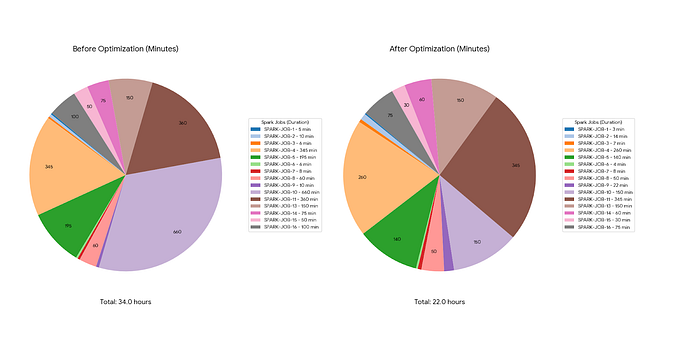

## Reading Prerequisites (Skip if familiar with Spark)

Apache Spark is a powerhouse for big data processing, but unlocking its true potential requires moving beyond the default settings. A well-tuned Spark job can run orders of magnitude faster and use resources far more efficiently than an untuned one.

This guide is a deep dive into advanced optimization techniques for **Spark 3.x**. We’ll cover how to master resource utilization, leverage modern Spark configurations, write smarter code, and optimize your data storage strategy.

To understand the Advanced Spark Optimisations basic knowledge on Spark is expected and if you want to go through spark from basic level refer to the below links

**Fundamentals:**

- **What is Spark?** [Link](https://www.databricks.com/glossary/what-is-apache-spark)
- **Cluster Overview:** [Link](https://spark.apache.org/docs/latest/cluster-overview.html)

**Programming Guides:**

- **RDD Programming:** [Link](https://spark.apache.org/docs/latest/rdd-programming-guide.html)
- **DataFrames and Datasets:** [Link](https://spark.apache.org/docs/latest/sql-programming-guide.html)

**Resources:**

- **Practical Examples:** [Link](https://sparkbyexamples.com/)
- **Spark UI Understanding:** [Link](https://spark.apache.org/docs/latest/web-ui.html)

## The Investigation — Uncovering a Sea of Bottlenecks

This wasn’t about tweaking one or two spark.conf settings. This was a full-scale, low-level re-architecture. We are going to walk you through exactly how we diagnosed each bottleneck and the specific, expert-level solutions we engineered to solve them. Before we could fix anything, we had to understand _why_ everything was so slow. We spent many hours living in the Spark UI, executor logs, and cluster manager dashboards. What we found was a cascade of failures (internal), each one making the others worse.

## Problem 1: The “1.9 GB Part File” Nightmare

The first thing we saw on the Spark UI for our “Allocation Pre” job was in the input stage. The job was reading about 400 part-files. The problem? **Each part-file was a staggering 1.9 GB.**

In Spark, one partition generally maps to one file. This meant a single executor core was being assigned a 1.9 GB chunk of data. This was the root cause of all similar bottlenecks where large part files for a dataset staggers the flow and makes the data spill. It wasn’t just this job; our “Network Post” job had a similar issue: a _single, massive input file_ that choked all parallelism from the start.

## Problem 2: Excessive Disk Spill (Severe Memory Pressure)

The specific layout of roughly **400** part-files, each a staggering 1.9 GB, precipitated a memory crisis while processing our **650 GB** dataset. Because Spark mapped these massive files directly to single tasks, the executors’ Execution Memory pools were immediately overrun, resulting in gigabytes of data spilling to disk per task and terabytes cumulatively across the job. This forced the system into a state of “thrashing” — swapping efficient in-memory processing for slow disk I/O and heavy serialization — which triggered aggressive Garbage Collection and frequent, fatal OutOfMemoryError (OOM) crashes.

## Problem 3: “Fake” Parallelism and Idle Executors

With only 400 large partitions, our job could, at most, use 400 concurrent tasks as max concurrency is directly dependent on the no. of part files for a dataset for the initial read. But we had a massive cluster with thousands of available cores. Looking at the “Event Timeline,” we could see 400 tasks spin up, overwhelming the executors they landed on (causing spills), while hundreds of other executors sat completely **idle**, wasting cluster resources. We were paying for a supercomputer and using it like a laptop.

## Problem 4: The Straggler Task That Held Us Hostage

Even when we got past the read, the “shuffle” stages were a disaster. On the “Stages” page, we could see 4799 tasks finish in two minutes, and **one single “straggler” task** running for 45 minutes. Because of data skew (where one key gets a disproportionate amount of data), that one task was bottlenecking the entire job. The whole multi-thousand-core job had to wait for that one slow task to finish.

## Problem 5: Our Wasteful “Fixed” Resource Strategy

Looking at the YARN cluster manager, we saw our jobs were configured with a _fixed_ number of executors (e.g., num-executors: 200). This was wildly inefficient. During a simple map stage, 150 of those executors would be idle. During a massive shuffle, all 200 would be overwhelmed, and we’d be starved for more power. We were either wasting money or creating a bottleneck, with no middle ground.

## Problem 6: Re-running the Same Marathon (DAG Re-computation)

By digging into the code and the DAG visualizations, we found something horrifying. Our jobs were built on a complex series of joins and transformations. A DataFrame df_complex_join would be created, and then _multiple_ subsequent actions would be called on it (e.g., df_complex_join.count(), df_complex_join.write()).

Because of Spark’s lazy evaluation, that entire, computationally-intensive df_complex_join **was being re-executed from scratch every single time**. We were running the same expensive join 3 or 4 times, wasting hours of CPU cycles.

## Problem 7: When the DAG Itself Becomes the Bottleneck

In one of our longest-running jobs, we saw something even more subtle. The job wasn’t just slow; it was unstable. The _driver_ node was under immense GC pressure. This happens when the query plan, or **Directed Acyclic Graph (DAG) lineage**, becomes colossally long. A long lineage can cause StackOverflowError during query planning and puts huge memory pressure on the driver, which has to track the entire plan.

## Problem 8: The Shuffle & Serialization Tax

The “Shuffle Read/Write” metrics were terrifying 3 TBs of shuffle read + 3TBs of shuffle write of data flying across the network. We knew this was a network I/O bottleneck, but it was also a CPU bottleneck. By default, Spark uses Java’s built-in serializer. It’s safe, but it’s slow and _very_ verbose, creating large byte arrays that need to be sent over the network. We were wasting CPU time just _packaging_ the data, before it even hit the network.

## Problem 9: The “Stop-the-World” GC Pauses

Finally, we saw tasks randomly freezing. An executor would just stop responding for 5–10 seconds and then resume. These were classic JVM **“stop-the-world” Garbage Collection (GC) pauses**. With large on-heap memory, the JVM has to periodically freeze _everything_ to clean up old objects. These micro-pauses add up to significant, unpredictable latency across thousands of tasks.

## Our Multi-Layered Engineering Strategy

Fixing this mess wasn’t one single solution. It was a holistic, low-level approach. We had to re-architect the data, the code, and the cluster configuration all at once.

## Solution 1: Strategic Repartitioning (The Core Fix)

This was the most important change. We tackled the 1.9 GB partition problem head-on.

- **For “Allocation Pre”:** We re-engineered the upstream process. Instead of writing 400 large files, We changed it to repartition and wrote **3,200 smaller files, each in the 300–500 MB range**. This gave us 3,200 fine-grained tasks. Now, each partition fits comfortably in executor memory, **completely eliminating disk spills**.
- **For “Network Post”:** The problem was a single file. We introduced a new step to repartition this file into **800 smaller files based on key business columns**. This was a double win: it enabled massive read parallelism _and_ the pre-sorting by a key column made subsequent joins and aggregations on that key incredibly fast by avoiding data reshuffling.

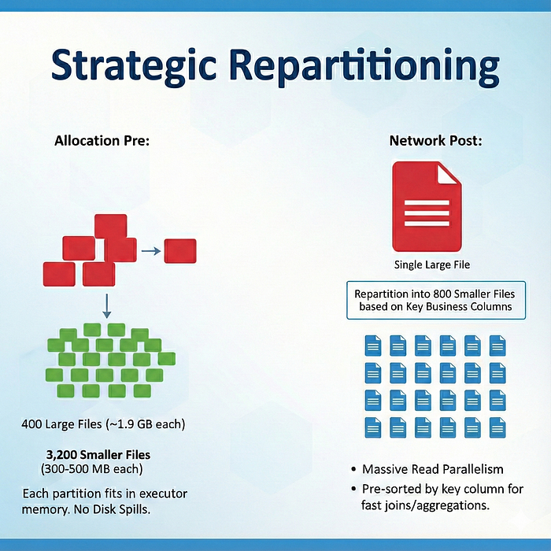

## Solution 2: Mastering the DAG (Caching & Checkpointing)

To solve the “re-computation” problem (Problem 6), we strategically broke the DAG lineage.

- **persist() for DAG Caching:** After any computationally-intensive operation(like that multi-way join), we immediately called df.persist(StorageLevel.MEMORY_AND_DISK_SER). This “materializes” the result. When the _next_ action ran, Spark’s Catalyst optimizer saw the DataFrame was already cached and started from there, pruning the entire upstream lineage. This saved immense CPU cycles.
- **checkpoint() for Lineage Truncation:** For that one job with the massive, unstable DAG (Problem 7), persist() wasn’t enough. I used df.checkpoint(). This is more powerful: it writes the DataFrame to reliable storage (like HDFS or GCS) and _completely severs the lineage_. The new DataFrame has a simple, new plan that just reads from that checkpointed file. This stabilized the driver and provided fault-tolerance.

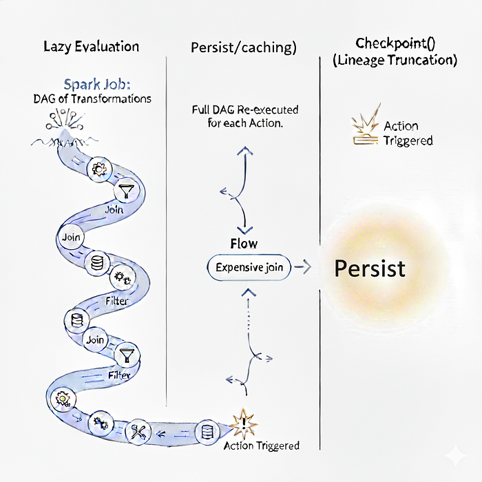

## Solution 3: The “Trifecta” of Modern Spark Tuning

My repartitioning strategy created thousands of small tasks. Now we had to configure Spark to handle them. We used a combination of three powerful features.

**A) The Muscle: Powerful & Dynamic Resource Scaling** We immediately removed out the static allocation.

- spark.dynamicAllocation.enabled: “true”: This was the key. Now, the Spark driver could request executors from the cluster _as needed_.
- spark.executor.cores: “6”: We found 6 cores to be a good balance of parallelism and memory per core. (Note: For “Network Post,” we tested a different profile:
- spark.dynamicAllocation.maxExecutors: "500": We gave it a high ceiling. For our "Allocation Pre" job, this meant it could scale up to **3000 concurrent task slots** (500 executors * 6 cores) during peak load.
- spark.executor.cores: "8" and spark.executor.memory: "14g", tailoring it to that specific job's needs).

**B) The Task Manager: Massive Parallelism Configs** Having 3,200 input partitions is useless if the next shuffle stage crushes them back down to the default 200. We had to tell Spark to maintain this high parallelism _throughout_ the entire job.

- spark.sql.shuffle.partitions: "4800"
- spark.default.parallelism: "3000" These settings instructed Spark: "We have thousands of small tasks. We want you to _keep_ them as thousands of small tasks." Setting shuffle partitions to 4800 ensured that even after a massive join, the data remained in small, manageable chunks that could be processed with maximum velocity by our 500+ dynamic executors.

**C) The Brains: Smart, Adaptive Execution (AQE)** This is Spark's "auto-pilot" and it's brilliant for solving the straggler problem (Problem 4).

- spark.sql.adaptive.enabled: "true"
- spark.sql.adaptive.skewJoin.enabled: "true" With AQE enabled, Spark _watches itself run_. It uses shuffle-stage statistics to detect data skew in real-time. If it sees one task receiving a disproportionately large partition, it **automatically splits that single skewed partition into smaller sub-partitions**, which are then processed in parallel. This single-handedly neutralized our straggler tasks.

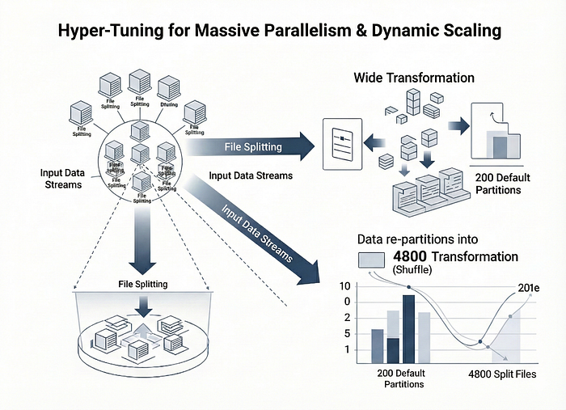

## Solution 4: Optimising the Shuffle (Kryo & Snappy)

To fix the shuffle tax (Problem 8), We stopped using the defaults.

- spark.serializer: "org.apache.spark.serializer.KryoSerializer": We switched to Kryo, a high-performance serializer that is dramatically faster and produces much more compact byte arrays. This reduced CPU time spent on SerDe.
- spark.io.compression.codec: "snappy": Snappy is a compression codec designed for high-speed, not high-compression. The combo was perfect: Kryo made the data small, and Snappy compressed/decompressed it _very_ fast. This pairing reduced the bytes transferred over the network by 4x times when compared to Java serializer and minimized I/O wait times by 40%.

## Solution 5: Advanced Memory Management (Off-Heap)

To kill the "stop-the-world" GC pauses (Problem 9), We took memory _away_ from the JVM.

- spark.memory.offHeap.enabled: "true"
- spark.memory.offHeap.size: "4g" This creates a 4GB memory pool _per executor_ that is outside the JVM's control. Spark's Project Tungsten engine uses this space to store shuffle data and cached DataFrames in its own hyper-efficient binary format. Data is accessed via direct memory operations, bypassing the JVM entirely. This **dramatically reduced GC pressure**, leading to fewer pauses and more stable, predictable execution.

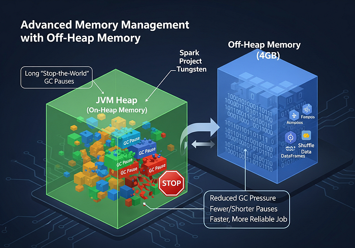

## Solution 6: Re-Architecting the Core Logic Itself

For some jobs, like "Speed SLA Summaries," no amount of tuning was enough. The _logic_ was the bottleneck.

- **Modernizing the Tech Stack:** We migrated the entire business logic from **R to Spark**. This was the most critical step, moving us to a distributed, scalable platform.
- **Optimizing the Data Model:** We implemented a **wide-to-tall data transformation**. This allowed us to eliminate slow, complex loops in favour of highly efficient and parallelisable **window functions**.
- **Parallelizing the Workflow:** We adopted a "divide and conquer" strategy. Instead of one monolithic job, the process now runs as **four parallel jobs** that only merge their small final results. This (along with logic changes in "MH Forward" to process day-level files in parallel) had eliminated our sequential bottlenecks.

To support this new architecture, we even added _more_ specific configs, like high-performance ORC file tuning (Vectorized Reading, Bloom Filters) and tuning our Google Cloud Storage connector for faster parallel I/O.

The benefits we got in terms of runtime by each solution has been showcased below in a breakdown for 1 of our heavy jobs.

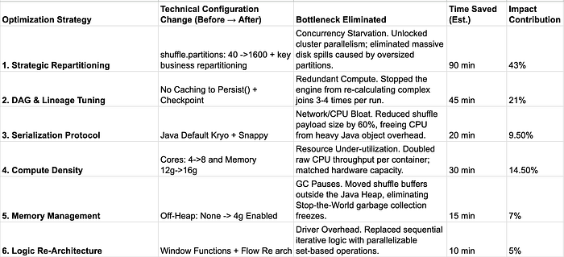

**Optimisation Cheatsheet**

This guide outlines common performance bottlenecks in Spark jobs and provides recommended solutions.

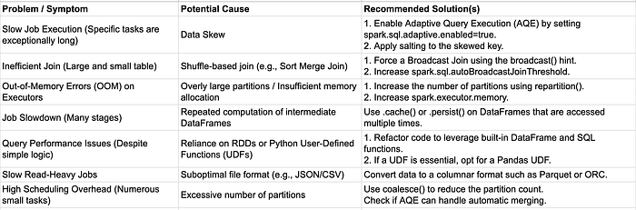

**Deep Dive into Details**

### 🧠 The Core of Optimisation: Understanding Your Resources

Before tweaking any configuration, you need to understand what you're trying to optimise. Every Spark application is a balance between three key resources:

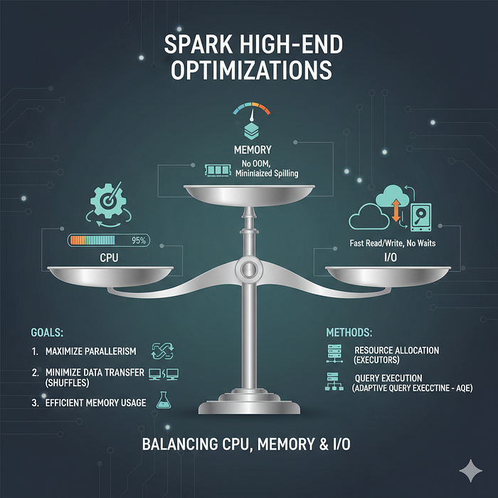

**CPU:** Used for computation (e.g., calculations in a map or filter). Are your cores constantly maxed out or sitting idle?

**Memory:** Used for storing data for shuffles, caching (.cache()), and general operations. Are you facing OutOfMemory (OOM) errors or spilling excessive data to disk?

**I/O:** The speed at which you can read from a source (like HDFS or S3 or GCS) and write to a destination. Is your job waiting for data to be read or written?

The goal of optimization is to ensure none of these become a major bottleneck. A perfectly tuned job keeps the CPU busy with data that is readily available in memory, minimizing disk spills and long waits for I/O.

Spark performance tuning is the process of adjusting configurations to improve the execution time and resource utilization of an application. The primary goals are to maximize parallelism, minimize data transfer across the network (shuffles) and to/from disk (I/O), and use memory efficiently. This is achieved by configuring two main areas: **Resource Allocation** (executors) and **Query Execution** (Adaptive Query Execution - AQE).

## Part 1: Foundational Resource Allocation - Configuring Executors

An **executor** is a Java Virtual Machine (JVM) process launched on a worker node that is responsible for executing tasks and storing data partitions in memory or on disk. Correctly sizing your executors is the most critical first step.

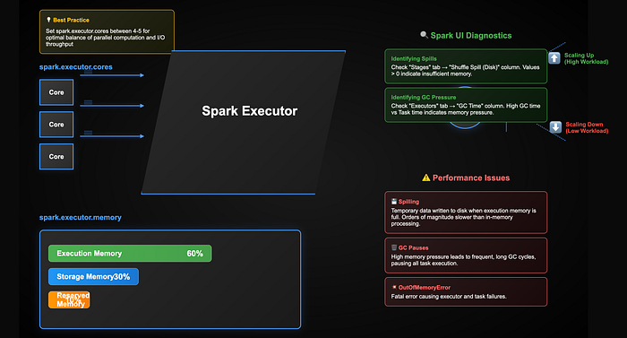

### Key Executor Configurations:

spark.executor.cores

- **Technical Definition:** Specifies the number of CPU cores allocated to each executor. This determines the number of tasks an executor can run concurrently. For example, spark.executor.cores=4 means each executor can run 4 tasks in parallel.
- **Impact on Performance:** This directly controls the task-level parallelism within a single executor. A common best practice is to set this between 4 and 5 to balance parallel computation with the I/O and network throughput of a single machine.

spark.executor.memory

- **Technical Definition:** Controls the heap size (-Xmx) of each executor's JVM. Spark's UnifiedMemoryManager divides this heap into specific regions:
- **Execution Memory:** Used for temporary data during shuffles, sorts, joins, and aggregations.
- **Storage Memory:** Used for caching user data (.cache(), .persist()) and broadcasting variables.
- **Reserved Memory:** For system overhead.
- **Impact on Performance:** Insufficient memory is a primary cause of poor performance. It leads to:
- **Spilling:** When execution memory is full, Spark writes temporary data to the local disk and reads it back later. This I/O operation is orders of magnitude slower than in-memory processing.
- **Garbage Collection (GC) Pauses:** High memory pressure leads to frequent, long GC cycles, during which the executor pauses all task execution.
- **OutOfMemoryError (OOM):** A fatal error that causes the executor and its tasks to fail.

spark.dynamicAllocation.enabled

- **Technical Definition:** Allows Spark to dynamically scale the number of executors up and down based on the workload. The Cluster Manager (YARN or Kubernetes) will allocate new executors when there are pending tasks and remove executors that have been idle for a specified duration.
- **Key Parameters:** spark.dynamicAllocation.minExecutors, spark.dynamicAllocation.maxExecutors, spark.dynamicAllocation.initialExecutors.
- **Use Case:** Highly recommended for multi-tenant environments and workloads with variable parallelism, as it improves overall cluster resource utilization. For performance-critical, single-tenant jobs, static allocation (--num-executors) may provide more predictable performance.

**Defining how many executor cores you need:**

Below is the setup for finding out the magic number for no. of executor cores we generally need for an optimal(more balanced) processing

Total vCores per Node (yarn.nodemanager.resource.cpu-vcores): 80

Total RAM per Node (yarn.nodemanager.resource.memory-mb): 241,664 MB (~236 GB)

**Step 1: Calculate Allocatable Capacity** We must reserve resources for the OS, YARN NodeManager, and DataNode agents to prevent node crashes.

- **Rule:** For high-density nodes (>64 cores), reserve 4 Cores and 4 GB RAM.
- **Available Cores:** 80 Total - 4 Reserved = 76 Available Cores
- **Available RAM:** 236 GB Total - 4 Reserved = 232 GB Available RAM

**Step 2: Calculate Executors per Node** We divide available cores by the Target Core Count of 5 (the optimal number for I/O throughput) to find the maximum container density.

- **Calculation:** 76 Available Cores / 5 Target Cores = 15.2
- **Result:** 15 Executors per Node (Round down)

**Step 3: Calculate Memory per Executor** We divide the available RAM by the calculated number of executors to ensure full memory utilization without OOM errors.

- **Calculation:** 232 GB Available RAM / 15 Executors = 15.4 GB
- **Result:** ~15.5 GB per Executor

## Diagnosing Resource Issues in the Spark UI

- **Identifying Spills:** Navigate to the **"Stages"** tab. Examine the stage details and look at the **"Shuffle Spill (Disk)"** column. Any value greater than zero indicates that spark.executor.memory was insufficient for that stage's shuffle operations.
- **Identifying GC Pressure:** Navigate to the **"Executors"** tab. The **"GC Time"** column shows the total time each executor has spent in garbage collection. If this time is a significant fraction of the **"Task Time"**, it indicates memory pressure.

## Part 2: Runtime Optimization - Adaptive Query Execution (AQE)

AQE is a query re-optimization framework in Spark 3.x that uses runtime statistics from completed stages to improve the execution plan. It is enabled by default (spark.sql.adaptive.enabled=true).

### Key AQE Features:

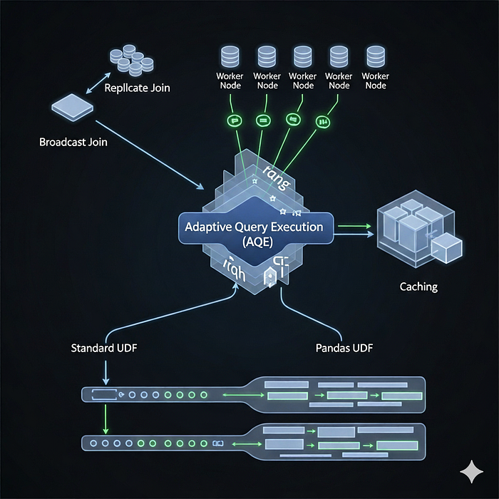

### 1. Dynamically Coalescing Shuffle Partitions

- **Technical Problem:** The number of shuffle partitions is often configured with a static value (spark.sql.shuffle.partitions). This can lead to a large number of very small partitions after a filter operation, resulting in high task scheduling overhead and inefficient I/O.
- **AQE Solution:** After a shuffle stage completes, AQE inspects the actual size of each output partition. It then merges adjacent small partitions into larger, more optimally sized ones, reducing the number of tasks required for the subsequent stage.
- **Diagnosing in the UI:** Go to the **"SQL / DataFrame"** tab and click on the query description. In the physical plan graph, you will see an **AQECoalescePartitions** node. By clicking on it, you can see the initial and final number of partitions.
- **Tuning Parameter:** spark.sql.adaptive.advisoryPartitionSizeInBytes allows you to specify the target size for the coalesced partitions (e.g., 64m, 128m).

### 2. Optimizing Skewed Joins

- **Technical Problem:** Data skew in a join key causes some tasks to process significantly more data than others, becoming **stragglers** and bottlenecking the entire stage.
- **AQE Solution:** If spark.sql.adaptive.skewJoin.enabled=true, AQE can detect highly skewed partitions from the shuffle statistics. It then splits the skewed partition into smaller sub-partitions on one side of the join and reads the matching key from the other side for each new sub-partition, effectively parallelizing the processing of the large key.

**Diagnosing in the UI:**

- **Identify Skew:** In the **"Stages"** tab, view the summary metrics for tasks. A large difference between the "Median" and "Max" task duration is a clear sign of skew.
- **Verify AQE Fix:** In the SQL/DataFrame plan graph, an **AQESkewedJoin** node will be present. The stage will have more tasks than originally planned, but their execution times will be more uniform.

### 3. Dynamically Switching Join Strategies

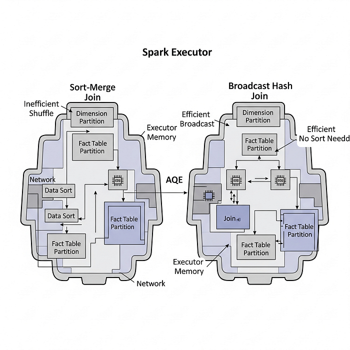

- **Technical Problem:** The Catalyst optimizer defaults to plan a **Sort-Merge Join** based on initial size estimates. However, a runtime filter might reduce one side of the join to be small enough to fit in memory, making a **Broadcast Hash Join** a much more efficient strategy.
- **AQE Solution:** AQE checks the actual size of the join relations after the relevant stages complete. If one side is smaller than spark.sql.adaptive.autoBroadcastJoinThreshold, AQE will cancel the Sort-Merge Join and replace it with a Broadcast Hash Join at runtime, avoiding the expensive sort and shuffle operations of the original plan.
- **Diagnosing in the UI:** In the SQL/DataFrame graph, the join node will be displayed as a **BroadcastHashJoin**. The node's details will often indicate that it was an adaptive, runtime decision.

## A Structured Tuning Workflow

1. **Baseline Resource Allocation:** Begin by configuring executor resources. A good starting point for a static cluster is to set --num-executors, --executor-memory, and --executor-cores based on the available cluster hardware.
2. **Diagnose Memory and CPU Issues:** Run the application and use the Spark UI's **"Executors"** and **"Stages"** tabs to check for fundamental problems like disk spilling or high GC time. Adjust spark.executor.memory if needed.
3. **Analyze AQE Behavior:** Once resource allocation is stable, examine the **"SQL / DataFrame"** tab. Verify that AQE is active and addressing issues like small partitions or join strategies. Most of the time, AQE's defaults are sufficient.
4. **Fine-Tune AQE:** For highly specific performance needs, you can begin tuning AQE parameters like spark.sql.adaptive.advisoryPartitionSizeInBytes to guide its decisions based on your data's characteristics. This should be considered a secondary optimization after the primary resource configuration is correct.

Before manually tuning, it's crucial to understand the powerful automatic optimizations Spark performs. Most of these are handled by the Catalyst Optimizer and the Tungsten execution engine.

### 1.1 The Catalyst Optimizer

Catalyst is Spark SQL's extensible query optimizer. When you write a DataFrame, Dataset, or SQL query, Catalyst compiles it into a highly efficient physical plan to run on the cluster. This process involves four main phases:

1. **Analysis:** Resolves table and column names against the catalog.
2. **Logical Optimization:** Applies a set of rule-based optimizations to the logical plan. Key optimizations include:

- **Predicate Pushdown:** Pushing filter operations as close to the data source as possible. This reduces the amount of data read from disk or over the network. For example, a filter on a Parquet file will be pushed down to Parquet itself, so Spark only reads the required data blocks.
- **Column Pruning:** Removing unused columns from the query plan. This dramatically reduces I/O by only scanning and processing the columns that are actually needed.

1. **Physical Planning:** Generates multiple physical plans from the optimized logical plan and selects the one with the lowest calculated cost. This is where Spark decides on join strategies (e.g., Broadcast Hash Join vs. Sort Merge Join).
2. **Code Generation:** Generates optimized Java bytecode for the final plan. This is a key part of Project Tungsten.

### 1.2 Project Tungsten

Tungsten is the backend execution engine that focuses on CPU and memory efficiency. It provides three major benefits:

- **Off-Heap Memory Management:** Explicitly manages memory in an off-heap binary format (UnsafeRow), reducing the overhead of JVM garbage collection (GC).
- **Cache-Aware Algorithms:** Uses algorithms and data structures that are mindful of memory hierarchy (L1/L2/L3 cache), leading to faster data access.
- **Whole-Stage Code Generation:** Fuses multiple operations (like a filter and a map) into a single Java function. This eliminates virtual function calls and leverages CPU registers for intermediate data, significantly improving performance.

**Key Takeaway:** Always prefer DataFrames or Datasets over RDDs for structured data. This allows Catalyst and Tungsten to perform their full range of optimizations. Using RDDs with custom lambda functions makes your logic a "black box" to Spark.

## 2. Data Serialization and Storage Formats

### 2.1 Serialization with Kryo

When Spark shuffles data or caches RDDs, it must serialize data into a binary format.

- **Java Serialization:** The default, but it's often slow and produces large binary output.
- **Kryo Serialization:** A much faster and more compact serialization library. For most applications, switching to Kryo provides a performance boost of 4x times bytes transfer reduction and 40% task serialization time reduction. Refer to this [doc](https://spark.apache.org/docs/latest/tuning.html) for more information

### 2.2 Choosing the Right File Format

The file format you use for storage has a massive impact on read performance.

- **Columnar Formats (Parquet, ORC):** **Highly Recommended.** These formats store data in columns rather than rows. This works synergistically with Catalyst's column pruning and predicate pushdown. Parquet is the de facto standard in the Spark ecosystem.
- **Row-based Formats (Avro):** Good for data that is often read in its entirety. It has strong schema evolution support but is less efficient for analytical queries that only touch a few columns.
- **Text-based Formats (JSON, CSV):** Slowest and least efficient. Avoid intermediate or large-scale storage. They require parsing the entire row even to read a single value.

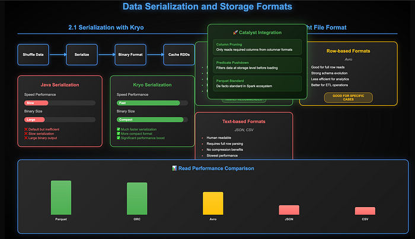

## 3. Mastering the Shuffle

The shuffle is the process of redistributing data across partitions, often required for operations like groupByKey, reduceByKey, and join. It is the most expensive operation in Spark due to network I/O, disk I/O, and serialization.

### 3.1 Partitioning Strategy

The number of partitions determines the level of parallelism.

- **Too few partitions:** Leads to poor parallelism. A few massive tasks may cause OOM (Out Of Memory) errors and data skew.
- **Too many partitions:** Leads to excessive overhead in scheduling and managing tasks. Each task has a small fixed overhead.

**Key Operations & Configurations:**

- df.repartition(N): Performs a full shuffle to create exactly N partitions. Use this to increase the number of partitions or to distribute data evenly (e.g., by a key).
- df.coalesce(M): An optimized version for _decreasing_ the number of partitions to M. It avoids a full shuffle by combining existing partitions on the same worker node.
- spark.sql.shuffle.partitions: The default number of partitions to use for shuffle operations. The default is 200, which might be too low for very large datasets or too high for small ones. Adjust this based on your data size and cluster resources.

**Optimal Partitioning Strategy (**Read if you want to understand more HDD vs SSSD**):**

**The Variables:**

- **Total_Input_MB:** Total size of the input data in Megabytes.
- **Total_Cores:** Total available cores (Number of Nodes * 80).

**The Formula (Standard / GCS-Bound):** Use this formula for all standard jobs reading from GCS or using standard disks.

**Optimal_Partitions = MAX( (Total_Input_MB / 128), (Total_Cores * 3) )**

- **(Total_Input_MB / 128):** Ensures every file is at least 128 MB to match the GCS block size.
- **(Total_Cores * 3):** Ensures we generate enough tasks to keep the CPU queue saturated (hiding network latency).

**The Formula (SSD / Scratch-Space):** Use this formula _only_ if the cluster is configured with Local NVMe SSDs.

**Optimal_Partitions = MAX( (Total_Input_MB / 64), (Total_Cores * 5) )**

- **(Total_Input_MB / 64):** SSDs have no seek time, so we can process smaller chunks (64 MB) for better distribution.
- **(Total_Cores * 5):** SSDs require higher concurrency to saturate their IOPS throughput.

The 3 factor in HDD became a formulated one due to cores design. To understand this you can refer to this [doc](https://spark.apache.org/docs/latest/tuning.html) . For SDD the factor became 5 due NVMe IOPS Saturation benchmarks. Understanding I/O characters for SSD - [doc](https://docs.aws.amazon.com/ebs/latest/userguide/ebs-io-characteristics.html)

**General Rule of Thumb:** Aim for partitions to be between 100MB and 200MB in size i.e. exactly 128MB in terms of HDD and 64MB for SSD. The number of partitions should be 2-3 times the number of available cores in your cluster for HDD and 5 for SSD respectively.

### 3.2 Handling Data Skew

Data skew occurs when one or more partitions are significantly larger than the others, creating a bottleneck. The tasks processing these large partitions will run much longer than the rest.

**Strategies to Mitigate Skew:**

**1.Salting:** For skewed keys in a join or groupBy, add a random "salt" to the key. This distributes the skewed data across multiple partitions.

- In the skewed DataFrame, append a random number to the join key: concat(skewed_key, '_', floor(rand() * N)).
- In the other DataFrame, explode the join key to match the salted keys.
- Perform the join and then remove the salt.

**2. Adaptive Query Execution (AQE):** Available in Spark 3.x and enabled by default. AQE can dynamically handle skew at runtime by splitting oversized shuffle partitions into smaller sub-partitions. See Section 4.1 for more details.

## 4. Advanced Programming and Query Techniques

### 4.1 Adaptive Query Execution (AQE)

AQE is a game-changer for Spark performance, re-optimizing the query plan during execution based on runtime statistics.

- **Enable AQE:** spark.conf.set("spark.sql.adaptive.enabled", "true") (default in Spark 3.2+)

**Key Features of AQE:**

1. **Dynamically Coalescing Shuffle Partitions:** AQE can merge small adjacent shuffle partitions into larger ones, reducing the number of tasks and scheduling overhead.
2. **Dynamically Switching Join Strategies:** AQE can change the join strategy from a Sort Merge Join to a Broadcast Hash Join if one side of the join is found to be small enough at runtime.
3. **Dynamically Optimizing Skew Joins:** AQE automatically detects and handles data skew in Sort Merge Joins by splitting the skewed partitions into smaller ones.

### 4.2 Broadcast Joins

When joining a large DataFrame with a small one, you can avoid a massive shuffle by broadcasting the small DataFrame to every executor.

- **Automatic Broadcasting:** Spark does this automatically if the size of the smaller table is below spark.sql.autoBroadcastJoinThreshold (default is 10MB).
- **Manual Broadcasting:** You can explicitly hint to Spark to use a broadcast join.

### 4.3 Caching (.cache() and .persist())

If you reuse a DataFrame multiple times in your application, you should cache it in memory. This avoids re-computing the DataFrame and its entire lineage.

- df.cache(): A shorthand for df.persist(StorageLevel.MEMORY_AND_DISK). It will try to store the data in memory, but spill to disk if it doesn't fit.
- df.persist(StorageLevel): Provides fine-grained control over where the data is stored (e.g., MEMORY_ONLY, MEMORY_ONLY_SER for serialized memory, DISK_ONLY).

**Best Practice:** Cache a DataFrame _after_ you have performed filtering and selections, but _before_ you need to perform multiple actions on it. Always remember to .unpersist() when you are done to free up memory.

### 4.4 User-Defined Functions (UDFs)

While powerful, UDFs are a "black box" to the Catalyst Optimizer. Spark cannot see inside the UDF to apply optimizations.

- **Standard UDFs (Scala/Python):** Incur high serialization/deserialization costs as data must be moved between the JVM and the Python process.
- **Pandas UDFs (Vectorized UDFs):** A major improvement. They operate on Apache Arrow data structures and perform calculations on entire pandas.Series at once, drastically reducing the overhead between Python and the JVM. Whenever possible, use built-in Spark SQL functions first, and if you need a UDF, prefer a Pandas UDF.

## 5. Configuration and Memory Tuning

Fine-tuning your Spark job's configuration is the final step.

- spark.executor.memory: The amount of memory allocated to each executor process. This is the main knob for memory.
- spark.executor.cores: The number of CPU cores allocated to each executor. A common configuration is 5 cores per executor for good HDFS throughput.
- spark.driver.memory: Memory for the driver process. Increase this if you are performing a .collect() on a large dataset or using a broadcast join with a moderately sized table.
- spark.default.parallelism: For RDDs, this controls the number of partitions. For DataFrames, spark.sql.shuffle.partitions is more relevant.

**Unified Memory Model (On-Heap):** Spark's memory is divided into two main regions:

- **Execution Memory:** Used for shuffles, joins, sorts, and aggregations.
- **Storage Memory:** Used for caching and broadcasting data. These regions can borrow from each other, but Execution memory has priority. If a task needs memory for a shuffle, it can evict cached data from Storage memory.

## Total Memory Computation Formula

Let's define the variables for the formula:

- Mdriver_on​ = Value of spark.driver.memory
- Mdriver_overhead​ = Value of spark.driver.memoryOverhead
- Nexec​ = Value of spark.executor.instances
- Mexec_on​ = Value of spark.executor.memory
- Mexec_off​ = Value of spark.memory.offHeap.size (This is 0 if off-heap is disabled)
- Mexec_overhead​ = Value of spark.executor.memoryOverhead

**1. Total Memory per Executor Container:**

This is the full memory footprint of a single executor process.

Mexecutor_total​=Mexec_on​+Mexec_off​+Mexec_overhead​

**2. Total Memory for the Driver Container:**

This is the full memory footprint of the driver process.

Mdriver_total​=Mdriver_on​+Mdriver_overhead​

**3. Grand Total Cluster Memory Request:**

This is the final formula for the entire Spark application.

Mapp_total​=Mdriver_total​+(Nexec​×Mexecutor_total​)

Substituting the components, the complete formula is:

Mapp_total​=(Mdriver_on​+Mdriver_overhead​)+(Nexec​×(Mexec_on​+Mexec_off​+Mexec_overhead​))

## Example Calculation

**Given Configuration:**

- spark.driver.memory = 4g
- spark.driver.memoryOverhead = 1g
- spark.executor.instances = 20
- spark.executor.memory = 8g
- spark.memory.offHeap.enabled = true
- spark.memory.offHeap.size = 2g
- spark.executor.memoryOverhead = 1g

**Calculation:**

1. **Total Driver Memory:** Mdriver_total​=4 GB+1 GB=5 GB
2. **Total Memory per Executor:** Mexecutor_total​=8 GB (on-heap)+2 GB (off-heap)+1 GB (overhead)=11 GB
3. **Grand Total Application Memory:** Mapp_total​=5 GB+(20×11 GB)=5 GB+220 GB=225 GB

This guide provides a detailed breakdown of key configurations, categorized by their area of impact. Each entry analyzes the technical implications of tuning the parameter.

### Category 1: YARN Resource Management & Dynamic Allocation

These configurations control the application's physical footprint and resource interaction with the YARN cluster manager.

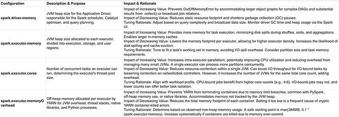

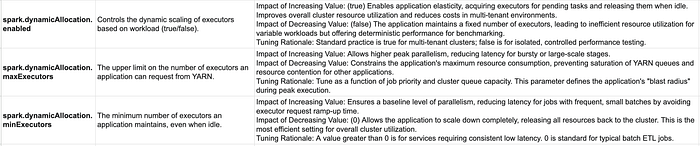

### Category 2: Shuffle & I/O Optimization

These parameters tune the performance of data transfer between stages and data reading from sources.Optimizing Spark Performance: Key Configurations

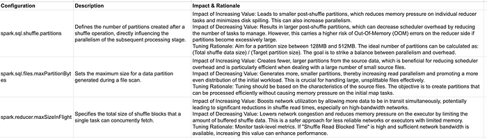

### Category 3: Execution Engine & Memory Management (Project Tungsten)

These settings control Spark's core execution engine, memory model, and adaptive capabilities.

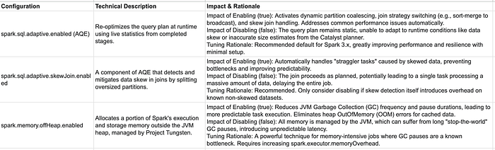

### Category 4: Serialization & Compression

These configurations tune how data objects are converted to bytes for network transfer or storage.

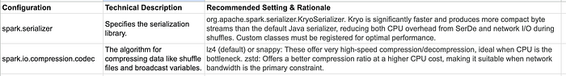

### Category 5: Query Planning & Join Strategies (Catalyst Optimiser)

These parameters influence the initial query planning decisions made by the Catalyst optimiser.

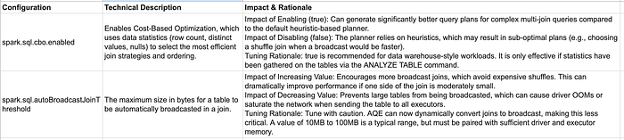

---
**Tags:** Performance Optimization · Apache Spark · Big Data
