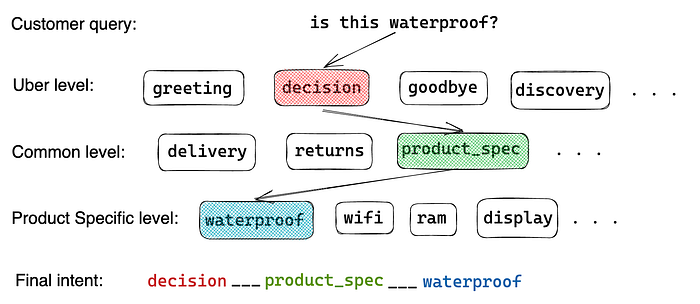
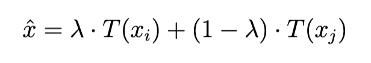
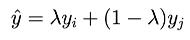
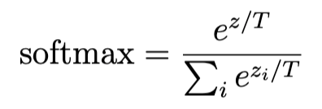

# Understanding Flipkart’s AI-Powered Decision Assistant Chatbot

> A Look into Our Approach to Intent Recognition and Natural Language Processing

## About Flipkart US R&D team

In our quest to enable India’s next 400 million e-commerce users, Flipkart has established the Flipkart U.S. R&D Center — a dedicated center of excellence for artificial intelligence, based out of Bellevue, Washington. We lead innovative research around Natural Language Understanding (NLU), chatbots, computer vision, and healthcare to support Flipkart’s front and back-end applications. We’re working on some very interesting projects, including regional language solutions, voice-first conversational assistants for discovery and decision-making, and more.

## Defining our approach

In our last [blog](./flipkart-us-r-d-billion-ai-2022-conference-6cb3e262c700.md) by [Anusua Trivedi](https://www.linkedin.com/in/anusua/), Director of the US R&D Center, we introduced our Decision Assistant (DA) chatbot that helps customers with their questions when they are considering buying a product on Flipkart. We wanted to know the basic, yet important aspect necessary to help address queries and aid users in their decision-making process. Our method is about thinking from a customer perspective in a real-life scenario.

When you visit a shop looking for information on a product, you talk to a sales representative who understands your question or identifies the intent in your question. Drawing a parallel to the same in the digital context, we first need to understand the customer’s intent. In technical terms:

> **Intent recognition** is taking a written or spoken input and classifying it based on what the customer needs from the exchange, whether it is a question only, or a desired action.

Flipkart’s decision-focused chatbot uses various techniques to understand the human-like mindset or the logic behind the intent. Since its inception, we have expanded our supervised machine learning models to two of our major product categories — mobile and fashion.

Such solutions that aim to emulate human-like conversations are part of Natural Language Processing (NLP). NLP breaks down and processes language, while Natural Language Understanding (NLU) provides language comprehension. NLP and NLU work together, but perform different functions.

## Our way of solving it

### The high-level architecture

Let’s start with how we’ve defined our intents at a high level. A customer can ask a multitude of questions, from _“I’m looking for sports shoes”_ to _“Is this size available for a 14 yr old girl?”_, but the goal of the model is to identify the _primary_ intent behind each question.

With focus on decision-making, we based our initial approach on the most frequently asked questions to a customer support specialist. From there, we found that not all intents are created equal. We had to break down our intents and design a model that could recognize them on different levels of granularity–

1. Uber (high level meaning)
2. Common (when the intent is common to any product, such as delivery timeframes or payment options)
3. Product-specific (questions pertaining to the actual product details)

*Example: Formation of final intent using the granular level intents*

These levels of classifying the intents aren’t mutually exclusive for a user query, but are rather sequentially related. For example, a question like, _“Is it waterproof?”_ is at face value, an information-seeking query. However, we have to build upon that question by factoring in context (in this case, they were browsing the product details page, and for a phone specifically), so we not only know what “it” means but also conclude that their intent is to get an answer that would help them decide (_uber_ intent) based on an attribute or feature of the product in question (_product specification_ intent).

Other intents that contribute besides those that are part of deciding to purchase a product are ones centered on the discovery part of a user’s shopping journey (browsing, finding alternate colors, and so on), having a casual chat (simple greetings and goodbyes), or questions that might arise after purchasing the product (delivery and returns, for example).

> This method of breaking user intents into granular levels helps us to grasp the final output the intent model predicts. Once the model predicts an intent, different **conversation flows** are triggered according to the Uber or common intent prediction level, each designed to address the user’s query in the most contextually relevant way possible.

For example, a product specification level prediction would take an answer-retrieval approach, while a question about delivery or stock availability might kick off some business rules that take some additional calculations and walk the user through a few more questions to resolve their query.

### The mind behind the model

From the foundation of our problem statement, we turned to the data science approach to solve it. After several iterations of various models, we landed upon a model through a rigorous process of debugging outputs.

> The crux of our solution is an in-house Large Language Model (LLM) trained by the Flipkart NLP team, which can be used as a more efficient and effective pre-trained model for all NLP tasks. It’s a pre-trained model in the English language using a masked language modeling (MLM) objective.

**Masked Language Modeling** is a procedure in which taking a sentence, the model randomly masks 15% of the words in the input then runs the entire masked sentence through the model, which then predicts the masked words. It allows the model to learn a bidirectional representation of the sentence, meaning it learns contextualized representations of tokens by considering both their left and right contexts during training.

It’s primarily aimed at being fine-tuned on tasks that use the whole sentence (potentially masked) to decide, such as sequence classification, token classification, or question answering (Q&A).

- **Sequence Classification **or Text Classification is the NLP task of predicting a label for a sequence of words. For example, a string of “_This phone is not good because the ram is just 2 gb”_ could be tagged with a negative label. A string of “_This phone is amazing because of its 5gb ram”_ could be tagged with a label of positive.
- **Token classification** task is like text classification, except each token within the text receives a prediction. For instance, given the product title _“Nike Air Max 270 Women’s Running Shoes”_, a token classification model could be used to classify each token in the title as either a product category (e.g., “Running Shoes”) or an attribute (e.g., “Women’s” or “Nike Air Max 270”).
- **Question answering** is answering questions (typically reading comprehension questions), but abstaining when presented with a question that cannot be answered based on the provided context. For example: A customer might ask the chatbot _“What are the features of this camera?”_ and the chatbot would search the product description for that camera and return the features as the answer.

In effect, the model has learned an inner representation of the English language that can then extract features useful for downstream tasks like the ones mentioned above.

This model was trained using Flipkart internal data sources comprising product descriptions, catalog attributes, product reviews, and customer answers. The total size of training data amassed to ~40GB. This model is termed as our base model.

### The fine-tuning

The next task was to fine-tune the LLM to our purpose of classifying queries into their right intent.

An important part of fine-tuning a model is to make the base model work on domain-specific cases. Here, our base model was not trained using chat queries. Hence, for fine-tuning, we use our chat data — customer-bot and customer-human agent conversations — to train the model. We extracted about a hundred thousand queries from our database and had them manually labeled by expert labelers. This labeled data then made up our training, validation, and test data in the initial stages of training.

The main output of our base model was to provide an embedding vector for the input sequence of words. This sentence-embedding vector is 768-dimensional. This size is determined by the hyperparameter “hidden_size,” which specifies the size of the hidden layers in the BERT model.

> The hidden_size is typically set to 768 or 1024, meaning that the output sentence embedding vector will have 768 or 1024 dimensions, respectively. This vector represents the **contextualized representation** of the input sentence and is produced by the _[CLS]_ token in the final layer of BERT, which is trained to represent the entire input sequence.

To get the prediction probability for each class, we add a linear head on top of this sentence embedding vector. Adding a linear head on top of the sentence embedding vector from BERT involves training a linear layer on top of the output vector to perform a specific downstream task. The output of this linear head is a vector whose length is equivalent to the number of intents, which is 28 in our case. This forms the complete neural network architecture of our model.

This model is then trained until we see a gradual drop in validation loss integrated with early stopping. Validation loss is a metric used to assess the performance of a deep learning model on the validation set. Typically, it would take about 5–6 epochs to train a model that performs pretty well on our validation and test sets in terms of targeted metrics.

> It’s very important to have good **quality** and **quantity** of data. Quality here means that there should be as few errors in training/validation set labels as possible. Ignoring this is only going to harm your model training and work against your expected lift in model performance. Speaking about quantity, as the famous saying with BERT-based models goes — the larger the data, the better the performance of the model.

The model was trained using a dataset of 117,249 queries, with an additional dataset of 12,073 queries used for validation during training, and a separate dataset of 12,142 queries used for testing the performance of the model. For optimization, we use the [AdamW](https://arxiv.org/abs/1711.05101) optimizer. It decouples the weight decay from the optimization step. This means that the weight decay and learning rate can be optimized separately, i.e. changing the learning rate does not change the optimal weight decay.

### The extra tasty spices

That’s not all to provide us with the results we are looking for — we added and equipped several techniques on top of the usual way of training a fine-tuned BERT model, including Mixup, Temperature Scaling, Data Augmentation, and Quantization.

- **_Mixup_**: The latest data augmentation technique that linearly interpolates input examples and the corresponding labels. You can learn more about this technique [here](https://arxiv.org/abs/1710.09412). Unlike image data, text input consists of discrete units (words) without an inherent ordering or algebraic operations — it could be one sentence, two sentences, a paragraph or a whole document. Here, we construct virtual hidden representations dynamically during the training process as follows:

where T(x_i), T(x_j) are output features from transformers;

where y_i, y_j are corresponding labels.

A very important point to note is that the mixup process is trained together with the fine-tuning process in an end-to-end fashion, and the hidden mixup representations are dynamic during the training process. This method helped us increase robustness and improve generalization, calibration, and data efficiency in our model.

- **_Temperature Scaling_**: Neural networks tend to output overconfident probabilities. Temperature scaling is a post-processing method to make neural networks calibrated. After temperature scaling, you can trust the probabilities output by a neural network. In this technique, we divide the logits (inputs to the softmax function) by a learned scalar parameter i.e.,

where **z** is the logit, and **T** is the learned parameter. We learn this parameter on a validation set, where T is chosen to minimize Negative Log-Likelihood Loss (NLL). With the help of temperature scaling, we were able to improve calibration, uncertainty estimation, model interpretability, and reduce overconfidence of the model. Here’s an intuitive example:

> Suppose we have a language model that is trained to predict the sentiment of a product review, with positive sentiment assigned a label of 1 and negative sentiment assigned a label of 0. After training the model, we can apply temperature scaling to adjust the model’s confidence in its predictions.Assuming the model outputs a logits vector of [2.0, -2.0], which corresponds to a probability distribution of [0.88, 0.12] after applying the softmax function. We can adjust the temperature of the model by **dividing the logits vector** by a temperature parameter, which is a scalar value greater than zero.For example, if we set the temperature to 2.0, we would obtain a new probability distribution of [0.98, 0.02], which places greater confidence on the positive sentiment label. Conversely, if we set the temperature to 0.5, we would obtain a **new probability distribution** of [0.69, 0.31], which places **greater confidence** on the negative sentiment label.

- **_Data Augmentation_**: Using the queries in our train dataset, we apply some data manipulation for every batch and train the model with these manipulated queries. An example of data augmentation can be swapping the words in a sentence which involves randomly swapping the positions of two words in a sentence to create a new sentence that is similar to the original but has different word order.

> For example, consider the sentence: “The quick brown fox jumped over the lazy dog.” Swapping the positions of the words “quick” and “brown” could result in the following augmented sentence: “The brown quick fox jumped over the lazy dog.”

- **_Quantization_**: Again, this is a post-training procedure where we perform computations and store tensors at lower bit-widths than floating point precision. A quantized model executes some or all of the operations on tensors with reduced precision rather than full precision (floating point) values. This allows for a more compact model representation and the use of high performance vectorized operations on many hardware platforms. Quantization helped us to reduce memory usage, perform faster inference, and provided improved energy efficiency and model portability.

> For example, suppose we have a language model such as BERT that has a large number of weights, each represented as a 32-bit floating-point number. By using quantization, we can reduce the precision of the weights to a lower number of bits, such as 8 bits or less, to **reduce the memory requirements** of the model.

## Let’s grade our work

Every trained model needs to be evaluated against the target metrics. Only then will we be able to figure out where improvement lies. The primary metric that we used to evaluate our model’s performance is called weighted recall. The recall measures the model’s ability to detect positive intents — the ability of the model to classify the proportion of actual positive classes correctly. The higher the recall, the more positive samples detected. This is calculated considering only 23 (from 28) primary intents of interest. These primary intents help the customer engage with our chatbot and/or help them make a purchasing decision. The remaining 5 intents do not contribute to decision-making in any manner. As of the time of publishing this blog, our deployed chatbot model achieved a weighted recall of 0.87 and a weighted precision of 0.88 across all product categories.

> This helps us improve the chatbot’s performance, which is measured on several factors, like accuracy of answers and helpfulness ratings (applied in analysis), all of which amounts to what we track as its “[answerability](https://aclanthology.org/2022.gem-1.27/)”. This measure is our personalized chatbot effectiveness metric and it can guide model development decisions for a conversational AI product focused on serving up answers, such as ours, which helps users in their pre-purchase decisions.

Building an intent classification model for an ecommerce chatbot, we had several valuable learnings, including:

1. **Data preparation**: This can involve identifying the different intents that the chatbot needs to support, collecting examples of user queries for each intent, and labeling the data. This process can help you develop an understanding of the types of queries that users are likely to make when interacting with an ecommerce chatbot.
2. **Feature engineering**: Feature engineering involves selecting and transforming the input data into a format that is suitable for the machine learning algorithm.
3. **Model selection**: There are many different machine learning algorithms that can be used for intent classification, including logistic regression, decision trees, and neural networks. Choosing the right model for the task at hand requires an understanding of the strengths and weaknesses of each algorithm.
4. **Hyperparameter tuning**: Machine learning models have many hyperparameters that can be tuned to optimize their performance. This process can help you develop an understanding of how different hyperparameters impact the performance of the model.
5. **Model evaluation**: Once the model is trained, it is important to evaluate its performance on a held-out test set. Model evaluation can help you understand the strengths and weaknesses of the model and identify areas for improvement.

These skills can be applied to a wide range of other machine learning tasks in NLP and beyond.

The intent model has contributed to our business metrics by improving the chatbot’s ability to answer customer questions, reducing the number of conversations that get handed off to a human agent, and lowering the abandonment rate.

Stay tuned for our next blog in this Tech series.

---
**Tags:** NLP · Chatbots · Intent Recognition · Large Language Models · Data Science
