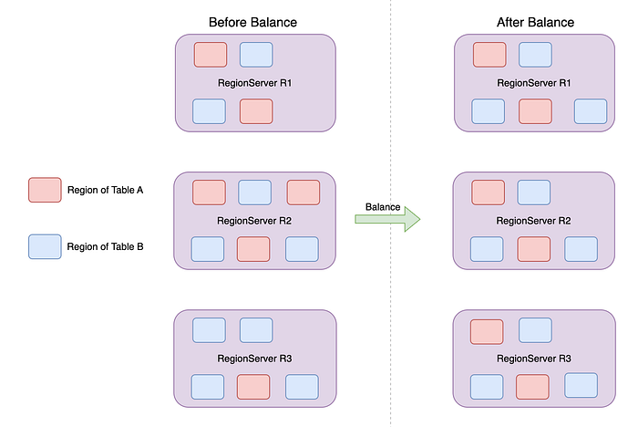
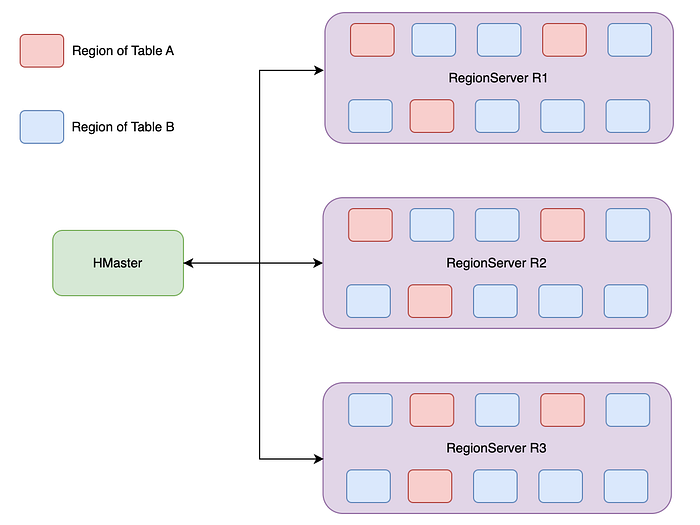
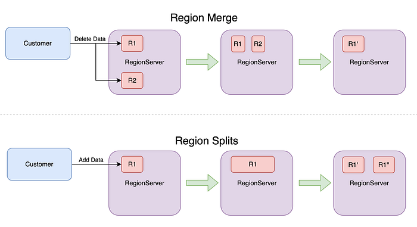
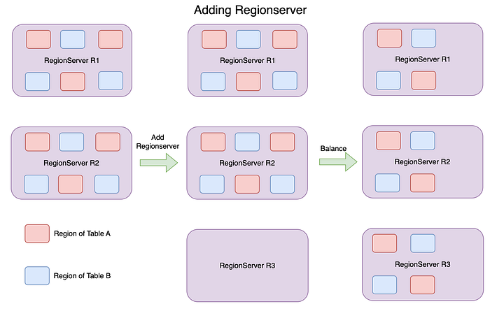
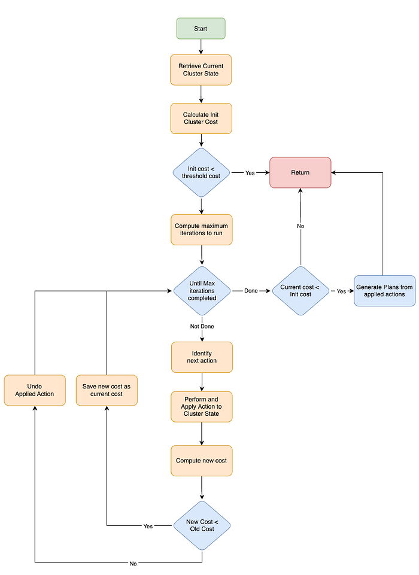

# Architecture of Apache HBase Balancer

## Introduction

**Apache HBase** is an open-source non-relational distributed database modeled after Google’s Bigtable and written in Java. It is developed as part of Apache Software Foundation’s Apache Hadoop project and runs on top of HDFS, providing Bigtable-like capabilities for Hadoop

A **Load Balancer** in a distributed database context is a piece of software that ensures the load is distributed across the nodes to ensure resource utilisation as per the configuration. In the below diagram you can see the regions (shards) of tables are unequally distributed before balance and equally balanced post balance. This post balance setup ensures that the number of requests received by each of the regionservers are equal in number because the number of regions (shards) hosted are the same.



Depending on the architecture of the database, functionality of load balancer can be different, for example it could just be a stateless layer sitting in front of the data routing the traffic to server nodes functioning as a load balancer, or each database server process itself can act as a navigator and in turn function as a load balancer. In this article we are going to stick to Load balancer as per the architecture of Apache HBase.

Apache HBase comes with a few load balancer pre bundled such as [FavoredStochasticBalancer](https://github.com/apache/hbase/blob/rel/2.5.3/hbase-server/src/main/java/org/apache/hadoop/hbase/master/balancer/FavoredStochasticBalancer.java), [SimpleLoadBalancer](https://github.com/apache/hbase/blob/rel/2.5.3/hbase-server/src/main/java/org/apache/hadoop/hbase/master/balancer/SimpleLoadBalancer.java), [StochasticLoadbalancer](https://github.com/apache/hbase/blob/rel/2.5.3/hbase-server/src/main/java/org/apache/hadoop/hbase/master/balancer/StochasticLoadBalancer.java), [RSGroupBasedLoadBalancer](https://github.com/apache/hbase/blob/rel/2.5.3/hbase-rsgroup/src/main/java/org/apache/hadoop/hbase/rsgroup/RSGroupBasedLoadBalancer.java), etc. Each of these production grade load balancers uses StochasticLoadbalancer as the underlying implementation and overrides a few capabilities corresponding to the respective load balancer. In this article we are going to talk about the architecture of HBase balancer in general and[ StochasticLoadbalancer](https://hbase.apache.org/devapidocs/org/apache/hadoop/hbase/master/balancer/StochasticLoadBalancer.html) in particular.

## Apache HBase Background

### HBase Terminology

Let’s familiarize some of the Hbase terminologies that can come up often during this reading.

**Tables**: HBase tables organize data in rows of data in the form of key value pairs. Rows are lexicographically sorted with the lowest order appearing first in a table. Each table is divided into a set of one or more regions.

**Region**: Each table is divided into disjoint contiguous subsets called regions. Regions are the basic element of availability and distribution for tables. Each region has a lexicographically sorted subset of rows of the table.

**RegionServer**: is a process which hosts regions in memory that serves client rpc calls and whose data is stored in hdfs via datanodes

**Hmaster:** is a master node in HBase, which co-ordinates between regionserver for performing certain cluster-wide activities such as region assignment, balancing, etc

### HBase Architecture

**HMaster** is a central component of hbase which is responsible for HBase cluster is in a healthy state with responsibilities such as

- Allocation of regions onto regionserver
- Tracking the health of regionservers
- Balance the resource utilisation of regionserver
- Cleanup chores to avoid any pileup of temporary data in the cluster

Regionserver is responsible for client api calls such as puts, gets, updates, deletes, etc. Where each regionserver hosts a definitive set of regions at any point in time and responsible for crud operations only for those regions hosted by the regionserver. These regions hosted can change as per the needs of changing dynamics of the cluster such as addition of new regionservers, removal of existing regionservers etc.



**Load Balancer**: Apache HBase is an auto sharded, auto balanced horizontally scalable key value store. Load Balancer is responsible to keep the cluster healthy and to optimally utilise the resources with changing landscape.

- _Auto Sharded_ — Each table is divided into disjoint contiguous subsets called regions (shards). Each region (shard) if it grows enough can be split into 2 regions and if two neighbouring regions contract enough (with TTL expiry or data deletes) can be merged into a single region. This sort of dynamic nature of setup calls for a need for a balancer to ensure the cluster is catering to the changing dynamics of the cluster.



- _Auto Balanced_ — With horizontally scalable capability adding or removing regionservers should be handled automatically and each regionserver is appropriately utilised. This can happen if regions are automatically moved to new regionservers and moved out from removed regionservers. This is where the balancer comes into play.



### Apache HBase Balancer Goals

A Load balancer in the context of a distributed database like HBase ensures the appropriate utilisation of worker processes such as regionservers as per the configuration defined. Lets consider the diagram in the previous section, where there are a few regionservers, a couple of tables and each table has a few regions. Each regionserver is hosting a few regions from each table

**Distribution of Load**:

Load for a regionserver can be defined based on various parameters such as

- The number of api requests received by the regionserver in comparison with other regionserver
- The number of regions hosted per regionserver per table
- How many regions are hosted per rack of a cluster in the datacenter
- How much of the data hosted per regionserver in comparison with other regionservers

Depending on the need of a particular cluster deployment, a cluster can be configured to ensure that there is a distribution of load (one or more of above mentioned definitions) across the regionservers.

For Example: In the above diagram — each of the regionserver has 3 regions of table A and 7 regions of table B and overall 10 regions per regionserver. Balancer should provide levers to be able to control the distribution of load as per the needs of deployment via configuration.

**Region Assignment**:

The assignment manager has the responsibility of assigning regions onto regionservers, which happens throughout the lifecycle of the cluster in action such as table creation/deletion, balancer runs, region splits/merges, etc. Whenever an assignment manager comes into action, it is the responsibility of the balancer to provide the right plans to ensure configured criteria of Distribution of Load is maintained.

## Apache HBase Balancer Architecture

The [StochasticLoadbalancer](https://hbase.apache.org/devapidocs/org/apache/hadoop/hbase/master/balancer/StochasticLoadBalancer.html) is a best effort balancer that comes prebundled as part of Apache HBase which has the ability to extend and configure as per the needs of the deployed Apache HBase cluster. The [StochasticLoadbalancer](https://hbase.apache.org/devapidocs/org/apache/hadoop/hbase/master/balancer/StochasticLoadBalancer.html) runs a simulation taking the current cluster state as input and wanting to meet the goals of the balancer defined in the previous section and giving the new cluster state as output. During the simulation process some of the levers available at balancer disposal are Cost Functions and Candidate Generators along with some configurations like number of iterations, threshold cost of imbalance, etc. These details are discussed in greater detail later in this section.

**Cost Function**: is a balancer function when invoked spits out a cost value between 0 and 1 with 0 being the most balanced and 1 being the least balanced for a specific criteria such as Locality, Region spread across regionservers etc. HBase comes pre-bundled with a large number of Cost Functions, you can find them [here](https://github.com/apache/hbase/tree/rel/2.5.3/hbase-server/src/main/java/org/apache/hadoop/hbase/master/balancer). Some examples of Cost functions are ServerLocalityCostFunction, RackLocalityCostFunction. One can add custom cost functions as well, you can find a couple of examples described in greater detail in [this blog](https://blog.flipkart.tech/hbase-multi-tenancy-part-i-37cad340c0fa#864b)**_._**

**Candidate Generator**: is a balancer function when invoked spits out one of the following two actions

- Swap region r1 on regionserver rs1 with region r2 on regionserver rs2
- Move region r1 on regionserver rs1 to regionserver rs2

which has a probability of improving the balance of the cluster i.e. reduce the cost for a specific criteria. HBase comes pre-bundled with a large number of Candidate Generators and you can find them [here](https://github.com/apache/hbase/tree/rel/2.5.3/hbase-server/src/main/java/org/apache/hadoop/hbase/master/balancer). Some examples of Candidate Generators are RandomCandidateGenerator, LoadCandidateGenerator, LocalityCandidateGenerator. One can add custom candidate generators, you can find a couple of examples described in greater detail in [this blog](https://blog.flipkart.tech/hbase-multi-tenancy-part-i-37cad340c0fa#ff05).

### Architecture



**Details of the Flow Chart**

**_Cluster State_**: [BalancerClusterState](https://github.com/apache/hbase/blob/rel/2.5.3/hbase-server/src/main/java/org/apache/hadoop/hbase/master/balancer/BalancerClusterState.java) is an in-memory representation of hbase cluster with all of the cluster regionservers, hosts, racks, regions, tables etc at that point in time. This is taken as an accurate representation of the cluster for calculating how balanced the cluster is and simulating the balancer algorithm to understand if that plan can improve the balance of the cluster after applying.

**_Calculate Cost_**: Cost is nothing but an indicator to how good the cluster is balanced. Lower the cost better the balance and higher the cost worse the balance. There are one or more cost functions configured as part of the balancer configuration along with their weight. Some examples are

- [WriteRequestCostFunction](https://github.com/apache/hbase/blob/rel/2.5.3/hbase-server/src/main/java/org/apache/hadoop/hbase/master/balancer/WriteRequestCostFunction.java): Which indicates if write requests are skewed and gives higher value if skewed or lower value if balanced. Default weight is 0 as it is not enabled by default
- [ServerLocalityCostFunction](https://github.com/apache/hbase/blob/rel/2.5.3/hbase-server/src/main/java/org/apache/hadoop/hbase/master/balancer/ServerLocalityCostFunction.java): Indicates if data for a specific region hosted on a regionserver is locally available for serving or it has to fetch from remote. Lower cost indicates greater amount of data available locally and higher cost indicates lesser data available locally. Default weight configured is 25

To compute the cost at any point of time, the cost function iterates over each configured cost function, gets the cost as per the algorithm of that cost function and multiply by its configured weight, sum these values of all cost functions. Here is the [code reference](https://github.com/apache/hbase/blob/rel/2.5.3/hbase-server/src/main/java/org/apache/hadoop/hbase/master/balancer/StochasticLoadBalancer.java#L823) for the same

**_Number of Iterations_**: Each balancer runs for every table runs for a fixed number of iterations and is optimistic about improving the balancer of the cluster. Those number of iterations are calculated from formula — [_numRegions x stepsPerRegion (800 default) x numServers_](https://github.com/apache/hbase/blob/rel/2.5.3/hbase-server/src/main/java/org/apache/hadoop/hbase/master/balancer/StochasticLoadBalancer.java#L465)

**_Next Action_**: During each iteration an action is identified using the algorithm and this action identifies a change in the cluster state to be made to improve the balance of the cluster. The action is described [here](https://github.com/apache/hbase/blob/rel/2.5.3/hbase-server/src/main/java/org/apache/hadoop/hbase/master/balancer/StochasticLoadBalancer.java#L465) and as follows

- Pick a candidate generator among the ones which are configured with the balancer proportionate to the cost of the corresponding cost function configured. The goal is to pick a candidate generator more often with higher probability to reduce the cost. Some examples are
- [LocalityBasedCandidateGenerator](https://github.com/apache/hbase/blob/rel/2.5.3/hbase-server/src/main/java/org/apache/hadoop/hbase/master/balancer/LocalityBasedCandidateGenerator.java): This candidate generator returns an action which picks two regions which are having low locality and try swapping them which can improve locality of both the regions or move one region from regionserver to another which improves the locality of that region.
- [LoadCandidateGenerator](https://github.com/apache/hbase/blob/rel/2.5.3/hbase-server/src/main/java/org/apache/hadoop/hbase/master/balancer/LoadCandidateGenerator.java): This candidate generator has functions to pick the most loaded regionserver and least loaded regionserver and hence an action can be returned which moves on region from most loaded server to least loaded server.

**_Apply Action_**: From the previous step of picking an Action from Next Action and apply the picked Action onto the Cluster State described above. With the applied Action, the balancer algorithm will be able to calculate the cost to see if the change has improved the balance of the cluster or not.

**_Undo Action_**: With the Action applied described above, if balance of the cluster has not improved this step will just revert the action to what was before. And this in principle moves the cluster back to the state that was before applying the action.

**_Generate Region Plans_**: [Region Plan](https://github.com/apache/hbase/blob/rel/2.5.3/hbase-server/src/main/java/org/apache/hadoop/hbase/master/RegionPlan.java) is a representation of moving a region from one regionserver to another. From the previous steps, the balancer alters the in-memory cluster state over a period of the balance run to improve balance of the cluster and if this cluster state has improved balance of the cluster at the end of the run will have to be applied to the production cluster and which generates the list of [Region Plans](https://github.com/apache/hbase/blob/rel/2.5.3/hbase-server/src/main/java/org/apache/hadoop/hbase/master/RegionPlan.java) as output of the balancer function.

## Apache HBase Balancer Performance

HBase Balancer is scheduled to run at an interval of [5 minutes by default](https://github.com/apache/hbase/blob/rel/2.5.3/hbase-common/src/main/java/org/apache/hadoop/hbase/HConstants.java#L155) and can be configured to a different interval and can be triggered on demand with balancer command. Each balancer run does not necessarily result in a state change, it happens only if the imbalance is greater than [the threshold configured](https://github.com/apache/hbase/blob/rel/2.5.3/hbase-server/src/main/java/org/apache/hadoop/hbase/master/balancer/StochasticLoadBalancer.java#L127C32).

Performance of a balancer is very important on large Apache HBase deployments and especially if the cluster has many rsgroups and multiple tables. There are several parameters which affect the performance of a balance run. Some of them include

- Max number of iterations: Each balancer run goes through a specific set of iterations, with each iteration is going to perform a certain amount of balance. Each step takes some amount of time and hence defines the performance of the balancer
- Imbalance in the cluster: More the cluster imbalance, the greater amount of effort to be put into each iteration to get to a better balanced state and hence the impact on the performance of the balancer.
- Number of regions: Higher the number of regions the greater the probability of performing an action which can improve the balance and hence the impact on the performance of the balancer.
- Number of regionservers: Higher the number of regionservers the greater the probability of performing an action which can improve the balance and hence the impact on the performance of the balancer.

Performance of the balancer is measured by following parameters

- Minimal region movement: Considering Apache HBase is a consistent store, meaning region movements are going to have unavailability for a very brief period of time. Performance of the balancer will be measured by least number of regions moved from one regionserver to another and hence the reduced impact on the customer api calls
- Minimum Final Cost: Cost is nothing but how balanced is the cluster. The goal of the balancer is to leave the end cluster state in the best balanced state as much as possible. This will ensure that the balancer is not going to be invoked next time it runs because of a very small imbalance.

Once these region movement plans are generated by the Balancer as per the configuration, these plans are handed over to the [Assignment Manager](https://github.com/apache/hbase/blob/rel/2.5.3/hbase-server/src/main/java/org/apache/hadoop/hbase/master/assignment/AssignmentManager.java). The assignment manager is going to move regions as per the plan shared by the balancer with a throttle on how many regions are going to be unavailable at any point during the process. You can read more details from the code on specifics from [here](https://github.com/apache/hbase/blob/rel/2.5.3/hbase-server/src/main/java/org/apache/hadoop/hbase/master/HMaster.java#L2040)

The above mentioned performance factors are demonstrated in the following section with examples.

### Examples:

**Scenario 1:**

Cluster Configuration

- Number of regionservers: 8
- Number of regions: 45
- Maximum number of iterations: 1000000
- Cost threshold: 0.04

Run Details

- Balancer Run: 30 seconds
- Application of Plans: 2 minutes 41 seconds
- Total iterations ran: 96858
- Initial Cost: 0.09706592766966382 — greater than cost threshold (0.04)
- Final Cost: 0.00756644910689012 — less than cost threshold (0.04)
- Region Moves: 24

More details can be found in the logs

```
2025-01-15T13:24:59,505 INFO  [RpcServer.default.FPRWQ.Fifo.read.handler=79,queue=69,port=16000] balancer.StochasticLoadBalancer: Running balancer because cluster has idle server(s). function cost=RegionCountSkewCostFunction : (multiplier=1000.0
, imbalance=0.11749633049682573, need balance); MoveCostFunction : (multiplier=7.0, imbalance=0.0); ServerLocalityCostFunction : (multiplier=25.0, imbalance=0.0317494613441357); RackLocalityCostFunction : (multiplier=15.0, imbalance=0.0315649216
5548885); TableSkewCostFunction : (multiplier=35.0, imbalance=0.11749633049682573, need balance); RegionReplicaHostCostFunction : (not needed); RegionReplicaRackCostFunction : (not needed); ReadRequestCostFunction : (multiplier=5.0, imbalance=0.
4880731811586446, need balance); WriteRequestCostFunction : (multiplier=5.0, imbalance=0.4440815926682966, need balance); MemStoreSizeCostFunction : (multiplier=5.0, imbalance=0.1448451182915061, need balance); StoreFileCostFunction : (multiplie
r=5.0, imbalance=0.15045621507200435, need balance); FavoredDeadNodeCostFunction : (multiplier=400.0, imbalance=0.0); FavoredNodeImbalanceCostFunction : (multiplier=100.0, imbalance=0.26486423168198797, need balance);

2025-01-15T13:24:59,505 INFO  [RpcServer.default.FPRWQ.Fifo.read.handler=79,queue=69,port=16000] balancer.StochasticLoadBalancer: Start StochasticLoadBalancer.balancer, initial weighted average imbalance=0.09706592766966382, functionCost=RegionC
ountSkewCostFunction : (multiplier=1000.0, imbalance=0.11749633049682573, need balance); MoveCostFunction : (multiplier=7.0, imbalance=0.0); ServerLocalityCostFunction : (multiplier=25.0, imbalance=0.0317494613441357); RackLocalityCostFunction :
 (multiplier=15.0, imbalance=0.03156492165548885); TableSkewCostFunction : (multiplier=35.0, imbalance=0.11749633049682573, need balance); RegionReplicaHostCostFunction : (not needed); RegionReplicaRackCostFunction : (not needed); ReadRequestCos
tFunction : (multiplier=5.0, imbalance=0.4880731811586446, need balance); WriteRequestCostFunction : (multiplier=5.0, imbalance=0.4440815926682966, need balance); MemStoreSizeCostFunction : (multiplier=5.0, imbalance=0.1448451182915061, need bal
ance); StoreFileCostFunction : (multiplier=5.0, imbalance=0.15045621507200435, need balance); FavoredDeadNodeCostFunction : (multiplier=400.0, imbalance=0.0); FavoredNodeImbalanceCostFunction : (multiplier=100.0, imbalance=0.26486423168198797, n
eed balance);  computedMaxSteps=1000000

2025-01-15T13:25:29,505 INFO  [RpcServer.default.FPRWQ.Fifo.read.handler=79,queue=69,port=16000] balancer.StochasticLoadBalancer: Finished computing new moving plan. Computation took 30001 ms to try 96858 different iterations.  Found a solution
that moves 24 regions; Going from a computed imbalance of 0.09706592766966382 to a new imbalance of 0.00756644910689012. funtionCost=RegionCountSkewCostFunction : (multiplier=1000.0, imbalance=0.0); MoveCostFunction : (multiplier=7.0, imbalance=
0.0); ServerLocalityCostFunction : (multiplier=25.0, imbalance=0.00129180719124955); RackLocalityCostFunction : (multiplier=15.0, imbalance=2.154169598744815E-5); TableSkewCostFunction : (multiplier=35.0, imbalance=0.0); RegionReplicaHostCostFun
ction : (not needed); RegionReplicaRackCostFunction : (not needed); ReadRequestCostFunction : (multiplier=5.0, imbalance=0.4880731811586446, need balance); WriteRequestCostFunction : (multiplier=5.0, imbalance=0.4404013422882793, need balance);
MemStoreSizeCostFunction : (multiplier=5.0, imbalance=0.03698265906832484); StoreFileCostFunction : (multiplier=5.0, imbalance=0.00893377731407148); FavoredDeadNodeCostFunction : (multiplier=400.0, imbalance=0.0); FavoredNodeImbalanceCostFunctio
n : (multiplier=100.0, imbalance=0.07216878364870322, need balance);
```

**Scenario 2**_:_

Cluster Configuration

- Number of regionservers: 20
- Number of regions: 145
- Maximum number of iterations: 1000000
- Cost threshold: 0.04

Run Details

- Balancer Run: 30 seconds
- Application of Plans: 3 minutes 55 seconds
- Total iterations ran: 286186
- Initial Cost: 0.051534985526077624 — greater than cost threshold (0.04)
- Final Cost: 0.00451554446302049 — less than cost threshold (0.04)
- Region Moves: 72

More details can be found in the logs

```
2025-01-15T12:35:25,316 INFO  [RpcServer.default.FPRWQ.Fifo.read.handler=58,queue=58,port=16000] balancer.StochasticLoadBalancer: Running balancer because cluster has idle server(s). function cost=RegionCountSkewCostFunction : (multiplier=1000.0
, imbalance=0.045157153600191915, need balance); MoveCostFunction : (multiplier=7.0, imbalance=0.0); ServerLocalityCostFunction : (multiplier=25.0, imbalance=0.0); RackLocalityCostFunction : (multiplier=15.0, imbalance=0.0); TableSkewCostFunctio
n : (multiplier=35.0, imbalance=0.09843482696369105, need balance); RegionReplicaHostCostFunction : (not needed); RegionReplicaRackCostFunction : (not needed); ReadRequestCostFunction : (multiplier=5.0, imbalance=0.07299710811422996, need balanc
e); WriteRequestCostFunction : (multiplier=5.0, imbalance=0.06444159540603787, need balance); MemStoreSizeCostFunction : (multiplier=5.0, imbalance=0.0663331405323534, need balance); StoreFileCostFunction : (multiplier=5.0, imbalance=0.069945435
56027737, need balance); FavoredDeadNodeCostFunction : (multiplier=400.0, imbalance=0.0); FavoredNodeImbalanceCostFunction : (multiplier=100.0, imbalance=0.32588087870790766, need balance);

2025-01-15T12:35:25,316 INFO  [RpcServer.default.FPRWQ.Fifo.read.handler=58,queue=58,port=16000] balancer.StochasticLoadBalancer: Start StochasticLoadBalancer.balancer, initial weighted average imbalance=0.051534985526077624, functionCost=Region
CountSkewCostFunction : (multiplier=1000.0, imbalance=0.045157153600191915, need balance); MoveCostFunction : (multiplier=7.0, imbalance=0.0); ServerLocalityCostFunction : (multiplier=25.0, imbalance=0.0); RackLocalityCostFunction : (multiplier=
15.0, imbalance=0.0); TableSkewCostFunction : (multiplier=35.0, imbalance=0.09843482696369105, need balance); RegionReplicaHostCostFunction : (not needed); RegionReplicaRackCostFunction : (not needed); ReadRequestCostFunction : (multiplier=5.0,
imbalance=0.07299710811422996, need balance); WriteRequestCostFunction : (multiplier=5.0, imbalance=0.06444159540603787, need balance); MemStoreSizeCostFunction : (multiplier=5.0, imbalance=0.0663331405323534, need balance); StoreFileCostFunctio
n : (multiplier=5.0, imbalance=0.06994543556027737, need balance); FavoredDeadNodeCostFunction : (multiplier=400.0, imbalance=0.0); FavoredNodeImbalanceCostFunction : (multiplier=100.0, imbalance=0.32588087870790766, need balance);  computedMaxS
teps=2320000

2025-01-15T12:35:55,314 INFO  [RpcServer.default.FPRWQ.Fifo.read.handler=58,queue=58,port=16000] balancer.StochasticLoadBalancer: Finished computing new moving plan. Computation took 30001 ms to try 286186 different iterations.  Found a solution
 that moves 72 regions; Going from a computed imbalance of 0.051534985526077624 to a new imbalance of 0.00451554446302049. funtionCost=RegionCountSkewCostFunction : (multiplier=1000.0, imbalance=0.0); MoveCostFunction : (multiplier=7.0, imbalanc
e=0.0); ServerLocalityCostFunction : (multiplier=25.0, imbalance=-4.263256414560601E-14); RackLocalityCostFunction : (multiplier=15.0, imbalance=0.0); TableSkewCostFunction : (multiplier=35.0, imbalance=0.0); RegionReplicaHostCostFunction : (not
 needed); RegionReplicaRackCostFunction : (not needed); ReadRequestCostFunction : (multiplier=5.0, imbalance=0.042606873332493696, need balance); WriteRequestCostFunction : (multiplier=5.0, imbalance=0.021935418851234647); MemStoreSizeCostFuncti
on : (multiplier=5.0, imbalance=0.02556733220584559); StoreFileCostFunction : (multiplier=5.0, imbalance=0.02333748822907091); FavoredDeadNodeCostFunction : (multiplier=400.0, imbalance=0.0); FavoredNodeImbalanceCostFunction : (multiplier=100.0,
 imbalance=0.06666666666666667, need balance);
```

## Conclusion

Balancer is one of the core components of a database which supports Auto Sharding with Auto Balancing. Designing a balancer requires several considerations which includes performance, extensible, configurable, simple and many more. Apache HBase does a fantastic job of balancing among those non-functional requirements and still functional meeting the needs of a balancer.
