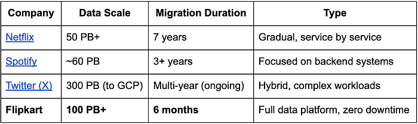
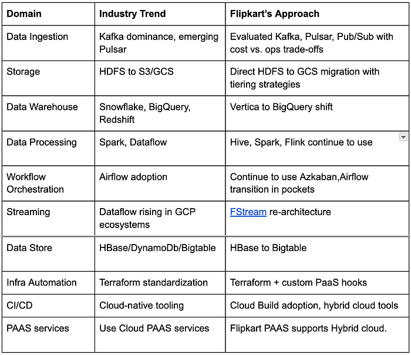
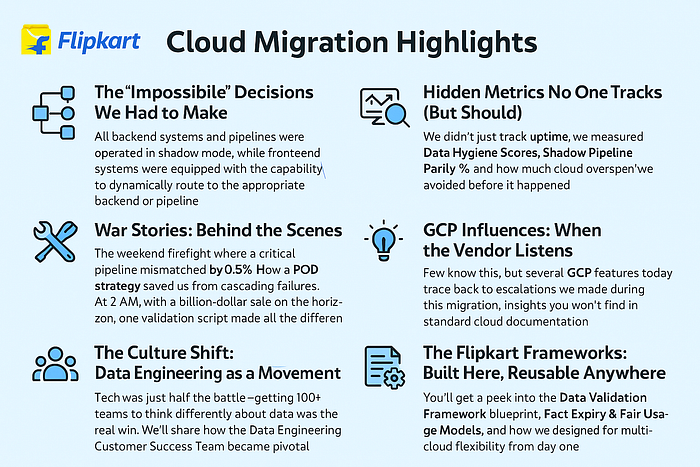

# Beyond the Data Horizon: Flipkart’s Race to Cloud at Unmatched Scale

_“Petabytes in motion, zero downtime, and a six-month ticking clock — what could possibly go wrong?”_

When Flipkart set out to migrate its colossal Flipkart Big Data platform (FDP) to Google Cloud Platform (GCP), it wasn’t just following an industry trend, it was redefining what’s possible.

When we began charting our migration journey, we turned to the industry to learn from the best. We asked — how did giants like Netflix, Spotify and Twitter approach cloud migration? What we found was a pattern of multi-year, phased transitions, often accepting trade-offs Flipkart couldn’t afford. Across the globe, tech giants have undertaken cloud migrations, but velocity and scale expectations kept Flipkart unique, though they are not apples to apples comparison:

Key achievements summarized:

- While companies like [Netflix](https://about.netflix.com/en/news/completing-the-netflix-cloud-migration), [Spotify](https://www.computerworld.com/article/1655983/how-spotify-migrated-everything-from-on-premise-to-google-cloud-platform.html) and [Twitter](https://cloud.google.com/blog/products/data-analytics/how-twitter-modernized-its-data-processing-with-google-cloud) moved to the cloud over several years, Flipkart took a bet to target migration in **just half a year**, all while keeping **10,000+ pipelines** alive and business-critical analytics uninterrupted.
- **Zero Downtime** — unlike many peers who accepted partial outages or degradation.
- **>99.5% Data Validation Accuracy** established after migration for tables, pipelines, reports**.**

## The Flipkart’s Expectation Reality

As we saw above on how the industry took the approach. Flipkart, however, faced specific pressures:

- India’s e-commerce market **real-time functional systems like search, ads, business analytics etc **are critical and cannot take any downtime or compromises.
- The scale involved **petabytes of active data** — not archival storage. Where data movement of data itself will take itself will take a few months.
- **Data mesh architecture** and strong dependency of pipelines made partial movement not an option.
- Flipkart has its own private cloud services, and all the applications and platforms have dependencies on other private cloud services, so migration strategy should take care of interoperability and long-term view **of hybrid cloud strategy**.
- **The deadline**? Set by business imperatives** like the Big Billion Days sale**. Which requires all platforms to be stable, scale and battle tested with no scope for error.

This wasn’t a textbook migration — it was a high-wire act without a safety net.

## Key Stats: Where Flipkart Stands w.r.t Scale

- Daily ingestion of avg ~300 TB per day to 1PB per day during BBD sale.
- 10s of 1000s of Data tables/Facts.
- 10s of 1000s of pipelines, both real time and batch.
- >100K daily reports and subscriptions.
- 10s of PB of data is daily read and processed.

## How the Planning Was Done

Planning wasn’t just about timelines and tools — it was about strategy, culture, and risk management:

- **One Month Dedicated to Design**: We invested heavily upfront, spending a full month purely on architecture, dependency mapping, and risk assessment.
- **Platform does heavy lifting:** All benchmarking, movement, correctness ensuring done by platform and avoiding changing the job/Pipeline logic, to reduce the number of variables.
- **Data Mesh Graphs**: Built internal data dependency graphs to visualize and de-risk interlinked datasets.
- **Shadow Pipelines**: Designed a validation-first approach with shadow pipelines to ensure parity before cutovers.
- **Validation Frameworks**: Written validation frameworks to compare, certify and promote.
- **POD-Based Execution**: Teams were split into focused PODs handling schema, processing, reporting, governance, and billing — ensuring accountability and speed.
- **Engineering Focussed Pods** were also created, that were responsible for design, alternatives identification, benchmarking, implementation, migration and certification.
- **Decision FAQs**: Every major decision was documented as an FAQ to streamline alignment across 100+ teams.
- **Cost Modeling Before Execution**: Implemented pre-migration cost simulations to avoid surprises.
- **Cultural Readiness**: Launched “FDP Setup Day” to onboard teams, align goals, and instill a data engineering mindset.

This wasn’t just planning, it was engineering a blueprint for controlled execution in an environment where failure wasn’t an option.

## Tech Choices: Industry Benchmarks vs. Flipkart Decisions

## Strategy

Considering the trade-off between reliance and the advantages of cloud, FDP prioritizes technology and service dependency in this sequence:

1. High value Flipkart PAAS services, which also have supported Hybrid cloud, as part of this migration.
2. Opensource compatible cloud services (like BigTable, Dataproc)
3. Cloud specific value-added services (like BQ, Pubsub) preferably with abstractions.

While many companies leaned on managed services to reduce complexity, Flipkart balanced **control vs. convenience**, ensuring flexibility for future hybrid models — a nuance often overlooked in typical migrations.

*Tech comparison and Flipkart Approach for Cloud Migration*

Here’s a quick summary of how our choices stacked up against popular industry trends:

- **Data Ingestion**: While Kafka continues to dominate, and Pulsar emerges in some ecosystems, we evaluated Kafka, Pulsar, and Pub/Sub — balancing feature richness with operational and cost implications.
- **Storage**: Instead of defaulting to S3 or GCS from HDFS, we designed a tiered GCS architecture that prioritized separation of compute and storage, aligned with access patterns.
- **Data Warehouse**: As many lean toward Snowflake or BigQuery, we made a direct jump from Vertica to BigQuery — optimizing for scalability and integration without introducing multiple tools.
- **Workflow Orchestration**: Airflow is the de facto industry choice, but our phased migration from Azkaban to Airflow gave us safety, parallelism, and control.
- **Streaming**: While GCP-native Dataflow gained adoption across the board, we re-architected FStream to run natively and more efficiently within the GCP environment.
- **Infrastructure Automation**: Terraform is the industry gold standard. We combined it with custom PaaS hooks for faster infra provisioning and reusability.
- **CI/CD**: Rather than reinvent, we adopted Cloud Build for its simplicity and integration — a shift from our custom pipeline tooling.

These choices reflect our strategy: don’t chase the trend — **chase fit, scalability, and control**.

## What You Didn’t Expect to Learn

## The “Impossible” Decisions We Had to Make

All backend systems and pipelines were operated in shadow mode, while frontend systems were equipped with the capability to dynamically route to the appropriate backend or pipeline. This strategy ensured uninterrupted service and zero downtime, maintaining transparency of the pipelines and readiness for seamless switching.

## Hidden Metrics No One Tracks (But should)

We didn’t just track uptime — we measured Data Hygiene Scores by validating against known golden datasets, monitored Shadow Pipeline Parity % by comparing daily metrics like record counts, sum deltas, and NULL density across pipelines, and proactively estimated potential cloud overspend using simulated billing dashboards during shadow runs. For example, one of our pricing ingestion pipelines showed a 7x cost spike in BigQuery slot usage during early dry runs triggering a redesign of the partition strategy before it ever hit production.

## War Stories: Behind the Scenes

The weekend firefight where a critical pipeline mismatched by 0.5%. How a POD strategy saved us from cascading failures. At 2 AM, with a billion-dollar sale on the horizon, one validation script made all the difference.

One weekend before Big Billion Days, a critical report showed a 0.5% mismatch between the legacy and shadow pipelines. With less than 48 hours before going live, the team traced the issue to a misconfigured decimal rounding function in the migrated batch job. The rollback was not an option. Instead, we built and validated a hotfix pipeline, promoted it, and backfilled over 30TB of data — all in 8 hours. Had we failed, hundreds of dashboards used for price planning would have gone blind.

Another night, a fire broke out in one of the ingestion pipelines due to timezone misalignment in logs. What made it worse? The offset table was reused between two unrelated consumers. Thanks to our POD structure and data validation harnesses, we isolated the scope, rebuilt just those partitions, and were back to green before morning.

In parallel, the POD responsible for reporting rapidly isolated dashboard-level discrepancies and worked with stakeholders to suppress potentially misleading reports until fixed data was in place. A single validation script helped trigger this entire escalation cascade and ultimately averted what could’ve led to incorrect pricing insights during one of Flipkart’s most critical events of the year.

## GCP Influences: When the Vendor Listens

Several capabilities in GCP’s platform were directly influenced by the escalations and collaborative feedback provided by Flipkart’s teams.

For instance, our early complaint around inconsistent latency in BigQuery query executions during backfill led to optimizations in slot allocation policies for streaming workloads. In another case, we highlighted the need for enhanced metrics in Pub/Sub Lite which led to a fast-tracked rollout of per-partition throughput visualizations.

The biggest of all: GCP had limitations around unified billing and quota management across org boundaries, a pain point for our multi-tenant FDP use case. Flipkart’s input directly shaped the roadmap for quota delegation APIs and per-folder billing drilldowns.

Few know this, but several GCP features today trace back to escalations we made during this migration — insights you won’t find in standard cloud documentation.

## The Culture Shift: Data Engineering as a Movement

Tech was just half the battle — getting 100+ teams to think differently about data was the real win. The turning point came when we launched the “Data Engineering Customer Success Team,” modeled after traditional customer support functions. They worked closely with internal product, reporting, and analytics teams to onboard them onto FDP, provided hands-on migration playbooks, and conducted weekly office hours to handle edge cases. This shifted data platform adoption from reactive escalation to a proactive enablement model. Within a quarter, 80% of incoming data issues were pre-empted through shared knowledge, curated onboarding paths, and friction dashboards.

## Cost — The Elephant in Every Cloud Room

We predicted our first cloud bill within 5% accuracy — can you? This wasn’t luck. We built dry-run simulators for job execution, pre-estimated BigQuery slot usage based on historical query logs, and modeled cloud egress based on expected data tiering and access patterns. For example, one campaign simulation revealed Looker dashboards were scanning entire partitions due to improper date filtering — this insight alone saved 18% on projected monthly analytics spend.

## The Flipkart Frameworks: Built Here, Reusable Anywhere

You’ll get a peek into the Data Validation Framework blueprint that supported automated diffing across legacy and GCP pipelines; the Fact Expiry & Fair Usage Models that reduced long-tail data bloat by 12%; and how we implemented execution guardrails for multi-cloud flexibility — like Spark, BigQuery, and Hive under a single execution plan, based on workload need and user persona.

These are the lessons rarely documented but crucial for anyone attempting a migration of this scale.

We will.

*Flipkart Playbook for Cloud Migration*

## What’s Coming Next in This Series

Here’s how we’ll decode this unprecedented journey — and how it compares to the industry’s best practices and pitfalls:

1. **Why Flipkart Rejected “Lift & Shift” When Everyone Else Embraced It  
**How strategic tech choices outperformed a conventional migration approach.
2. **Kafka, Pulsar, or Pub/Sub? How We Beat the Industry’s Ingestion Dilemmas  
**Deep dive into selecting the right ingestion engine for scale, cost, and flexibility.
3. **From Vertica to BigQuery: Lessons Migrators Should Know  
**Insights from rethinking analytical databases in a cloud-native world.
4. **The Untold Story of Cloud Bills: Predict, Control, Optimize  
**Managing and forecasting cloud costs before they spiral out of control.
5. **Scaling Teams, Not Just Systems: The Human Side of Cloud Moves  
**How we structured teams and culture to thrive during rapid transformation.
6. **Battle Scars & Best Practices: Flipkart’s Playbook for Future Migrations  
**Hard-earned lessons and reusable frameworks for your next big move.

## Why This Series is Different

Plenty of blogs narrate cloud journeys. Few:

- **Expose decision frameworks** with context-specific trade-offs.
- Offer **actionable insights** for those racing against both data gravity and business deadlines.

If you’re planning — or surviving — a big data migration, these aren’t just stories. They’re survival guides.

**Credit : Venkataramana Gollamudi (Principle Architect) and The Entire Flipkart Data Platform Team.**

**Next Up:** _“_Why Flipkart Rejected “Lift & Shift” When Everyone Else Embraced It_.”_
