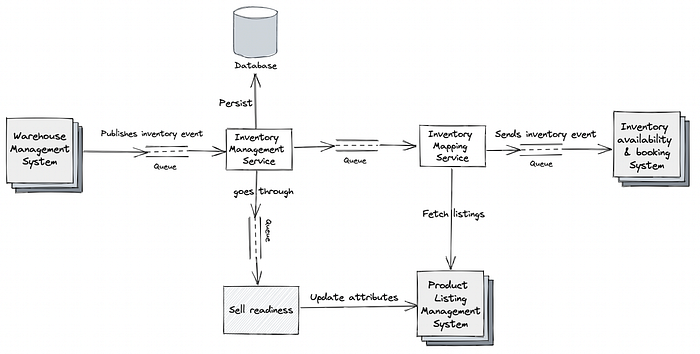
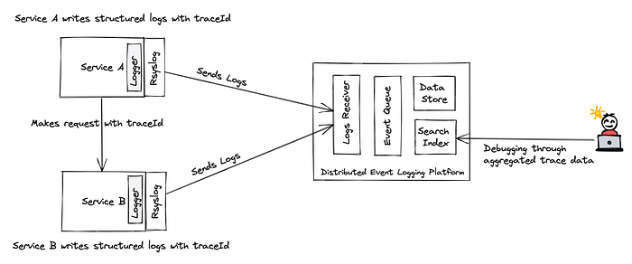
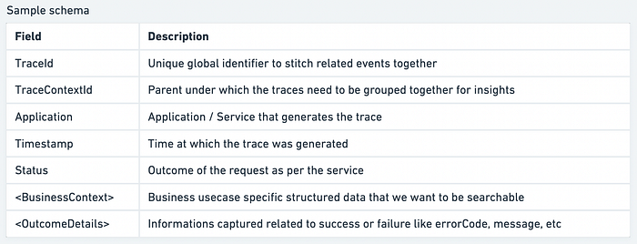
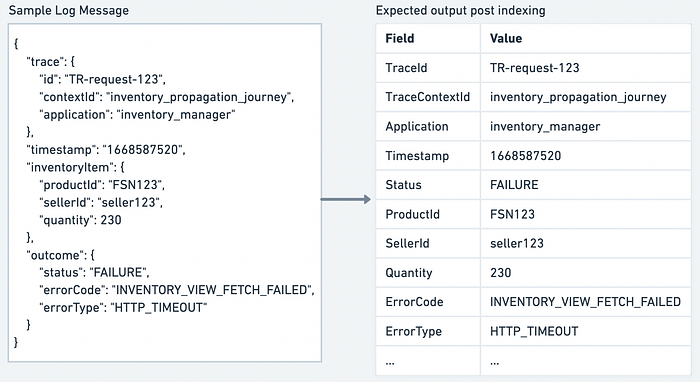
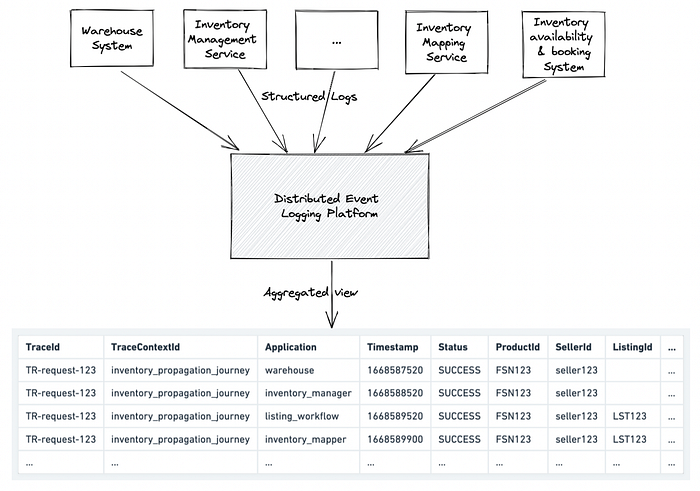

# Distributed Entity Tracing

Troubleshooting across microservices

## Introduction

At Flipkart, we deal with multiple systems, such as warehouse management systems, product listing systems, inventory management systems, inventory availability & booking system, etc. Each system is further composed of multiple microservices that use different technology stacks (programming language, communication protocols, databases, messaging queues, etc.) based on their need. Executing a request often involves multiple systems where several microservices interact with each other either synchronously or asynchronously to realize the flow. Having a microservice-based architecture ensures that the services are loosely coupled and so it is easier to build, test, deploy and maintain.

While microservices-based architecture has its advantages regarding its evolution, there are challenges associated with ensuring predictable SLAs and troubleshooting issues related to slowness or failures. To show, the inventory propagation journey spans across several systems like warehouse, retail, listing, and booking, involving multiple microservices, CDCs, scheduler systems, and messaging queues. This article captures the challenges that were present in monitoring and how we could troubleshoot the issues. We will take the inventory propagation journey as an example to explain the solution in detail.

## Inventory propagation journey

Warehouse operations team inwards products in the warehouse. This information is captured and published as an inventory event to the dependent systems. Our goal is to first make this inventory sell-ready and then send this event to the inventory availability and booking system so that it can be sold to customers on the Flipkart website. To achieve this, the inventory management service listens to the event, persists in it, and then triggers a pipeline to make the inventory sell-ready. This pipeline goes through multiple microservices to perform several selling checks and also updates relevant attributes in product listing systems. Once the inventory becomes sell-ready, we then retrieve the event, map it with selling constructs and then send the event to the inventory availability and booking system. This process is eventually consistent and so the inventory will be visible on the website.

*Inventory propagation journey*

Just like any other e-commerce business, we can have different inventories that are available for sale. Ingestion delays of hours would be fine for high shelf life products like books, mobiles, chairs, etc but it can be catastrophic for low shelf life products like fruits, vegetables, milk, etc., as they would become unfit for selling.

With Flipkart’s foray into a freshness-sensitive business like grocery, it is important to minimize the time lag between the product's inward time and its discovery time. Whenever this delay increases beyond the threshold, there are increased cancellations and unsellable inventories. Our goal was to root cause and address these delays.

## Challenges

When we set out to debug the inventory availability issue, the observability tools that each team had during debugging sessions were the metrics and logs for every microservice. This was useful to understand what was happening in each of the microservices, but they did not provide enough context to build the full picture across them. Logs of a request were scattered across several log files. So, debugging cases like why this event was sent with so much delay or which microservices contributed most to the overall latencies & errors took a huge amount of time considering the collaboration required across teams. Analyzing the overall system and finding such answers was hard because it was difficult to correlate and visualize the execution of requests right from the start (warehouse system) to the end (inventory availability & booking system).

## Requirements

Following were our key requirements to debug the inventory availability issue :

1. Start-to-end visibility in terms of overall latency  
- Delay points.  
- Identification of the cause of delay — performance or functional issue.
2. Start-to-end visibility in terms of overall request failures  
- Failure point.  
- Error rate, along with reasons.
3. Insights into how the system behaves for different inventory types  
- Percentage of requests completed within an interval for different inventory types.  
- Percentage of requests failing with an error for different inventory types.

## Solution Overview

At a high level, we wanted to come up with a way to correlate the requests so that we can build the overall picture. This way, we can aggregate them to answer questions related to how a request fared across the microservices.

We largely wanted to:

1. Answer queries related to latency and errors for different inventories
2. Minimize the application runtime overhead
3. Ensure that the solution worked seamlessly across different technology stacks with minimal changes

Distributed tracing is a well known concept in the industry and there are several libraries and technologies out there which provide this but they mostly work for sync calls. For a set of systems which are asynchronously wired, this problem becomes extremely complex. We have attempted to solve the same using Distributed Entity tracer.

**How about we do this?**

## Our Solution

We typically used the concepts of Distributed tracing for our functional entity tracing use case.

- Enabled the services to propagate a unique identifier into its interactions
- Added the identifier to the log messages
- Relied on a centralized log server to aggregate the logs
- Added indexing to build a view from which we could get useful insights and troubleshoot problems.

**Note: **This meant we had to use structured logs to define schemas and relevant indexes.

_Quick Summary of Distributed Tracing and Structured Logs_

Distributed tracing is the technique used to track user requests as they flow across different components in a distributed system. We enable an application to generate tracing data at the start and ensure that it is propagated across the call chain.

Trace data comprise a unique identifier that each application must add to the logs and also propagate in their interactions so that they can be correlated together. We call this unique global identifier "traceID."

Structured logging is the practice of defining a message format for application logs so that it is machine-readable and can be easily parsed.

## Our Implementation

**Generating and Propagating Trace context**

The process of distributed entity tracing starts when the system receives the request for the first time from the end user. It is the responsibility of that component to generate a traceID. In the above-mentioned inventory propagation journey, the warehouse system generates the traceID, which is then passed across all the calls in the call chain. The traceID is added as an HTTP header or as part of the request payload, depending on interactions such as API calls or messaging systems by the application.

**Adding structured logs with Trace context**

We ensure the logs added by the application include the tracking details. The logs need to have a predefined format and are structured (e.g. JSON) so that the indexing can be carried out later as per the schema. All the applications typically maintain a Request context that helps access the tracing details during the execution of the request. We then use the application logger to add a JSON message to the Syslog through a custom "Appender." However, you can also use a Syslog client or write the logs to a file.

Typical schema of the aggregated view:

*Sample schema for the log message*

Sample JSON log message with tracking details:

*Mapping log message to schema illustration*

**Sending logs to a centralized logging service**

The next step is to send relevant logs to a centralized logging service. This was done by integrating with[ RSyslog](https://www.rsyslog.com/) which allows you to do that through TCP or UDP. Having a centralized logging service ensures that all the logs are in one place.

**Aggregating and indexing structured logs**

The last step is to aggregate the logs and index them so that we can draw relevant insights. For this, we used an in-house distributed event logging platform (Distributed Entity Tracer), which is built over a centralized logging service. This platform parses the application logs and indexes them as per the defined schema to power relevant searches and thus enables you to:

1. Create a trace context in which multiple services can register to send structured logs.
2. Define a schema for the trace context.
3. Allow each service to define a mapping to map their structured logs with the schema.
4. Receive, Parse, Store, and index application logs under a trace context.
5. Enable the teams to perform queries on the aggregated trace.

With this platform, we could power queries like these :

1. Percentage of requests completed within an interval at different business pivots.
2. Percentage of requests failing with an error at different business pivots.
3. Check the latency and error at each of the components against a traceID.
4. Show the requests which were latent or have errors.
5. Show the requests which are breached and pending.

*Aggregating structured logs from multiple microservices*

**Why did we use the in-house platform over any open-source tracing solution?**

This is because we also wanted rich analytics over logs, and, considering that all the existing services were already integrated with the centralized logging service, it was also seamless to integrate each of the microservices.

**What about marginal tracing data losses across the pipeline?**

Since there are multiple services that handle a particular request, any loss in log messages over the pipeline can reduce visibility and may affect request-level debugging. Considering that our primary goal was to draw insights and enable the business to get start-to-end visibility in terms of latency and errors at different pivots, we were fine with the marginal data losses. There could be misses while debugging a particular request, but doing a trend analysis was workable with this approach.

## Conclusion

For monitoring, the approach that people mostly follow is using logs and metrics at the per-service level. While these work in most cases, they are not enough for distributed systems given their complexity. This approach of distributed entity tracing using structured logs helped us in improving the visibility across the pipeline.

Without this solution, it used to take weeks to narrow down the exact issue in the flow considering that we had to follow up with multiple teams but it can now be debugged just by executing a query in the aggregated view. We could not only do the trend analysis but also be able to debug and identify the problems at multiple places related to latency, errors, and message losses with little need for collaboration across teams.

In the future, we may also consider setting up alerts based on the indexed logs to make it proactive.

---
**Tags:** Microservices · Distributed Systems · Distributed Tracing · Structured Logging · Flipkart
