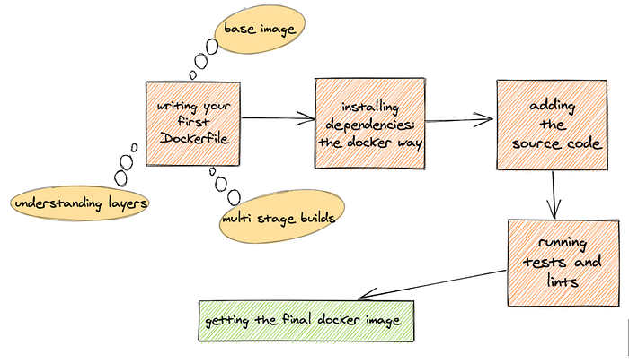
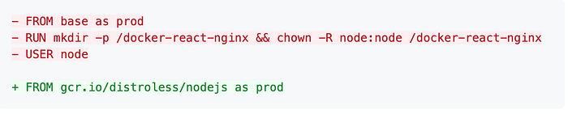
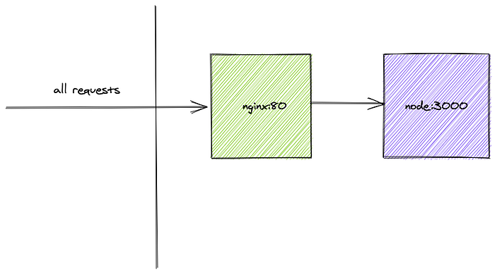

# Dockerized Frontend Applications in Flipkart

Let’s say you are working on the latest and greatest app of the year on a Mac, but your production servers run Linux. The app running on production servers may depend on the native libraries, which makes the output unpredictable. We need deterministic outputs in the deployments despite the different host/OS/Environments/Configurations and **Docker** makes this possible.

Docker is a way to package your app and run it. With Docker, you can:

- define and fix the execution environment of your app.
- decouple the app from the host machine.

## Why did we adopt Docker?

Debian, as an Operating System, has been working well for us with all its advantages, particularly the availability of many pre-installed packages, the enablement of simple transition between technologies, and the easy installation. Over time, as the systems grew, Debian proved challenging for our system environments in a few aspects related to deployments, library management, hardware, and processes.

### Challenges with Debian

- **Multiple scripts and distributed logic**: In Debian-based deployments, there are many places where we need to add code such as Control scripts, init.d scripts, instance creation scripts, postinst/prerm scripts to set up the permissions and context.
- **Need better isolation: **Debian uses shared libraries and since packages depend on them, any change in the libraries might break the application.
- **Hard ‘machine’ dependency: **As only a single instance of a Debian package can be installed in the machine, we faced space issues and could not scale up to the massive requirements of stage and pre-prod environments. Each team has at least 6–7 apps and 13–14 engineers. Dependency on machines for (stage/preprod/qa) dampens productivity.
- **Dependency on PM2 and Node process managers: **The single-threaded node requires a process manager for production applications. This is resource intensive and adds complexity to the code base.

Docker solved these challenges and many more!

- **Easy on-boarding of new members in the team: **Docker image was self-contained and there were no environment setup instructions.
- **Simplified our ‘build’ pipeline: **The Docker file was sufficient to build all the assets.
- **Easy traceability of dependencies: **Docker image has all the declarative definitions. There is no need to update and manage information like the same node version from local dev machines to Jenkins, and pre-prod/prod boxes.
- **Improved Reliability and Robustness of apps: **With Docker adoption, we have the advantage of using Kubernetes, the container orchestration system for containers. Kubernetes supports the cluster coordination at scale, which was not in erstwhile Debian deployments.

## Think Docker!


*dockerisation at a glance*

Everything starts with a `Dockerfile`. To start on a more practical note, I’ll package/dockerize a React Node app, but it could be anything {insert-your-fav-framework-please}. For this article, I’ve bootstrapped a react app using a create react app ([github snapshot](https://github.com/ankeetmaini/docker-react-nginx/tree/6a5d4e77d777fc23d2a772b23fcf56a85068c410)).

You’ll first need to know the answer to these questions before you start writing a Dockerfile:

_What is the os/flavor of your production environment?  
_Usually, it is Linux.

_What are the dependencies?  
_Since I’m running a node app, I’d want at least node installed on the Linux machine.

## Writing your first Dockerfile

Writing the Dockerfile involves the following steps:

1. Choosing the base image file
2. Defining the Working Directory
3. Installing Dependencies: The Docker Way
4. Adding the Source Code
5. Running Tests and Lints
6. Building your assets

### Choosing the base image file

Base image is the combination of the file system and parameters that help you define the environment and dependencies. The base images for most _(if not all)_ languages/engines/runtimes already exist on [Docker Hub](https://hub.docker.com/) by the official authors/companies/orgs.

Like the official [Node image here](https://hub.docker.com/_/node). You can choose from a variety of versions and flavors. I chose [Node v12 installed on a trimmed Debian OS](https://github.com/nodejs/docker-node/blob/9518f46153d0ab2a3ebb20bc24c28ee0c48af208/12/stretch-slim/Dockerfile).

This would be the very first line of the Dockerfile. Docker images are made of _layers_.

```
FROM node:12-stretch-slim
```

> Understanding layering_Every line in the Dockerfile becomes a layer that translates to an intermediate image. A docker image is made up of a number of these intermediate image layers.__Docker caches these image layers and speeds up the entire building process if the cache is not busted. Always ensure that you do not change the top lines/layers as Docker discards every layer from then on and rebuilds the image._

### Defining the Working Directory

Define the _working directory_ using the `WORKDIR` command. It creates a directory if it does not exist. It also sets the context of all commands run subsequently with the working directory as the base path.

Also, notice the `as` keyword which is the syntax to name a `multi-stage` build stage. You can now reference this step as `test` from another stage. (More on `multi-stage` builds later)

If you’re to peek inside the OS, you will see:

You can see a folder `docker-react-nginx` (7th item from the top) created automatically inside what looks like a Linux operating system. Fantastic!

### Installing Dependencies: The Docker Way

Of all the things in frontend development, one of the most time-consuming thing is: `(npm|yarn) install`

If you remember the layering concept I mentioned above, can be utilized to optimize this and do this only if dependencies really change.

The `package.json` is first copied before installing the dependencies as the docker image is empty and anything you want there has to be copied from the host machine or created there.

💁 Why not copy all the source files and package.json as well?

This could prove detrimental to the time it takes to build the image. Even for commits that don’t change the dependencies, the `npm i `step is not cached and gets executed every time.

Doing it separately caches it and Docker runs it only if the checksum of package.json or lock file changes.

💁 Note that the flag `--frozen-lockfile` considers the pinned versions and does not take the latest semver matching package as per `~|^` in the package.json.

### Adding the Source code

Use the following command to copy the source files.

`COPY . .`

### Running Tests and Lints

I only ran the unit tests but you can run many checks which you’d run on a PR like prettier checks, lint checks, ts checks, etc.

`RUN yarn test`

### Building your assets

When you build assets, use the ENV directive to set environment variables.

For example, NODE_ENV=production.

> **ENV vs ARG**These are the two types of parameters you can use in the whole docker lifecycle._- _**_ENV_**_ is defined inside the Dockerfile and can also be passed while running the docker image.  
> - _**_ARG_**_ can be defined in Dockerfile and passed in only at the time of building the image. It cannot be accessed when you run the built docker image._

### Cleaning ‘build’ in a multi-stage build step

At this stage, the image is almost ready to be run, but we can do better.

We can remove the node modules, source files, intermediate image layers and take only what we need for the final production deployment making the docker image super lean.

If you notice, I ran the server.js directly using the node. For high availability, you can count on spawning multiple Docker containers using the container orchestrator software such as docker swarm, or Kubernetes.

> **Understanding multi-stage docker builds**_Docker image size is of great importance and one should strive to get to the slimmest image possible. It directly improves the time to deploy and saves a lot of storage. In addition, the lesser the surface area of your image, the lesser are the chances of security loopholes.__Multi-stage docker helps in trimming the size of the docker image by giving you the option of removing extra layers in your image and keeping only the required.__Multi-stage lets you have multiple _`_FROM_`_ statements and the ability to copy stuff from one stage to another.The boundary of a stage extends from the start of a _`_FROM_`_ statement till another _`_FROM_`_ statement or till the end of the file.This way you can define different stages for static analysis like lint checks, tests, build and final image where you just copy the built assets.__In the absence of multi-stage docker builds, people used multiple Dockerfiles to achieve the same results. You can have one Dockerfile for both prod and dev._

## The Working Docker File

The Dockerfile at this point looks like this…

## Building an Improved Docker File

Let’s re-look at the working Dockerfile we have at the moment, for any necessary changes that we must do to improve performance and security of the docker image.

### Limit the user privileges

All the commands now are run with `root` user context. The **root** inside the docker container is not the same as **root** in the host machine, however, to limit the privileges, the node docker images ship with a user `node` which can be used for a non-root user.

Changing the Dockerfile to use this **user** instead of **root**. The commands need to be changed as follows:

- If directory is already created docker would just `cd` instead of `mkdir + cd` when it executes `WORKDIR`
- adding `USER` directive to enable the specific user's context for all subsequent `CMD`, `RUN` and `ENTRYPOINT` instructions

```
RUN mkdir -p /docker-react-nginx && chown -R node:node /docker-react-nginx
USER node
WORKDIR /docker-react-nginx
```

- use `node` user for copying files from host machine (if you notice I’ve added `--chown` directive to the existing `COPY` commands)

```
# node_modules install
COPY --chown=node:node package.json yarn.*lock ./

# source copy step
COPY --chown=node:node  . .
```

### Simplify base image in FROM statements

In the working Dockerfile, note that in both test and final multi-stage builds, the FROM statements start and define the base image as `node:12-stretch-slim`.

This repetitive usage can be avoided by using another empty stage at the top and then basing your stages from it.

```
FROM node:12-stretch-slim as base

# test stage
FROM base as test

# final stage
FROM base
```

## Improved Docker File

## Building the Image

To build the image from the above Dockerfile, from the root of the app type  
`docker build . -t docker-react` (output pasted below)

You can validate the layering concept here as each line is converted into a step and is cached in an intermediate container image.

Let’s take a look at the size of the image:

```
$ docker image ls | grep docker-react
docker-react latest 13999baf2bca 22 seconds ago 142MB
```

142 MB is the total size of the image on disk. I wonder what’s taking this space, is it my code?

Examining it using `docker history <image-tag>`

If you scroll towards the right and see the sizes of the intermediate layers making up the image you can see the app code’s contribution is just** 2.29 MB** and the rest is the size of the base image. This can be cut down by choosing a smaller base image like Alpine etc. (Note: we’ve already saved a lot by using mutl-stage builds and we don’t see the intermediate layers with `node_modules` etc in the final image)

There’s one more option using distroless images that only contain the language runtime and remove the entire OS. The CMD of this image just runs node.

Let’s give distroless a try.

I have removed mkdir statements as distroless images don’t have a shell and they only contain runtime in this case `node`.


*prod stage*

We check the image size again:

```
$ docker image ls | grep docker-react
docker-react  latest  863e5570cbc2  About a minute ago  83.5MB
```

83.5 MB. Woww! That’s almost ~60MB reduction.

The distroless image will run as `root` as the `USER` directive was removed. The distroless images ship with a non root user called `nonroot`. Also note the `--chown` directive used to copy assets.

We update the Dockerfile as below (displaying only the last stage, here)

## Shutting down containers

The containers are managed by a federation tool in the production environment. These tools like Kubernetes and Swarm perform rolling updates to the cluster.

Each container should be able to signal that it is shutting down so that new requests are not sent towards it. The container also has to wait till it fulfills the inflight requests and cleans up any used resources, otherwise it’ll lead to deadlock and paucity, such as maximum connections to a database.

During the entire lifecycle of a container, it receives various events from the kernel, out of which one of the most important is `SIGTERM`. This is the signal that gets sent when the federation tool or kernel wants to shutdown the container.

If you do `docker container stop <id>`, you send the same `SIGTERM` event to your container. This event means that the container is shutting down and this is the last chance to gracefully close resources/open connections for DB, or file descriptors etc., before the container gets killed abruptly with `SIGKILL`.

💁 If the container doesn’t shut down after `SIGTERM` automatically, then the parent kills it forcefully by sending `SIGKILL` after the grace period of 10 seconds. One way to handle this is using the http’s inbuilt functionality [server.close([callback])](https://nodejs.org/api/http.html#http_server_close_callback) which tells the server to stop accepting new connections and give the opportunity to other active containers to serve this request.

The above code listens for the `SIGTERM` event and closes the server for any new requests. Right now I am not handling the existing connection requests and just exiting the node process using process.exit. Please check out the official [Express page](https://expressjs.com/en/advanced/healthcheck-graceful-shutdown.html) for more detailed handling of inflight requests.

### SIGINT

You could go the extra mile and handle `SIGINT` too, this is sent when you try to close the program by hitting `Ctrl+C`. This also comes very handy when you’re running a local docker container and want to stop it by pressing `Ctrl+C`. If this is not handled and no external [tini](https://github.com/krallin/tini) added, the container won’t exit and you’ll have to do a `docker container stop <id>` by opening a different terminal, as the one running the container would be unresponsive as mentioned above.

```
process.on("SIGINT", () => {
 server.close(() => process.exit(0))
})
```

## Working with Docker during local development

The main highlight of docker is that it decouples the host environment from the final output of your app. Using docker just for producing production builds seems less than optimal. It defies the principle of keeping prod and dev setup as close as possible.

Let’s take a moment to revisit the steps to run an app locally:

- `yarn install` (if it’s the first time)
- `yarn start` or an equivalent command that starts the server and possibly watches the files

Some queries that crop up in Docker Usage:

- Docker image build and run are two separate steps; Can we combine them?
- Isn’t docker separate from the host and all its contents get destroyed once it’s stopped/removed?
- Isn’t it time consuming to copy entire assets inside docker, everytime I make a change in my source file?
- How do I preserve the changes on host? Do I copy back?
- How does my instellisense work?
- Can the docker build run in ‘watch’ mode?
- Is there a better way to pass all the envs and ports on the command line by hand?

Interestingly, all of the above can be solved by the following constructs in Docker:

- bind mounts
- docker-compose

### bind mounts

This is the standard way to bind a directory path from host machine to Docker container. This can be used to mount the entire source code folder into the container. This will make docker think all the files are inside it and all the edits happening will be propagated both ways.

You can edit files on your IDE and docker container gets the changes and vice-versa.

### docker-compose

This command is built-in with Docker Desktop. It makes building and running images locally easy. It uses a yaml configuration file to get all the arguments for the docker command. It acts as a proxy to actual docker commands and makes DX awesome.

The configuration file is named as `docker-compose.yml`

If you notice, I added a `target=dev` in the compose file above, which means the compose will only run the dev stage of multi-stage Dockerfile.

So revising the above steps needed for local dev setup, step (2) of yarn start is taken care of by specifying it as CMD in the dev target.

It makes adding bind-mounts, passing environment variables so easy which if you’re to pass by hand directly to docker gets long and cumbersome. I also added the `delegated` keyword at the end of the volume name, and it’s for pure performance.

On MacOS if there are a lot of files written on the container by a bundler process then there has to be extra work done to replicate the same changes on the host machine. This can slow the process down drastically. `delegated` flag relaxes how the changes are propagated, by doing them lazily.

As a side note, the only changes that should be replicated to host should be the source code changes you make while the docker process is running. If you’re using a bundler (like Webpack) that’s writing files to the disk instead of serving the assets in-memory, then you should make sure that the location where files are written isn’t bind mounted. As those files need not be in the host machine and will only slow the watch/build process further.

(a sample of directly specifying arguments to docker container run)

```
docker container run -d \
  -it \
  --name devtest \
  --mount type=bind,source="$(pwd)"/target,target=/app \
  -p 3000:3000 nginx:latest
```

but with `docker-compose` all you've to do is

```
docker-compose up --build
```

For the first run, the above command will fail as there would be no `node_modules`.

To fix this you’ve to install the dependencies manually as you do even now.

The only difference is instead of doing `yarn install` from the host machine you must get inside the docker container and do it. This is because dependencies also depend on native libraries. So dependencies downloaded for mac might not work for linux. Always be mindful of this small fact.

`docker-compose` makes sshing into the container super easy. The below command sshes into the container named app in the `docker-compose.yml`, which is an alias for the node container. You can use the same command to go inside any container by specifying the service name.

```
docker-compose run app /bin/bash
root@96524f974891:/docker-react-nginx# yarn install
```

The finished docker files and docker-compose are [here](https://github.com/ankeetmaini/docker-react-nginx)

## Adding a Reverse Proxy

If you have a setup which requires a reverse proxy to be set up, maybe to serve static assets or reroute api calls to different servers, it’s easy to add one using the same setup. `docker-compose` really shines when you need to run multiple containers as one atomic unit.

For this example, I’m using the following setup to create a two container cluster where all the requests would come to nginx and it’ll forward them to the node server. I also want to keep my node server inaccessible from the internet.



Adding a new folder (`nginx`)in the repo with nginx config.

```
server {
    listen 80;
    location / {
        proxy_pass http://app:3000;
    }
}
```

A super simple nginx config which listens on port 80 and proxies everything to `app:3000` which is the node server. See how convenient it is to connect to other containers using docker-compose by DNS name which is the same as the service name defined in `docker-compose.yml`? In absence of this feature, it would have been difficult to connect if we had to depend on actual IP addresses that are assigned after the container is started.

### Dockerfile to build nginx image

```
FROM nginx:1.17.10
COPY default.conf /etc/nginx/conf.d/
```

Adding the entry in `docker-compose.yml`

I want to expose the port `80` to the outside world to access it and hence the entry in ports key above. It translates to `{port in the outside world}:{port inside docker}`. This is not present in the app service as I want to keep the container accessible only within the docker network. Also, note adding `EXPOSE <port number>` directive either inside Dockerfile or compose file will not expose the port. It just serves as a documentation guide for devs. `ports` is the only thing which exposes.

`docker-compose up --build`

You should now be able to access the react app at [localhost](http://localhost/) which is the nginx port. You cannot access the node server directly at port=3000.

### .dockerignore

Lastly, please use `.dockerignore` to keep things getting copied to docker container like node_modules etc. This file can just be an exact replica of `.gitignore`.

## The Code

All the code used here is present in this repository [docker-react-nginx](https://github.com/ankeetmaini/docker-react-nginx)

---
**Tags:** Docker · Frontend · Node · Nginx
