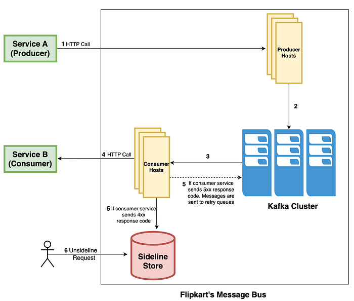
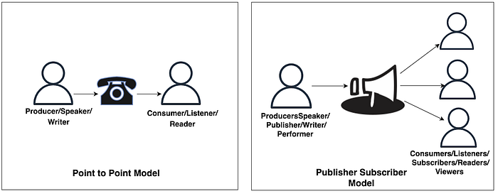
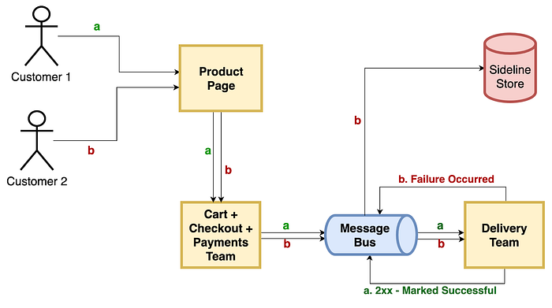
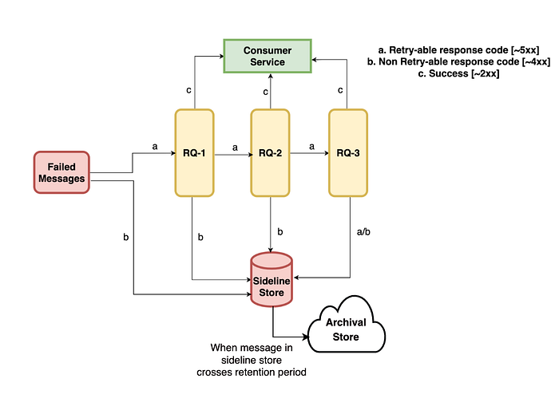

# Effective Failure Handling in Flipkart’s Message Bus

## Introduction

_“Communication—the human connection—is the key to personal and career success.” — Paul J. Meyer_

We all know the importance of communication in our lives and the role played by effective communication in decision-making, coordination, and all other daily activities.   
Similar to humans, communication is a key requirement in a microservices-based ecosystem.

## Need for a message bus

Communication between micro-services is possible via gRPC, RESTful APIs, and a message bus.   
Though direct communication between micro-services via RESTful APIs sounds like an easier solution, it comes along with multiple challenges like disparate processing capabilities, tight coupling, handling horizontal scaling, the possibility of network disconnects, failures from the destination service, and service discovery. Some of these problems can be solved using the message bus.

## What is a message bus?

A message bus is a publisher-subscriber pattern-based communication solution that allows consumer services to subscribe and producer services to produce messages of certain types. The bus then acts as a connector between these producers and consumers.

It provides loose coupling between the services, i.e., there is no direct line of contact between two micro-services. Instead, the message bus takes care of transporting these events between the services.

Even if a consumer micro-service is down or disconnected, the message bus will receive events from the producer micro-service, and we are free of data persistence worries.

The message bus also adds a buffer for events to handle peak loads. It smooths out the intermittent heavy loads that can cause the service to fail or the task to time out. The use of a message bus helps to minimize the impact of peaks in demand in terms of the availability and responsiveness of the service.

## Flipkart’s Message Bus

Many services at Flipkart use an internally developed message bus implementation which provides the features of the message bus like Kafka while also providing easier and faster integration via REST endpoints.

Let’s look at an example illustration of how two services can communicate via message bus:

### How do two services communicate using Flipkart’s message bus?

Using Flipkart’s message bus, the producer and consumer services can keep on using the REST interface for communication without the worry of using Kafka and implementing their own consumers. The platform sends the message to the Kafka cluster and polls it for messages. Here is the explanation of the message flow:

1. The producer service sends a message using an HTTP post request to the producer ELB endpoint.
2. After receiving the message, the producer host sends the message to the Kafka cluster.
3. Consumer fetches the message from the Kafka cluster and tries delivering it to the destination service (Service B).
4. If the application gives a successful response (response codes ~ 2xx) then the message is marked as ‘consumed’.
5. If the application gives an error response (!= 2xx)  
- If the response code is 5xx, then the message is sent to a retry queue.  
- Else it is sent to the sideline queue.
6. An un-sideline request helps consume messages from sideline stores.

### Features of Flipkart’s message bus

- **[Easy Pluggability] **It provides a REST interface using which the pre-existing direct communications can directly be onboarded to the messaging bus, making it easy to plug and play.  
-The producer service doesn’t have to worry about using a Kafka client; they can simply send messages to the message bus using the API endpoint.  
-Similarly, consumer services don’t have to write their own Kafka consumer. We poll the message from the Kafka cluster and push it to consumer service by calling their endpoints. Ultimately, we provide the feel of direct communication only.
- **[Failure handling]** It provides failure handling as a platform feature.  
-Users don’t have to go through the hassle of implementing their own dead letter queues. With every subscription, by default, we provide retries on failure and eventual sidelining to a different queue.
- **[At least once delivery] **Similar to Kafka, it also provides the guarantee of at-least-once message delivery.
- **[Key level consumption]  
- **The platform ensures the ordered delivery of messages with the same message key even in case of delivery failures.  
- The parallelism with which we can deliver a message is independent of the underlying Kafka partition count.

It supports both P2P (point-to-point) and Publish-Subscribe messaging models.

- A P2P model is used when a producer wants to send a message to a particular service.
- A Publish-Subscribe model is used when the same message needs to be sent to multiple micro-services.

## Why is failure management a must?

Failure to deliver messages to the consumption endpoint is bound to happen for various reasons, such as:

- endpoint temporarily unavailable
- bad request
- data issues
- incorrect service endpoint
- authentication issues

The queue may become clogged up with these messages that can’t be processed, but they do not get drained away. Even when a message is not consumed successfully, it should not block the queue, and other subsequent messages should still be sent to the consumer. Failures should be managed well enough to prevent the blocking of message consumption flow.

Linear consumption in Kafka requires that whenever a message fails and blocks all the subsequent messages, a different channel is available to park these failed messages. This ensures that the main consumption of other messages continues as usual.

Another reason failure management is important is the value of data and the amount of business impact an unsuccessful message delivery can cause. For example -

Suppose two customers land on the product page of Flipkart. Let’s see what a successful and failed flow will look like:

1. Customer 1 [Success]: Let’s assume Customer 1 chooses a product from the products page and adds the product to the cart, completes the checkout process, and payment successfully. After a successful payment, the payment team finally sends an event to the delivery team for further processing of the product. This is how a product life cycle is completed and a product is successfully delivered to the customer.
2. Customer 2 [Failure]: In a similar flow, Customer 2 places an order and completes payment, but this time the delivery team cannot consume the message from the payments team.

**_What happens now?_**

If there is no failure management, the payment information does not reach the delivery team, and they cannot further process the product sale. This causes a loss of message or leads to data inconsistencies. In this example, even after successful payment, the customer cannot get the product. Therefore, failure management is a necessity. With effective failure management, the message from the payment team will not be lost.

We can apply a retrying strategy that pushes the message to the consumer for eventual consistency or abandon the message and push it to the dead-letter queue.

While failures are inevitable, error handling is crucial for building reliable and resilient services.

## How does Flipkart’s message bus handle a failed message?

As service providers, we understand the importance of data and the negative business repercussions of the unsuccessful delivery of every message.

Let’s discuss how Flipkart’s message bus handles failures in delivering a message to the consumer’s endpoint.

We centrally provide a failure path with retries and sideline stores to handle failed messages separately. There is also a user-friendly way to consume the failed messages present in the sideline store.

Whenever a consumer service fails to process a message and sends a response code !2xx, we take action based on the response code received from the consumer service. A message can fail either with a retry-able error response code [5xx] or with a non-retry-able error response code [4xx].

The status of any message helps us find out our next step when we deal with failure cases. The following diagram attempts to summarize the journey of a failed message.

### Retry Queues

- Retry queues are the secondary Kafka topics that receive the messages that consumer service failed to process because of certain errors. A message is pushed to a retry queue when it fails with a retriable error code [5xx].
- We provide a retry mechanism in which we do 3 retries at intervals of 1 min, 5 min, and 15 min by default. These retry intervals are configurable according to the user’s need.
- Whenever a message fails with a retry-able error code the message is delivered to RQ-1.
- After one minute, we retry to deliver the message from RQ-1; If the response code received is 2xx, then the message is marked as ‘consumed’, else, the message is sent to RQ-2 or sideline queue based on the response code.
- If the message is present in RQ-2, after 5 minutes we retry to deliver the message from RQ-2 to the destination service and take actions (to RQ3 or sideline queue) based on the response code.
- If the message lands in the RQ-3, we retry to deliver the message after 15 minutes. If the message is not consumed successfully, then the message is sent to the sideline store.

### Sideline Store

- A sideline store allows us to set aside and isolate messages that can’t be processed correctly even after multiple retries or messages which failed because of non-retriable errors.
- Messages will remain in the sideline store till the user explicitly marks them ready to consume using un-sideline APIs. We expect our clients to consume those messages when the failed messages are ready to be consumed again.
- The presence of the sideline store helps consumer service from preventing message loss because of any unprecedented issue at their end and provides them sufficient time to determine why the processing didn’t succeed and to fix their service.
- Sideline stores help users to do selective consumption of the messages and allow them to inspect and potentially process any messages which the consumer service could not handle earlier.

### Sideline Store Archival

- We provide our users with a configurable retention period for the messages present in the sideline store with a maximum limit on the retention period.
- Once this retention period is crossed, the expired messages are deleted from the sideline store.
- If users want to keep failed messages after the retention period, they can opt for an archival policy.
- If sideline store archival is enabled, we take a dump of those messages and upload that dump to the cloud, and then we permanently delete those messages from the sideline store. Users can use this dump to analyze the payload of their failed messages. Also, they can un-archive the messages and consume them manually.

## Conclusion

The message bus enables us to write complex systems, and in those complex systems, failures are unavoidable.

Proper handling of failed messages:

- Provides a standard experience to both the producer and consumer services.
- Helps in preventing loss of valuable business data.
- Ensures continuation of the main produce/consume flow in the event of failures, too.
- Provides sufficient time for the teams to inspect the failed messages, fix services, and even allows reprocessing of the failed messages whenever the consumer service is ready.

Our efforts towards continuously improving the efficiency of failure management in Flipkart’s message queues have helped us see a constant improvement in the metrics.

---
**Tags:** Flipkart Message Bus · Failure Handling · Sideline Queues · Retry Queues · Sideline Store Archival
