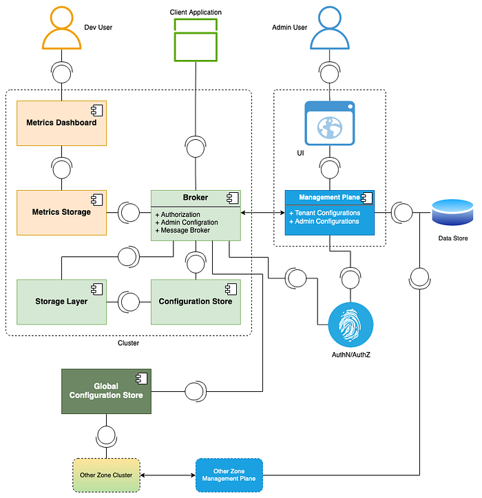
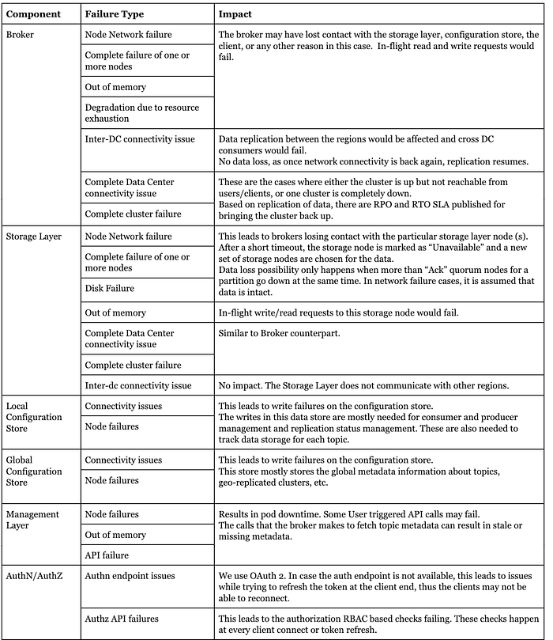
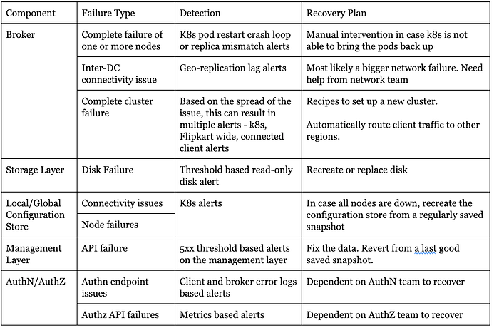

# Failure Resiliency and High Availability in Flipkart Messaging Platform

## Flipkart Messaging Platform

Earlier, we wrote about [a relaying platform](https://blog.flipkart.tech/how-do-we-relay-messages-at-a-high-throughout-between-microservices-part-1-9ff304224b37) and a [messaging bus](./effective-failure-handling-in-flipkarts-message-bus-436c36be76cc.md) on Flipkart. This article covers the underlying messaging platform used across Flipkart to power these platforms. It also explains the challenges of maintaining high availability and business continuity. We then talk about the approaches and systemic techniques used inside Flipkart to overcome these challenges.

## Context

Being a messaging platform, we serve a variety of business use cases like Data platforms, micro-service relayers, Chat platforms, and Recommendation engines, to name a few. To fulfill these, the messaging platform provides the following salient features:

- **Topic as a Service: **Topics for the Users, as a self-serve messaging platform
- **Multi-tenancy: **Multiple levels of hierarchy, allowing teams to manage their topics effectively
- **Quality Of Service: **Presence of both soft and hard isolation in the platform
- **Data durability and latency SLAs: **Suitable options for durability and latency SLAs pertaining to the use case
- **Geo-replication: **Multiple regions for BCP/DR and replication needs of the user
- **Security **— Authentication and Authorization with the self-serve capability to manage the roles and access for all topics
- **High Availability: **99.95% uptime and availability to users, ensuring no data loss in ‘failure to produce’ scenarios.

Here, we focus on the “High availability” feature of the platform and attempt to dissect the various layers that keep the platform “up and running”.

## Uptime vs Availability in a messaging platform

We must first understand the difference between uptime and availability, to know what makes a “Highly Available” platform.

**Uptime**: A simple measure of the duration for which the system was “up and running”.

**Availability**: The Probability that the system is “up and functioning” as intended when required. Availability also considers planned and unplanned maintenance.

Examples:

- A topic in the messaging platform is up throughout the day, but due to degradation in the underlying hardware, the writes to the topic may breach the latency SLA guaranteed by the platform.
- A topic is unable to sustain the configured number of consumers, while producers are working just fine.

## Why do we need a highly available Messaging System?

We can define “High Availability” as the ability of the system to remain available for a very high percentage of time.

The Flipkart Messaging Platform serves a wide variety of use cases. Any disruption to the platform can cause one or more of the following costly business impacts:

- Delays in processing user input, such as order status updates.
- Wrong or stale user recommendations due to issues in the recommendation pipeline.
- Hindrance in Customer support experience because of delayed or missing messages

Thus, it is important for the Flipkart messaging platform to ensure business continuity. Currently, it operates at an SLA of 99.95% availability.

## How do we achieve High Availability?

There is no single rule of thumb to achieve high availability in a software system.

Here are the three principles we follow to achieve high availability:

- **Single Point of Failure: **A single point of failure (SPOF) inside a software system is a ‘component’ that leads to partial or complete downtime of the system upon its failure. It is critical that we understand the various SPOFs in the system through a SPOF analysis.
- **Reliable failover: **The ability to switch automatically and seamlessly to a reliable backup system when any system fails. The system should ensure that there are redundancies built at all points of contact, be it data redundancy, connectivity redundancy, etc., to ensure a lesser or no negative impact of the failure on the users.
- **Failure detection: **The system should automatically detect failure and failing components, handle failures, and prevent multiple component failures.

Using the above principles, we can use the following techniques to implement High Availability in the system:

- **HA in the design: **Thinking about the core high availability principles in the design from the beginning
- **Automatic load balancing: **Distributing the traffic and data across the hardware automatically
- **Geographic redundancy: **Replicating your setup in more than one physical location
- **Data and configuration redundancy: **Maintaining multiple copies of your data and configuration for higher resiliency
- **Automatic failovers: **Building recipes and automation to divert traffic and data to standby paths if the main path fails

Let’s talk about how the Flipkart Messaging Platform handles some of these principles and implements these techniques. We will go through the architecture of the platform, the tech choices involved, and the various techniques used to make the system resilient to failures.

### Brief Architecture Overview

Let’s quickly look at the high-level architecture of the messaging platform on Flipkart. This overview will help us understand the single points of failure and the scope of the failure.

There are three major component groups in the system:

**The main messaging cluster **contains core components to support the messaging features such as Produce, Consume, Admin operations, Observability, and Metrics.  
As shown in the diagram, this cluster is duplicated in all other regions that the platform serves. This comprises the following components:

- Broker: A stateless component that manages the topics and interfaces for the producer and consumer clients, redirects the ‘Produce’ and ‘Consume’ calls to the Storage layer, and handles geo-replication of data
- Storage Layer: Stores the data, maintains its life cycle and handles local data replication
- Configuration Store: Stores all metadata about topics, consumers, brokers, and the storage layer.

**The management layer**:

- Contains the Self-serve user interface and the management API plane.
- Stores configurations at a layer above what the configuration store holds, i.e., billing, capacity information, mapping tenants to business teams, etc.

**Global Configuration Store:**

- Stores the messaging metadata, such as geo-replication data and global tenancy details, spanning across the clusters

### Tech Choices

After an extensive case study and multiple review discussions, we settled on the following tech choices for the messaging platform:

- **Deployment strategy: **All components are cloud-native and work on the Kubernetes runtime.
- **Main messaging cluster:** This is the core of the platform. We are using the **Apache Pulsar** platform, which comes with its own brokers, Apache Bookkeeper, Apache Zookeeper, Prometheus, and Grafana, as part of the deployment package. Read more on Flipkart's success story about Pulsar [here](https://streamnative.io/success-stories/flipkart).
- **The management layer: **This is an in-house self-serve tool developed on top of Apache Pulsar’s metadata which stores additional metadata about auditing, capacity constructs, billing constructs, hardware management, etc.

### Principles

**Single Points of Failures (SPOF) Analysis**

We now dive deep into the SPOF analysis based on the architecture.

Based on this analysis, we can summarize a few challenges in the system:

- Node degradation and failures: There are common patterns for each sub-component: A degradation, then a single node failure, followed by multiple node failures, have an escalating impact on the system.
- Network connectivity: There are various critical connections that, when affected, lead to a loss in the update of metadata or, in the worst case, the inability to produce or consume data.
- Regional disaster: A complete region can go down for external and physical reasons. This may affect either the complete data center or a big part of it based on the physical redundancies at the hardware layer.
- Dependent services failure: This is a separate case from node degradation or network connectivity failure, as you do not control this system. The interactions with these systems are through network-based APIs.

**Failure detection and recovery plan**

The next step of a SPOF analysis is to ensure that each row has relevant failure detection and a plan of action for recovery. Let us go through some of the highlights from the above SPOF table and add in the detection and recovery plan columns:

Most of the failures require manual recovery. For highly available systems, we cannot let these failures cause partial or full downtimes while we wait for someone to fix them.

This is where resiliency and reliable failover come into play. While the core issue is being resolved manually, we should ensure we have enough resiliency to sustain the system and keep it available. Let’s look at how Flipkart Messaging System achieves this.

**Resiliency and Reliable failover in the system**

Let’s look at the resiliencies that we have built across various components, considering the underlying tech stack, system configurations, and additional system checks.

**Broker**

- **Stateless: **Being a stateless component, Kubernetes automatically handles node-level failures.
- **Automatic load balancing: **If one or more broker pods are down, the traffic hosted by those nodes is automatically distributed to the remaining brokers.
- **Topic data rollover: **If more than one storage node is down or brokers cannot connect to it, leading to a replica count quorum breach, brokers can automatically roll over the topic data onto a new set of storage nodes in order to avoid write downtime.

**Storage Layer**

- **Rack-aware placement: **The storage pods are divided into more than 1 physical machine node called a rack. These racks generally have different networks and power sources to ensure failure in one rack due to external forces isn’t carried over to other racks.
- **Replication: **The core resiliency in the storage layer is achieved by having more than one replica of each message present across multiple storage nodes. We also ensure that each replica of the message is on a different rack.
- **Auto recovery: **In case a storage node is down, the system can automatically copy the data to other nodes to maintain the replica count.

**Configuration Layer**

- **Replication: **We maintain data replicas to ensure one or two node failures do not affect read and write.
- **Auto-reconnect:** The brokers and storage nodes that connect to configuration nodes have a logic to reconnect to other nodes if connections fail.

**External Service dependencies**

As we do not manage these services, we can only introduce resilience on the client side. The service you depend on may have lower availability guarantees than your system. In such cases, it is important to build resilience in the clients.

These are some techniques we have used in the Broker component to handle failures at the external services, i.e., AuthN, AuthZ, and management layer:

- **Caching: **Assuming that the metadata does not change that often, we store all the metadata in a TTL-based cache that is backed by the actual external services.
- **Retries: **In case of failures, we have the logic to retry after a while to fetch updated values.
- **Bypass with defaults **— For metadata involving new topics, the cache would not help. Here, if the external service is also down, then we fall back to a default value or even bypass checks like authorization temporarily.

**Client-side resiliency**

The client library also plays an important role in maintaining high availability of the system.

- **Auto retries: **In case of a ‘Write’ failure, the client code has the logic to retry the messages. The retries happen at an exponentially increasing interval to relieve additional stress on a restarting broker.
- **Back pressure** **queues: **In the case of ‘Write’ failures, or when the underlying application produces more than what the platform can handle, there are in-memory queues that help slow down the production rate without losing data.
- **Auto cluster failover** — In case of complete cluster failure or network connectivity issues that hinder the ability of the client to produce or consume messages, the client has the logic to automatically switch to a secondary cluster.  
A health-check thread in the client keeps checking for cluster liveliness and switches over to a secondary cluster in case of liveliness failure. The geo-replication** **helps in a seamless movement of message ‘produce and consume’ flows and offsets over to a cross-region cluster.

## Conclusion

We now understand what high availability means and what key principles are used to ensure high availability in systems, Failure analysis, Failure detection, and resilience.

We also went through the architecture of Flipkart’s Messaging Platform and looked at the various resiliencies and failovers:

- Data replication, isolation, and auto recovery.
- Client retries and automatic load balancing
- Automatic cluster failover
- Caching and bypassing external dependencies

With these resiliencies in place, we achieved 99.95% high availability guarantees.

---
**Tags:** Flipkart Messaging · Messaging Platform · Failure Resiliency · High Availability
