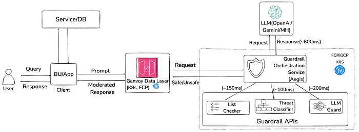
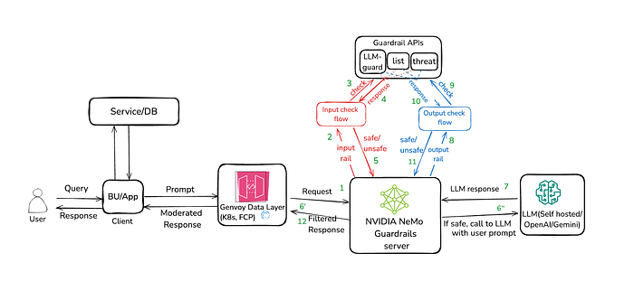
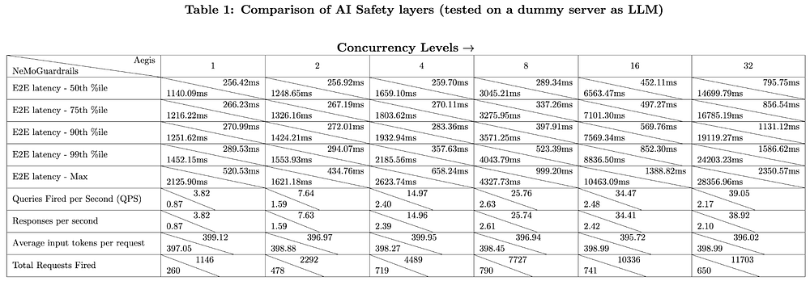

# Flipkart Enhances AI Safety in E-Commerce: Implementing NVIDIA NeMo Guardrails

Authors — [Jagetiaaaryan](https://medium.com/u/91180898af33?source=post_page---user_mention--cb2f293b29c0---------------------------------------), [Shridhar Gupta](https://medium.com/u/53fa895bcd4b?source=post_page---user_mention--cb2f293b29c0---------------------------------------), FMT /ML Platform Team, [Avinash Chakravarthi](https://medium.com/u/66707e8a04cc?source=post_page---user_mention--cb2f293b29c0---------------------------------------)

## Introduction

With AI and, in particular GenAI gaining momentum over the last 18 months, at Flipkart, we are exploring new LLM technologies to enhance our customer experience. As e-commerce has developed over decades to have multiple connect-points with customers, sellers and other stakeholders, we understand the paramount need to ensure our customer interactions are safe, responsible, ethical, and compliant with Responsible AI guidelines.

Towards this mission, we have implemented ‘Aegis’, an in-house AI safety layer to safeguard production LLMs from unwarranted safety attacks and bad responses. Aegis is an orchestration layer which triggers three guardrails at the input of the LLM. Currently, it focuses on input moderation. It is invoked parallelly with the primary LLM call to determine whether a prompt is safe before responding to the user. As an immediate step, Aegis is being extended to support output moderation.

We have been exploring many open-source tools to make our AI safety systems more robust and easy to manage, deploy, and configure especially for chat use cases. NVIDIA NeMo Guardrails is one such open-source toolkit that allows adding programmable guardrails to LLM-based conversational applications. It also offers a robust framework for managing and controlling the behavior of language models.

This article explains our effort in integrating NeMo Guardrails to enhance the AI Safety for Flipkart’s AI-enabled customer experiences and evaluate the same with the existing setup, Aegis.

## Focus of our AI Safety layer

The safe deployment of LLMs extends to managing the following potential challenges and considerations:

1. **Topic irrelevance and compromised AI capabilities: **LLMs fine-tuned for e-commerce must avoid issues like engaging in religious, social, and political discussions or deviating from brand-relevant topics in e-commerce bots. In addition, they have to stay away from standard AI safety concerns such as toxicity, illicit behavior, prompt injection, role-play, and impersonation.
2. **Misleading content generation and legal issues: **User queries to the LLMs need to be appropriate to the context and within the bot’s capabilities. The output also needs to be aligned with Flipkart’s organizational values and customer experience standards. We cannot risk the possibility of displaying misleading, inappropriate, or incorrect content that can negate the customer experience or cause legal battles.
3. **Integration and future readiness: **We need a system that integrates seamlessly with our custom LLMs that have distinct input and output payload structures and headers. It should also support definitions and implementations of custom actions and guardrails, given the diversity of the LLMs in our space. As we continue to scale our AI capabilities, we’ll also need a solution that is futuristic in design.

## Our Analysis

At Flipkart, AI Safety is jointly owned by the ML Platform Engineering, Data Science, Legal, Data Privacy, Application Security, and Product teams. Out of the many safety constructs applied across the teams, the run-time guardrail service powered by Aegis filters any possible harmful content from the input query before it reaches the LLMs. However, we also need to ensure that the outputs are appropriate and the LLMs are safe from potential attacks.

In addition, from a platform point of view, all commercial and open-source fine-tuned LLMs in Flipkart are accessible via a central AI gateway (project name: ‘Genvoy’). This gateway provides features such as rate limiting and multi-tenancy, and supports integration with run-time safety services. Ensuring smooth integration through Genvoy is vital for efficient management of LLM interactions.

We are also looking at a solution that has the ability to:

- Integrate new models
- Switch to simple classifiers for minor safety verifications
- Use vulnerability-specific LLMs to reduce latency
- Define guardrails to suit our needs
- Implement complex workflows

We require advanced customization and control over LLM context and dialog flow to effectively address our requirements.

## Integrating NeMo Guardrails to Address Our Challenges

NVIDIA NeMo Guardrails offers customizable flows, actions, a specialized rail system, support to register custom classes, and the flexibility to define workflows based on different use cases.

NeMo Guardrails support our needs in several ways:

1. **Seamless Integration:** NeMo Guardrails integrates with existing conversational systems seamlessly. It allows us to add programmable guardrails without extensive modifications. This is useful for Flipkart systems, where we use few fine-tuned LLMs across various use cases and the data scientists can customize and enable AI safety with minimal effort.
2. **Comprehensive Protection and Orchestration:** NeMo Guardrails provides robust mechanisms to protect against LLM vulnerabilities such as jailbreaks and prompt injections. They help ensure secure and reliable conversations. NeMo acts as an orchestration layer, similar to our in-house system, Aegis, coordinating various components of the conversational system.
3. **NeMo Guardrails Advanced Rail System Includes:**

- **General Instructions:** Guides the overall AI responses within specific use cases, such as shopping assistants.
- **Dialog Rails:** Limits conversation topics to relevant areas.
- **Moderation Rails:** Filters input/output and checks facts to ensure compliance with community guidelines.
- **Flexible Moderation Levels:** Adjusts moderation levels as needed for different scenarios.
- **Specific Rail Configurations:** Customizes configurations for each rail to provide precise control over prompt processing.
- **Colang Modeling Language:** Uses Colang v2.0[4] for improved flow management.

**4. Custom Class Support:** NeMo Guardrails supports the registration of custom classes. We can integrate all our LLMs under a unified framework, supportingserving different models.

## Current Architecture



In our current architecture,

1. The user’s request goes to Genvoy, the central AI gateway.
2. Genvoy sends the request to the guardrail orchestration service, Aegis.
3. Aegis calls the guardrail APIs (List Checker, Threat Classifier, and LLM Guard) in parallel, alongside the LLM service.

- **List Checker** is a List-Based program that blocks inputs matching a predefined list of harmful keywords and phrases using n-gram TF-IDF-based fuzzy matching algorithm to detect close matches.
- **Threat Classifier** utilizes DeBERTa-based classifiers to detect prompt injection attempts and identify unsafe Indic content.
- **LLM guard** (Llama-Guard-2–8B) is an LLM-based safeguard model trained to predict safety across 11 categories from the MLCommons taxonomy of hazards[5].

4. Aegis returns a safe or an unsafe response back to Genvoy, which sends the moderated response back to the user.

With NeMo guardrails, we can extend Aegis’s core functionalities. The improved flow orchestration and custom actions help support dynamic and context-sensitive interactions with the LLMs. Its flexibility in setting up strict or liberal workflows helps adapt to various scenarios quickly. In addition, we can also program the safety checks and tailor the responses with the help of advanced moderation techniques for the new flows.

Nemo Guardrails’ seamless compatibility with our existing infrastructure ensures easy deployment. Its customisation enhances our AI safety framework along with Aegis for GenAI use cases.

## Implementation: How We Integrated NVIDIA NeMo Guardrails

We deployed a NeMo Guardrails endpoint using a flask server, which can handle any LLM payload. This approach allows NeMo Guardrails to support all our LLMs under a unified framework, similar to Aegis.

Here’s an overview of how we implemented it and the specific use cases we focused on.



In our newly recommended architecture,

- Genvoy sends its request to our NeMo Guardrails server, which checks the input prompt using the** input check flow.** This flow has a custom-defined action that makes parallel calls to the Guardrail APIs (List Checker, Threat Classifier, and LLM Guard), similar to Aegis.
- If the response is unsafe, the NeMo Guardrails server directly returns the filtered response to Genvoy.
- If the response is safe, then it makes an LLM call and checks the LLM’s response using the **output check flow**.
- The NeMo Guardrails server responds to Genvoy depending on whether the response was safe or unsafe.

## Implementation Details

This section covers the following aspects of our implementation:

- **Custom LLMs(Self-hosted) and Class Integration:** We developed a custom class within NeMo Guardrails to support our diverse LLMs.
- **Input and Output Rails:** The mechanisms for validating and filtering inputs and outputs to ensure safe interactions.
- **Custom Actions and In-House Classifiers:** The integration of in-house classifiers with NeMo Guardrails for asynchronous processing and reduced latency.

## Custom LLMs and Class Integration

Our custom class within NeMo Guardrails supports different LLM models in Flipkart. It offers control over how we execute LLM calls, ensuring that the interactions align with our AI policies. We also manage the requests sent, and the responses captured with strict adherence to our safety protocols.

In addition, this custom class provides dynamic parameter configuration, which allows us to adjust settings such as temperature and token limits to meet the specific requirements of different use cases. This flexibility enables us to tailor the system to suit various environments with minimal effort.

The custom class ensures that NeMo Guardrails can support all our LLMs under a unified framework, similar to our in-house moderation layer, Aegis. It helps ensure consistency in safety and functionality across all our AI-powered interactions.

## Pseudo Code -

```
Class CustomLLM(BaseLLM, BaseModel):
    """
    A wrapper class for interacting with a custom language model via API.
    Supports synchronous and asynchronous operations with streaming capabilities.
    """

    Attributes:
        model: str - Name of the model
        temperature: float - Controls randomness in output
        tokens_to_generate: int - Number of tokens to generate
        api_host: str - API endpoint URL
        headers: Dict[str,str] - Headers received from the request
        streaming: bool - Flag to enable/disable streaming
        stop: List[str] - Optional list of stop tokens

    Method __init__(model: str, tokens_to_generate: int, temperature: float, top_p: float, api_host: str):
        Initialize the CustomLLM with model parameters and API host.

    Property _default_params() -> Dict[str, Any]:
        Return default parameters for API requests (e.g., temperature, tokens to generate).

    Property _identifying_params() -> Dict[str, Any]:
        Return identifying parameters including model name and default parameters.

    Property _llm_type() -> str:
        Return the type of the language model ("fkllm").

    Method _get_request_headers() -> Dict[str, str]:
        Return HTTP request headers (e.g., content-type: application/json).

    Method _get_request_json(prompt: str, stop: Optional) -> Dict:
        Prepare JSON payload for API requests with prompt and optional stop tokens.

    Method _get_timeout() -> httpx.Timeout:
        Return timeout configuration for HTTP requests.

    Method _stream(prompt: str, stop: Optional, run_manager: Optional, **kwargs: Any):
        Stream responses from the API as `GenerationChunk` objects for the given prompt.

    Method _call(prompt: str, stop: Optional, run_manager: Optional, **kwargs):
        Make a synchronous POST request to the API and return the response as a string.

    Method _generate(prompts: List[str], stop: Optional, run_manager: Optional, **kwargs: Any) -> LLMResult:
        Generate text for multiple prompts and return an `LLMResult` with the results.

    Async Method _astream(prompt: str, stop: Optional, run_manager: Optional, **kwargs: Any):
        Asynchronously stream responses from the API as `GenerationChunk` objects for the given prompt.

    Async Method _acall(prompt: str, stop: Optional, run_manager: Optional, **kwargs) -> str:
        Make an asynchronous POST request to the API and return the response as a string.

    Async Method _agenerate(prompts: List[str], stop: Optional, run_manager: Optional, **kwargs: Any) -> LLMResult:
        Generate text for multiple prompts asynchronously and return an `LLMResult` with the results.
```

## Input and Output Check — Input and Output Rails

NeMo Guardrails supports both input and output moderation effectively:

- **Input Moderation:** Nemo Guardrails analyze the incoming user queries before they reach the LLM. This allows us to identify and filter out any off-topic or harmful inputs, so the conversation focuses on shopping. With customizable input rails that are used to call the in-house classifiers, NeMo Guardrails allows control of the permissible queries. They guide the interaction in a way that aligns with Flipkart’s business goals.
- **Output Moderation:** On the output side, NeMo Guardrail scrutinizes the responses from the LLM before they are sent to the user. With output moderation rails routing output prompts towards our in-house classifier models, NeMo Guardrails helps ensure that any potentially inappropriate or non-compliant content is intercepted and either corrected or blocked. This step helps maintain the quality and safety of the interactions and ensure that every response the bot provides is aligned with Flipkart’s standards of communication.

Here’s how we have implemented moderation rails:

1. **Define our own input and output rail (_input check_ and _output check_ respectively) in _config.yml_**

```
rails:
 input:
   flows:
     - input check

 output:
   flows:
     - output check
```

**2. For the respective rail, define its flows (for example, _define flow input check_) in _flows.co_**

```
define bot refuse to respond
  "I'm sorry, I can't respond to that because it is unsafe"

define flow input check
  $response = execute input_check
 ...
  if not $response
    bot refuse to respond
    stop
    
define flow output check
  $response = execute output_check
  ...
  if not $response
    bot refuse to respond
    stop
```

**3. For each flow, we have triggered a custom action (_input_check_ and _output_check_) defined in _actions.py_; Each action further makes 3 parallel calls to in-house classifiers — LlamaGuard, Threat Classifier, and List Checker.**

```
@action()
async def input_check(
 context: Optional[dict] = None
) -> dict:
 """
 Checks user input using the list checker model, threat classifier model, and llamaguard model and returns bool values in the form of a dictionary.
 """
 …
 return {"list_checker": list_output, "threat_classifier": threat_output, "llama_guard": llamaguard_output}
```

## Custom Actions and In-House Classifiers:

We have integrated three in-house classifiers into our system using the NeMo Guardrails’ custom actions feature. This allows us to leverage existing classifiers while maintaining seamless integration with the guardrails.

One of the significant advantages provided by NeMo Guardrails is the flexibility to make these classifier calls asynchronously. In a typical synchronous setup, each classifier would need to complete its task before the next step could proceed, potentially leading to increased latency. However, by enabling asynchronous calls, NeMo Guardrails allows our system to process these classifications in parallel. This drastically reduces the overall latency, ensuring that customers receive quick and accurate responses without compromising the integrity of the moderation process.

The way we implemented this is as follows-

```
//make async calls to the models
async def get_response_from_llamaguard_model():
async def get_response_from_threat_model():
async def get_response_from_list_model():
async def check_all_models(user_message: str) -> dict:
 //gather all the responses from the individual classifiers
 try:
   threat_result, list_result, llamaguard_result = await 
asyncio.gather(get_response_from_threat_model(user_message), 
get_response_from_list_model(user_message), 
get_response_from_llamaguard_model(user_message))
   return {"threat_classifier": threat_result, "list_checker": list_result, "llama_guard": llamaguard_result}
 except Exception as e:
 print(f"Exception in check_all: {e}")
 raise

@action()
async def input_check(
 context: Optional[dict] = None
) -> dict:
 """
 Checks user input using the list checker model, threat classifier model, and llamaguard model.
 """
 user_input = context.get("user_message")
 results = await check_all_models(user_input)
```

## Evaluation

We conducted a non-functional test (NFRs) to compare the performance of NeMo Guardrails with our in-house moderation layer, codenamed ‘Aegis’, focusing on latency and throughput. For a fair comparison, we tested both systems using the same data set, focussing on e-commerce queries, and operating with the same backend LLM.

**Methodology:**

We measured key metrics such as end-to-end latency (across percentiles like p50, p75, p95, p99, and max), queries per second (QPS), responses per second (RPS), average input tokens per request, and average tokens generated per request. To simulate real-world usage, we tested with varying levels of concurrency, where multiple “users” interacted with the system simultaneously. Each user (represented by a thread) sent requests and waited for responses, mimicking real user behavior. We adjusted the load by increasing the number of concurrent users from one and doubling it up to a maximum limit, and sustaining each level long enough to gather accurate data.

**Results:**

NeMo Guardrails was configured with both input and output rails, requiring our classifiers to check twice. This introduced additional latency compared to Aegis, which checks for input prompts only. However, NeMo Guardrails provide the advantage of ensuring queries are sent to the LLM only after passing the guardrails, avoiding delays in processing harmful content.

This evaluation was crucial in assessing whether the benefits of NeMo Guardrails justify the added latency, considering its enhanced safety and moderation capabilities.

Here are the evaluation results:



The evaluation revealed several key performance insights of Aegis as compared to the NeMo Guardrails. Aegis can support higher queries per second (QPS) with lower latency. NeMo Guardrails introduced additional latency but provided more comprehensive safety checks by validating both input and output with our in-house classifiers.

## Conclusion

Integrating NeMo Guardrails into Flipkart’s AI safety framework has helped address the key challenges we identified in deploying LLMs within a customer-facing environment. By offering advanced flow management, dual-stage moderation, and the ability to integrate with our diverse range of LLMs, NeMo Guardrails has enhanced our ability to maintain safe, relevant, and contextually appropriate conversations for our e-commerce bots.

## Addressing Our Challenges

- **Maintaining Context and Relevance:** NeMo Guardrails helps us enforce strict guardrails, to ensure that our LLMs avoid inappropriate or off-topic discussions, such as political debates, and remain focused on relevant e-commerce topics.
- **Ensuring Comprehensive AI Safety:** Through its robust input and output moderation capability, NeMo Guardrails helps ensure that all content processed by our LLMs is safe and compliant with Flipkart’s standards.
- **Achieving Seamless Integration and Customization:** The custom class within NeMo Guardrails has enabled us to integrate various LLMs with specific payload structures, control and configurability across all models.

While our evaluation highlighted some additional latency because of the detailed checks performed by NeMo Guardrails, we see that the trade-off is justified by the significant increase in safety and flexibility. While we are presently using Aegis, we plan to implement NeMo Guardrails in the next quarter.

## Future Directions

As a next step, we plan to use topical rails for improved dialog management, allowing our e-commerce bots to engage in more precise and context-aware interactions.

We are confident that this ongoing effort will not only support Flipkart in delivering an effective and customer-friendly AI experience, but also ensure that our LLMs meet the highest standards of safety and performance in the e-commerce industry.

## References

1. [https://github.com/NVIDIA/NeMo-Guardrails/tree/develop?tab=readme-ov-file#types-of-guardrails](https://github.com/NVIDIA/NeMo-Guardrails/tree/develop?tab=readme-ov-file#types-of-guardrails)
2. [https://github.com/NVIDIA/NeMo-Guardrails](https://github.com/NVIDIA/NeMo-Guardrails)
3. [https://arxiv.org/abs/2310.10501](https://arxiv.org/abs/2310.10501)
4. [https://docs.nvidia.com/nemo/guardrails/colang_2/overview.html#colang-2-0](https://docs.nvidia.com/nemo/guardrails/colang_2/overview.html#colang-2-0)
5. [https://drive.google.com/file/d/1V8KFfk8awaAXc83nZZzDV2bHgPT8jbJY/view](https://drive.google.com/file/d/1V8KFfk8awaAXc83nZZzDV2bHgPT8jbJY/view)

---
**Tags:** Genai Safety · Nvidia Nemo Guardrails · Llm Safety · Runtime Ai Safety · Ai Safety In Flipkart
