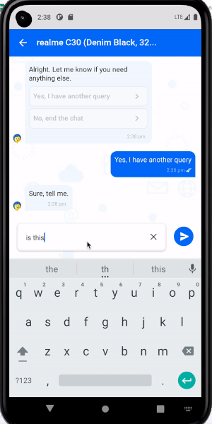
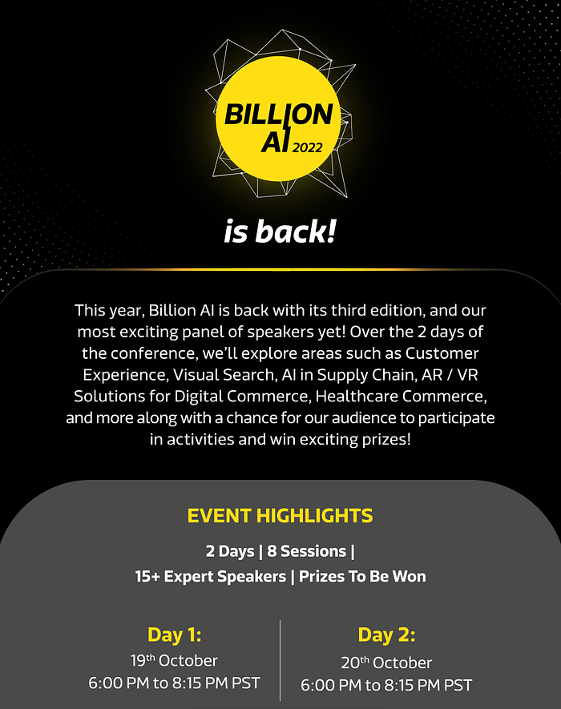
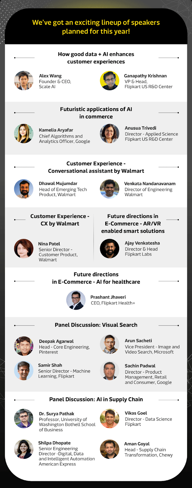

# Flipkart US R&D Billion AI 2022 Conference

> Announcement

— Anusua Trivedi, Director, Applied Science, Flipkart US R&D Center.

## Background

The $850 billion Indian retail market is the fourth largest in the world and is on the cusp of a transformation led by the emergence of e-retail and its growing influence on Indian shoppers. The e-retail market in India is primed to reach nearly 300 to 350 million shoppers over the next five years, propelling the total sales close to $120 billion.

Flipkart, backed by the financial prowess of Walmart, is India’s leading e-commerce marketplace platform, available in 12 languages with more than:

- 400 million registered users
- 150 million products
- 420,000 sellers

As with all things “progressive” in this world, there is always another opportunity waiting to be tapped in the e-commerce space as well. At Flipkart US R&D, we are working on the latest advances in Artificial Intelligence and Machine Learning for e-commerce to facilitate and improve the shopping experience for these customers.

## About Flipkart US R&D team

In our quest to connect with and onboard our next 400 million customers, we established the Flipkart U.S. R&D Center — a dedicated Center of Excellence for Artificial Intelligence, based out of Bellevue, Washington. We lead cutting-edge research around Natural Language Understanding, Chatbots, Computer Vision, and Healthcare to support Flipkart’s front and back-end applications. We’re working on some very interesting projects, including regional language solutions, voice-first conversational assistants for discovery and decision-making, and more!

## A quick glimpse into our Decision Assistant Bot

The first product developed by our team is a Decision Assistant (DA) chatbot that helps customers with their questions when they are considering buying a product on Flipkart. Before we dive deeper into our journey, let us explore why we built such a bot for our customers.

### Problem space: Language barriers and decisions

Indians have been using smartphones and the internet for communication and entertainment for many years now. However, the next 400 million new e-commerce customers (N400M) in India shop differently online than the established e-commerce customers.

A few key language-based reasons we were able to identify:

- Typing in non-Latin scripts is time-consuming and challenging for shoppers who use their phones to shop online.
- Searches are prone to spelling errors and grammar mistakes in English which are not well understood by the UI constructs designed for the English language.

A few queries that shoppers always have when it comes to trusting their purchase decisions:

- Will I get the product I want?
- Would this break?

### Business Solution: Empowering customers with intelligent, data-driven bots

Most questions that a customer might ask a salesperson before buying a product can be answered from the product specification details page. This information needs to be made more accessible through simple answers just like that salesperson would give. This is where an intelligent bot can help.

Here is an example below of how the DA Bot appears in the Flipkart Android app.

The user’s questions can be answered by a bot in an automated conversation, with a human agent as a fallback when the bot cannot answer. For example, a buyer might ask, “Does this mobile have a discount when I use my Flipkart Axis bank card?” or “Is this shoe waterproof?” or “What fabric is it?”. To answer queries such as these, we have built a Decision Assistant (DA) chatbot with our custom models that use product information along with user-generated reviews and answer common questions. Since launch, we have been increasing the breadth of issues that the bot can handle and the frequency of escalations to a human agent has reduced significantly.

**Learn more about our Flipkart US R&D team’s work: **[**Join the Billion AI 2022 Conference**](https://www.linkedin.com/posts/flipkart_flipkart-billion-ai-is-back-register-now-activity-6982576764963209216-lZDL?utm_source=share&utm_medium=member_desktop)

## What is Billion AI?

Billion AI 2022 is an AI conference where leaders and experts from industry and academia come together and talk to you about some of the most relevant topics in technology — including Computer Vision, Chatbots, Supply Chain, Best Practices in AI/ML, and more. We focus on retail and e-commerce, which are industries and areas in which Flipkart operates. At this 2-day event, we will have the members of the Flipkart U.S. R&D Center join leaders from industry and academia, as well as colleagues from our India team, to talk more about the future of retail and the role technology is going to play in it.

## Why do you need to attend this conference?

The top five reasons to attend this conference:

1. Stay ahead of the curve: Learn from global industry and academic experts on cutting-edge applications of AI in e-commerce.
2. Power up your skills: A chance to interact with world-renowned speakers and get a deeper insight regarding machine learning topics.
3. Network with top machine learning professionals: Gather with like-minded individuals to share your experiences, learn from one another, and make some connections to broaden your network.
4. Attend from anywhere in the world: It is a virtual ML Conference and you can attend from anywhere in the world.
5. Learn from the best: Our speakers are industry leaders with years of experience. They are passionate about sharing their learnings and helping you level up your skills.

## How to register for the Billion AI conference?

_If this interests you, we’d like you to click the _[_Direct Event Registration link_](https://docs.google.com/forms/d/e/1FAIpQLScP3aPPSALx6Tx9NFAcTYCgFvkccjNOl51M1_4lAxnOwBnCjg/viewform)_ to register for the event._

_We look forward to seeing you all at the event._

_Happy learning!_

---
**Tags:** Billion Ai 2022 · Flipkart Us Rd
