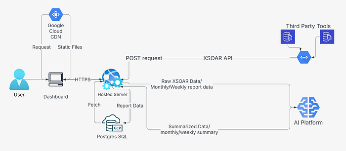
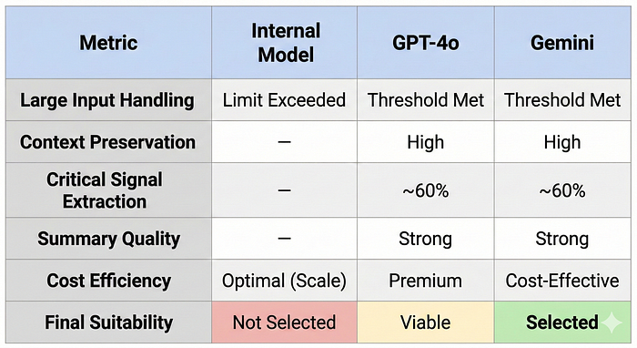
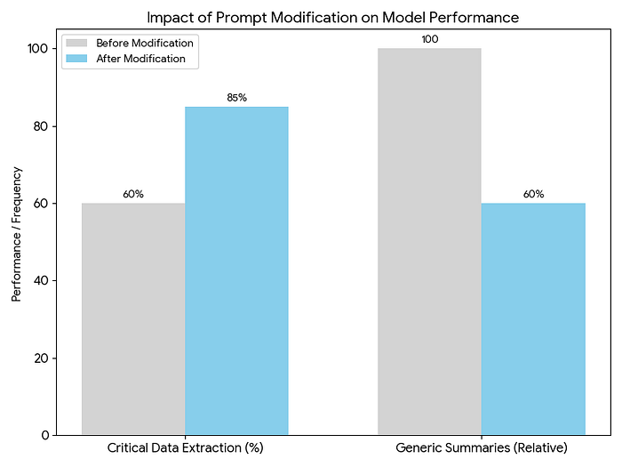
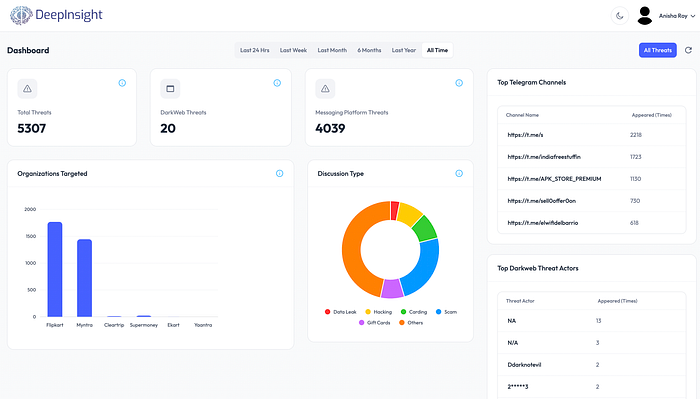

# From Noise to Insight: How LLMs Are Transforming Threat Intelligence Analysis

## A Story from the Frontlines of Threat Intelligence

The identification of cyber threats in e-commerce is challenging because discussions on topics like gift cards and discounts, when found on underground forums, can signal fraud yet closely resemble normal customer behavior. For security teams, distinguishing a genuine threat from routine chatter is extremely difficult, making risk identification feel like searching for a needle in a massive, constantly growing haystack. Threat intelligence teams face a relentless flood of unstructured data, often starting their day by reviewing hundreds of raw alerts spread across multiple tools. These alerts often lack sufficient context, making it hard to determine if they represent a real threat or a false alarm. Third-party AI summaries frequently miss critical context, failing to clearly differentiate true positives from noise. Consequently, analysts spend hours manually reviewing and interpreting alerts, which ultimately reinforced the clear need for structured, automated analysis.

### Building DeepInsight: Architecture and Workflow

*Figure 1: DeepInsight — High-Level Architecture*

DeepInsight was designed as an end-to-end platform that consolidates threat intelligence ingestion, analysis, and reporting into a single system. The architecture focuses on reducing licensing costs, minimizing manual effort, and making analysis faster and more consistent. The workflow begins with a centralized ingestion layer that aggregates more than 200 daily alerts from multiple unstructured sources without relying on additional paid integrations. Raw alert data often containing logs, free-text descriptions, and fragmented indicators is standardized into a unified pipeline. During this stage, key entities such as source URLs, Telegram channels, threat actor names, keywords, and associated metadata are extracted and structured. This normalization ensures that unorganized raw content is prepared properly before analysis.

Once structured, the normalized dataset is transmitted to the LLM through a secured API call using a predefined system prompt tailored for threat intelligence analysis. The LLM generates structured and concise summaries that include contextual overviews, indicators supporting true positive or false positive assessments, key findings, risk signals, and recommended next steps for analysts. All outputs, extracted entities, and summaries are stored in a structured database format and linked to unique Threat IDs. This allows efficient querying, filtering, and trend analysis while preserving full traceability to the original raw alert data. The separation between ingestion, AI processing, and storage ensures consistency, scalability, and reduced duplication across the system.

### Challenges

**LLM Benchmarking**

*Figure 2: LLM Benchmark — Performance Comparison Across Key Metrics*

Managing large volumes of unstructured alert data was a significant challenge. A single alert could contain extensive logs, indicators, and free-text entries, often pushing the limits of model input size. If the content was trimmed, it risked losing important context, affecting threat interpretation. To address this, three models, Gemini, GPT-4o, and an internal model, were benchmarked for context preservation, threat signal accuracy, and summary quality. While GPT-4o delivered strong structured reasoning and the internal model offered cost control, input size constraints made the internal model impractical for full alert processing. Gemini was ultimately selected for its larger context window and scalable pricing, offering the best balance between performance, context handling, and long-term efficiency.

**Prompt Refinement**

*Figure 3: Impact of Prompt Modification on Model Performance*

Another key challenge was avoiding generic summaries. Early prompt versions often produced high-level outputs that failed to consistently surface critical details, with important indicators correctly highlighted in only about 60% of cases. To improve this, the prompt was refined to explicitly instruct the model to extract specific high-value data points such as employee email addresses, phone numbers, order IDs, and other sensitive information, and to explain their relevance. After refinement, critical data extraction improved to approximately 85%, and non-actionable summaries reduced significantly. This reinforced that effective LLM implementation depends not only on model selection but also on precise and structured prompt design.

### Benefits of DeepInsight

*Figure 4: DeepInsight — Dashboard*

- Reduced manual alert triage time by approximately **75%** across 200+ daily alerts
- Improved clarity through **standardized and structured summaries**
- Faster identification of potential **true positives**
- Analysts can focus more on **investigation rather than on formatting**
- **Automated monthly AI-generated reports** for trends and insights
- Built-in **GChat and email functionality** for seamless alert notifications and communication

### Next Steps

Future work will focus on enhancing DeepInsight’s effectiveness and expanding its coverage. This includes benchmarking additional LLMs, such as Claude Sonnet 4.6 and Gemini 3.1 Pro, to optimize the platform’s ability to extract and summarize relevant information from large volumes of data. The goal is to make summaries more precise and actionable, enabling analysts to quickly understand and respond to threats.

Additionally, plans are underway to ingest other alert types, such as data alerts and broader threat intelligence signals. This expansion aims to ensure that the platform not only collects information but also helps the organisation take meaningful action. Addressing the challenge of converting globally received threat intelligence into actionable insights remains a key priority.

### Key Takeaways

- Volume becomes manageable when structure is introduced.
- Centralization is essential before applying AI.
- LLM effectiveness depends heavily on prompt design and validation.
- Even a focused solution can significantly improve daily operations.

### Contributors

[Anisha Roy](https://www.linkedin.com/in/anisha-roy-30b962216/) , [Ram Sandesh](https://www.linkedin.com/in/ram-sandesh-ramachandruni-88899221/), [Shashwat Jain](https://linkedin.com/in/shashwat-jain-2k3)

### References

1. [Introducing Cyware’s AI‑Powered Threat Intelligence Summarization: Real‑Time Context, Zero Manual Lift](https://www.cyware.com/blog/introducing-cywares-ai-powered-threat-intelligence-summarization-real-time)
2. [Corelight & LLMs: AI‑Powered Alert Summaries and Insights](https://corelight.com/blog/llm-prompts-for-network-security)
3. [AI and the Five Phases of the Threat Intelligence Lifecycle | Mandiant | Google Cloud Blog](https://cloud.google.com/blog/topics/threat-intelligence/ai-five-phases-intelligence-lifecycle)

---
**Tags:** AI · Cyber Threat Intelligence · LLM · Cybersecurity · Security
