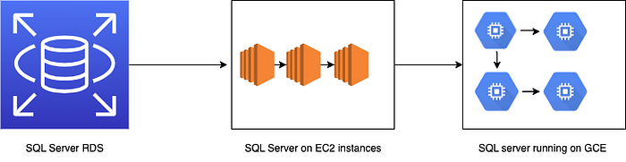
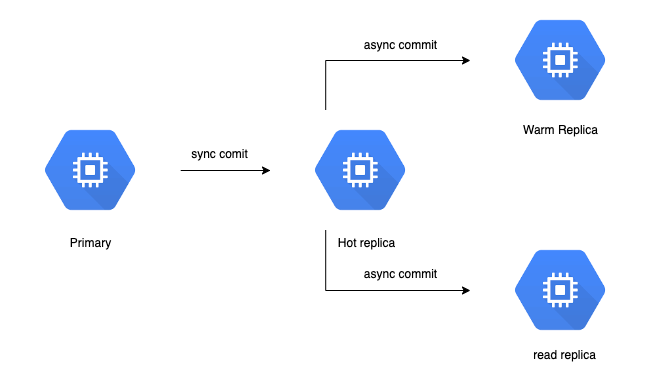
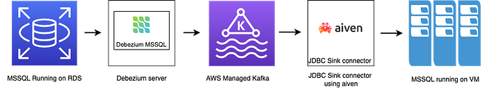

# From RDS to self-managed SQL Server

---

Until May 2023, the Flipkart Health+ relational database, specifically SQL Server, was hosted on AWS’s managed service known as [RDS](https://aws.amazon.com/rds/). The configuration consisted of a primary server with 24 cores and a read replica with 8 cores in a multi-AZ setup, ensuring asynchronous data replication to a secondary read replica.

## Context

In our endeavor to lower costs, we decided on Google Cloud. With the migration from RDS to GCP, the estimated cost reduction was projected to be 50%.

With Cloud SQL, GCP’s managed service, we foresaw the following migration challenges:

- **The GCP-provided SQL Server operates on a Linux OS, whereas RDS runs on a Windows OS.** Switching the operating system could result in significant risks due to unknowns.
- The total size of the database is approximately 4TB, and the restoration process took approximately 6 hours. This downtime meant a temporary suspension of business operations for the duration of the restoration.
- We use Debezium to read updates from SQL Server which powers the business metric dashboard. It is also used for other business flows such as inventory ingestion and order communication. Any impact on these pipelines would result in business impact.

To address these challenges, we opted for a self-managed SQL Server solution running on GCP VMs. This article explains our migration journey and all that it took to complete the migration successfully.

## Challenges

We had to address an array of uncertainties and surmount multiple obstacles before proceeding with the migration.

A few key challenging mandates were:

1. Assure Disaster Recovery: In the event of disk corruption or network partition, the node recovery time cannot exceed 15 minutes.
2. Secure Encrypted Backups: As our database housed sensitive personal health information, our backups required encryption to prevent unauthorized access.
3. Ensure Zero Data Loss: Data once written to the SQL Server should never be lost.
4. Windows Failover: We needed a thorough understanding of how Windows failover mechanisms function and how Availability Groups maintained high database availability in case of any disaster scenario like loss of network, VM crash, etc.
5. Change Data Capture Event Reliability: Ensure high availability of Change Data Capture events to prevent any disruptions to user-path services.
6. Learn SQL Server Internals: With RDS, a lot of SQL Server internals were unknown. A deep understanding of SQL Server’s internals would help quickly debug issues and maintain operational efficiency throughout and beyond the migration process.

In addition to these key challenges, we also addressed the following non-functional requirements to ensure that the system’s performance, security, and reliability met the highest standards.

- One Node-Fault Tolerant System: Provides resilience to unexpected failures, minimizing downtime and maintaining a seamless user experience.
- Data in Synchronized State with at Least One Node to Avoid Data Loss: Guarantees that no data is lost even if a node experiences failure. Data synchronized with another node safeguards against potential disruptions.

## Operational Guidelines

Considering the business continuity and minimal data loss pivots while handling these challenges, we set the following operational guidelines:

- Autopromote Hot Replica to Primary
- Node recovery under 15 min
- Un-interrupted data replication vis CDC
- Setup of 4 node clusters to ensure backups/ application/ debezium and other maintenance activities in SQL server could be performed without any downtime.

### Automatic Promotion of Hot Replica to Primary if the previous Primary Goes Down

We eliminated the requirement for manual intervention to resolve a primary node failure by automating the promotion of a hot replica to the Master role and upholding synchronization among a minimum of two nodes. If the primary goes down, the warm slave node is promoted to sync writes by an automated job. This seamless process takes effect autonomously within a mere 10 seconds. The system swiftly attains a healthy state ensuring that resolution procedures can be initiated promptly after that. After the system is stable, the primary that went down could be debugged and brought back online.

### Recovery Time of a Node to less than 15 mins

In scenarios such as a network partition in a node or deployment of a new virtual machine, we wanted to revert to a healthy state within 15 minutes.

We take hourly snapshots of disks, data, and boot disks. If we were unablea to debug, creating a new VM was our only option, using snapshots enabled to restore the state of the VM. To roll forward the database from the time of the snapshot, we apply the transactional logs whose backup is taken every 10 sec and stored on a separate disk that is accessible to all VMs.

This time frame assures the quick availability of systems and helps in operational continuity.

### Un-interrupted data replication to debezium

Debezium pipelines capture our database changes and power the analytic dashboards. Along with these dashboards, we also use debezium for multiple user path services to ensure at least-once delivery, implying data completion. For this, we set up a dedicated VM accepting writes in async mode, running on 8 Cores. A dedicated VM ensured that we did not overwhelm the read replica in case there was a failure in any of the other nodes. This VM would not take writes in any scenario.

## Phases of Migration

Our rationale was to recognize and address the existing gaps in the in-house expertise for self-managed SQL server deployments. Accordingly, we chose to facilitate a gradual and controlled migration process. It also added a layer of risk management.

The migration of RDS was done in the following phases:

1. RDS to self-managed SQL Server running on EC2 instances.
2. SQL Server running on AWS EC2 instances to SQL Server running on Google Cloud Engine.

*Fig 1: migration phases*

We used EC2 as an intermediate step because, in instances where unforeseen issues surfaced, the path to revert to a previous state (i.e, RDS) was significantly streamlined. The migration from EC2 instances to Amazon RDS using Database Migration Service (DMS) proved to be more straightforward and cost-effective than GCP VMs to RDS. This approach ensured a pragmatic and resource-efficient methodology to navigate the complexities of migration while minimizing operational disruptions.

## Infrastructure Setup

### AWS Setup

- Primary: 24 Core node, 192 GB, Z-class
- Replica: 24 Core, 192 GB [same as primary configuration as the writes happening on the primary will wait for successful writes on this replica. The slow ack from this VM should not be a bottleneck].
- **Read replica: 8 Core, 64 GB** [This VM is for failover and to support the read use cases and debezium pipelines.]
- Self-Managed Active Directory: In AWS we used a self managed active directory.

*Fig 2: AWS Setup*

### GCP GCE Setup

*Fig 3: GCP Setup*

- Primary: 24 Core, 384 GB — High Memory VM
- Hot Replica: 24 Core, 384 GB — High Memory VM
- Warm Replica: 8 Core, 128 GB [This VM was created to ensure that the read replica which serves data to application and debezium pipelines is not overwhelmed when the failover happens. So instead of read replica, another warm slave will start accepting writes in sync mode. This VM was skipped in AWS as a cost-saving call because AWS was an interim arrangement that was not planned for the long term.]
- Read Replica: 8 Core, 128 GB to support the Debezium and read use cases.
- [Managed Microsoft AD](https://cloud.google.com/managed-microsoft-ad/docs/overview): Managed Service for Microsoft Active Directory (Managed Microsoft AD) offers high-availability, hardened Microsoft Active Directory domains hosted by Google Cloud.

### How does the ‘Write’ work in this setup?

During a Write operation in the primary node, it waits for the replicas with the synchronization commit property to confirm the success of the data write. If the data write fails for a minimum-configured synchronization replica, the write operation also fails, and the transaction is not committed.

For replicas that accept writes asynchronously, the primary node does not wait for acknowledgments. As a result, these replicas may be lagging behind the replicas that are operating in synchronous mode. We set up the synchronized commit to 1 i.e. minimum of 1 replication to commit the transaction. Full backup and transactional backup were both taken by sync write VM to ensure that there was no data loss. With primary going down, a scheduled SQL Server job would enable the backup job on the warm slave which is not taking writes in sync mode.

### Performance in the new setup

We conducted multiple Non-Functional Requirement (NFR) tests to ensure a seamless transition from RDS to a self-managed SQL Server without any performance degradation. These comprehensive tests encompassed various aspects, such as executing multiple stored procedures, running read queries, writing queries with high concurrency, and evaluating disk speed. These tests aimed to validate the performance of the self-managed SQL Server environment under real-world conditions.

We simulated heavy workloads and assessing factors such as query execution times, transaction concurrency, and disk performance to identify potential bottlenecks that could impact the system’s performance:

- In AWS, we used “targeted IOPS” for I/O performance control. In GCE, this is similar to “provisioned IOPS” with “pd-extreme” disks. However, “pd-extreme” doesn’t allow easy volume size changes. So, in GCE, we went with “pd-ssd” disks for solid performance and flexibility without worrying about I/O issues, as our requirement was below limit provided by GCP for our setup.
- To optimize SQL Server performance, we mount tempDB on a local disk with an NVMe interface. In AWS, we can use Z-class VMs. In GCP, there isn’t a VM family with NVMe local disks directly, so we created a RAID array using four 375GB local SSDs attached with an NVMe interface.

Apart from this, we also applies the best practices provided by Microsoft for SQL Server running on VMs.

We worked on the following core performance improvement initiatives:

- Ensuring no data loss and managing disaster scenarios
- Ensuring no data loss in the event of a failover
- Minimizing downtime and expediting the recovery process

### Ensuring no data loss and managing disaster scenarios

For a system like SQL Server, ensuring there is no data loss is of utmost importance. In case of disasters, the system should either automatically recover itself or, with human intervention, be brought back to a healthy state quickly.

Here is how we solved for high availability of the system:

A few keywords to know:

- [Windows Failover cluster](https://learn.microsoft.com/en-us/sql/sql-server/failover-clusters/windows/windows-server-failover-clustering-wsfc-with-sql-server?view=sql-server-ver16) is a group of nodes connected, such that if any one node becomes unavailable, a secondary node is promoted and the services remain available.
- SQL Server High Availability SQL Server provides high availability which ensures that the database is available 24*7.
- [Availability group](https://learn.microsoft.com/en-us/sql/database-engine/availability-groups/windows/overview-of-always-on-availability-groups-sql-server) It provides automatic failover. When the primary becomes unavailable, the secondary gets promoted to act as a primary. AG also provides the capability to configure the data replication — synchronous/asynchronous data replication.

### Ensuring no data loss in the event of a failover

The hot slave replica replicates data in synchronous mode — the master waits for the data to be successfully written to the hot secondary replica before proceeding. This configuration ensures that in the event of a failover and the primary replica becoming unavailable, there is no data loss.

On the other hand, the warm slave replica replicates data in asynchronous mode. During failover, the asynchronous commit on this replica is changed to a synchronous commit. The minimum number of synchronous commits is set to 1 and if there are fewer than 1 synchronous replication, the master replica will not accept new write requests.

### Minimizing downtime and expediting the recovery process

The process of setting up the new node, including adding it to the Windows failover cluster and configuring the database, took approximately 7 hours. This was unacceptable as potential outages and lack of fault tolerance in the system in the event of a 2-node failure can prove costly.

We conducted a proof of concept (POC) to minimize the downtime and expedite the recovery process using disk snapshots and creating images from the snapshots. This approach worked. The snapshots of the C drive and other data drives taken at a scheduled interval helped failure recovery of the node and data to a point in time. If the node is still behind, we can add it back to the cluster and apply the transaction logs (records all transactions and the database modifications made by each transaction).

## Cutover Steps for SQL Server

The traditional approach of setting up a database involves exporting and importing the database, which, in the case of Flipkart Health+ (FKH) and its multi-terabyte (TB) database, would take approximately 6 hours to restore. This would result in a loss of write operations and business disruption.

### RDS to AWS EC2

For tables that had slow-changing data or were master tables, one-time migration was targeted by a simple backup and restore strategy, but for frequently changing data and large tables, the migration was planned via CDC pipelines.

*Figure 4*

The FKH system already uses [debezium](https://debezium.io/documentation/reference/stable/connectors/sqlserver.html) to capture row-level changes for some use cases; we utilized Debezium as the source connector to capture row-level changes from the RDS SQL Server.

Here are the other steps:

- Employed Aiven [JDBC Sink connector](https://github.com/aiven/jdbc-connector-for-apache-kafka), which reads data from Kafka and writes it to SQL Server running on VMs.
- Created a custom JAR for Aiven to support various functionalities such as delete statements, calculated columns, and other data types such as timestamp and datetime which weren't supported by Aiven. This approach allowed the migration of as many tables as possible and reduced the effort of migrating the tables during cutover.
- Developed completeness, and correctness scripts were developed to validate the migrated data.

Let’s say the Debezium source connector starts capturing changes from time T0. The backup process commences after Debezium begins pushing data to Kafka. The entire backup and restore process is expected to be completed by T0+t1. Once the database in the VMs is restored, the sink connector is initiated to read data from Kafka and continuously write it to the VMs from time T0 until the cutover occurs.

This approach significantly reduced the cutover time from approx 6 hours to the lag between the two systems, which was approximately 10 minutes, in addition to the time to run scripts for data correctness and completeness scripts. These scripts match the existence of the primary key of RDS with the existence of the same primary key on EC2. Once the primary key is found, the script takes a checksum of the row on both systems and then compares them.

### AWS EC2 to GCP Compute Engine

![Fig 5: DAG setup between two failover clusters [source: official documentation]](../images/854895c005246211.png)
*Fig 5: DAG setup between two failover clusters [source: official documentation]*

SQL Server provides [distributed availability groups](https://learn.microsoft.com/en-us/sql/database-engine/availability-groups/windows/configure-distributed-availability-groups?view=sql-server-ver16&tabs=automatic), which replicate data between two availability groups. The primary AG was AWS, and the secondary AG was GCP. The distributed AG setup writes from AWS to GCP in async mode. Within GCP, the setup remains as described above i.e. two nodes writing in sync mode and two nodes writing in async mode.

During cutover, we failover the DAG, i.e. the primary becomes GCP and the secondary becomes AWS. After ensuring that everything is working fine, we delete the DAG and decommission the AWS nodes.

## Way Forward

In addition to the migration process, we are actively enhancing our operational documentation, implementing comprehensive monitoring, and establishing infrastructure / service alerts. These measures significantly improve the visibility of our entire system and simplify the debugging process in the event of any issues or scenarios. This entire migration not only helped us save costs but also helped build muscle for SQL Server.

---
**Tags:** Flipkart Health · Rds To Gcp · Rds Gcp Migration Journey · Self Managed Sql Server · Fkhealth Engineering
