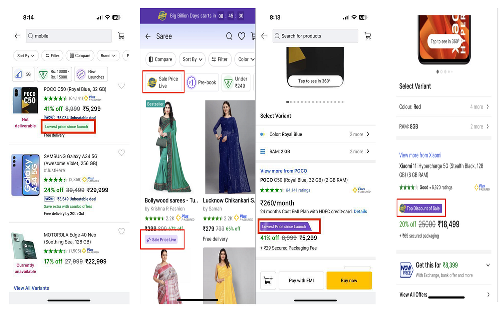
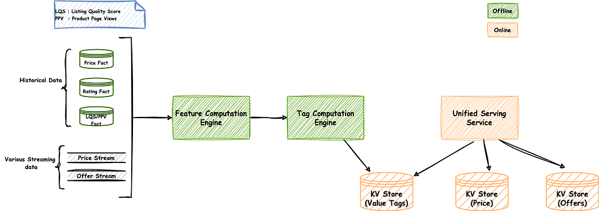
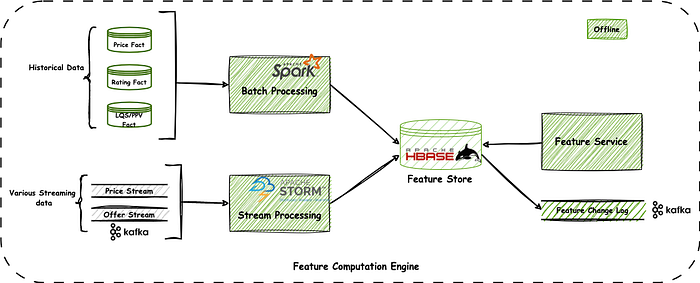
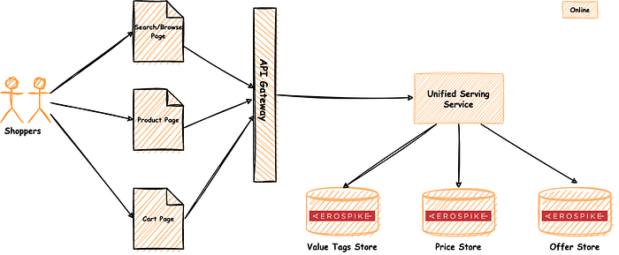

# Generating Data-Driven Value Insights @ Scale

Like any other eCommerce company, Flipkart has also grown exponentially over the years. While this growth can be attributed to multiple factors like an increase in product selection by onboarding more and more sellers, the addition of newer categories, better offer constructs, and competitive pricing, the most important factor is that we have always prioritized customer satisfaction and experience in all our products and features.

With this growth, the increase in product selection has led to many choices for customers to shop online. Although this was good from a platform perspective, it has led to more confusion for the customers to choose the right products. Our platform needed the following capabilities to minimize this confusion.

There are two parts to this problem:

1. Ability to communicate the value associated with a product.
2. Ability to personalize the value associated as perceived by different customer segments.

This article is about how we enabled data-driven value insights for customers to make better informed and right purchase decisions. The insights also help them build trust on the platform and enjoy a better shopping experience.

## So what is Value Communication?

From an end-user perspective, values are called out labels associated with a product that users can see consistently across multiple touch points like search page, product page, cart page, etc. These labels help in communicating the relevant and personalized value proposition of the product. We call these labels ‘value tags’.

We have different value tags to communicate different value propositions. There can be Sale-specific Value tags or Tags spanning across BAU (non-sale) and Sale days.

These are some of the value tags along with their meanings and the context in which they are used:

- **Lowest price since launch**: The tag shows that the product is at the lowest price since it was launched on the platform. This is the tag that is shown on both Sale and non-sale days.
- **Top discount of the sale**: The tag shows that the product is at a very high discount as compared to its normal day’s price. This tag is used during sale periods only.
- **Sale Price Live**: This tag is used a few days before the sale starts. This shows that the product is currently priced at the same price as during a sale.
- **Crazy Deals/Rush Hours**: These products are at very good discounts and won’t be there for long. This tag is also used during sale events.
- **WoW Rs._ xxx_ with Bank Offer / Get at Rs._ xxx_**: These tags communicate the lowest possible price of the product at which a customer can buy it, considering the offers applicable to the product. We call this price the Net Effective Price (NEP).

And there are many more…….

All these value tags have strict guardrails on quality and rating apart from prices and discounts. Only those products that pass these guardrails become eligible for the value tags.

*Value Tags*

## How are Value tags computed systemically?

Listing is the product sold by a seller, so if the same product is sold by multiple sellers, then each product has a unique listing ID and may have a value tag. Currently, we have more than 300M active listings in our catalog spanning across multiple categories and business units and we calculate value tags for each one of them. These tags are then served and powered in various high throughput APIs at different touch points like the Search Browse page, Product Page, Cart page, etc. These APIs power value tags at a few million QPS and low latency.

This implies that there are hundreds of value tags, each with a lifecycle. They need to be computed and served as near real-time as possible. Apart from the computation, there needs to be explicit guardrails in place in terms of quality, rating, etc. Some tags even need real-time information such as inventory count which adds to the complexity. The overall scale at which the value tags platform works makes it interesting.

We have devised an architecture based on Big Data technologies to churn user clickstream, product metadata, pricing information, etc. The pipeline derives features that are combined in a heuristic or learned way to come up with various tags that can be applied to the listing.

Broadly it has the following components:

1. Feature Computation Engine
2. Tag Computation Engine
3. Unified Serve Layer

We will go in-depth into each of the components.

## Feature Computation Engine

Features are the building blocks of value tags. They are signals or units of information derived from the raw data that help to calculate value tags.

**Note**: Flipkart has its own Flipkart Data Platform (FDP) where every team pushes their data which can then be used for any offline analysis. FDP also provides a platform for writing various custom spark-based batch/stream jobs for processing this data.

Some examples of features include:

- **LQS** — This stands for Listing Quality Score. This is a numerical value that shows the goodness of the listing in terms of its quality. These are offline computed values that are determined by multiple factors like the last few days' returns, cancellations, ratings, revenue, etc. Eg. LQS is measured on a scale of 1–10 where lower values signify better quality listings.
- **Rating** — This signifies the rating of the product. Rating is a numerical value on a scale of 1–5, which is provided by the customers when they buy products.
- **Usual Price** — This captures the price at which listings are usually sold. We compute this by giving more weightage to prices for which the listing was sold longest in the last ‘x’ days and a few other factors.
- **PPV Band** — This stands for Product Page Views band. We classify listings into different bands based on the number of views they are getting on the product page. PPV band is a numerical value in the range of 1–5.
- **Lowest Price in X days** — This captures the lowest price of the product in the last ‘x’ days. X can be as small as 7 days and as long as a year or more.

As you can see from the above examples, some features can be computed periodically as they don’t change frequently such as LQS, Rating, and PPV. but some features need to be computed in near real-time as they are time-sensitive and need to be as accurate as possible as the Lowest Price in X days.

Therefore, we designed the Feature Computation Engine to follow **lambda** architecture. The batch processing mostly does aggregations on historic data and derives batch feature values which are then combined with the stream process to get the latest feature in near real time.

1. **Batch Processing Unit:** It has various spark jobs that run periodically on the FDP (Flipkart Data Platform) platform. These jobs load various historical data of the products and do computations to calculate different feature values. These features are then stored in Hbase and replicated through the WAL (Write-Ahead Logging) change log over Kafka and consumed by various consumers. The features that are computed via this unit are the ones that have a lower frequency of change, e.g. LQS, Rating, etc.
2. **Stream Processing Unit:** Some features need to be computed in near real-time. For this, we have a stream processing unit. For example, the features that are related to price need to be very accurate and should be re-computed as and when a price change is happening. These features are also stored in Hbase and replicated using WAL. We use Apache Storm for stream processing.

For some features, we use a combination of both batch and stream processing e.g. Lowest price in X days is one such feature.

We pass the feature value generated by this engine through a diff checker which checks for the difference in feature value (by comparing old and new values) and pushes it to a Kafka-based feature change log which is an input to the Tag Computation Engine.

## Tag Computation Engine

The tag computation engine computes the value tags for each listing. Once the features are computed, the change logs are consumed by the tag computation engine and act as a trigger for tag computation. The tag computation engine is based on Apache Storm and computes various tags in near-real time.

Tags are modeled as a function of one or more features, therefore any change in feature triggers tag computation. Each tag has its algorithm based on the features. Tags are computed at listing X price point level. For example, suppose we have a listing L1 with prices P1, P2, and P3 over a period, we compute tags for L1 X P1, L1 X P2, and L1 X P3. Once the tag is computed, it is associated with the listings and price point until any feature change that may trigger its recompute.

We also calculate the goodness score of the tags. If we have more than one tag associated with the listings we also rank these tags.

The computed tags along with the goodness score are then stored in a key-value data store for user path (API call paths when the actual user is shopping on the Flipkart app or website) lookups. In addition, a change log is generated over Kafka for other consumers to consume.

## Unified Serve Layer

This is a lightweight HTTP-based REST service that powers multiple data for a listing such as prices, offers, and also value tags. This API is used in almost all pages of the FK app where price, offers, and value insights are to be shown. It scales to several thousands of rps with double-digit millisecond latency.

In addition, the same API also enriches and decorates responses for attributes such as communicating social proofing, inventory status, etc. We also personalize value tags for user cohorts for optimal experience.

Personalizing value tags helps communicate the most optimal value to a customer. For example, while a few users may look for faster delivery, few others may be keen on Hot deals.

Value tags are associated with the price points, therefore, they go hand-in-glove with each other. This is the reason their serving is co-located and we have a unified serving layer.

## Challenges

### Staleness in price-related features

We tried to only go with periodic batch processing. The limitation of this approach was that if there is any change in data after the feature compute, it cannot be considered till the next compute causing staleness (till next feature compute). This becomes unacceptable for price-related features because prices keep changing frequently and therefore the features dependent on prices should also be recomputed as soon as possible otherwise irrelevant tags may be shown to users. _To overcome this issue, we introduced a combination of stream and batch processing where heavy lifting was done by batch and delta from last batch run to now was done by stream processing giving us fresh features._

### Choice of Data Store

We needed data stores to store features and value tags, and both of them needed to serve a very different use case. The requirement for the feature store was scalability, large object storage, and high write throughput along with change log propagation. We explored MongoDB and Hbase. When we evaluated both these data stores then we saw that our use case was more aligned to what Hbase offers. This was mostly because we needed a store where we can fetch/store data as a key value pair at very low latency. MongoDB is suited more for use cases where we need to store data as a document and need filtering/aggregations based on secondary indexes. Flipkart extensively uses Hbase and offers it as centrally managed services on which teams can easily onboard, so we opted for Hbase with WAL replication.

Value tag stores needed high read throughput with very low latency and Aerospike was our best choice as we were already using it in production for serving price and value tags also needed to be stored along with it.

### Choice of Tech Stacks for computation-pipeline

We needed to crunch a lot of historical data in order to compute batch features. This historical data is stored in Flipkart Data Platform (FDP). FDP provides an in-house platform to visualize this data and write custom jobs to process this data for various use cases. These jobs are written using FStream framework which is a wrapper over Apache Sparks and has inbuilt integrations with FDP facts. Therefore this was our choice for batch processing.

For stream processing and value tags computation we needed near real time data processing therefore we went ahead with Apache Storm which is extensively used in Flipkart. Also apache storm can be easily scaled horizontally and offers a lot of tuning configurations for achieving the required throughput.

For queuing we used kafka because of its horizontal scalability and fault tolerance capabilities and ordered reads and writes. As Kafka has an out- of-the-box integration with Apache Storm, it makes sense to use Kafka along with Storm.

### Version Checks while storing tags

This entire tag computation pipeline works in asynchronous mode. Whenever there is a price change for any listing, it leads to feature change and eventually tag computation is triggered. Since these tags need to be served at a very high scale in user path and also since they are coupled with prices we clubbed both price and tags to be served together because of which we used the same data store where price is stored.

The problem with this approach is it may so happen that we are computing tags for some older price points whereas currently price points have changed. To tackle this problem, we implemented MVCC checks during writing, to make sure that the tags are computed for the same price points which are getting served.

## Net Effective Price

As part of our value communication initiative, we have an industry-first construct called WoW Price or Net Effective Price or NEP. Today there are many offers that apply for a customer’s purchase but customers cannot comprehend what is the best way in which these offers can be availed and what is the best price at which they can buy the product, as these offers come with various hurdles and rewards (like specific bank discount, quantity-based discount etc.).

We show a sample personalized calculation to ease the cognitive load on the customer. This involves the payment instruments a customer carries, the discount he is eligible for on the platform, any exchange which he/she has intended to avail, among several other things.

This topic is another interesting challenge we are solving and plan to continue in the years to come.

## Future RoadMap

While the current platform has laid a very good foundation in the value communication and discovery for Flipkart, we continue to work on following key initiatives:

1. **Personalized value discovery and communication: **We want to move toward making these value communications more personalized for the user by incorporating user short term and long-term affinity along with their shopping needs. In addition, we’ll also distinguish specific user’s behavior from others on the platform.
2. **Expand value discovery through other channels: **Today we power these tags as labels associated with the listings. Whenever a user does an organic search or opens a product page, then these tags appear. Presently, there is no way to search products based on these tags. Therefore, there is a need to expand the discovery of these tags using channels like merch cards, filters, etc.
3. **Bring machine intelligence in Tag computation: **Today the algorithms to compute tags are mostly heuristic-based and work on certain predefined input parameter. We want to move away from rule based heuristic approach and try to use ML models instead so that the computation becomes more real and also takes a lot of input parameters into consideration.

---
**Tags:** Value Communication · Flipkart Value Tags · Data Sriven Insights · E Commerce Value Tagging · Personalized Value Tag
