# HBase Compaction Manager

## Introduction And Context

[HBase](https://hbase.apache.org/) is a column-oriented database, developed by Apache software foundation and part of the Hadoop ecosystem. It is useful in storing ever-growing data of records and transactions such as messages, payments transactions, search history, etc., as it can scale linearly and efficiently access entries. It runs on [HDFS](https://hadoop.apache.org/docs/r1.2.1/hdfs_design.html), a distributed file system that was developed by Apache itself, which is a fault-tolerant distributed file system.

At Flipkart, we use HBASE as a platform service, where we onboard each use case as a **tenant**. Each node in HBASE that serves the data is a [RegionServer](https://hbase.apache.org/book.html#regionserver.arch). Think of a region as a logical shard of a table, and each [RegionServer](https://hbase.apache.org/book.html#regionserver.arch) serves the read and write requests for the data within its assigned regions. A **tenant** is a collection of RegionServers, known as [RSGroup](https://hbase.apache.org/book.html#rsgroup) in HBASE terminology, serving data for a particular use case. You can refer to this [blog](./hbase-multi-tenancy-part-i-37cad340c0fa.md) for further information about the multi-tenancy of HBASE in the Flipkart ecosystem.

## What is HBase Compaction?

Compaction is a popular memory management concept in operating systems where it tackles memory fragmentation, i.e., empty patches in memory resulting from regular operations. The primary aim of this technique is to improve memory performance. Similarly, in HBase, which is an append-only file system, compaction is used to optimize storage utilization. Common operations like writes and mutations are initially performed in an in-memory area referred to as MemStore. Periodically, MemStores are flushed to the file system, consolidating the data into single files known as HFiles. As the Hadoop Distributed File System (HDFS), the underlying storage layer operates on an append-only principle, HFiles may accumulate outdated information, such as deleted rows, necessitating a separate cleanup process to optimize storage utilization.

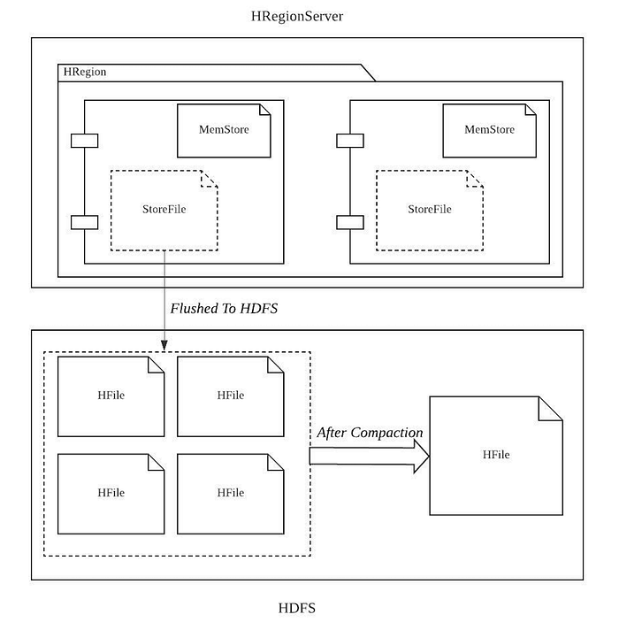

_Figure 1. Working Principle Of HBASE Compaction_

HBASE is optimized for read operation using binary search in distributed systems. As stated already, the small files created by the database system, which are known as HFiles that contain the data, grow rapidly in time. Now, to get the data, HBase needs to search through multiple smaller files, leading to multiple FileSeek operations and eventually affecting the efficiency in the long run.

Major Compaction in HBASE is the process that compacts all of these small HFiles into a big HFile for a Store that contains a sizable chunk of data so that the number of FileSeek operations is lesser and the efficiency of read performance improves. During its operation, it identifies the stale entries and cleans them — it re-writes the entire data stored in HDFS. Hence this process is expensive in terms of resource consumption and harms HBASE performance in terms of API latency and consequently throughput. This article is about the challenges and solutions of Major Compaction in HBase.

## Challenges of Compaction in a Multi-tenant Environment

### Expense

Compaction merges multiple store files into a single store file. It requires loading partial/entire content of one or more Hfiles onto the memory and creating a merged output. As this process is heavy on memory and CPU utilization, in many scenarios the HBase operations (especially writes), are blocked to guard against JVM heap exhaustion.

By default, major compaction runs once every 7 days, but we can set the value of “hbase.hregion.majorcompaction” to 0 to disable and reschedule it for the less-loaded hours. For the Flipkart scenario, where the load in the off-peak hours is often not sufficiently low, the compaction can affect the service.

We’ll need a solution in which the pace of the compaction is controllable based on the underlying situation.

### Data

As the entire data is being re-written during the process, it increases storage utilization temporally but significantly. The default implementation of compaction doesn’t honor the storage utilization condition for the tenant, hence for any reason if the tenant’s usage is higher than a threshold while the compaction is being run, the growth in temporary files can lead to the spilling over of data blocks beyond the boundary of the tenant. You can refer to [this blog](./hbase-multi-tenancy-part-i-37cad340c0fa.md) to understand the caveats of multi-tenancy further. Hence, the trigger of compaction needs to have an understanding of underlying storage utilization and adjust accordingly.

### Schedule

Each use case has a different compaction-scheduling requirement. For use cases such as Fulfillment, Billing which run at night, compaction runs are best done in the afternoons.

In tenants such as Checkout and Payments in an e-commerce scenario, midnight may be the most suitable time to run compaction when the customer interactions are lesser. However, during the sale seasons, these customer-facing tenants are busier than usual, and it is best to avoid compaction runs.

### Visibility

The limited availability of metrics is a blocker in debugging issues related to performance. The default implementation of Compaction exposes metrics that cannot help understand the correlation between compaction and its negative impact. So we needed a solution with adequate visibility for running algorithms that help decide compaction configuration and time.

## Solution: Compaction-Manager

## Background

We built Compaction Manager as a solution that helped resolve the aforementioned challenges of Hbase compaction.

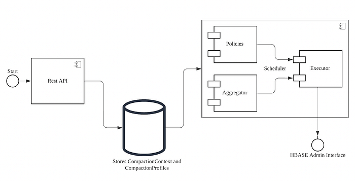

_HLD — Compaction Manager_

**Scheduler**: A daemon service that schedules and executes the compaction. It is the core engine of the solution. This service uses the compaction API that HBASE exposes to trigger the compaction and takes two inputs: 1) where to run and 2) how to run.

**Management API**: This interface provides tenants with the autonomy to manage compaction schedules. Given that a compaction schedule is characterized by two distinct factors, as mentioned in the last point, this API is designed to streamline CRUD operations for these elements, ensuring efficient control and customization.

**Storage**: The bridge between the management API and the scheduler will be storage — While the API service interacts with the storage to write/update the data/input, the Scheduler service acts on the inputs.

## Building Blocks

The following terminologies are important to create the foundation of the design:

### SelectionPolicy

The [SelectionPolicy](https://github.com/flipkart-incubator/hbase-compactor/blob/master/src/main/java/com/flipkart/yak/interfaces/RegionSelectionPolicy.java) plays a pivotal role in determining the eligible regions for compaction within HBase. It operates by considering various criteria, such as the load on the RegionServer hosting a particular region. The implementation of this interface establishes a rule or set of rules that address specific aspects qualifying a region for compaction eligibility.

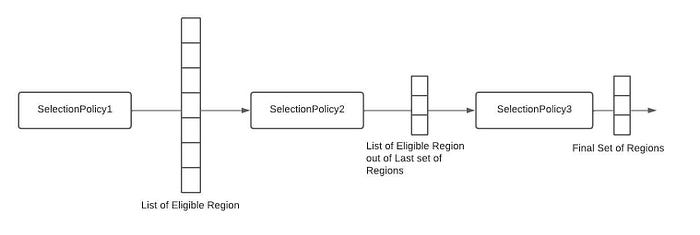

_Multiple Selection Policies in Conjunction_

Conceptually, the Selection Policy functions as a filter, excluding regions that do not meet the eligibility criteria. Multiple selection policies collaborate to refine the selection process, collectively identifying regions that satisfy all established criteria for compaction.

### CompactionContext

In the class diagram, you can see [CompactionContext](https://github.com/flipkart-incubator/hbase-compactor/blob/master/src/main/java/com/flipkart/yak/config/CompactionContext.java) is one of the components of CompactionConfig.

The Scheduler uses the following configuration model to trigger the compaction:

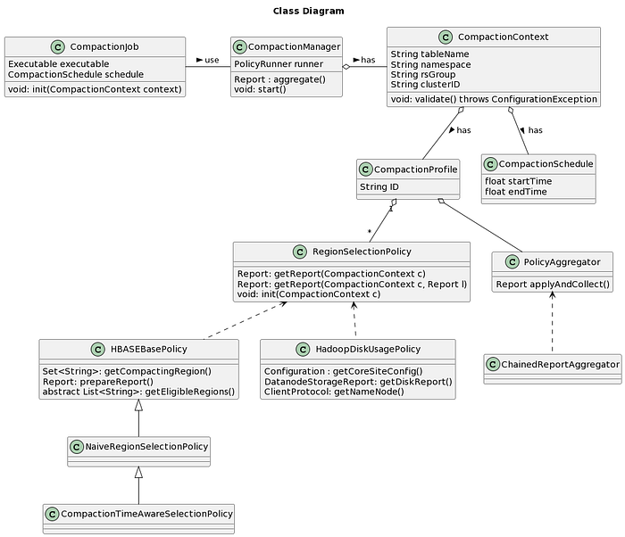

_Class Diagram-All Pivotal Components_

**Note: **We define a context as information that represents when and where the compaction is to be run. It encapsulates a set of regions (defined by a table or by an entire namespace) under scrutiny and a Schedule containing time for the trigger. This is one of the two inputs that is passed to the Scheduler.

### PolicyAggregator

While the compaction policy defines the criteria of eligibility, the [PolicyAggregator](https://github.com/flipkart-incubator/hbase-compactor/blob/master/src/main/java/com/flipkart/yak/interfaces/PolicyAggregator.java) accumulates output (plan) received from all the policies. The aggregator is like a customizable algorithm that produces the final plan for scheduling the compaction. The final plan will contain a set of regions that are eligible for the run that will pass on to the executor — although the plan can contain no region at all, which means according to the criteria, no region is eligible for compaction in this run. PolicyAggregator is invoked by a CompactionPlanner, which maintains the runtime of the iterations of eligibility analysis.

### CompactionProfile

[CompactionProfile](https://github.com/flipkart-incubator/hbase-compactor/blob/master/src/main/java/com/flipkart/yak/config/CompactionProfileConfig.java) is a bridge combination of a set of policies and an aggregator. This contains the individual configuration of each policy as well.

## Workflow

We designed this in such a way so that it can respond to any change done in the store configuration, which means at any point in time, if there is any configuration change, the application will detect it and refresh whatever it is doing. In Figure 5., we have shown that any configuration storage event calls a compaction job, but a compaction job may not trigger major compaction for a region immediately, rather depends on the schedule.

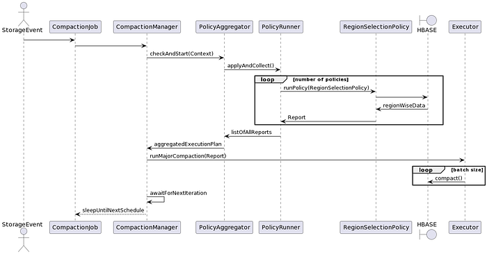

_Sequence Diagram of Compaction Manager_

It represents a long-running thread, which serves the job of scheduling the compaction, whenever needed. Compaction job relies on CompactionManager which uses the aforementioned modules to execute compaction as per configuration.

## Outcomes

### Visibility

The figures in this section depict the visualization of throttled compaction for different use cases. For the first case, less percentage of regions were compacted completely within the schedule window, whereas the scenario is much different for the latter one. This kind of visibility helps to tune the config as per requirement.

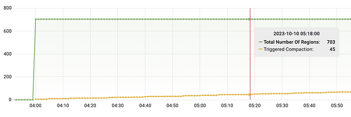

_Compaction Manager in Working — Slow-Paced Compaction_

In cases where the compaction of all regions cannot be accomplished within the designated time frame, un-compacted regions are prioritized in the subsequent schedule. The policy, which selects regions based on their last-compacted timestamp, also organizes them in a manner that gives precedence to the oldest compacted region. It’s noteworthy that the order of regions selected by one policy is consistently preserved in the next one.

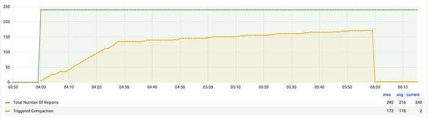

_Compaction Manager in Working — Aggressive Compaction for less critical use-case_

Here, we see two different rates of compaction trigger. This is because there are multiple tables present in an RSGroup, and each of them can be compacted at the Disk level at a different pace. Hence, the combined metric shows two sections and in the second section, the bigger table with the large number of StoreFiles is getting compacted.

## Scheduling

Another crucial consideration is the ability to regulate the scheduling time, a feature that can also be managed through HBase’s native configuration. This is particularly pertinent because, with a throttled compactor, it is imperative to explicitly disable native compaction. Therefore, it becomes a key requirement for the Service to enable scheduling at specific times, ensuring seamless coordination with the throttled compaction process. There are two sets of graphs, one representing the trigger rate emitted from the application and the other displaying the set of metrics collected from HRegionServer.

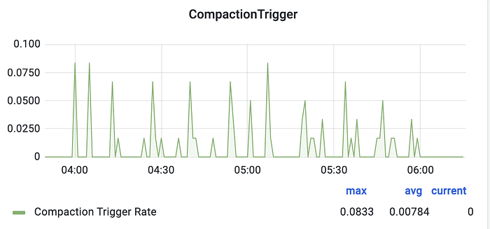

_Compaction Trigger Rate — Reported by Compaction-Manager_

This is to validate the correctness of the execution of the application, i.e. the schedules are working as per requirements.

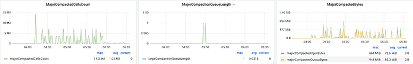

_Compaction Trigger — Metric Collected from HRegionServer_

## Configuration And Control

Here, we set the maximum number of Regions to be compacted for a Table as 5. In the plot, you can see, at any point in time, the increase in the number of Regions for which it invoked compaction is less than 5.

The following graph shows how the configurations discussed earlier impact the pace of compaction:

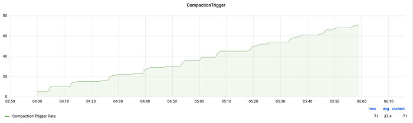

_Compaction Trigger Rate — Reported by Compaction-Manager_

Also, there are areas where the invoked number is less than 5. This is obvious when not all the regions from a batch of 5 have completed compaction at the same time. The application takes a best-effort policy approach to match the number of compacting regions with the highest potential value.

As previously mentioned, the Selection Policy operates collaboratively, akin to a set of filters. Specifically, the TimestampAwareRegionSelectionPolicy, which selects HRegions based on their last compacted timestamp, marks an increased number of regions as eligible (**yellow line**). In contrast, the alternative policy that assesses the load on the underlying HBASE cluster as a compaction criterion restricts the eligibility of regions (**green line**). This behavior is analogous to a low-pass filter, effectively allowing through only those regions that meet the specified load criteria.

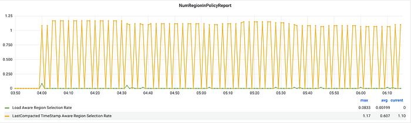

_SelectionPolicy working in Conjunction_

Expanding on this concept, an additional Selection Policy can be introduced to evaluate the utilization of the underlying HDFS storage. This policy is designed to inhibit the selection of regions for compaction when high Disk Utilisation is detected. By doing so, it serves as a safeguard against further increases in disk usage, mitigating the risk of DataBlocks spilling over the RSGroup boundary.

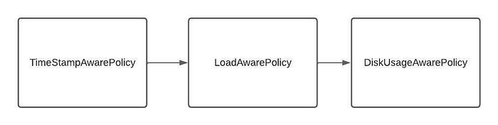

_SelectionPolicy Working Principle_

Tuning the Aggregator in terms of the order in which it applies the policies allows us to further change this behavior. This gives a lot of flexibility in trying out different combinations based on different requirements from the tenants.

## Conclusion

We’ve achieved notable enhancements in the scheduling, management, and visibility of compactions. Beyond scheduled compaction, our system now supports the initiation of immediate compactions without disrupting the existing schedule. To further optimize performance, we have planned significant improvements, including scalability upgrades for the CompactionScheduler. This involves the capability to deploy multiple CompactionSchedulers, facilitating collaborative work and efficient task distribution.

Additionally, our roadmap includes the implementation of more sophisticated policies, providing users with finer control and automation options for a more granular and customized compaction management experience.

Refer to our GitHub repo for setup and other API details: [https://github.com/flipkart-incubator/hbase-compactor](https://github.com/flipkart-incubator/hbase-compactor)

---
**Tags:** Hbase · Compaction · NoSQL · Throttling · Apache Hbase
