# HBase Multi-Tenancy — Part I

## Introduction and Context

HBase is an open-source non-relational distributed database modeled after Google’s Bigtable and written in Java. It is developed as part of Apache Software Foundation’s Apache Hadoop project and runs on top of HDFS, providing Bigtable-like capabilities for Hadoop.

We are a platform team at Flipkart hosting an HBase database for well over 100 different business use cases primarily OLTP workloads, with over 1.6 PetaByte data, 8000+ vcores, and 40TB of RAM provisioned capacity.

Considering that these many use cases were needed to run their own HBase clusters, it meant a highly suboptimal utilization of developer bandwidth and infra resources and HBase has a loosely defined multi-tenant construct. There was a need for providing a consolidated, centrally managed, multi-tenant HBase cluster with stronger isolation guarantees. This article is about how we solved for a truly multi-tenant HBase cluster and our documented observations.

## Background

We @ Flipkart have a diverse set of store requirements for various microservices, some of the ones which we are going to focus on have the following characteristics because of which Hbase became a good fit.

- OLTP kinds of workload
- Want to run a key-value non-relational store
- Need strong consistency guarantees
- Ability to scale horizontally
- Ability to autoshard and dynamically host shards

Our current deployment has

- Around 100 tenants with diverse workloads.
- Around 1300 instances with a provisioned capacity of 8000+ vcores, 40 TB of RAM, disk capacity of 1.6 PB with hosted data of 650 TB.
- Serving 1M read+write(1:1) rps at peak (during Big Billion Days 2021).
- Capable of serving tens of millions of rps with very good tail latencies.

## Hbase Terminology

Let’s familiarize and recall some of the Hbase terminologies that can come up often during this reading.

**Tables**: Hbase tables organize data in rows and columns, but they are stored fundamentally different from how a SQL database stores

**Regions:** Each table is divided into disjoint contiguous subsets called regions. Each region is an independent unit of data hosted on nodes called region servers

**RegionServer:** is a node on which regions are hosted in memory that serves client RPC calls and whose data is stored in hdfs.

**Hmaster:** is a master node in HBase, which co-ordinates between region server for performing certain cluster-wide activities such as region assignment, balancing, etc

**Data nodes** The nodes on which actual data is stored in a hdfs filesystem.

**Namenode:** are the master nodes that create new blocks and maintain metadata of the filesystem. It also serves RPC calls on data discovery via meta information stored.

**FavoredNode:** Favored node is a hdfs construct which is an indication to hdfs onto where the blocks are to be placed for a specific file. This affects the block placement policy of hdfs for specific blocks being created.

**RSGroup (RegionServer Grouping): **A group of region servers that are logically grouped for serving a disjoint set of tables in HBase providing isolation in the RPC serve layer.

**WriteAhead Log:** The Write Ahead Log ( WAL ) records all changes to data in HBase in a sequential manner, appended only to file-based storage.

**Tenancy Definition with Isolation expectation**

- A single region server belongs to a single tenant.
- A single region server serves regions from tables belonging to the same tenant
- A single regionserver and corresponding data node(co-located setup) host data blocks belonging to regions from tables belonging to the same tenant
- Resources of data nodes and regionserver such as CPU, Memory, Disk, and Network are dedicated to the tenant to which it is allocated.

Here is the diagram representing perfect isolation:

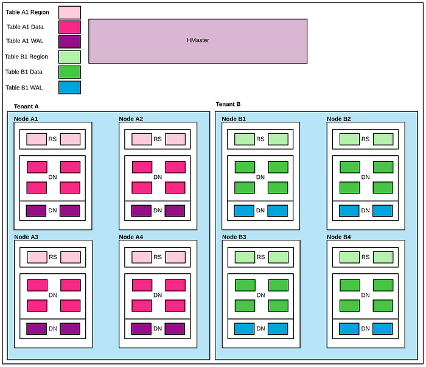

For the rest of the talk, we will be talking about HBase 2.1.x version and how we solved the following challenges along the way:

- Data Isolation
- WAL Isolation
- Cluster Replication
- Change Data Capture
- Backup Restore
- Export Snapshot

## Data Isolation

**Problem Statement:**

For every region of a table belonging to a tenant, all replicas of that region should reside in the nodes belonging to that tenant (Data Isolation). This is important for the following reasons:

- Each tenant wants to have hardware curated to their needs, in terms of core, memory, type of storage, network bandwidth, etc. Hbase solves core and memory problems by providing rsgroups (serve layer isolation) but data cannot be isolated for tenants, especially for tenants with different storage hardware such as SAN vs HDD vs SSD, etc.
- Providing different hardware for serve vs data (regionserver vs data node) is an under utilization of hardware and can degrade performance (short circuit doesn’t work; fetching across nodes can result in more dependence on network bandwidth, etc).

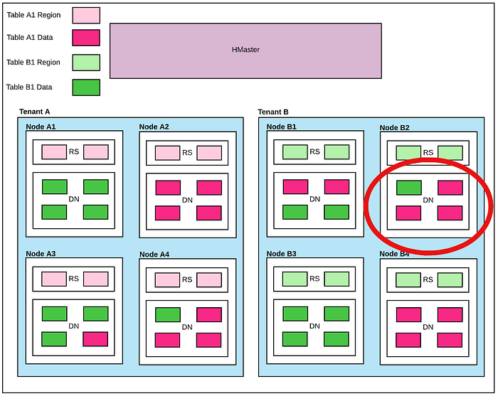

**Background**

Hbase Load Balancer’s job is to:

- Balance all the online regions across the region servers in the cluster for optimal resource utilization.
- Assist assignment manager in assigning regions to region server and ensuring the right assignments. For example, the RSGroup balancer ensures rsgroup constructs are adhered to, by default. It also ensures regionserver is online before assigning the region.

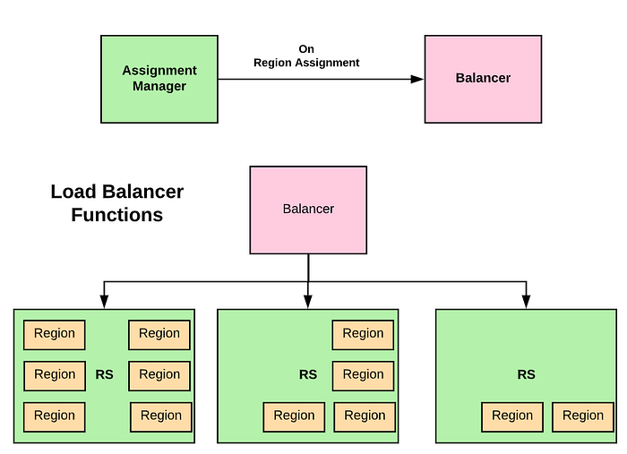

There are several scenarios where a region is to be assigned to a regionserver. The primary ones are:

- When a table is created, a single region or multiple regions are created and assigned.
- When a single region is split into 2 regions or 2 regions merged into a single one.
- When a cluster has gone into an imbalance state and the balancer is triggered based on the configured balancer parameters.
- Specific activities resulting in the closing or opening of regions such as
- replication related changes
- topology modifications like the regionserver going down

Some Load Balancers bundled with HBase are:

- FavouredNodeLoadBalancer
- RSGroupBasedLoadBalancer
- StochasticLoadBalancer
- SimpleLoadBalancer

**Approach:**

- Custom Load balancer extending from FavoredStochasticBalancer and RSGroupBasedLoadBalancer.
- Custom LB stores favored nodes belonging to the same regionserver group in Hbase meta at the time of region assignment.
- Hbase already has favored node support. When a new hfile is created, it passes on favoredNodes from HBase meta to DFS client, if present.
- Then onwards, all blocks created for this hfile are placed in these favored nodes (best effort enforced by the HDFS layer).

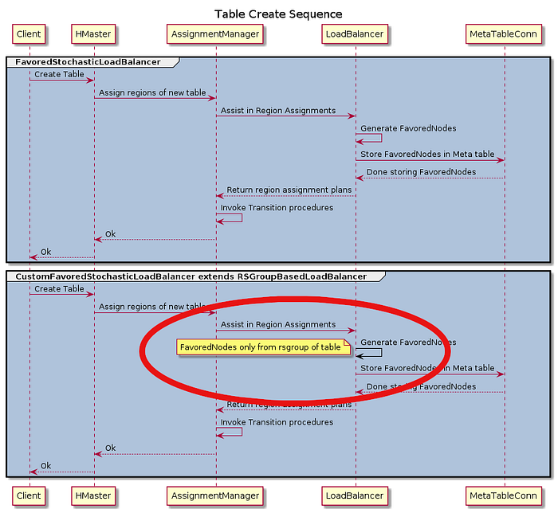

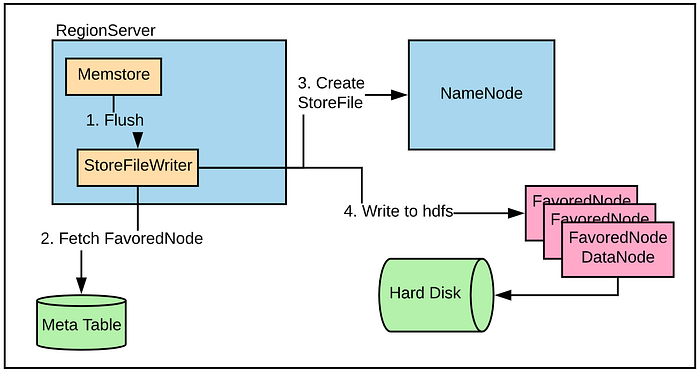

Credit to patch → [https://issues.apache.org/jira/browse/HBASE-15533](https://issues.apache.org/jira/browse/HBASE-15533)

Results:

Limitations:

- Skewness: May happen if there is a change in topology because of maintenance, hardware failures, etc resulting in uneven distribution of favoredNode assignments.
- Data Spillover: As favoredNode is a best effort block placement by hdfs layers, it only ensures block are placed when the data node is healthy. If not, data blocks may be placed on any other data node including other tenant data nodes.

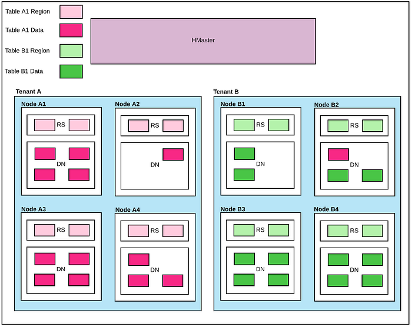

These limitations are discussed in detail in the next section.

## Data Spillover

**Problem Statement:**

When a node goes down or regions are moved for various reasons, a balancer that does not understand favored nodes considers only the primary regions in the balancing activity for reassignment. All the regions for which the dead node is either secondary or tertiary favored node will be left as is.

This causes the following issues:

- Imbalance in favoredNode assignment while balancer run can result in skewed disk usage.
- Dead datanodes being a favoredNode may cause spillover of data outside of the tenant.

**Background:**

Hbase StochasticLoadBalancer does balancing activity with the help of :

- Cost functions such as RegionCountCostFunction, LocalityCostFunction, etc. Each cost function gives a cost value between 0 and 1, which is multiplied by the configured weight given to each of the functions and added up to get the total cost.
- Candidate generators such as RandomCandidateGenerator, LocalityBasedCandidateGenerator, etc, when called returns an action. The action is either ‘Move a region from one regionserver to another’ Or ‘Swap 2 regions between regionservers’.

Once the balancing activity starts, calculates init cost and then balancer identifies candidates using candidate generators and moves around a predefined number of times and then calculates a new cost. If the cost is reduced compared to the previous step, the balancer applies it to the in-memory cluster view and repeats the process.

Once the balancer finds a new region spread called the balancer plan, the Master asks the Assignment manager to execute the plans.

Following flowchart describes how Stochastic Loadbalancer works in practice

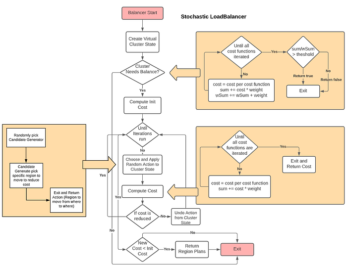

**Data Spill Over Scenarios**

- HDFS FavoredNode is a best effort block placement policy.
- FavoredNode is applied at the time of block creation.
- Blocks can be spilled over from defined favoredNodes to any other data nodes if favoredNode is not healthy in scenarios such as:   
- data node is dead or out for maintenance  
- data node is part of excluded nodes.  
- data node disk is unhealthy like readonly  
- data node is detected as unhealthy for various other reasons by namenode

---

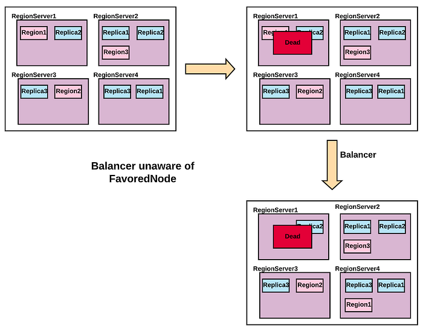

**Approach**

Cost Functions:

- FavoredDeadNodeCostFunction: A Cost Function, which gives a higher cost if there are dead nodes among favored nodes for any regions. Hence increasing the initial cost and thus probability of triggering balancer.
- FavoredNodeImbalanceCostFunction: Is a Cost Function, which gives a higher cost if there is a high imbalance in terms of favored nodes assignment. Hence increasing the balancer's initial cost and thus the probability of triggering the balancer. A balanced scenario means each datanode is a favorednode for an equal number of regions.

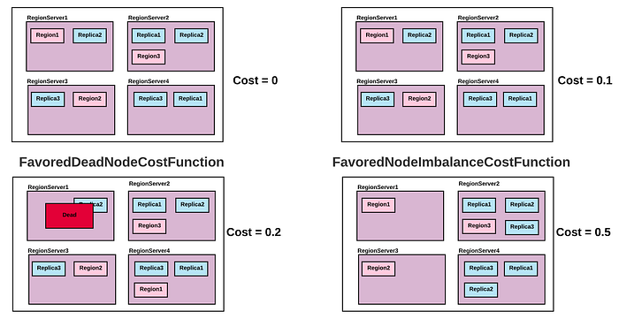

Candidate Generator:

- FavoredNodeIgnoreDeadNodeCandidateGenerator: A Candidate Generator that picks a region as a candidate which has a dead node as one of the favoredNode. When balancer picks up this region and moves to another regionserver, will result in not having a dead node as one of the favored nodes which will reduce the overall cost
- FavoredNodeImbalanceCandidateGenerator: A Candidate Generator that picks a region as a candidate which can reduce the imbalance among favoredNode spread by reducing the overall cost. As in each datanode is favoredNode for equal number of regions.

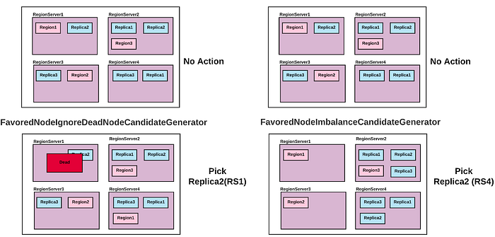

Results:

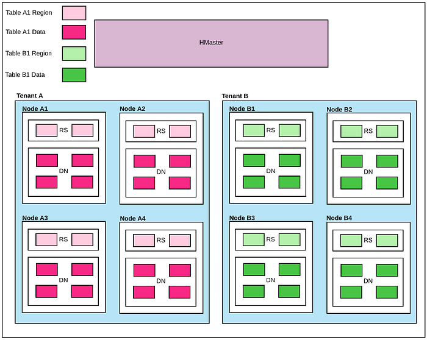

**Limitations**:

- Regions per RS: Works best when the number of regions per regionservers is 10 and above. If very few regions are hosted, the weight of each region is too high for any skewness calculation and hence doesn’t give very good results.
- Major Compaction: Data distribution is restored as per favoredNode assignment only after major compaction because major compaction rewrites the files and restores the correct assignments. Otherwise only logically corrected or balanced favorednodes.
- Unhealthy data node: Considering scenarios like datanode being unhealthy from hdfs cluster point of view such as (being in the excluded list of namenode, disk full, decommissioned, etc), whereas hbase sees regionserver being up on co-located datanode resulting into data spill over. These scenarios are marginal in nature.

## WAL Isolation

**Problem Statement**

WALs are directly in the Write path. Each use case can have a diverse set of requirements in terms of Write throughput and latencies. It was necessary to shield tenants by ensuring that the Write block for a single tenant lands on the data nodes of the same tenant.

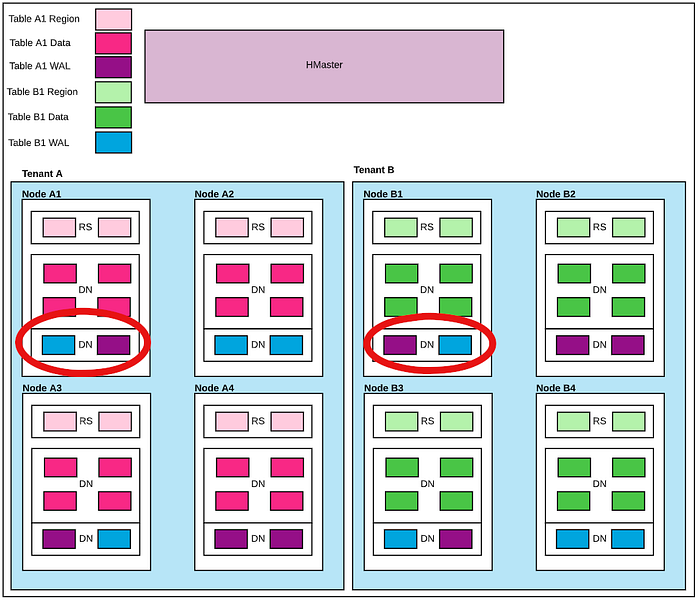

**Background**

- A RegionServer hosts one Memstore per region column family.
- Each Memstore has zero or more StoreFiles. Each Storefile corresponds to a column family for the table of the region. Memstore is flushed to disk when certain conditions are met.
- Write Ahead Log (WAL) records all changes to data in HBase to file-based storage. WAL is sequentially written to disk and hence can achieve good performance.
- As WALs are in the WRITE path, they directly affect the performance of client API. It can give varied throughput based on the type of disk WAL is written to (NAS vs. SSD vs. HDD).
- If a RegionServer crashes before flushing Memstore to disk, WALs are used for recovery and can be replayed to recover the data.

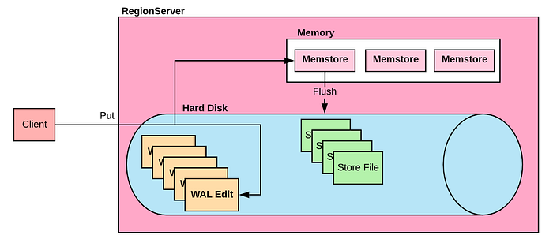

**Approach:**

This approach is based on the lines of data isolation where favoredNodes are used to ensure isolation.

- NodeSelectionStrategy is configured and initialized by regionserver at the time of startup.
- On WAL rotate, tenant is identified based the regions that are hosted on that particular regionserver and thus the favorednodes.
- These favoredNodes are shuffled for randomizing and passed on to the DFS layer and will be applied while writing the file.

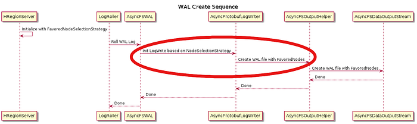

Results:

## Conclusion

In [Part II ](./hbase-multi-tenancy-part-ii-79488c19b03d.md)of the series, we will be talking about isolation in terms of Cluster Replication, Change Data Capture, Backup Restore, etc

By addressing the problems discussed above, we could run a multi-tenant Hbase cluster(s) that touches every part of the user journey at Flipkart and scales effortlessly. We have shifted our attention towards optimizations, operations, and maintenance along with ironing out glitches from the above solutions. One highlight is [HBase-k8s-operator](https://github.com/flipkart-incubator/hbase-k8s-operator), which is in the works. Stay tuned for more articles from Hbase Team at Flipkart.

This article is based on a presentation in Flipkart’s technical symposium SlashN 2022, held earlier this year.

Presentation Video Link: [https://www.youtube.com/watch?v=ttGI9Ma7Xos&t=26s](https://www.youtube.com/watch?v=ttGI9Ma7Xos&t=26s)

---
**Tags:** Hbase · Multitenancy · Replication · Isolation · Change Data Capture
