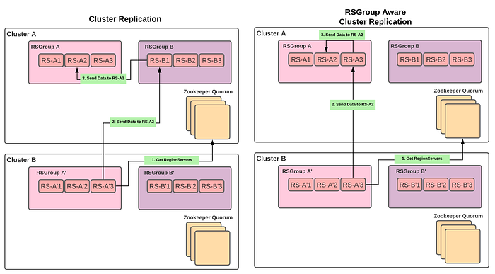
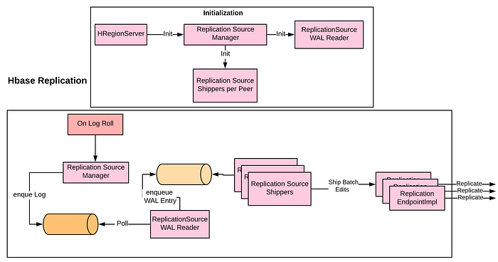
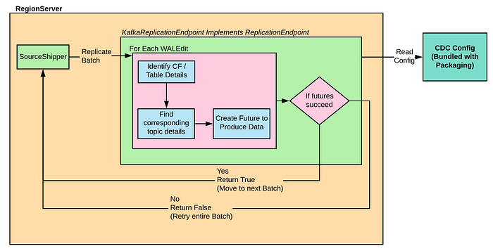
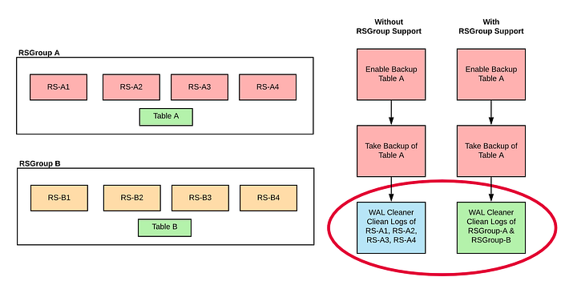
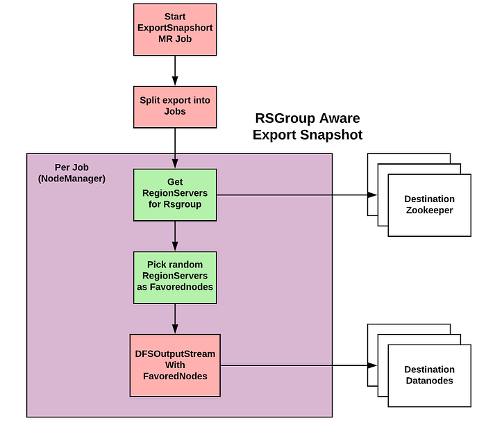

# HBase Multi-Tenancy — Part II

This article is II part of the Hbase Multi-Tenancy series, do read [HBase Multi-Tenancy — Part I](./hbase-multi-tenancy-part-i-37cad340c0fa.md) before proceeding further.

## Introduction and Context

HBase is an open-source non-relational distributed database modeled after Google’s Bigtable and written in Java. It is developed as part of Apache Software Foundation’s Apache Hadoop project and runs on top of HDFS, providing Bigtable-like capabilities for Hadoop.

We are a platform team at Flipkart hosting an HBase database for well over 100 different business use cases primarily OLTP workloads, with over 1.6 PetaByte data, 8000+ vcores, and 40TB of RAM provisioned capacity. Considering that these many use cases were needed to run their own HBase clusters, it meant a highly suboptimal utilization of developer bandwidth and infra resources.

HBase has a loosely defined multi-tenant construct. There was a need for providing a consolidated, centrally managed, multi-tenant HBase cluster with stronger isolation guarantees. This article is about how we solved a truly multi-tenant HBase cluster and our documented observations.

Having covered Data Isolation and WAL Isolation in [Part I](./hbase-multi-tenancy-part-i-37cad340c0fa.md) of the series, we will cover the following in this article:

- Cluster Replication
- Change Data Capture
- Backup Restore
- Export Snapshot

## Cluster Replication

HBase provides a cluster replication mechanism that allows you to keep one cluster’s state synchronized with that of another cluster, using the write-ahead log (WAL) of the source cluster to propagate the changes.

**Problem Statement**

During Cluster replication, to ship every batch of WAL edits, the regionserver from the source cluster chooses a random regionserver from the destination cluster, independent of the rsgroup. This passes on the WAL edits to the correct regionserver to apply onto itself. An intermediate hop is involved outside of rsgroup which consumes resources unnecessarily from other tenants, breaching the tenancy construct. This also has an unnecessary overhead for each regionserver of each rsgroup to know regionservers of all other rsgroups because all communication happens via hostnames.

**Background**

- Every regionserver stores all mutations(changes) to a single WAL file with respect to that regionserver and these are rotated based on certain conditions such as threshold length of the WAL file, etc.
- Every mutation(change) in HBase is recorded as a WAL edit in Write Ahead Log. Every WAL edit has a sequential identifier with respect to the regionserver on which WALs are generated.
- Cluster replication is asynchronous in nature and progress is checkpointed in zookeeper as a sequential identifier of WAL edit.
- Each RegionServer from the source cluster replicates to the regionserver of the destination cluster using WAL edits stored in WAL in case of an inter-cluster replication.
- While replicating each batch of WAL edits, it picks a random regionserver on the destination cluster and ships the edits, which in turn passes each edit to the appropriate regionserver.

**Approach**

- Instead of choosing a random regionserver of any rsgroup in another DC, choose the regionserver from the corresponding rsgroup and hence provide better isolation guarantees.

**Limitations**

WAL edit shipped during cluster replication is a batch operation. Each batch can contain edits for several different regions and several regionservers. Hence it would not be possible to direct the batch to regionserver which is the destination of the particular batch of WAL edits.

## Change Data Capture

Change data capture (CDC) refers to the process of capturing changes made to the data in a database and then delivering those changes to downstream systems such as a secondary database, stream processing engine, etc. These are also called Side Effects.

**Problem Statement**

- Propagate Change Data: Optionally each tenant may want to ship change data from HBase to their distributed queues such as Kafka, pulsar, etc for stream processing engines to propagate to common side effects such as:  
- Notify dependent systems about a state change for a distributed transaction  
- Fill up data in a secondary database that has different read/write patterns, etc.
- Tenancy Isolation: Each tenant would want to have isolation both in terms of resource utilization as well the sink on which data is produced such as Kafka topic or on self-managed distributed queues.

**Background**

- ReplicationEndpoint is a plugin interface that implements replication to other HBase clusters, or other systems. ReplicationEndpoint implementation can be specified at the peer creation time by specifying it in the `[ReplicationPeerConfig](https://hbase.apache.org/devapidocs/org/apache/hadoop/hbase/replication/ReplicationPeerConfig.html)`. A ReplicationEndpoint is run in a thread in each region server in the same process.
- ReplicationEndpoint is closely tied to ReplicationSource in a producer-consumer relationship. ReplicationSource is an HBase-private class which tails the WAL logs and manages the queue of logs plus management and persistence of all the states for replication. ReplicationEndpoint is responsible for the shipping and persisting of the WAL entries in the other cluster.
- HBaseInterClusterReplicationEndpoint is an implementation of ReplicationEndpoint for replicating to other Hbase Clusters.
- For every registered peer in an HBase cluster, the replicate method is invoked for every batch of WAL entries as shown below.

**Approach**:

Implementation of ReplicationEndpoint as Kafka and pulsar connectors:

- Each regionserver has a configuration specific to the rsgroup it belongs to, which is controlled via our packaging. As the WAL entries have information such as table names, column families, etc, the tenants can control the information access for each topic. This enables tenants to propagate only the changes to dedicated queues which they own.
- The tenants are provided with the capability to propagate changes in a multi-dc active-active cluster. Each WAL edit is imprinted with the chain of clusters it has visited in sequence and hence can identify the events to propagate appropriately to the dc/zone.
- RegionServers directly ships the data via connectors and there is complete isolation in terms of tenancy constructs.

## Backup Restore

The HBase backup and restore feature provides the ability to create full backups and incremental backups on tables in an HBase cluster. The full backup is the foundation on which incremental backups are applied to build iterative snapshots. Full backups are based on HBase snapshots, while incremental backups are based on WAL files to capture changes since the last backup (Full or Incremental).

**Problem Statement**

- Hbase Incremental backup requires WAL files to be kept from previous successful backups and backup/restore doesn’t understand rsgroup. This means WALs of all regionservers are independent of tables from which rsgroups have backups configured. This means backup configured on one rsgroup table can affect resource utilization of some other rsgroup regionserver.
- Hbase backups take system-wide locks, meaning there can be only one backup running at any point in time. This takes away a lot of flexibility from tenant-specific RPO (Recovery Point Objective) and makes it interdependent among tenants.

**Background**

- Backup Restore of full backup uses HBase snapshot, whereas incremental backup uses WALs to replay them into hfiles and back them up.
- WAL Cleaner janitor job ensures that WAL files are kept from the last successful backup (full or incremental) until a new successful backup is taken.
- Backup Set is a user-defined name that references one or more tables over which a backup can be executed as a single unit. This can be correlated with rsgroup and created accordingly.
- Backup can be shipped to hdfs and s3 complaint object stores.

**Approach**

- WAL Cleaner job understands if rsgroup is enabled and particular tables belong to a specific rsgroup. If so, keep only those WAL files belonging to regionservers within a rsgroup for which backup is yet to be taken. Cleans up WAL files from other rsgroup regionservers.
- Replace system-wide locks with table-specific locks using check and put, enabling multiple backups to occur simultaneously as long as they are not on the same table.

Results:

- Ability to take backups by multiple tenants independently and parallelly.
- WAL Cleaner understands rsgroup and is hence able to clean WALs from tables of other rsgroups.

Patch Link:

- Add rsgroup support for backup → [https://issues.apache.org/jira/browse/HBASE-26322](https://issues.apache.org/jira/browse/HBASE-26322)
- Add support to take parallel backups → [https://issues.apache.org/jira/browse/HBASE-26034](https://issues.apache.org/jira/browse/HBASE-26034)

## ExportSnapshot

The ExportSnapshot tool copies all the data related to a snapshot (hfiles, logs, snapshot metadata) to another cluster. The tool executes a Map-Reduce job, similar to distcp, to copy files between the two clusters, and since it works at the file-system level the HBase cluster does not have to be online.

**Problem Statement**

- ExportSnapshot doesn’t understand the rsgroup construct. This means when one table in one cluster is copied to another cluster that is multi-tenant, data can be placed on any of the datanodes and hence leading to a breach in data isolation.
- If data nodes are heterogeneous in a multi-tenant setup across different tenants and data to be copied is huge, it can fill up entire disk space among tenants of smaller disk-sized datanodes.

**Background**

- The ExportSnapshot tool copies all the data related to a snapshot (hfiles, logs, snapshot metadata) to another cluster.
- The ExportSnapshot tool executes a Map-Reduce job, similar to distcp, to copy files between the two clusters.

**Approach**

- Made ExportSnapshot aware of rsgroup via optional parameters.
- If these additional parameters are provided, export snapshot gets regionservers of particular rsgroup from destination cluster.
- While running each split job in yarn, it chooses favoredNodes from regionservers discovered from the previous step.
- Each job randomizes the favoredNodes selected to avoid skewness of any sort.

## Conclusion

By addressing the problems discussed above and in [Part I ](./hbase-multi-tenancy-part-i-37cad340c0fa.md)of the series, we could run a multi-tenant Hbase cluster(s) that touches every part of the user journey at Flipkart and scales effortlessly. We have shifted our attention towards sustainability at scale along with ironing out glitches from the above solutions. One highlight is [HBase-k8s-operator](https://github.com/flipkart-incubator/hbase-k8s-operator), which is in the works. Stay tuned for more articles from Hbase Team at Flipkart.

This article is based on a presentation in Flipkart’s technical symposium SlashN 2022, held earlier this year.

Presentation Video Link: [https://www.youtube.com/watch?v=ttGI9Ma7Xos&t=26s](https://www.youtube.com/watch?v=ttGI9Ma7Xos&t=26s)

---
**Tags:** Hbase · Multitenancy · Isolation · Change Data Capture · Replication
