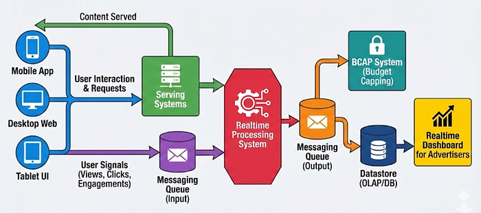
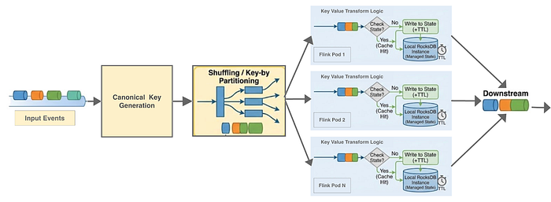
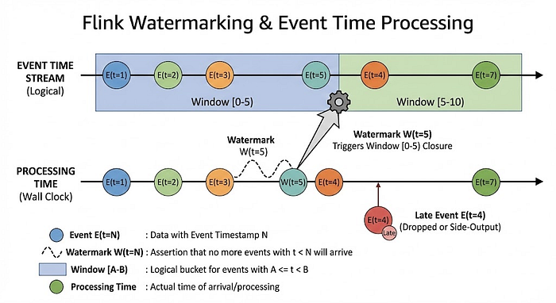
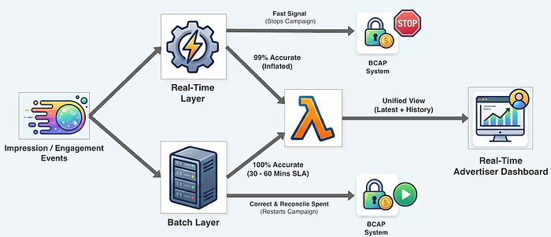

# High-Risk, High-Scale: Guaranteeing Ad Budget Precision at 1 Million Events/Second

Flipkart serves **thousands of sponsored ads** across various pages and with search queries. Advertisers are charged based on the **impression views or clicks** generated by their campaign content. In the high-velocity domain of AdTech, _the latency between an ad impression/click and a budget deduction represents a direct financial risk_. If the system lags, advertisers overspend; if it blocks, revenue is lost.

At Flipkart Ads, solving this required moving beyond standard stream processing to an eventual consistent, stateful architecture capable of sustaining millions of events per second.

This blog post dissects how we architected our ads ingestion ecosystem, specifically focusing on leveraging event-time semantics, deduplication, and watermarking to guarantee precise budget control amidst massive throughput.

---

## The Lifecycle of an Ad: From Provisioning to Interaction

The data lifecycle initiates when a user interacts with the served content on Flipkart’s platform. The user’s interaction with these campaigns closes the feedback loop. These placements generate high-velocity UI telemetry streams which our realtime pipeline must process and attribute against the advertiser’s budget in real-time.

We classify this telemetry into two primary event classes:

- **Impressions (Billable Views):** Emitted when a creative renders effectively within the user’s viewport, satisfying our viewability standards.
- **Engagements (High-Intent Actions):** Triggered by direct user interactions, such as “Click” or “Add to Cart” events.

---

## The Challenges: Precision at Millions of RPS

At Flipkart Ads, our pipeline manages an ingestion throughput of **millions records per second (RPS)**. This stream represents the aggregate of all user activity and critical interactions across the platform.

Our objective is to transform this raw, high-velocity **firehose** into precise, real-time campaign spend metrics. We are forced to navigate a critical trade-off between latency and availability, compounded by a non-negotiable constraint of financial correctness:

- **The Over-burn Risk:** Budget enforcement is time-sensitive. If spend aggregation incurs even minute-level latency (“_processing lag_”), we risk serving ads even after the budget is exhausted. In a high-frequency bidding environment, this results in significant, unrecoverable financial loss.
- **The Under-burn Risk:** Conversely, the system cannot fail-close. Overly conservative consistency checks or system downtime can prematurely halt campaigns. This leads to _“under-burn”_ — revenue leakage where we fail to deliver the client’s objectives due to false throttling.
- **The Deduplication Tax:** Reliability is insufficient; we require absolute correctness. Unlike latency or availability where we make calculated trade-offs, billing accuracy is non-negotiable. The pipeline must filter duplicate signals caused by network retries or client jitter to ensure exactly-one billable charge. This requirement imposes a heavy stateful processing _“tax”_ that significantly complicates achieving our latency goals at scale.

**The Tradeoff:**

Choosing a fully consistent system with exactly-once semantics would introduce high latency and compromise availability. Therefore, we have strategically chosen _at-least-once_ semantics, prioritizing high availability while accepting that the system will be eventually consistent, _relying on a downstream batch reconciliation layer for final auditability_.

Crucially, during severe outages or significant processing lag, our downstream budget controller (BCAP) utilizes the propagated _watermark_ progress to determine the maximum acceptable lag, ensuring safe, fail-safe enforcement even under abnormal or stressful operating conditions.

---

## High-Level Architecture

To meet these demands, we architected a fully horizontally scalable pipeline. As shown in the diagram, our data flows through several key stages, like serving content, user’s interaction, realtime processing, powering BCAP system and advertisers dashboard.

*High Level Architecture of Flipkart Ads for Powering Realtime Reporting and Budget Capping*

---

## Real-Time Idempotency: Deduplicating the Stream

In high throughput distributed systems, duplicate telemetry is inevitable — triggered by network retries, client-side scroll jitter, aggressive pre-fetching or business requirements. However, our system needs to effectively deduplicate this to represent true customer intent.

We must guarantee **idempotency**. Regardless of how many times an event enters the pipeline, it must result in exactly** one billable charge** within a given business window. To achieve this, we implemented a two-stage stateful processing topology.

### Stage 1: Canonical Key Generation

The first step is normalization. We convert the raw incoming stream into a Key-Value pair, where the key acts as the unique composite signature for the event.

- **ID Normalization:** We standardize differing ID formats generated by various ad sources, resolving the raw input down to a _single, canonical impression ID_.
- **Temporal Bucketing:** We append a time-window identifier (e.g., a 1-minute bucket derived from the event timestamp) to the ID. This ensures we are deduplicating within relevant business bounds.

### Stage 2: Stateful Evaluation & Suppression

Finally, the canonical keyed stream enters our Key-Value transform. We leverage Flink’s managed state (backed by RocksDB) to perform a low-latency existence check. As shown in the diagram, the canonical keyed stream shuffled on the basis of the key and spread among available Flink pods and the logic replaces simple conditional checks with an atomic state transition:

*Shuffling and Deduplication using RocksDB*

---

## Ensuring Correctness with Watermarking

One of the classic problems in stream processing is out-of-order events. In a perfect world, an event that happens at 10:00:00 arrives at our processor at 10:00:01. But in the real world of mobile apps, we face the **“App-in-Background”** Problem.

*Flink Watermarking & Event Time Processing*

​​Our mobile SDK utilizes local batching to respect battery life. If a user views an ad and immediately backgrounds the app, that event batch might remain on their device for hours.

This creates a massive conflict between **Event Time** (the moment of ad exposure) and **Processing Time** (the moment our pipeline receives the event). Because our settlement occurs on an hourly cadence, we allow for a maximum delay of 60 minutes. Any events arriving more than one hour after their timestamp are considered stale and are automatically dropped to prevent billing inaccuracies after a campaign has ended.

To manage this, we rely on **Watermarking** — a mechanism that embeds temporal progress indicators directly into the data stream. A watermark effectively asserts, _“No events older than time _**_`T`_**_ will be processed hereafter,”_ allowing the engine to close windows and materialize results.

---

## The Lambda Architecture

To resolve the tension between the “milli-seconds rush” (_speed_) and the “hours wait” (_completeness_), we adopted a **Lambda Architecture**, strictly decoupling _Enforcement from Settlement_.

*Lambda Architecture for Flipkart Ads Realtime Reporting*

**The Speed Layer (Flink):** We tuned our watermark heuristics based on the p99 statistical distribution of event lateness. We accept an “eventual consistency” where the stream captures the vast majority of spend to trigger near-real-time budget stops.

**The Batch Layer (Reconciliation):** To guarantee absolute billing precision, we rely on a parallel batch layer as the authoritative source of truth. Unlike the real-time path, this layer enforces strict validity by performing a **temporal join** between the interaction signals and the immutable **‘Served Ad’** logs. This process effectively reconciles the data, filtering out duplicates or orphans to ensure the final advertiser charge is mathematically exact.

_Note: The engineering complexity of optimizing these massive shuffle-heavy joins deserves its own analysis. We will break down the architecture of this Batch Reconciliation pipeline in a dedicated follow-up post._

---

## Conclusion

Building a real-time spend pipeline at this scale is a complex undertaking, but it is essential for the health of our advertising platform. By utilizing a horizontally scalable architecture and leveraging sophisticated stream processing techniques like stateful deduplication and canonical key generation, we successfully built a system that can:

- Process a firehose of ~1 million events per second.
- Provide real-time spend metrics to automatically stop campaigns, protecting advertiser trust.
- Guarantee financial accuracy through a hybrid stream-batch reconciliation strategy.

---

## Key Takeaways

**Prioritising At least-once over Exactly-once Semantics for Financial Safety:** At 1M RPS, latency equals financial risk. We deliberately chose _“at-least-once”_ semantics for high availability in the hot path to ensure sub-second budget enforcement, deferring strict consistency to reconciliation.

**Distributed Idempotency via Stateful Processing:** _“Atleast-once”_ billing is non-negotiable. We achieved this by leveraging Flink’s managed state (RocksDB) and canonical key generation to atomically filter high-velocity duplicate streams.

**Mastering Temporal Skew with Event Time:** Addressing mobile _“App-in-Background”_ delays requires prioritizing when an event happened, not when it arrived. We utilize Flink Watermarks to enforce Event-Time semantics for accurate temporal bucketing.

**Decoupling Speed vs. Precision (Lambda Architecture):** We resolved the tension between operational urgency and financial auditability by separating concerns: Flink drives p99 latency enforcement, while a parallel batch layer provides the authoritative source of truth for final settlement.

---

> Authored by [Abhishek Bharti](https://medium.com/@akbirooks007) & [Ankur Gupta](https://medium.com/@ankur.g03)

---
**Tags:** Adtech · Stream Processing · Apache Flink · Lambda Architecture · Data Engineering
