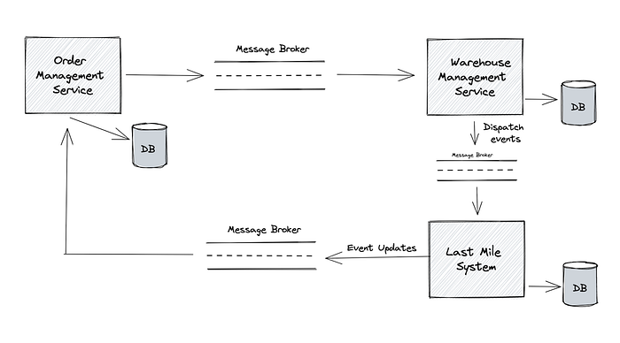
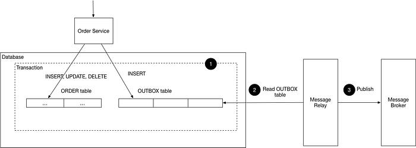
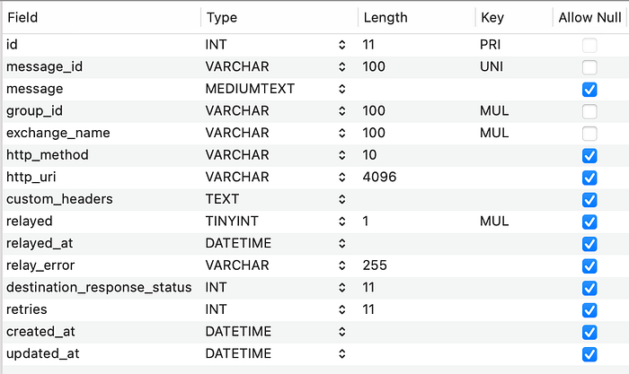
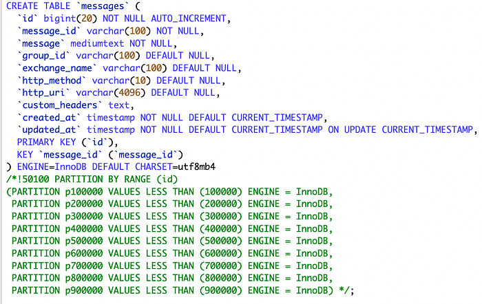
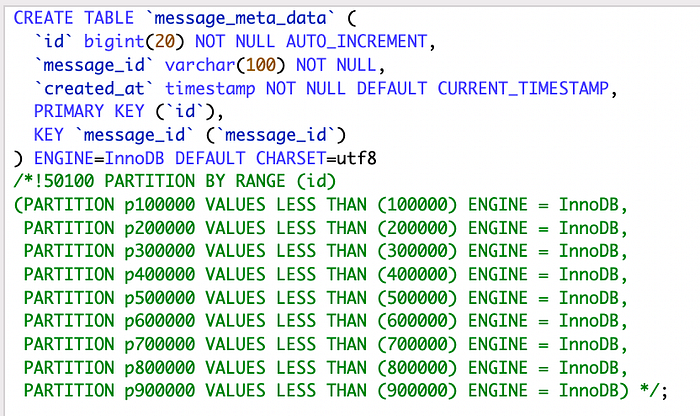

# Turbo Relayer — Relaying high throughput messages reliably between Microservices

## Motivation

Just like in any other e-commerce platform, an order placed on the Flipkart website goes through multiple systems such as the Order Management system, Seller Fulfillment system, Warehouse Management system, Accounting system, and Last Mile before it is delivered to the customer. Multiple microservices make up each of these closely dependent systems. During an order fulfillment journey, these microservices often send messages and events between them asynchronously to realize multiple functional flows such as pick, pack, dispatch, and deliver, at scale. Sending the messages and events asynchronously helps us in two ways:

- These services are not tightly coupled w. r. t. their evolution, deployments, etc.
- There is a clear functional boundary between them and well-defined interfaces to communicate.

We use Kafka as a message bus to send the messages between the services. Let’s assume Service ‘A’ receives a request. As part of that request, Service ‘A’ does some processing, including its database update, and sends the request to Message Broker (in this case, Kafka) for Service B.

Our problem statement:

- How do we maintain atomicity between database update in Service A and the event propagation to Service B?

Our challenge was to handle the failure scenarios seamlessly across the org, where we wanted to ensure that when a write to the database fails, we revert the writes to the Message Broker as well and vice versa.

The ideal approach would have been achieving this via a traditional distributed transaction (like 2PC) that spans the database and the message broker. As we are using Kafka for async communication, we used a [Transactional outbox](https://microservices.io/patterns/data/transactional-outbox.html) pattern for the same.

Our secondary goals were to:

- Ensure zero message loss while sending a message from Service A to Service B/MessageBroker.
- Handle long-running transactions/rollback of primary entities.
- Handle failures gracefully while pushing messages to Message Brokers.
- Minimize Relay lag while relaying messages from the Outbox table.
- Provide order guarantee while relaying the messages of an aggregate/group of entities.

## Initial implementation of Transactional Outbox Pattern

The way transactional outbox ( [Polling publisher](https://microservices.io/patterns/data/polling-publisher.html) ) pattern works is:

- Service A writes the primary entity and the event both in the primary database in 2 separate tables. Let’s call the primary entity/table which maintains the state as PRIMARY_ENTITY and the outbound entity which stores events as MESSAGES.
- There is a separate Relayer/Poller process (explained later) that reads these events from the MESSAGES and sends them to the message broker responsible for sending them to Service B.

As soon as the Service ‘A’ receives a request, it:

1. Performs required processing/enrichment of the request before updating the database.
2. Starts a DB Transaction.
3. Updates state of the entity in PRIMARY_ENTITY.
4. Updates entity MESSAGES with the event it sends to Service B.
5. Commits the DB Transaction.

A separate relayer process polls the MESSAGES table for any inserts and relays the committed messages to the message broker.

*Image Source: microservices.io*

Since both the tables (PRIMARY_ENTITY & MESSAGES) are part of the same (ACID compliant) database, we can commit/rollback the event along with the primary entity update.

This ensures that the Relayer would relay the event only when the primary entity is committed. (The database, such as MySQL, needs to be at the READ_COMMITTED isolation level).

**Why did we not choose the CDC approach, which is another way to implement the Transactional Outbox pattern?**

While CDC-based solutions are becoming very popular in the recent past, they were not very mature when we explored the solution (around 2015–16). It required us to solve for each type of database separately. Duplicate publishing was also tricky to handle in CDC. Considering the time to market and the complexity of the solution in mind, we went ahead with the Relayer-architecture approach.

## Relayer Architecture and how it solved our secondary goals

Relayer is a microservice responsible for polling the MESSAGES table for new messages. It continuously scans and picks up a batch of new messages (ordered by id) and marks them as ‘relayed’ as soon as they are successfully sent to the message_broker.

- Service A writes the event to the MESSAGES table which has the below schema:

_Message_

- **_id_**: Autoincrement primary key
- **_message_id_**: Identifier for a message (say a UUID)
- **_message_**: Payload to be sent to destination
- **_group_id_**: GroupId for a message. Used for ordering the same group messages.
- **_exchange_name_**: Topic name within message broker
- **_http_method / http_uri / custom_headers_** **_/ destination_response_status_**: Fields used for cases where Relayer is used to publish to a REST endpoint instead of message_broker
- **_relayed / relayed_at / relay_error / retries_**: status of a message once the message has been picked up for publishing. Updated by Relayer.

## Problems with our initial implementation

Although the above solution solved the functional requirements, we faced multiple issues when we scaled our systems. A few of them are mentioned below:

1. Disk footprint of the Primary database increased (data growth) because of events/messages being part of the same database.
2. Relayer was a single point of failure in relaying the messages. No High Availability.
3. If multiple instances of Relayer were running, the Relayer had to take a table-level lock while fetching the messages to ensure that no other thread marked that message as ‘Relayed’.
4. Read and Write throughput requirements increased multifold on primary data stores.
5. From the ‘Write’ perspective, the first write was in the MESSAGES table while inserting the message payload and the second write was required to update the message as and when it was relayed.
6. From the ‘Read’ perspective, as the Relayer worked on polling for new messages, the number of reads on the primary database increased multifold. Besides, each Read from this primary store resulted in sending the entire entity (containing the message payload) to the Relayer. This meant that the reads were costly, which affected Primary DB latencies because of the network bandwidth limitations.

## Turbo Relayer

The aforementioned challenges brought us to the next version of Relayer, aka Turbo Relayer (TR), which we use in Production.

We’ve grouped the challenges into:

- Scaling Primary Database for Non-functional Requirements (Disk and Network Bandwidth)
- Reducing queries on outbound DB
- Handling Data Growth

Let’s discuss each challenge and see how we solved them.

### Scaling Primary Database for Non-functional Requirements (Disk & Network Bandwidth)

In the earlier approach, by adding an extra entity of MESSAGES, the primary database now needs to store the entire payload of messages to be sent. The payload can be huge, which means the messages table can explode in size, requiring us to scale our primary database.

Also, as Relayer uses a polling mechanism to detect new messages, our primary database needs to support the high reads for polling and high writes for inserting messages and updating each message with a relayed flag.

A solution would be to move our MESSAGES table outside the primary database (to say Outbound Database) so that the primary database does not have to support high throughput, saving us from affecting functional flows. However, it would be complex to provide cross-database transactions while keeping the insertion code logic simple.

We chose a simple approach: Move the payload and metadata related to the message to a separate database, but commit the message identifier (say message_id) into the primary database in the same functional transaction.

While Relayer gets the entire data from the Outbound Database, it doesn’t relay the messages until it is committed in the primary database table.

This helped us in multiple ways. Our primary database now has a minimal footprint of extra data (as we store just the message_id). Throughput requirements from Primary DB reduced drastically as:

- Relayer queries the primary database only to get message-id
- The payload transfers over the network and updates after the message relay is done on Outbound DB. Hence, now the Relayer can point to the slave/read-replica of Primary DB.

In this approach, the client needs to write to two databases (with 2 insert queries — one for message payload and 2nd for message-id). The extra write compared to the previous approach is only a message_id, which is very low latent compared to the DB scaleup requirement we had in the previous approach.

### Reducing queries on Outbound DB

We reduced the extra load from Relayer to the Primary DB. This means any functional path dependent on this DB is isolated from the Relayer process queries. We still needed to solve these challenges for Outbound DB so that Relayer can provide high throughput while reducing the load on DB.

We want to get rid of:

- Table level locks while reading/updating the DB
- Scanning the entire table for un-relayed messages
- Updating the DB after relaying each message

We maintained data boundaries and avoided repetitive data reads to solve this. In the previous approach, Relayer had to update the ‘Relayed’ flag in DB as it would read unrelayed messages based on this flag. We shifted our read logic from the boolean ‘Relayed’ flag to auto-increment-ids.

The Relayer would read messages in a particular range and then move ahead with the next range (similar to the non-overlapping sliding window). For a batch size of say 1000, the Relayer would read messages from 1 to 1000, then 1001–2000, 2001–3000, and so on. We would update this checkpoint periodically into Outbound DB in a separate table, which would be the starting point in case the Relayer process fails. This also made our queries faster, as we now query on the primary key, i.e. auto-increment ids.

This also brought in a new issue of long-running transactions or uncommitted messages while reading a particular range (we’ll** **soon write about it).

### Handling Data Growth

We moved the Outbound DB out of the Primary store and made our functional application path secure. The number of DB calls to outbound DB was reduced. We not only reduced the network bandwidth requirements but also increased the throughput of the Relayer.

How did we solve for continuous data growth in Outbound DB? Our solution choice was guided by two factors:

- The data in the MESSAGES entity is append-only and there won’t be any lookup or functional dependency on this data apart from Relayer.
- It is safe to purge/archive this data once the message is relayed.

The simplest choice would be to delete the message as soon as it is relayed. This also means we are adding one more delete command for each relayed message (similar to maintaining a relayed flag in the previous approach). In DB like MySQL, deletion would leave out holes that require us to [optimize the table](https://dev.mysql.com/doc/refman/5.7/en/optimize-table.html) periodically to claim back the disk space. Hence, purging each record wasn’t a workable solution for us.

We solved this using [MySQL Range Partitions](https://dev.mysql.com/doc/mysql-partitioning-excerpt/5.7/en/partitioning-range.html) on auto-increment ids. Given that relaying is now range-based, and the range is ever increasing, we can safely assume that once the range has crossed the checkpoint, the message would have got relayed and the messages in that partition are not required.

We built an Auto Partition Management tool within the Relayer application that creates new partitions as soon as the empty partitions reduce below a threshold. It drops the partition after the user-configured retention period, once the messages are relayed. **Dropping a partition, compared to a single row, doesn’t leave out any holes, and the space is recovered immediately.**

The overall flow now is :

1. Service ‘A’ writes the entity records to the Primary DB.
2. Service A creates a record in Outbound DB with message_id (UUID) and then uses the generated auto-increment id & same message_id (UUID) to write into application DB.
3. The Primary DB record gets committed only if the transaction in which this record has been written is committed.
4. If the transaction gets rolled back, then the Primary DB record will not be available and the corresponding outbound message will not be relayed to the message broker.

Here’s a glimpse of the new schema:

*Outbound DB*

*Primary DB*

**Conclusion**

The above approaches helped in solving the non-functional issues related to data growth, query reduction, and disk/network optimizations and as a result, we could scale Relayer by ~5x to 8x (~20k messages relayed per sec) in terms of throughput.

We’ll talk about the low-level design of the Turbo Relayer and its subcomponents, some aspects around the High availability of Relayer, Query tuning, Monitoring, etc. in future articles. Stay tuned!

— Turbo Relayer Team ([Dhruvik Shah](https://medium.com/@dhruvik04_44048) & [Rahul Agrawal](https://medium.com/@rahulagrawal.skb))

---
**Tags:** Messaging · Reliability · Distributed Systems · Kafka · Transactions
