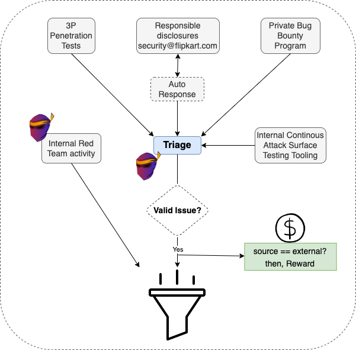
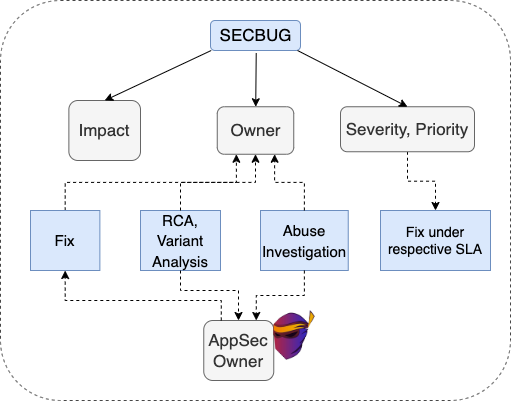
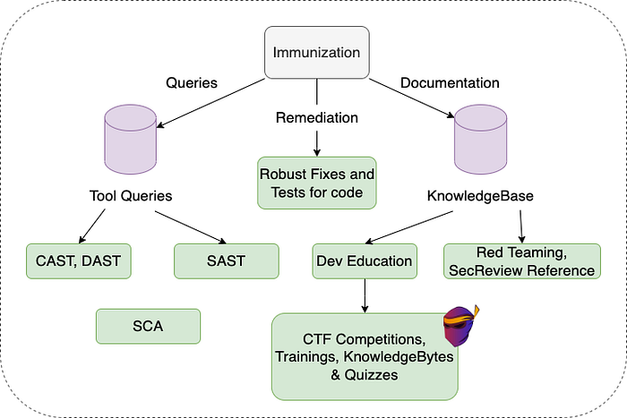

# How Flipkart Reacts to Security Vulnerabilities

## Introduction

Flipkart, being primarily a tech behemoth, obviously has a massive software footprint. The systems that power this scale can be completely pictured as a living body, which goes through multiple phases of growth, development, diseases, recovery, and immunization.

Just as the human body can be extremely fit and still become sick, the same applies to any software system as well. Even after infusing proper security immunity into our products in each phase of the Software Development Life Cycle (SDLC), the vulnerabilities are inevitable.

Flipkart’s AppSec Team makes Flipkart’s software durable against many software diseases (vulnerabilities). However, the huge scale of Flipkart’s production proportionally leads to security issues, which AppSec has to deal with frequently.

While the team has been working on fixes for all kinds of vulnerabilities, there have been recurrences of similar or the same issues in other places. The fundamental flaw with just patching a bug is that it only fixes one instance, and the total ecosystem does not get immunized to it. As part of our ongoing effort toward securing Flipkart Assets and its customers, we looked at the bigger picture to streamline and fine-tune our outlook towards vulnerabilities so we avoid recurrences.

We mutated Flipkart AppSec’s core culture to embrace these vulnerabilities, introspect, learn, and make the systems immune to them in the future. This write-up highlights our current process of dealing with security issues.

## Vulnerability Identification Sources

At the moment, there are five active channels from which vulnerabilities are reported to us for _production environments. O_ther channels such as Security Reviews and Penetration Tests exist to identify vulnerabilities in software that is not in production.

### Responsible Disclosures

This is the way for an external person to report security vulnerabilities to us. The reporter has to adhere to the policy document [here](https://www.flipkart.com/pages/security).

Whenever someone reports through email to “_security@flipkart.com”_, we reply to the email with an AutoResponse message, which redirects the reporter to our public HackerOne Platform Reporting Form. It helps them create a Security Report for us, properly describing the vulnerability, steps to reproduce the issue, and the assumed security impact on Flipkart or its users.

### Private Bug Bounty Program

Through our private bug bounty program, we allow motivated professional hackers to test our external attack surface for vulnerabilities hiding in plain sight or deep under the layers.

### Third-Party Penetration Tests

Once a year, one of the industry’s best Penetration testing vendors performs a scoped test of our external assets for a decided timeframe.

### Internal Red Team Activity

Our AppSec members, inclined toward ‘Offensive security’, do a recurring testing activity for internal and external assets of Flipkart.

### Internal Offensive Tools

This is a set of internal continuous application security testing tools we built from scratch to monitor assets. It also helps deploy frequent contextual and targeted scans on the assets.

## Triage

Every Vulnerability once reported, needs to be validated if it comes from an automated tool or an external source. A Security Engineer manually reproduces the vulnerable behavior and validates if the behavior gives rise to a vulnerability having a security-related impact.

Once validated, we use [JIRA](https://www.atlassian.com/software/jira) extensively for the Vulnerability Management with all necessary customizations for relevant workflows and automation.

If the Source of vulnerability is Responsible Disclosure or our HackerOne Program, we issue a Bounty Reward to the reporter according to the security impact on Flipkart Assets and our users.

*Channels of Vulnerabilities for Production*

## Vulnerability Management

Post validation, our vulnerability management flow kicks in. At the core lies our JIRA Project. A vulnerability ticket gets created under this project, via a semi or fully automated process, depending on the source of the vulnerability.

This vulnerability ticket has certain attributes attached to it, which determine its lifecycle:

**Dev Owner**   
The Engineering stakeholders of the service that is affected. They will follow the remediation steps to fix the vulnerability and help the AppSec owner in RCA and other investigations.

**AppSec owner**  
The point of contact Security Engineer from the AppSec team for the business unit which owns the system involved. This person has the expertise and understanding of the systems involved in their purview. They provide all attributes in the ticket and own the ticket until it is resolved.

**RCA and Variant Analysis**   
We find the root cause and other instances of vulnerability which we can use later to give proper remediation plan and immunization.

**Abuse Investigation**  
With the help of the **Dev owner**, we analyze the state of the system using logs and other helpful tools to determine if the vulnerability has been exploited.

**Fix**  
A robust solution in the code or configuration, such that the vulnerability gets completely patched and does not occur again in the same vicinity of the codebase in the future. We also ensure that the owner adds the test case, if possible, to their regression test suite.

**Impact**  
The damage this vulnerability can cause to the service and the whole of Flipkart/its users if it lives on in production.

**Severity**  
The level of severity of the vulnerability is self-calculated according to the business of the system involved, with flexible use of [CVSS](https://www.first.org/cvss/) if required.

**Priority**  
The level of urgency with which the issue should be dealt with. This basically signifies the immediate impact and severity of the bug on the whole of Flipkart and not just the system involved.

**SLA**  
After determining all the above attributes, we have a Ticket with a security score, which determines the SLA (basically a strict deadline to fix the issue). The owner has to adhere to this SLA while working on the fix of the vulnerability. To help AppSec and stakeholders adhere to the SLA of tickets, a separate Incident Management Team works along the lifecycle of the ticket until it’s closed. The system sends all the Vulnerability SLA breach notifications periodically to the Owner and their managers.

*Attributes of a Vulnerability Ticket*

## Immunization

As a security engineer, this is the most fulfilling part of our vulnerability management process. We don’t just fix the vulnerabilities, but we also ensure that we learn from the gaps that introduced the vulnerability and systematically introduce technical or procedural guardrails to immunize Flipkart from them forever.

### Remediation Plan

It starts with the Appsec engineers fully understanding the root cause(s) of the vulnerabilities and finding possible variants of the vulnerability in the codebase. With this understanding, they provide a very robust and centralized way of fixing the vulnerability, such that the possibility of any developer committing the same vulnerability in the future is eliminated. We also mandate to add the tests for the patch, and to the codebase’s test suite.

Also, with a publicly known Zero-Day vulnerability that is prone to get actively exploited, we start with adding Web Application Firewall rules for blocking malicious traffic at the point of ingress itself and then proceed with the robust mitigations.

### AppSec Test Suite

To not just rely on the patch and the tests written by the Dev owners, we also employ our own testing tools, which run continuously 24x7.  
The AppSec engineer determines if the exploit of the vulnerability is a good candidate for creating a query and including it in our scan engine databases. This is done by taking vulnerability into consideration. A good candidate for these queries will be the vulnerabilities that are:

- Generic and possibly apply to all of our assets. For example, a [DAST](https://en.wikipedia.org/wiki/Dynamic_application_security_testing) query for a zero-day vulnerability that applies to our tech stack.
- Specific to Flipkart’s architecture. For example, a [SAST](https://en.wikipedia.org/wiki/Static_application_security_testing) Query to determine vulnerable usage of an internal library.

### Documentation

We do thorough bookkeeping of all the new lessons we get from the vulnerabilities. These documents involve RCAs, Immunization measures, etc. We primarily use these as references for our Developer Security Education Programs and our future Red Teaming References.

### Developer Security Education

We love to share the application security knowledge with our developers pragmatically so that it creates a ‘security-first’ mindset in the development phase itself. We achieve this with the help of our Vulnerability Documentations so that only relevant and interesting information is shared across.

To educate developers we organize:

- **CTF Competitions**: The events where Developers compete by solving security challenges, which mimic the exact real-world vulnerabilities which were found in Flipkart assets.
- **Training**: We avoid keeping the content of these training generic, the training deck is built around the information which applies to the audience and has Flipkart environment-specific security knowledge.
- **Knowledge Bytes**: A Recurring email to all the Engineering team members, containing an autopsy of the recently found cool security vulnerabilities.
- **Quizzes**: Full of brainteaser MCQs around how to be a Flipster with a security mindset.

### Red Teaming and Assessment References

Documentation also helps us in future AppSec assessments and our RedTeaming activities.

For example, whenever a new member of the Appsec team is reviewing Flipkart assets, they go through the docs and get up to speed with what to expect in their assessments, and where to focus their strategies. This makes them comfortable and efficient while dealing with the massive Flipkart tech stack and its complexities.

The existing members of the red team also use it to approach the same or similar target in their activity.

*Immunization Procedures at Flipkart*

## Conclusion

The above strategies are specifically designed to make vulnerabilities a component of a feedback loop which improves and hardens what we do as part of Application Security at Flipkart.

There is a lot more that we plan to do in the future to squeeze all the juice out of every vulnerability. On another note, we plan to share more details on the particulars mentioned in this blog soon, keep an eye out for future posts.

---
**Tags:** Security · Application Security · Security Engineering · Cybersecurity · Infosec
