# Iceberg vs Hudi — Benchmarking TableFormats

## Introduction

In recent times, the Distributed Systems industry has been rapidly moving towards TableFormats and Lakehouse Architecture to modernize their Data Lakes.

This article explores Flipkart’s benchmarking exercise, comparing the performance of the most prominent TableFormats: Hudi and Iceberg. It analyzes the high-level results observed for various benchmarking profiles, providing insights into how data characteristics influence the optimal choice of TableFormat.

Although Flipkart went ahead with Iceberg as the Tableformat of its choice, this article tries to compare performance numbers between Hudi and Iceberg for different kinds of profiles to assess how these two compare to each other in terms of performance.

Our benchmarking exercise included industry-standard benchmarks such as TPC-DS and custom tests such as Upserts. Such a holistic approach enables readers to make informed decisions about the most suitable TableFormat for their specific workloads and requirements.

### What is Lakehouse?

In big data technology, the term “Lakehouse”, referred to a data architecture that aimed to combine the benefits of both data lakes and data warehouses.

1. **Data Lake**: A storage repository that holds _vast amounts_ of raw data.
2. **Data Warehouse**: A storage repository designed for _fast and efficient_ querying by storing structured data.
3. **Lakehouse**: A data architecture that combines the strengths of both data lakes and data warehouses by:

- Providing **ACID guarantees**
- Supporting indexes for faster query performance
- Having an efficient Metadata layer
- Providing Change Data Stream useful for mini-batch updates and incremental updates.

### What is TableFormat?

**TableFormat: is Metadata over a regular Data file.**

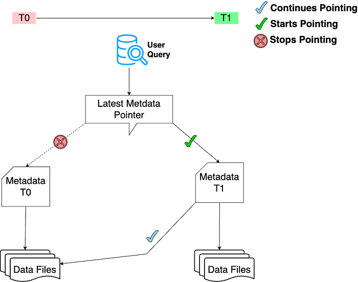

**Understanding the Relationship Between Lakehouse and Table Format:**

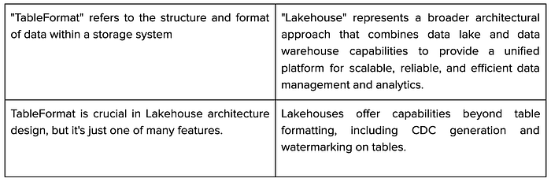

### Scope of the document

This benchmarking investigates the impact of TableFormats on Data Lakehouse performance. By judiciously selecting a TableFormat, we can enhance read performance on the same dataset because of the additional metadata. While write performance may experience a slight degradation, the overall impact including read and compute costs is notably positive. We leverage the TPC-DS benchmark to evaluate different TableFormats and identify the most suitable options for various scenarios within a Data Lakehouse environment.

### What is TPC-DS?

TPC-DS is a data warehousing benchmark defined by the Transaction Processing Performance Council (TPC). TPC is a non-profit organization founded by the database community in the late 1980s to develop benchmarks that may be used objectively to test database system performance by simulating real-world scenarios. TPC has had a significant impact on the database industry.

“Decision support” is what the “DS” in TPC-DS stands for. The TPCDS benchmark suit has 99 queries in total, ranging from simple aggregations to advanced pattern analysis.

Details of the queries can be seen [here](https://github.com/delta-io/delta/blob/master/benchmarks/src/main/scala/benchmark/TPCDSBenchmarkQueries.scala)

### How was the benchmark conducted?

The following are the steps leading up to the benchmark exercise:

1. Choose the various candidate profiles.
2. Identify the readily available open-source tools to simulate the widely known benchmark tests such as TPC-DS. Note: For a consistent and efficient benchmarking process, we opted to utilize the open-source Delta benchmarks hosted on [GitHub](https://github.com/delta-io/delta/tree/master/benchmarks).
3. Set up our infra cluster.
4. Run the benchmark tests.

### Infra Stack Info:

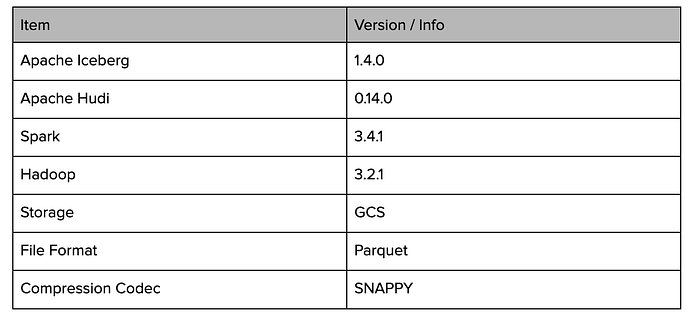

In addition, the stack included the following customizations:

- **Iceberg Customization:**   
The Iceberg customization was achieved through the following [pull request](https://github.com/delta-io/delta/compare/master...mudit1289:delta:fk_iceberg_benchmark?expand=1). Configs used for Iceberg can be found [here](./iceberg-vs-hudi-benchmarking-tableformats-dffe6f81f26e.md).
- **Hudi Customization:**   
Similarly, the Hudi customization was implemented through the following [pull request](https://github.com/delta-io/delta/compare/master...mudit1289:delta:fk_hudi_benchmark?expand=1). Inspiration for this implementation came from [this pull request](https://github.com/delta-io/delta/compare/master...alexeykudinkin:delta:ak/dlt-bcnh-fix) released by [Onehouse](./iceberg-vs-hudi-benchmarking-tableformats-dffe6f81f26e.md) for achieving the best performance with Hudi. The Hudi configurations used in our benchmarking process can be found [here](./iceberg-vs-hudi-benchmarking-tableformats-dffe6f81f26e.md).
- **Spark as Execution Engine:**  
We employed Spark Compute in self-managed Hadoop clusters using some specific [configs](./iceberg-vs-hudi-benchmarking-tableformats-dffe6f81f26e.md) to orchestrate and execute all the benchmark tests. This helped us to manage and execute our tests efficiently.
- **Data Storage in GCS Buckets:**  
The benchmark data was stored in Google Cloud Storage (GCS) buckets for efficient access and scalability during the testing process.

## Benchmarking and Analysis:

We conducted the benchmark for profiles: 1 GB, 1 TB, and 100 TB. We noticed that Iceberg was consistently better than Hudi in Load profiles. For Query profiles, Iceberg was better till 1 TB, while its performance degraded a little in the 100 TB profile.

A snapshot of our categorized results:

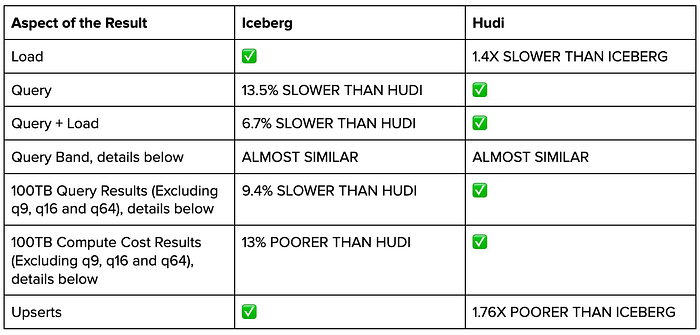

### Load: In our benchmarks, Iceberg exhibited Better Performance

For load tests, we ran TPCDS load queries and collated the results. For load profiles, we took the total load creation time and total load drop time. Although at 100TB, the graphs might depict iceberg as the slower one, the drop queries are in general very fast so just 3 seconds of difference is depicted as very high in graphs, but in overall load aggregated results (summed up results of create + drop), Iceberg was much better than Hudi.

We also checked the number of load queries that performed better in Iceberg as compared to Hudi. The load queries performed better in Iceberg than in Hudi for 90% of the scenarios.

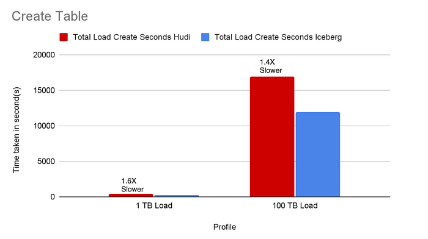

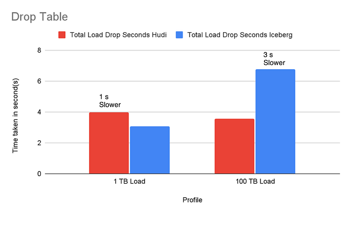

### Query: In our benchmarks, Hudi exhibited marginally better performance than Iceberg.

For query profiles, we ran 3 iterations each for all queries in the TPCDS suite and took the metric: Average query time per query. We summed up the average numbers for all queries to get the total average query time.

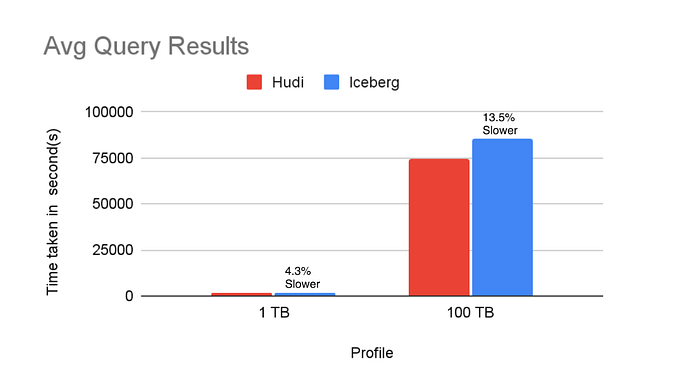

### Overall Results: Query + Load: In our benchmarks, Hudi exhibited marginally better performance than Iceberg.

For query profiles, we ran 3 iterations each for all queries and took the metric: Average query time per query. We summed up the average numbers for all queries to get the total average query time and added load time to calculate the overall time. At 1 TB, the Iceberg was 5.3% faster than Hudi while at 100 TB, overall results showed Iceberg being 6.7% slower than Hudi.

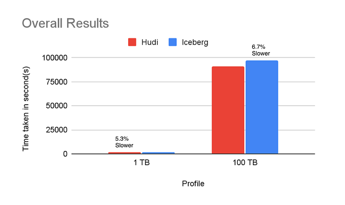

### Query Band Results: In our benchmark, Iceberg, and Hudi exhibited similar Performance

For query profiles, we ran 3 iterations each for all queries and took the following metrics:

1. Average query time per query

2. First Iteration Query time per query

This analysis was done specifically to understand how many queries perform better in each Tableformat as compared to the other one and by how much percentage. This helped us understand that even if Iceberg is slower overall, in terms of queries, what is the split of queries that perform better in Iceberg vs queries that perform better in Hudi?

We defined a metric:

**Performance-Ratio (PR): Iceberg Wallclock Time to run a query/ Hudi Wallclock Time to run the same query.**

Post this, we divided the results into various bands:

- PR < 0.5 ⇒ Iceberg is much better than Hudi
- 0.5 <= PR < 0.66 ⇒ Iceberg is considerably better than Hudi
- 0.66 <= PR < 0.9 ⇒ Iceberg is better than Hudi
- 0.9 <= PR <= 1 ⇒ Iceberg is marginally better than Hudi
- 1 < PR <= 1.1 ⇒ Hudi is marginally better than Iceberg
- 1.1 < PR <= 1.5 ⇒ Hudi is better than Iceberg
- 1.5 < PR <= 2 ⇒ Hudi is considerably better than Iceberg
- PR > 2 ⇒ Hudi is much better than Iceberg

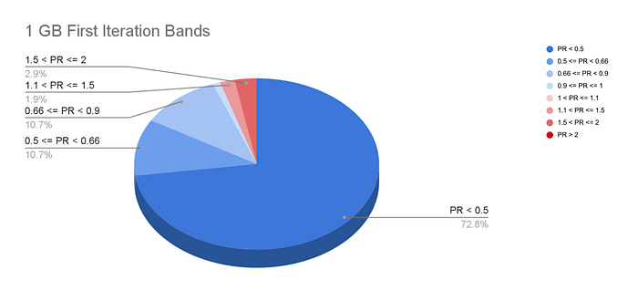

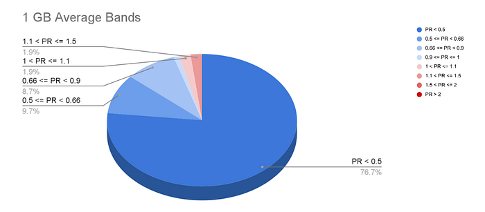

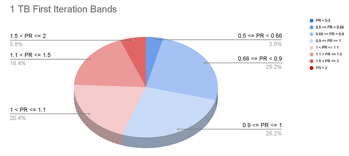

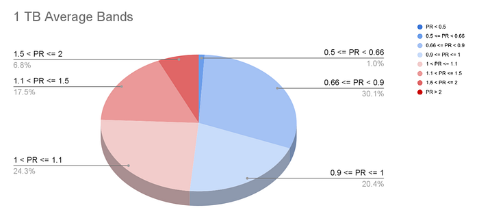

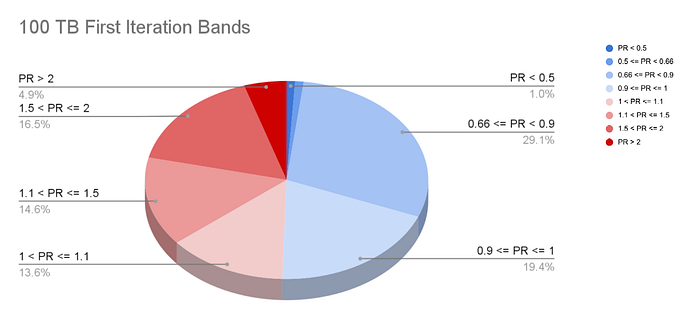

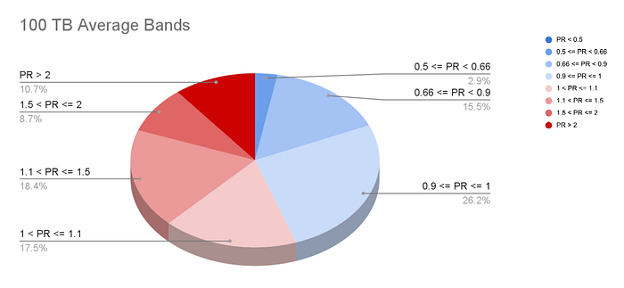

So this shows that even though Iceberg was 13.5% slower than Hudi if we take the split of queries better in Iceberg vs better in Hudi, they are almost similar.

But as already discussed in our benchmarking exercise, if we consider only Query performance, then Hudi was 13.5% better than Iceberg. We went ahead and deep-dived into the queries that were lagging the most in Iceberg

### 100TB Query Results (Excluding q9, q16, and q64): In our benchmarks, Hudi exhibited marginally better performance than Iceberg.

We deep-dived the queries q9, q16, and q64 from results because their performance delta between Iceberg and Hudi was worst (Iceberg was lagging by a good margin), but finally ended up excluding these from our results because of the following observations:

[**Q9**](https://github.com/delta-io/delta/blob/master/benchmarks/src/main/scala/benchmark/TPCDSBenchmarkQueries.scala#L518) (60% slower in iceberg):

- **Issue**: Iceberg does not reuse the sub-queries, unlike Hudi.
- **Analysis** → There is an alternative to this, where users can use the **_WITH _**clause and provide the subquery that they want to be reused as part of the **_WITH_** clause, and the performance was similar in both Iceberg and Hudi.

[**Q16**](https://github.com/delta-io/delta/blob/master/benchmarks/src/main/scala/benchmark/TPCDSBenchmarkQueries.scala#L1018) (95% slower in iceberg):

- **Issue**: The **_exists_** clauses are suboptimal in Iceberg.
- **Analysis** → We have not deep-dived into the **_exists_** patterns here because we believe the issue here is with the Iceberg’s Spark extension jar and should be fixable by investing some more time on the Iceberg side.

[**Q64**](https://github.com/delta-io/delta/blob/master/benchmarks/src/main/scala/benchmark/TPCDSBenchmarkQueries.scala#L7851) (77% slower in iceberg):

- **Issue**: The number of sub-queries generated in Iceberg is smaller, which prevents Iceberg from filtering rows before shuffling, unlike Hudi.
- **Analysis** → We have not deep-dived into this pattern here because we believe the issue here is with the Iceberg’s Spark extensions jar and should be fixable by investing some more time on the Iceberg side. Also, we have observed that the same query on the 1 TB profile was performing similarly in both Iceberg and Hudi but the performance degraded during the 100TB profile so the blast radius is also partial and it is impacting only the higher data profiles.

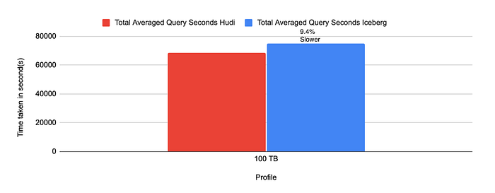

After excluding those 3 queries, query results in Iceberg were 9.4% slower, while including them Iceberg was 13.5% slower as discussed above.

### 100TB Compute/Cost Results (Excluding q9, q16, and q64): In our benchmarks, Hudi exhibited marginally better performance than Iceberg.

TPCDS suite by default provides just the wallclockTime-based analysis, we went ahead and analyzed the compute used by the profiles also instead of just measuring the time to complete the queries. We excluded the queries q9, q16, and q64 from the results because of the above-mentioned reasons.

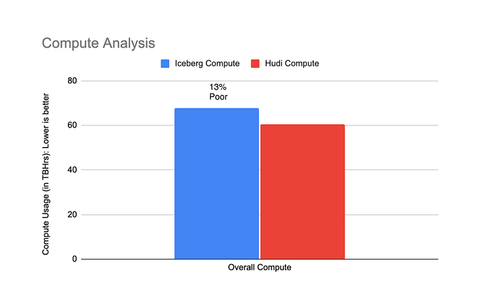

### Upsert Benchmarking

The TPCDS Benchmarking includes data load scenarios that help us evaluate load performance, similar to insert-only use cases in distributed systems. The preceding sections of this blog primarily focused on benchmarking query and insert performance. In distributed systems, upserts are also heavily used. To assess upsert performance, we conducted an additional benchmark for small data sizes using simulated data.

**Simulated Data Details:**

- Data Size: 24 GBs
- Total Number of Columns in Dataset: 110 (Containing nested columns)
- Total Number of Rows in Dataset: 46268189

This ensures that we gauge how TableFormats would perform if utilized for mini-batch or near-streaming use cases in the future.

This benchmarking is not covered by default in the TPC-DS benchmark suite.

**How did we conduct this test?**

1. Created a table with nested schema using Spark SQL in the desired TableFormat.
2. Inserted simulated data rows in the table.
3. Used MERGE syntax for TableFormats in Spark SQL to upsert similar size batch (as used in insert in step 2) of simulated new data containing partial updates and partial inserts.

### Upsert Benchmarking Results: In our benchmarks, Iceberg exhibited better performance than Hudi

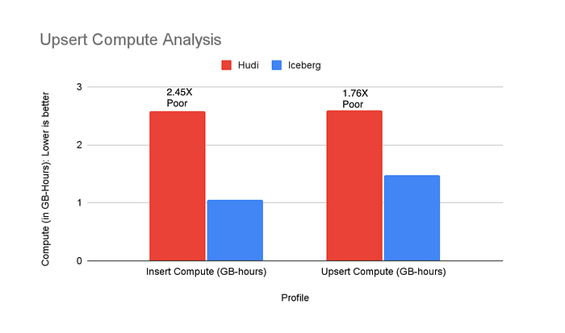

## Conclusion

### Identified gaps in Iceberg

- Iceberg does getBlockLocation calls to locate compute tasks on nodes where data resides and for better data locality. This causes a higher initial startup time. This issue was not observed for object storage like GCS.
- Iceberg does not push filters till the Parquet layer and underperforms in several queries: [https://github.com/apache/iceberg/pull/9479](https://github.com/apache/iceberg/pull/9479)
- Iceberg has less number of subqueries as compared to Hudi in some cases thereby causing poor filtering of data and higher shuffle. It was also observed that with 1 TB data, a higher number of subqueries were created in Iceberg but with > 1 TB data, subqueries got reduced and Iceberg behaved poorly: [q64 query in the TPCDS suite suffered from the same issue](./iceberg-vs-hudi-benchmarking-tableformats-dffe6f81f26e.md).
- Queries with the **_exists_** clause are performing better in Hudi: [q16 query in the TPCDS suite suffered from the same issue](./iceberg-vs-hudi-benchmarking-tableformats-dffe6f81f26e.md).
- Iceberg is not reusing subqueries efficiently: [q9 query in the TPCDS suite suffered from the same issue](./iceberg-vs-hudi-benchmarking-tableformats-dffe6f81f26e.md).

### What Are the Key Observations Regarding Other Benchmarkings?

It’s laudable to witness the community’s active participation in raising awareness regarding the industry’s landscape.

In our benchmarking efforts, we are committed to prioritizing these pivotal aspects such as reproducibility, openness, and fairness.

We ensured the following aspects:

- Maintain documentation methodologies meticulously to ensure reproducibility.
- Make benchmarking tools openly accessible for scrutiny.
- Adhere to standardized configurations for all contenders ensuring fairness.

In a blog authored by [Kyle Weller](https://medium.com/@kywe665/delta-hudi-iceberg-a-benchmark-compilation-a5630c69cffc) and a similar blog by [Onehouse](https://www.onehouse.ai/blog/apache-hudi-vs-delta-lake-vs-apache-iceberg-lakehouse-feature-comparison):

- Claims were made suggesting that Iceberg was 2x slower in reading and 3x slower overall.

Similarly, in another blog by [Databeans](https://databeans-blogs.medium.com/delta-vs-iceberg-vs-hudi-reassessing-performance-cb8157005eb0):

- Hudi was purported to be approximately 1.43 times faster than Iceberg overall.

However, our observations unveiled a nuanced performance comparison:

- Iceberg consistently outperformed Hudi in load profiles.
- For Query profiles:

Iceberg was majorly better till 1 TB.

Iceberg’s performance was a little degraded as compared to Hudi at 100 TB but it was <=10% slower barring some queries that were not deep-dived because of the belief that they should be fixable.

- For Upsert Benchmarks, Iceberg outperformed Hudi.

### Benchmarking Conclusion: Iceberg is marginally slower than Hudi

1. Overall **Iceberg** is **9.4%** **slower** than **Hudi** in query performance if **wallclock time** is taken into consideration (for 100 TB profile, excluding q9, q16, and q64)
2. Overall **Iceberg** is **13%** **poorer** than **Hudi** in query performance if **compute GBHrs** is taken into consideration (for 100 TB profile, excluding q9, q16, and q64)
3. 3 queries (**q9, q16, and q64**) in the TPCDS benchmarking kit are **skipped** because of either:

- These patterns can be avoided by their alternatives where both Iceberg and Hudi perform similarly, or
- Impact or Blast radius is limited, or
- They can be fixed by making some changes to the Iceberg Spark Layer.

Our benchmarking exercise provided a robust comparison of Hudi and Iceberg’s non-functional performance characteristics. While both offer distinct functional capabilities influencing their suitability for specific use cases, we recognize the need for a comprehensive functional evaluation. We are committed to conducting an in-depth feature comparison also to inform optimal adoption strategies. Stay tuned for our upcoming functional analysis report!

## Additional Notes

### Credits

- [Onehouse Benchmarking Blog](https://www.onehouse.ai/blog/apache-hudi-vs-delta-lake-transparent-tpc-ds-lakehouse-performance-benchmarks)
- [Databeans Blog](https://databeans-blogs.medium.com/delta-vs-iceberg-vs-hudi-reassessing-performance-cb8157005eb0)
- [Delta, Hudi, Iceberg — A Benchmark Compilation](https://medium.com/@kywe665/delta-hudi-iceberg-a-benchmark-compilation-a5630c69cffc)

### Acknowledgments

Thanks, [Vanshika Yadav](https://medium.com/@vanshikayadavby) for co-authoring this with me.

Thanks to Venkata Ramana Gollamudi, Robin Chugh, Vibhor Banga, Jithendhira Kumar R, Mohit Aggarwal, Adamya Sharma, Anab Khan and Saransh Jain for their valuable inputs.

### Appendix:

- Iceberg Benchmarking Configurations:

> == Iceberg Configs ==Iceberg Table Configs for Data load:🔗’write.spark.fanout.enabled’=’true’🔗’format-version’=2🔗’write.parquet.compression-codec’=’snappy’== Iceberg Config Overrides ==🔗”spark.sql.extensions=org.apache.iceberg.spark.extensions.IcebergSparkSessionExtensions”🔗”spark.sql.catalog.hive_cat=org.apache.iceberg.spark.SparkCatalog”🔗”spark.sql.catalog.hive_cat.type=hive”🔗”spark.driver.memory=5120m”🔗”spark.executor.memory=10240m”

- Hudi Benchmarking Configurations:

> == Hudi Configs ==Hudi Table Configs for Data load:🔗option(“hoodie.datasource.write.precombine.field”, “”)🔗option(“hoodie.datasource.write.recordkey.field”, primaryKeys.mkString(“,”))🔗option(“hoodie.datasource.write.partitionpath.field”, partitionFields)🔗option(“hoodie.datasource.write.keygenerator.class”, keygenClass)🔗option(“hoodie.table.name”, tableName)🔗option(“hoodie.datasource.write.table.name”, tableName)🔗option(“hoodie.datasource.write.hive_style_partitioning”, “true”)🔗option(“hoodie.datasource.write.operation”, “bulk_insert”)🔗option(“hoodie.combine.before.insert”, “false”)🔗option(“hoodie.bulkinsert.sort.mode”, “NONE”)🔗option(“hoodie.parquet.compression.codec”, “snappy”)🔗option(“hoodie.parquet.writelegacyformat.enabled”, “false”)🔗option(“hoodie.metadata.enable”, “false”)🔗option(“hoodie.populate.meta.fields”, “false”)🔗option(“hoodie.parquet.max.file.size”, “141557760”) // 135Mb🔗option(“hoodie.parquet.block.size”, “141557760”) // 135Mb== Hudi Config Overrides ==🔗”spark.serializer=org.apache.spark.serializer.KryoSerializer”,🔗”spark.sql.extensions=org.apache.spark.sql.hudi.HoodieSparkSessionExtension”,🔗”spark.driver.memory=5120m”,🔗”spark.executor.memory=10240m”

- Spark Configurations:

> == Spark Configs ==🔗spark.cleaner.ttl: 86400🔗spark.delta.logStore.gs.impl: io.delta.storage.GCSLogStore🔗spark.driver.cores: 1🔗spark.driver.extraJavaOptions: -Denv=prod -Dcom.sun.management.jmxremote.port=0 -Dcom.sun.management.jmxremote.authenticate=false -Dcom.sun.management.jmxremote.ssl=false -Xdebug -Xrunjdwp:transport=dt_socket,server=y,suspend=n,address=0 -XX:MaxDirectMemorySize=800M -XX:MaxMetaspaceSize=256M -XX:CompressedClassSpaceSize=100M -XX:+UnlockDiagnosticVMOptions -Djob.numOfRePartitions=30🔗spark.driver.memory: 5120m🔗spark.driver.memoryOverhead: 4096🔗spark.dynamicAllocation.enabled: true🔗spark.dynamicAllocation.executorIdleTimeout: 60s🔗spark.dynamicAllocation.maxExecutors: 200🔗spark.eventLog.enabled: true🔗spark.executor.cores: 1🔗spark.executor.extraJavaOptions: -Denv=prod -Dcom.sun.management.jmxremote.port=0 -Dcom.sun.management.jmxremote.authenticate=false -Dcom.sun.management.jmxremote.ssl=false -Xdebug -Xrunjdwp:transport=dt_socket,server=y,suspend=n,address=0 -XX:MaxDirectMemorySize=800M -XX:MaxMetaspaceSize=256M -XX:CompressedClassSpaceSize=100M -XX:+UnlockDiagnosticVMOptions -Djob.numOfRePartitions=30🔗spark.executor.id: driver🔗spark.executor.memory: 10240m🔗spark.executor.memoryOverhead: 4096🔗spark.hadoop.fs.s3.useRequesterPaysHeader: true🔗spark.hadoop.yarn.timeline-service.enabled: false🔗spark.history.fs.cleaner.interval: 1d🔗spark.history.fs.cleaner.maxAge: 60d🔗spark.history.provider: org.apache.spark.deploy.history.FsHistoryProvider🔗spark.master: yarn🔗spark.shuffle.service.enabled: true🔗spark.shuffle.useOldFetchProtocol: true🔗spark.sql.catalog.hive_cat: org.apache.iceberg.spark.SparkCatalog🔗spark.sql.catalog.hive_cat.type: hive🔗spark.sql.catalogImplementation: hive🔗spark.sql.extensions: org.apache.iceberg.spark.extensions.IcebergSparkSessionExtensions🔗spark.streaming.concurrentJobs: 4🔗spark.submit.deployMode: client🔗spark.yarn.report.interval: 60s

---
**Tags:** Apache Hudi · Apache Iceberg · Data Lakehouse · Apache Spark · Benchmarking Tableformats
