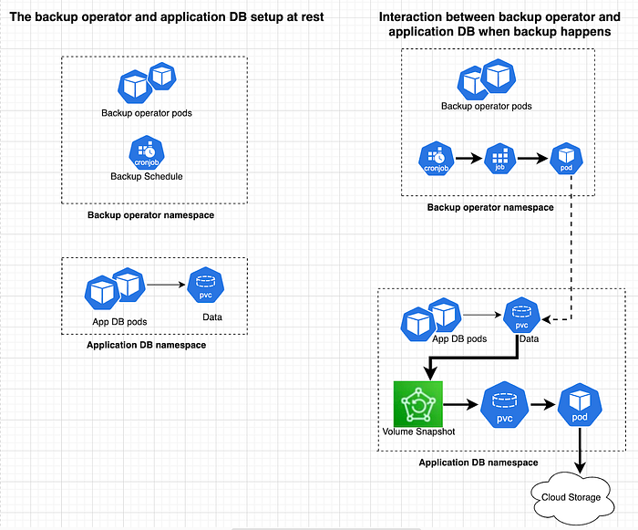
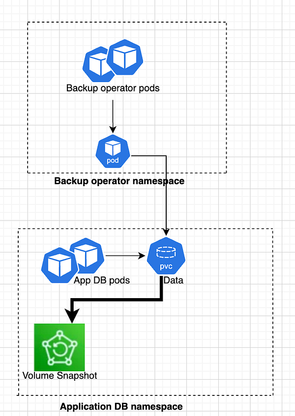
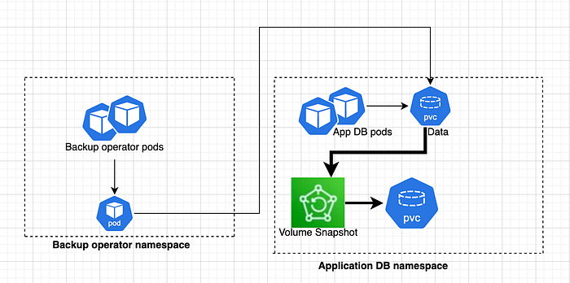
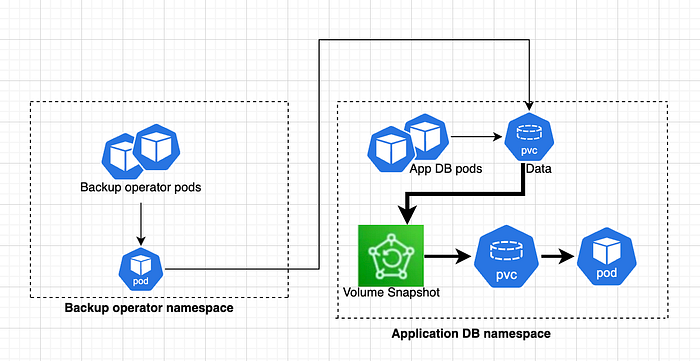
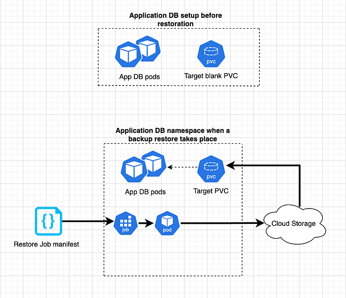

# Leveraging Kubernetes Volume Snapshots for efficient backup and restoration

## Introduction

For an organization like Flipkart, where data is the heart and soul of its being, ensuring reliable backups and restores is critical to safeguarding data and maintaining business continuity. As Kubernetes adoption grows within Flipkart for services and databases, managing persistent data in dynamic, containerized applications presents new challenges for traditional backup strategies. Ensuring data protection and recoverability is essential for availability, disaster recovery, and compliance.

To back up the databases deployed over Kubernetes having their data stored within Persistent Volumes, we explored some traditional backup methods, such as manual dumps or external backup agents using sidecar containers but found them to be inefficient, complex, and non-generic in nature. We then explored some Kubernetes native way to backup data in underlying volume, and came across Kubernetes Volume Snapshots. This Kubernetes native solution can help in creating consistent, point-in-time backups of persistent volumes. Supported by various CSI drivers, they provide automated backup and restoration, making them ideal for protecting stateful applications against disasters or errors. Further details will be discussed as we progress.

## Key terminologies

- Container Storage Interface(CSI) — A standard that allows users to add and configure storage provisioners in Kubernetes clusters. CSI was developed as a standard for exposing arbitrary block and file storage storage systems to containerized workloads on Container Orchestration Systems (COs) like Kubernetes.
- Stateful Applications — Applications that retain data or state over time. Examples : databases, distributed systems and message queues.
- Stateless Applications — An application that doesn’t store data or application state in the cluster or persistent storage.
- Persistent Volume (PV) — Represents the actual storage resource in the cluster that has been provisioned using Storage Classes.
- Persistent Volume Claim (PVC) — A request made by a pod for persistent storage.
- Storage Class — A StorageClass provides a way for administrators to describe the classes of storage they offer.
- Volume Snapshot — A snapshot of a volume on a storage system.
- Service Account — A non-human user identity to authenticate and access K8s apiserver.
- Recovery Point Objective (RPO) — It is the measure of permissible data loss within a stipulated time in the event of a disaster. In other words, the interval of time before the quantum of lost data exceeds the maximum allowable threshold.
- Recovery Time Objective (RTO) — It is the maximum acceptable amount of time for restoring a backup and regaining access to data after an unplanned disruption. In other words, how quickly can one recover from a disaster.
- Full Backup — Full backup backs up the whole data of the cluster. Full backups with volume snapshots capture an entire point-in-time copy of the volume, including all data.
- Incremental backup — Incremental backup on the other hand stores only the changes made since the last snapshot, significantly reducing storage requirements and speeding up the backup process. In Flipkart, we are leveraging the goodness of incremental backups wherever the underlying datastore supports it.

## Backup process using Volume Snapshots

In Flipkart, we have different namespaces for the application database and the backup controller to maintain the appropriate level of data isolation and access control using Role-Based Access Control (RBAC). The application DB namespace has the DB service pods and the underlying data is stored in the PVC.

The backup controller is a custom controller designed to automate and manage the backup of data for a database cluster deployed over Kubernetes. It monitors backup and restore related Custom Resources and orchestrates tasks like triggering volume snapshots, exporting data to remote storage, or maintaining backup schedules. This backup controller is built using the Operator SDK which is an open source toolkit to manage Kubernetes native applications, henceforth called backup operator. This backup operator is deployed in a dedicated namespace and takes care of scheduling and orchestrating the backups as per configured schedule for the application DB cluster.

Let’s jump into the details of the end to end backup process using Volume Snapshots.

### Onboarding to Automated Backup and Restore Service

The Recovery Point Objective(RPO) of different application databases differs as per their business and regulatory requirements. Hence, a common backup schedule does not work for all of them. To onboard to the automated backup and restore service, individual database owners create a backup configuration. This configuration has their business RPO, basis which the backup operator creates a Kubernetes CronJob that represents the backup schedule for this database. For example, if the RPO for an application DB is 2 hours, it means that they can afford to lose at the most 2 hours of data, which means a backup should happen at least once in every 2 hours. And, this is represented as a Kubernetes CronJob to be taken as a scheduled backup for this DB.

Now, let’s talk about some prerequisites to enable the backup operator to access the required Kubernetes resources in the database owner’s namespace for taking the data backup.

### Backup prerequisites

1. **Source PVC** — There should exist a PVC that holds your application data which you want to backup.
2. Create a **ServiceAccount** in the backup-operator namespace that will be used to access resources in the DB application namespace.
3. Grant the relevant Role-based access control (RBAC) to the above Service Account used by the backup operator to create and access relevant resources in the DB application namespace.

### Backup Process Details



1. Our backup-operator creates a point in time snapshot of the above PVC i.e. a Volume Snapshot in the DB application namespace — where the source PVC resides.



The Volume Snapshot manifest looks like :

```
apiVersion: snapshot.storage.k8s.io/v1
kind: VolumeSnapshot
metadata:
 name: backup-snapshot
 namespace: …
spec:
 source:
 persistentVolumeClaimName: pvc-test
 volumeSnapshotClassName: …2.
```

2. Using the above snapshot, the backup operator creates a PVC in the DB application namespace. This PVC holds the data of the source pvc at that time snapshot was taken.



The snippet from PVC manifest looks like :

```
kind: PersistentVolumeClaim
metadata:
  name: pvc-using-snapshot
spec:
 storageClassName: …
 volumeMode: Filesystem
 dataSource:
   apiGroup: snapshot.storage.k8s.io
   kind: VolumeSnapshot
   name: backup-snapshot
 accessModes:
    - ReadWriteOnce
 resources:
  requests:
    storage: <source pvc size>
```

3. To be able to access the data in this PVC, the backup operator now creates a pod that mounts this copy PVC. This backup pod now chunks the underlying data and backs it up to cloud storage. The details about chunking can be found in the[ previous blog ](./providing-backup-and-disaster-recovery-as-a-service-2caeff6ce278.md)in this series.



The pod manifest looks like :

```
kind: Pod
metadata:
 name: backup-pod
 namespace: playground
spec:
 volumes:       
   - name: data
     persistentVolumeClaim:
       claimName: pvc-using-snapshot
 containers:
   - name: backup-pod
     image: …
     volumeMounts:
     - name: data
       mountPath: /data
       readOnly: true
```

4. The metadata about this backup is stored in our database, which has all the details about this backup — the backup name, the backup config details, the backup size, cloud location of the backup etc. This is exposed to the clients via APIs and UI dashboard.

### Pre backup and post backup commands

We also have the capability to add pre and post backup commands to your backup configuration to enable automated actions before and after backups and to provide the tenants more control over their backup process. These commands provide the following additional benefits, making the backup process more efficient and customized :

- Data Consistency: Pre-backup commands can be used to quiesce or pause applications, ensuring all in-memory data is flushed to disk, which is crucial for consistent backups of databases and transactional systems. For example, a database like MySQL could use _FLUSH TABLES WITH READ LOCK_ as a pre-backup command to ensure data consistency before a data snapshot is taken.
- Custom Cleanup: Post-backup commands can trigger actions like deleting temporary files or snapshots, optimizing storage and keeping backup environments clutter-free. It can also be used to revert the actions taken before a backup like releasing a READ LOCK after backup completion etc.

This functionality helps make the generic backup process customizable and gives more control to DB application owners by allowing them to define actions that enhance the efficiency and usability of the backup process for their use-case.

## Restore backup created using Kubernetes Volume Snapshots

### Restoration Workflow



1. To be able to restore a backup, the database owner should have an empty PVC created in their namespace.
2. The database owner will then create a Restore Job manifest that consists of the details about the backup they want to restore (which the DB application owners can fetch from the API or UI dashboard using their backup configuration) and the PVC where they want to restore the data. Sample Restore Job manifest :

```
name: <restore-job-name>
spec:
 template:
   spec:
serviceAccountName: backup-sa
containers:
      - name: restore-controller
        image: restore-operator:<VERSION>
        env:
         - name: OPERATION
           value: "restore"
         - name: BACKUP_NAME
           value: <backup_name>
         - name: RESTORE_PVC_NAME
           value: <restore-pvc-name>
       resources:
         …
       volumeMounts:
         - name: my-pvc
           mountPath: "/mnt”
 volumes:
       - name: my-pvc
         persistentVolumeClaim:
           claimName: my-pvc-claim
```

3. Once the above restore job manifest is applied, it creates a restore pod in the DB application namespace.

4. The restoration service flow fetches the required backup from the cloud and restores it to the PVC mount path.

5. The target PVC is now ready to use and can be mounted to the appropriate DB service pod, as required.

## Performance Overheads and Challenges

### Storage Overhead Due to Copy-on-Write

When a snapshot is created from a source PVC, it does not immediately duplicate the data. Instead, it uses a **copy-on-write** mechanism, which means only changes made to the source PVC after the snapshot was taken are stored separately. Initially, the snapshot consumes minimal storage, but as changes accumulate, it may require significant additional space. Over time, if multiple snapshots are retained, they can collectively consume substantial storage and can potentially impact performance. For example:  
**Source PVC allocated size**: 8 GB  
**Source PVC actual data size**: 1 GB  
**Volume Snapshot size**: Close to 0 GB initially, with additional storage used based on changes after the snapshot is created.

### Additional Quota Requirements for New PVC

When a new PVC is created from a snapshot, it consumes storage equal to the **allocated size** of the source PVC, regardless of the actual data size. This means even if the source PVC has minimal actual data, the new PVC will still reserve the entire capacity of the original source PVC. For example :   
**Source PVC allocated size**: 8 GB  
**Source PVC actual data size**: 1 GB  
**New PVC size**: 8 GB (entire allocated size is reserved)

To ensure that the storage overhead remains in check and there is no accumulation of snapshots and PVCs, the backup process deletes all the resources it created once the backup is successfully uploaded to the cloud.

### Disk Type constraints

Not all storage classes in Kubernetes support snapshots, as the snapshot functionality is limited to block storage managed by CSI drivers. Some storage types that do not support snapshots are local or ephemeral storage types, Network File System, etc. Hence, this solution of doing backups using volume snapshots is dependent on the capability provided by the CSI driver for the underlying storage class.

### Debugging, Monitoring and Alerting

This backup setup has multiple points of failure across different namespaces, making robust monitoring and alerting crucial. As debugging failures across namespaces can be fairly complex, technically and in terms of defining ownership and action item to resolve the issue, we’ve segregated backup failure alerts to streamline the debugging process. Using our internal alerting platform, targeted backup failure alerts are sent to the appropriate teams: platform-related issues go to the central backup and recovery team, while database-specific alerts reach the DB owner team. This structured approach ensures timely acknowledgment and resolution of the failure root cause, ensuring there are no RPO breaches for the configured databases.

## Conclusion

In Flipkart, using Kubernetes Volume Snapshots served as an efficient solution for capturing point-in-time copies of data stored in Persistent Volumes and to restore that data, as and when required. By using volume snapshots, we have achieved reliable backups with minimal impact on live applications. Integrating volume snapshots with backup workflows have ensured data consistency and quick recovery, making it a yet another useful addition to Flipkart’s Backup and Restore platform.

---
**Tags:** Backup And Restore · Kubernetes · Volume Snapshot · Backup And Recovery · Platform Engineering
