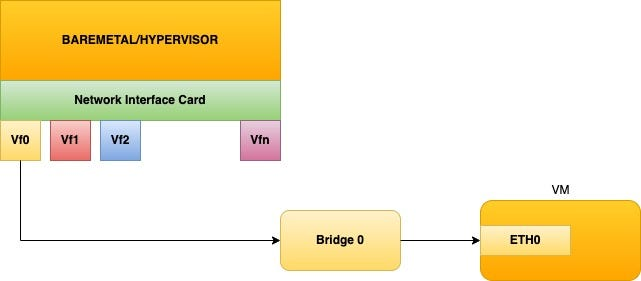
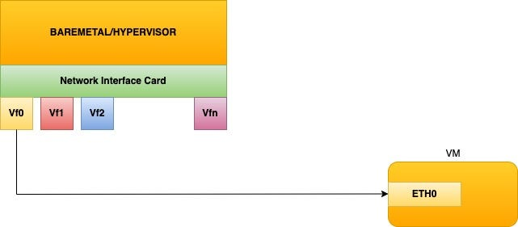
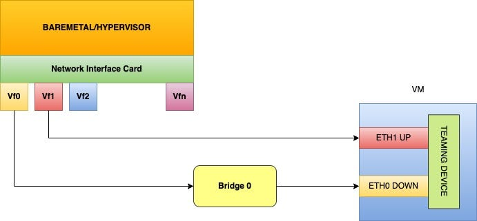

# Live migration of a VM with SR-IOV VF passthrough device

## Context and Background

Flipkart operates its own private cloud infrastructure spanning two data centers, each with tens of thousands of servers. Many applications specific to web services, databases, big data, and machine learning tools run on these servers. Over 90% of the workloads are completely virtualized today using _Kernel-based Virtual Machine_ (KVM) — an open-source virtualization technology built into Linux.

With heavily populated data centers, hardware issues and software updates resulting in server downtime are inevitable. On a parallel note, Flipkart implements a hardware monitoring solution to predict component failure, which significantly reduces unplanned maintenance.

Planned maintenance takes a lot more than powering off the server, fixing the hardware problems, and restarting the server. At Flipkart, we use the following approaches to implement planned maintenance:

- **Cold migration:** Requires powering off the VM, copying the root disk and application data of the VM to a destination server, and then powering ON the VM at the destination server. This results in some downtime for the applications that were running on those VMs, as well as other issues such as broken connections for clients.
- **Live migration**: Involves transferring the entire state of a running VM from its home hypervisor system to another hypervisor server. All VM properties remain unchanged — including network settings, instance metadata, block storage data, kernel state, application state, network connections, etc.

Out of the two approaches, live migration is a very efficient and seamless process causing the least disruption to applications. The IaaS team implemented live migration of a VM from one server to another to provide the application teams with a better experience in terms of latency and CPU utilization.

Linux system administrators, Cloud providers, and data center engineers will find this article useful as it discusses the details of implementing live migration of a VM with an SR-IOV VF pass-through device.

## VM setup in Flipkart data center

Today, Flipkart data centers use a bridge network mode for VM connectivity. See the picture below for the setup:

Flipkart’s IaaS team will soon provide the capability to pass through an [SR-IOV](https://en.wikipedia.org/wiki/Single-root_input/output_virtualization) Virtual Function (VF) of a NIC to VMs for improved networking performance in terms of latency and CPU utilization.

Here is what the new setup should look like:

However, [Libvirt](https://en.wikipedia.org/wiki/Libvirt) technology does not support the Live migration of a VM with an SR-IOV pass-through device due to the following [reasons](https://citeseerx.ist.psu.edu/viewdoc/download?doi=10.1.1.583.5044&rep=rep1&type=pdf):

- Expecting to find an identical SR-IOV device on the destination hypervisor is not a valid assumption.
- Cloning the device instance at the target VM is almost impossible because some device internal registers may not be readable, and requires the hypervisor to have device knowledge.

Therefore, we resorted to using a recent technology implemented in the [Linux networking stack — net_failover](https://git.kernel.org/pub/scm/linux/kernel/git/stable/linux.git/tree/Documentation/networking/net_failover.rst?h=v5.10.1).

## Solution

We create the VM with a master **_net_failover_** teaming device which enslaves the primary SR-IOV pass-through (**eth1**) device and the standby **_para-virtualized_** (**eth0**) device to enable live migration.

The teaming device allows one device (the fast SR-IOV device) to be removed under it while enabling the second slow device to take over the data transfer. This makes it seamless to the user as they interact with the single teaming device without the knowledge of the underlying devices.

For example, the teaming device receives the network IP address and remains constant during this operation. While the underlying SR-IOV device is removed and the para-virtualized device takes over, the system still uses the teaming device. Hence this operation is seamless for the running applications that see no service disruption.

Note that the para-virtualized device is kept in the **_DOWN_** state at all times other than during live migration so that the teaming device uses the VF slave interface for better performance.

See the following diagram to understand the configuration.

During live migration, the hypervisor removes the SR-IOV device (**eth1**) from inside the VM and marks the para-virtualized device (**eth0**) **_UP_**. Then Libvirt takes over migrating the process from one hypervisor system to another. The workflow is complete when the remote hypervisor inserts its own VF to the migrated VM and marks the para-virtualized device (**eth0**) **_DOWN_**.

## Challenges with the recommended procedure

We referred to the [Linux kernel documentation](https://en.wikipedia.org/wiki/Single-root_input/output_virtualization) to implement this solution. However, it soon became clear that the documentation was incomplete and following the steps with the sample Libvirt XML snippets failed to live migrate a VM. Some issues we found were:

- The documentation mentioned that 3 interfaces would get created in the VM but did not show how the teaming interface (the 3rd interface) would get created.
- In fact, when we tested the sample XML configuration, the VM came up with just 2 interfaces — a para-virtualized and an SR-IOV pass-through device.
- Many of the more intricate details — configuration and scripts needed for live migration, were incomplete or missing.

## Resolution

After studying [Libvirt documentation](https://libvirt.org/formatdomain.html#teaming-a-virtio-hostdev-nic-pair), we concluded that the **_teaming_** tag was required for both the para-virtualized and the SR-IOV pass-through devices. The teaming type should have the value:

- **_persistent_** for the para-virtualized device. This informs the system that this device would always be present in the VM.
- **_transient_** for the SR-IOV pass-through device. This informs the system that the device may be periodically detached and reattached to the VM.

Another change is to mark the state of the para-virtualized device as **_DOWN_** in the XML configuration so that the teaming device uses the SR-IOV VF device for traffic.

With these changes, the kernel creates a teaming device and attaches both slave interfaces to it. The teaming interface uses the SR-IOV VF interface for networking traffic since the state of the para-virtualized interface is **_DOWN_** as instructed by Libvirt.

## Yet another teaming challenge

We faced another problem, not specifically related to live migration, due to **_teaming_**. When the teaming device is created, both the teaming device (master) and the SR-IOV VF device (slave) makes a request for IP address, and both receive IP addresses (they may get the same or different addresses depending on the DHCP configuration) from the DHCP server, resulting in the VM becoming inaccessible to the network. This problem happens for the VM on both the source and destination hypervisor servers when the VM is booted up. We fixed this issue in _Debian Cloud Images _by adding the following line to the _/etc/network/cloud-ifupdown-helper_ script:

> _[-d /sys/class/net/$INTERFACE/master ] && exit 0_

This script is called for all interfaces and the above line performs a quick test to see if the device is a slave interface, and if so, exits the script successfully.

## Configuration and scripts for VM migration

- **Libvirt network interfaces definition of a VM on the source hypervisor**

- **List of devices inside the VM when it boots up with this configuration**

- **VF configuration file for the migration script on the source hypervisor**

- **Script to run on the source hypervisor to live-migrate a VM**

- **Script to reattach VF to the migrated VM on the destination hypervisor**

## Additional enhancements — VF device pool

The PCI settings which identify the SR-IOV VF in the VM’s configuration are likely to differ between the two servers. Hence, some higher-level management software is required to change the PCI address of the VF on the destination server during live migration. We experimented with Libvirt’s [**_hostdev-pool_**](https://libvirt.org/formatdomain.html) mechanism to reduce this complexity and overhead. A _hostdev-pool_ is a pool of PCI devices where Libvirt takes responsibility for allocating a suitable device from this pool during live migration as long as we ensure the hostdev network pools on both servers have the same name. This feature is slated to go into production soon.

## Summary

With the above changes, we successfully migrated a VM with an SR-IOV Passthrough device from a source hypervisor system to a destination system without service disruption. This article can be used as a ready reference to perform live migration of a VM with an SR-IOV pass-through device.

The solution will soon go live in the Flipkart data centers, and this will provide a much better experience for applications running on our servers, and from there on to the end-user!

Further, this project resulted in the Flipkart Engineering team’s contribution of a [patch](https://git.kernel.org/pub/scm/linux/kernel/git/netdev/net-next.git/commit/?id=738baea4970b) to the Linux Kernel networking community to improve the documentation and use of the network fail-over mechanism.

## References

1. [https://en.wikipedia.org/wiki/Kernel-based_Virtual_Machine](https://en.wikipedia.org/wiki/Kernel-based_Virtual_Machine)
2. [https://en.wikipedia.org/wiki/Single-root_input/output_virtualization](https://en.wikipedia.org/wiki/Single-root_input/output_virtualization)
3. [https://en.wikipedia.org/wiki/Libvirt](https://en.wikipedia.org/wiki/Libvirt)
4. [https://citeseerx.ist.psu.edu/viewdoc/download?doi=10.1.1.583.5044&rep=rep1&type=pdf](https://citeseerx.ist.psu.edu/viewdoc/download?doi=10.1.1.583.5044&rep=rep1&type=pdf)
5. [https://git.kernel.org/pub/scm/linux/kernel/git/stable/linux.git/tree/Documentation/networking/net_failover.rst?h=v5.10.1](https://git.kernel.org/pub/scm/linux/kernel/git/stable/linux.git/tree/Documentation/networking/net_failover.rst?h=v5.10.1)
6. [https://libvirt.org/formatdomain.html#teaming-a-virtio-hostdev-nic-pair](https://libvirt.org/formatdomain.html#teaming-a-virtio-hostdev-nic-pair)
7. [https://libvirt.org/formatdomain.html](https://libvirt.org/formatdomain.html)
8. [https://git.kernel.org/pub/scm/linux/kernel/git/netdev/net-next.git/commit/?id=738baea4970b](https://git.kernel.org/pub/scm/linux/kernel/git/netdev/net-next.git/commit/?id=738baea4970b)

> _Authored by Madhu Adav, Krishna Kumar, and Vasudeva Satish Kamath — the team that drives Infrastructure at Flipkart._

---
**Tags:** Linux · Vm Migration · Sr Iov Passthrough · Networking · Seamless
