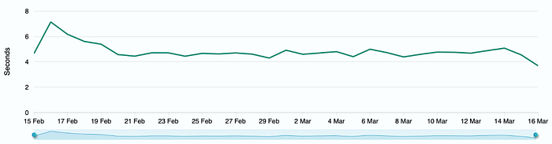
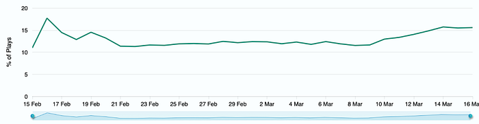
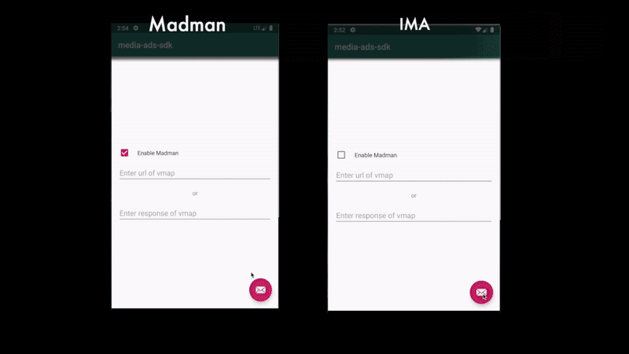
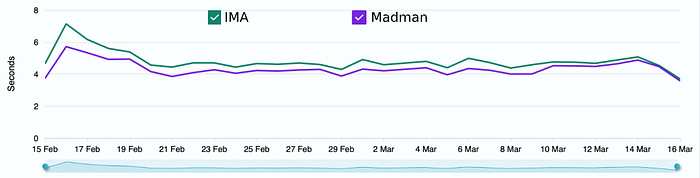
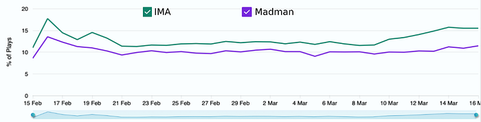

# Madman — an open-source Ads Framework for Android

We are pleased to announce the open-source launch of [**Madman**](https://github.com/flipkart-incubator/madman-android) **(Media Ads Manager)** — a library for android, which enables you to advertise video contents with video ads.

As Flipkart enters the video streaming market, it becomes imperative to use the existing user base as a distribution channel to reach out to the users. With the tremendous opportunities for targeted advertising and in order to ease adoption, AVOD (Ad-based video on demand) becomes the core piece of the strategy. This implies giving richer experiences for the user while viewing ads.

Madman provides an easy way to integrate the ads library with the video player. It allows you to fetch ad responses from vast compliant ad servers, handles the ad playback and report metrics back to the ad servers.

We have always felt strongly about sharing with the open source community, and believe that Madman has a great potential to address similar needs outside of Flipkart.

## The Journey to Madman

During the initial launch of the video platform, we decided to use the Google’s IMA library to power the ads playback for the following reasons:

1. Easy integration with the existing exo-player
2. Supportive of many [VAST](https://www.iab.com/guidelines/digital-video-ad-serving-template-vast-3-0/) (Video Ad Serving Template) and [VMAP](https://www.iab.com/guidelines/digital-video-multiple-ad-playlist-vmap-1-0-1/) (Video Multiple Ad Playlist) features
3. Stability and Reliability

Although the IMA library was a great library to start with, we realised that with the product gaining traction and with custom requirements coming in from the product managers, we will need complete control over the ads playback experience right from customising the user interface to improving the performance of the ads.

Our initial investigation using the analytics tool showed that the ad performance using IMA was not satisfactory.

The number of Exits Before the Video Starts (**EBVS**), and the Join Time for the video were **high** whenever there were pre-roll ads (pre-roll ads are ads which play before the start of the content) as compared to video with no pre-roll ads.

The join time with the pre-roll ads was at an average of **4.5–5** seconds.

*Join Time*

Approximately **15% **of users exit the playback, even before the video started.

*Exit Before Video Stats (EBVS)*

Digging deeper into the IMA library, we found that it uses WebView to render ads. Although WebView gives you more control over the UI, the performance is slow because of which there were few black frames before it initialised the view. This directly impacted our user experience.

In addition, it was impossible to fit in the new custom requirements coming in such as support for Rich CTA’s, customising UI elements and reliably showing ad countdown timer ie “Ad starting in” since the ad server may not serve the upcoming ad.

Since IMA library is not open-sourced, we had limited control over it. This is when we started to look for an alternative. We explored other third party libraries. For multiple reasons such as licensing terms and limited capabilities, none of the libraries fit into our requirement.

That’s when we wrote our own in-house ad framework. Welcome **“Madman” (Media Ads Manager)**

The Madman library is a high **performance** alternative to the IMA library, which enables you to advertise video contents with video ads. If you have your own VAST server and want to render video ads and have full control over the UI, then this library is for you.

The library enables you to:

- Retrieve ads from VAST-compliant ad servers.
- Handle ad playback.
- Collect and report metrics back to ad servers.

## Performance

Madman uses native views to render ads view which performs better than IMA that uses WebView.

Initial tests have shown madman is **~700 ms** faster in loading pre-roll Ads in comparison with other libraries such as IMA.

*Load Time Comparison for IMA and Madman*

To test the performance of the library in the production environment, we did a controlled rollout of the library for some percentages of the users.

**Here are the results**

We saw an improvement in **Join Time** by approximately **~1 second**.

*Join Time*

We also saw a sharp decrease in the users exiting the playback before the video started **(EBVS)**. We attribute this to the increased performance of the library.

*Exit Before Video Starts (EBVS)*

## Features

Madman supports many features out of the box. The following are some important ones:

1. **Full control over the user interface: **The library allows you to have full control over the user interface for the ads view. You can create your own custom layout, or use the library’s default layout to render overlays.  
The default implementation allows you to customise the “Skip Ad”, “Learn More” and other views.
2. **Performance: **Madman is a high performance alternative to the IMA library. If you have read the blog this far, you will know why 😉
3. **Extensible: **The library allows you to have your own custom implementation of components such as network layer, xml parser layer. It even allows you to add callbacks for listening to ad events such as “Ad starting in..”.

For a detailed understanding of the Components, refer to the wiki [**documentation**](https://github.com/flipkart-incubator/madman-android/wiki).

## Integration

Madman is easy to integrate with the existing [exo-player](https://exoplayer.dev/hello-world.html) implementation or any other player.

Checkout the [demo](https://github.com/flipkart-incubator/madman-android) app to understand the details of integration.

> _Note: For exo-player, the library provides an implementation of _[**_MadmanAdLoader_**](https://github.com/flipkart-incubator/madman-android/blob/master/madman-exoplayer-extension/src/main/java/com/flipkart/madman/exo/extension/MadmanAdLoader.kt)_ which acts as a glue between the library and the player._

## Demo

This is the demo video of loading a pre-roll ad using the madman library.

## What’s missing?

While we’re actively involved in the development of the library, and adding more features every day, there are number of features which are yet to be implemented such as

For VAST,

- Companion Ads
- Non-Linear Ads
- Executable media files
- Ad Pods
- Wrapper ads (for redirection)
- Industry icon support

For VMAP,

- Ad break time-offsets such as #1, x% etc. Only format supported for now is HH:MM:SS.mmm

> _Note: Google AdSense/AdManager Ads will not work with this library due to the absence of executable media files support_

---

## The road ahead

We have been actively working on the development of Madman and are very excited about the future it holds.

We have adopted Madman inside Flipkart, and available as an open source project under [jitpack](https://jitpack.io/) so that you can also start using it, per your needs in your organisation, and contributing to its further development.

If you have questions or suggestions about Madman, please reach out to us at [Github](https://github.com/flipkart-incubator/madman-android). We look forward to hearing from you!

---
**Tags:** Video Ads · Android · Open Source · Mobile · Advertising
