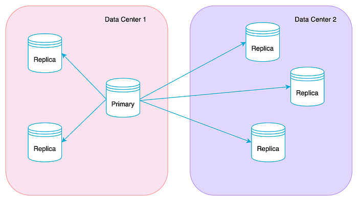
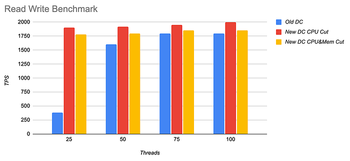
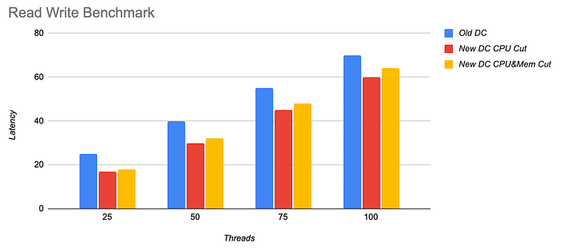
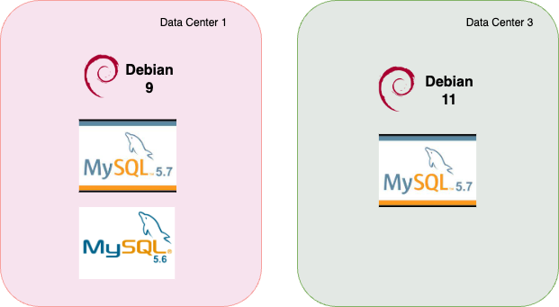
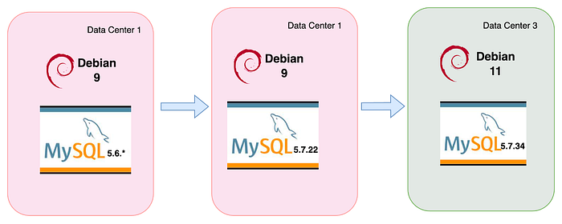
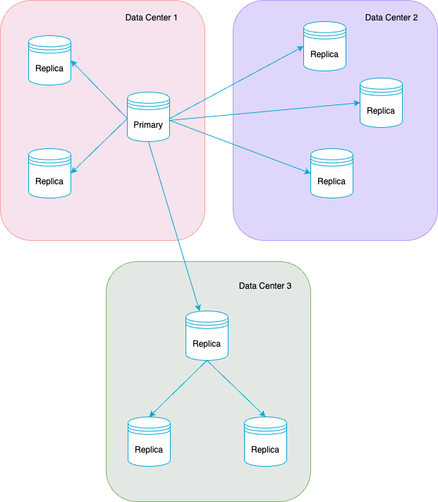
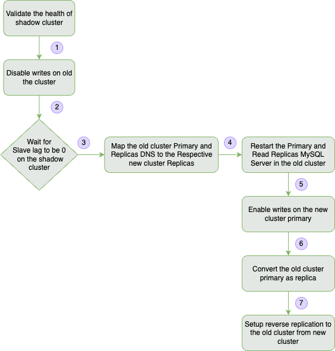
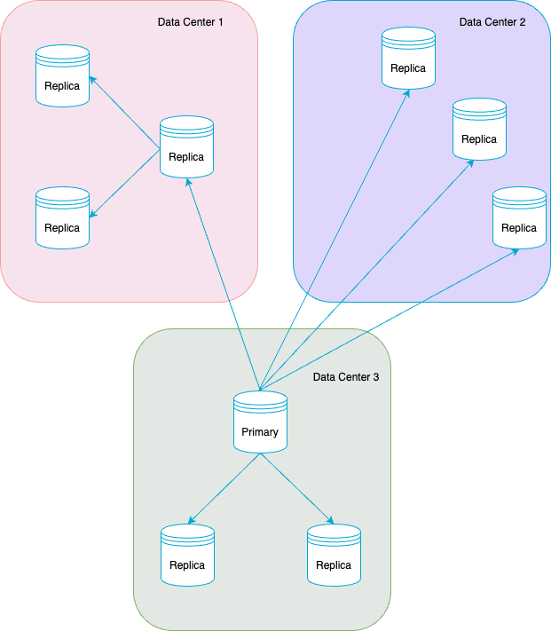
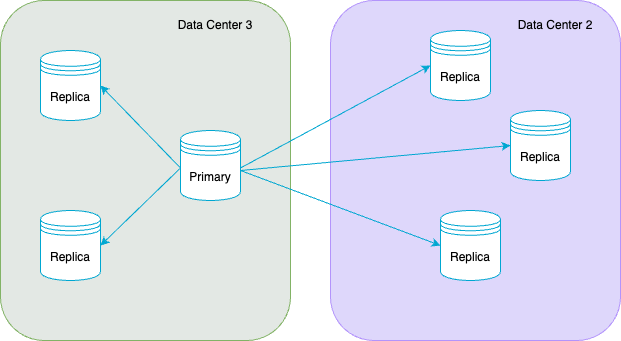

# The Great Migration, MySQL Edition

> How Flipkart managed to mass-migrate its MySQL workloads from one Data Center to another with minimal downtime.

## Introduction

Flipkart’s private cloud infrastructure spans across two data centers(DC) with tens of thousands of servers. These data centers store and manage petabytes of data generated by the e-commerce platform, ensuring a seamless shopping experience for its customers.

In this article, we explain how we migrated one of the largest on-prem fleet of MySQL clusters from one data center to another.

## Why DC migration?

With Data center technology growing rapidly, modern applications often require data centers to have improved scalability and performance.

At Flipkart, we considered the following factors for migration to the new data center:

- Servers become old and prove costly to maintain
- Servers have low operations per second
- Data center power supply is too expensive
- Cooling costs are significantly lower in the new data centers and the new technology cannot be retrofitted into the current data center

The new data center we moved to has brought in these significant benefits:

- Redundant electrical & mechanical system
- Usage of renewable energy
- Infra-additions regarding cores, storage, network, and disk
- Improved compute performance by up to 2.5x, reduces operational costs
- Reliable and composable storage
- Hybrid (multi-vendor) network
- Significantly lesser maintenance costs

Clearly, migrating to a newer data center with better infrastructure brings improved overall performance, reliability of services, and lesser operational cost. With this background, let’s now understand the MySQL Cluster landscape inside Flipkart.

## Flipkart MySQL’s Infrastructure

MySQL is one of the most-used data stores in Flipkart for its durability and transactional guarantees. Here is a high-level view of the MySQL fleet from the data center before migration:

- 300+ MySQL clusters spread across 1200+ VMs.
- Peak QPS of 0.75 Million per second.
- 300+ TB of data.
- All MySQL clusters are configured for high availability.
- Each cluster had one primary and multiple replicas, including one just for backup.
- Each cluster had a monitoring and alerting setup.

Ever wondered how we are managing these MySQL VMs and clusters?. [Altair](./mysql-high-availability-5f71838f19e1.md) is the homegrown product, which manages all the MySQL clusters.

## MySQL Cluster

MySQL cluster replicas are spread across two data centers and each replica in the cluster performs specific tasks. Each replica in the cluster has its DNS. Applications connect to the replicas using the DNS. All the MySQL clusters support async replication. The following diagram shows replicas in the MySQL Cluster, across two data centers.

*Typical MySQL Cluster Replicas spread across two data centers*

### Primary

The primary node serves the write and read traffic. Applications connect to the primary node using a DNS.

### Replicas

MySQL Cluster can have many replicas, where each replica asynchronously replicates from the primary node. The replicas help:

1. Serve application reads.
2. Achieve high availability in case of primary failure.
3. Handle DC Failovers.
4. Take regular data backups.

With this background on DC migration and Flipkart’s MySQL infrastructure, we’ll now read about our journey of migrating our MySQL clusters to a new data center.

## How did we begin the Migration Journey?

Our goal was to ensure seamless migration and reduced risks in business operations. With diverse workloads across our MySQL fleet and each cluster configured for High Availability, we kept to the following requirements:

- Hardware Performance Benchmarking: Applications should be compatible with the new data center hardware performance.
- OS Compatibility: Operating systems, MySQL and dependent softwares should be compatible between two data centers.
- Migrating clusters to new DC: Migrating MySQL clusters to the new data center with a per cluster average downtime of less than 5 minutes.
- Fallback to old DC cluster: Temporary fallback to the old DC cluster in case of failures in the new DC cluster.

## 1. Hardware Performance Benchmarking

The hardware in the new data center was better in terms of performance. We did a TPS and latency benchmarking between the current data center VMs and new data center VMs with the:

- Same core and memory
- Reduced core only
- Reduced core and memory

We employed the [sysbench](https://github.com/akopytov/sysbench) tool to arrive at rough CPU and memory cuts wherever possible.

After seeing the benchmarking results, we did a 40% CPU cut in the new data center VMs without changing the memory. We chose not to cut memory as MySQL has a high dependency on Memory.

## 2. OS Compatibility

We evaluated the software in the current data center (Data Center 1) and the new data center (Data Center 3).

We identified that Debian 11 does not support MySQL Version 5.6. We had to upgrade all the MySQL 5.6 clusters to 5.7 as a prerequisite for the migration process. Here’s what our plan looked like:

### How we upgraded MySQL version 5.6 clusters to version 5.7.

Application compatibility with the MySQL version 5.7 had to be tested in the stage environment. If the applications worked as expected with the MySQL 5.7 cluster, we followed these steps to do an in-place MySQL version upgrade:

1. Schedule an upgrade on the non-user facing replicas (Except Primary and Read Replicas).
2. Upgrade the Read Replicas one by one to the 5.7 version after upgrading non-user facing replicas.
3. Switch one replica as a Primary during a maintenance window, when the application traffic was less.

Once we upgraded all MySQL 5.6 Clusters to MySQL 5.7, the migration path to the new data center was clearer.

## 3. Migrating Clusters to new DC

Migrating the MySQL Cluster from one data center to another center required the following activities:

1. Creating a MySQL Cluster in the new DC and setting up replication with the old DC cluster.
2. Breaking the replication between the old data center cluster and new data center cluster once the replication lag catches up.
3. Changing the application configuration to the new data center cluster primary.
4. Configuring the replication from the new data center cluster to the old data center cluster.
5. Falling back to the old cluster if there are any issues with the new cluster.

### Challenges in migrating the single MySQL Cluster

1. Application teams have to change the application config with the new cluster after the cutover, which will increase the application downtime.
2. If there are any issues with the new DC cluster, falling back to the old data center required another config change and redeployment. This process would take additional downtime.

### Challenges per team in migrating all the MySQL clusters in a DC:

1. Creating a cluster and setting up the replication.
2. Performing the cutover.
3. Coordinating with multiple teams which needs an extensive program management effort.

### How did we mitigate the challenges?

To overcome all the above challenges, instead of 300 teams doing this exercise, we benchmarked, procured capacity, created clusters, setup data replication, and cutover.

Accordingly, our requirements were:

1. No application team involvement in the migration process.
2. Cutover to the new DC with an average of 5 minutes of downtime.

Let’s discuss each of these requirements in detail:

### No Application Team Involvement

As a platform team, we wanted to reduce the user team’s involvement and simplify the migration process with the following activities:

_Identifying the required hardware in the new data center:_

We bought bulk hardware from the new DC to create the clusters and simplified the program management based on benchmarking results.

_Pre-create shadow clusters in the new data center:_

Shadow cluster is the replica of the original cluster with the writes disabled. As a platform team:

1. Created shadow clusters with similar cluster topology in the new data center.
2. Replicated the setup from the old data center cluster to the new data center cluster.
3. Bulk-created about 300+ shadow clusters within a week using pre-built workflows internally called “Altair to Altair migration”.

Pre-creating these shadow clusters helped us in:

- Managing time: Creating all the shadow clusters within the planned time in the new data center.
- Saving time: Central creation meant individual teams didn’t need to take this time into account when the cutover was planned.

The following diagram represents how the shadow cluster looked like in the new data center.

_Building the DNS Retention feature_

Application teams use the DNS of primary and replicas in their application configs. Changing the application config with the new cluster DNS requires deployments and additional downtime for the application owners. Using the DNS retention feature, we assigned the new cluster IP to the existing cluster DNS during the cutover, so that customers need not change the DNS at the application level.

DNS Retention helped us in

1. Minimal application downtime.
2. Zero Manual effort from the application teams (cutover is regarded as a minor unavailability)

### Cutover to the new Data Center with minimal application downtime

What is cutover?

Cutover is the process of shifting application reads and writes to the new data center cluster. After the cutover, the application reads and writes are directed to the new cluster DC.

Cutover Process

Cutover process workflow consisted of multiple steps. Each step in the cutover process was executed sequentially with a single button click.

1. Validate the health of the shadow cluster: To proceed with the cutover, primary and replicas in shadow clusters should be available and replication should be healthy.
2. Disable writes on the old cluster: After validating the health of the shadow cluster, incoming writes need to be disabled on the old cluster primary.
3. Wait for replica lag to catch up on the shadow cluster: We use async replication in the MySQL Cluster. As is the nature of Async replication, wait for the replica lag to catch up on the shadow cluster primary.
4. Map DNS: If the seconds_behind_master value is zero on the shadow cluster replicas, convert one replica to the primary and assign the new primary IP to the existing primary DNS. Assign old DC Cluster Read Replicas DNS to the new DC Cluster read replicas by updating the read replicas IP.
5. Restart the primary and Read Replica’s MySQL Server: Per the DNS caching nature at the application side, restart the old DC Primary and Read Replica’s MySQL server to kill any active connections to the old cluster. Reattach the replicas in data center 2 to the newly elected primary which is in data center 3 using the change primary command.
6. Enable writes on the new cluster primary: Convert Shadow cluster replica to the primary. Disable read_only on the new DC cluster to accept writes to the new DC cluster.
7. Reverse replication setup: Setup Reverse Replication to the old cluster by getting the replication coordinates.

The following diagram shows how the MySQL Cluster looks like after the cutover.

## 4. Fallback to the old DC Cluster

Even though we had performed benchmarking, real-time traffic can introduce latencies. After the cutover, we expected a few applications to see latency or degradation issues with the new DC cluster. We had built the option to revert to the old cluster by breaking the replication between the old cluster and the new cluster in case of issues.

Once the cutover was successful and there were no issues observed with the new DC Cluster, we destroyed the old DC cluster. The following diagram shows the final state of the cluster.

## Conclusion

From a platform provider perspective, migrating MySQL’s cluster fleet from one data center to another data center was a very complex task for such a massive fleet. We evaluated all the dependencies carefully, introduced innovative processes, and added new features to the platform for seamless migration.

The following are the highlights of our MySQL Data Center migration journey:

- 300+ MySQL clusters migrated to the new data center with an average downtime of 5 minutes.
- 300+ TB of data was transferred to the new data center.
- Zero rollbacks to the old data center.

The following listed features/activities helped us in achieving the entire migration process seamlessly:

- Effective VM’s performance benchmarking.
- Upgrading the softwares to be compatible with the new data center.
- Pre-creating all the shadow clusters in the new data center by the platform team.
- Adding a DNS Retention feature to the platform to achieve minimal downtime during the cutover.
- Building fallback mechanisms to the old Data Center in case of any problems.
- Program management is simplified by reducing dependency on application teams.

---
**Tags:** MySQL · Datacenter Migration · Flipkart · Altair · Dns Retention
