# Memory Tuning a High Throughput Microservice

At Flipkart, over a billion recommendations are served to users every day. These recommendations help millions of users discover products and stores and guide them on their purchase journey. A performant recommendations system is crucial for a seamless shopping experience.

After adding many features over time, we recently took up a challenge to improve the performance of the system. After exhausting a series of optimisations based on profiling the application and addressing multiple bottlenecks, we identified an opportunity to merge two services into a unified service.

As a result, Recommendations can now handle 3x more content on 20% less hardware. In this post, we share some lessons we had along the way and cover two optimisations:

1. Identifying long living memory areas and offloading them out of JVM managed heap for GC Optimisations
2. Identifying and fixing a native memory leak within JVM

## What service setup did we have?

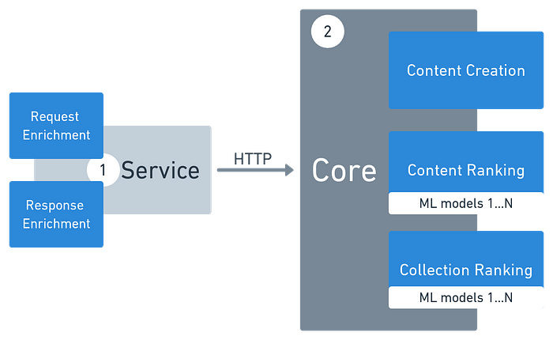
*Service Architecture*

Serving recommendations can be broken down into:

1. Understanding the user’s intent
2. Creating a content pool that fits the intent
3. Ranking the pool to provide the most relevant content first

**Service** (which handles Pt. 1 above) understands user intent. It spends most of the time waiting for responses from other services, and the garbage pressure is due to short-lived objects. This service is also less sensitive to GC pause times and follows the “most objects die young” philosophy behind garbage collectors. We use Java8 with a G1GC collector on 8 GB heap space for this service.

**Core** does most of the heavy lifting and handles Pt. 2 and 3 above. It spends most of the time ranking and the garbage pressure is because of a mix of short-lived objects during candidate creation, and long-lived objects in Machine Learning (ML) models. This service is extremely sensitive to GC pause times. Any STW (Stop The World) GC pauses adds directly to the overall latency, taking CPU time away from ranking. We use Java8 with a G1GC collector on 16 GB heap space for this service.

These two services are tightly coupled — neither of them can exist independently without the other. Merging them would retain the business functionality and reduce the resources spent on data transport and improve the hardware utilization.

## As they say, God is in the details

After removing the service hop in code, we ran a load test to validate the performance. The peak performance was 30% lower than expected!

The sinusoidal latencies and QPS indicated a potential GC issue, where pauses happen at a constant rate.


*Green: RPS, Red: 5xx*

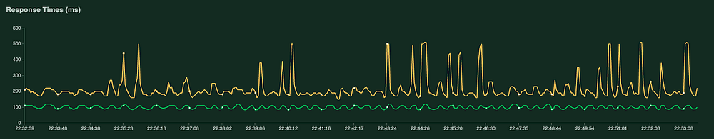
*Yellow: p95, Green: p50*

### Problem 1: Higher core utilization post service unification

We used JFR (Java Flight Recorder) and JVisualVM to identify GC issues. The results showed acceptable GC allocations and pause times, but we identified a significant increase in the overall CPU usage. There was also a 3x increase in the Load Average compared against the baseline performance.

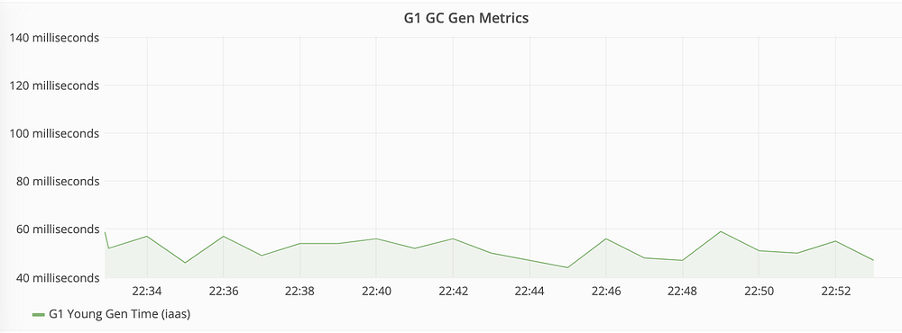
*G1 GC Young Collection Time*

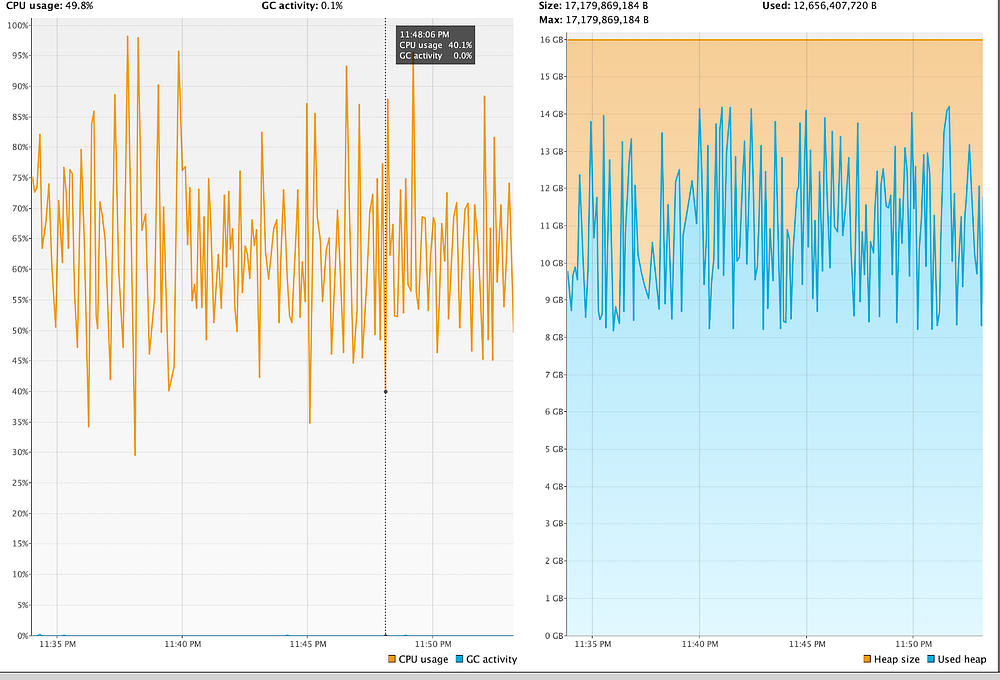
*CPU Usage and GC Activity*

How did we solve it?

While the telemetry tools reported normal GC CPU usage and pause times, the logs showed a significant increase in the concurrent time of the collector. When we analysed the CPU usage data via thread dump, we found that the top threads of the application were GC threads

**Let’s look at how the heap is used in the system:**

Recommendations is a personalisation problem domain, and we rely on many sophisticated ML models to determine what a user might find relevant. These models have millions of features pivoted on Demand, Supply and User Context. Including the experimental weblab models, at any point in time, 10+ models are active in the process memory.

Online Ranking is an expensive affair which requires feature transformations, lookups and scoring. Given that these operations are time sensitive, all the models are loaded in the JVM heap as a HashMap. These models contribute 100s of millions of long-lived objects that live through the life of the application and might occupy up to 60% of the heap.

Generational Garbage Collectors assume that most objects die young. By default, G1GC starts the initial mark phase (which starts marking all the live objects) when 45% of the heap is occupied. As the application’s heap is always occupied with many live objects, and new allocations happen constantly for the incoming requests, the garbage collector has to spend significant CPU time in the concurrent marking phase to identify the garbage in time, and meet the pause time goals. This resulted in a high CPU and frequent pauses that reduced the performance of the application threads and increased the utilization.

### How did we tame the increased utilization?

Once the root cause for increased core usage was identified, we had the following choices:

1) Move the models out of the Heap so the G1GC has an environment for which it is designed for, OR

2) Tweak the GC settings to workaround this issue.

We went with the former as it enables us to load more models in future and not be limited by the heap memory.

Using _off-heap memory_ for long-lived objects is not a new idea. It’s the fundamental implementation in many data systems like Hazelcast, Apache Flink and Druid, but to the best of our knowledge, they are rarely used alongside business logic in application systems.

Memory management in Java is split into three parts:

1. Heap Memory (Managed by Garbage Collector) : Heap memory used by the application where all the objects are allocated.
2. Reserved Off Heap Memory by JVM Runtime (Not managed by GC) : Off heap memory used and managed by the Java Runtime (metaspace, symbol cache), and not given access to the application code.
3. Reserved Off Heap memory (Not managed by GC) : Off heap memory that we explore as an option, and used by big data systems, is the native system memory allocated and managed the “unsafe” way. It is reserved under the same Java process, but outside of the garbage collector’s domain.

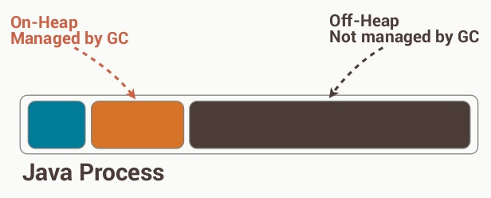

When objects are allocated on heap, Java understands that it’s a string, or an integer, or an object of a particular class. When objects are allocated out of the heap, they are stored and retrieved as a series of bytes, just as if they are fetched over a network. This involves an additional serialization and deserialization step for every update or retrieval of the data so that it can be translated to an object that can be used by the application.

For a high throughput user path service such as ours, we had two concerns in using off heap memory — CPU time in retrieving all the records and time spent in deserializing it.

We explored the performance impact of different options through JMH (Java Microbenchmark Harness).

Baseline was the HashMap implementation (loopGets).

Option 1 was using _Chronicle Maps_ by OpenHFT (loopGetsChronicle)

Option 2 was a custom implementation using ByteBuffer using FST (loopGetsCustomBHM) which claims to be the fastest Java object serialization framework.

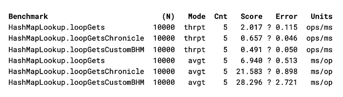
*One operation (op) is a 10,000 (N) sequential gets from the map. Throughput (thrpt) indicates the number of parallel ops that can be done every ms, and average time (avgt) is the time taken for each op in ms*

From this benchmark, _Chronicle Maps_ was the best performing Off Heap Implementation available off the shelf. However, there was a performance hit by moving from in-heap maps to any of the off heap maps. Average time to fetch the features increased from 7 ms to 21 ms and parallel calls that were handled reduced from 2 to 0.66 (at the same CPU usage).

While the performance of Chronicle Maps was worse than a HashMap in the micro-benchmark:

1. The additional CPU usage would be offset by the reduced GC CPU
2. The latency numbers are under the acceptable threshold. We could also place an in-heap HashMap for a few of the features that have a high hit rate — further reducing the overall latency.

We employed Chronicle Maps and migrated all the models to Off Heap memory. From the initial analysis, this resulted in approximately 150 million long lived objects that are no longer part of the GC consideration set. This had a direct impact on the time spent in the concurrent marking phase, and subsequently on the CPU usage. The top CPU consumers of the application are no longer GC threads after this change.

Comparing the detailed GC metrics through the logs for the same uptime:

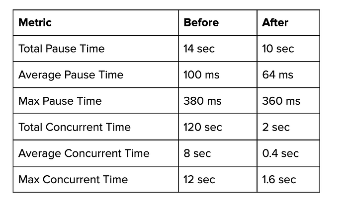
*GC Metrics Before and After*

While there is a 25% reduction in the pause time, **there is a whopping 98% reduction in the concurrent time!**

It was now time for a real world validation with a scale test:

Throughput — Before and After

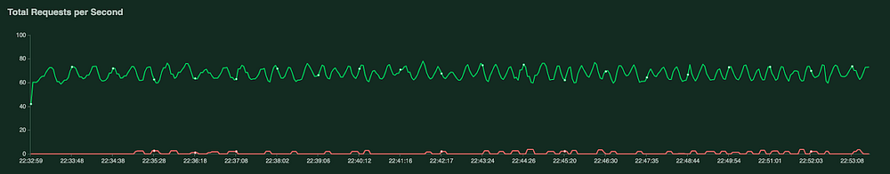
*Before. Green: RPS. Red: 5xx*

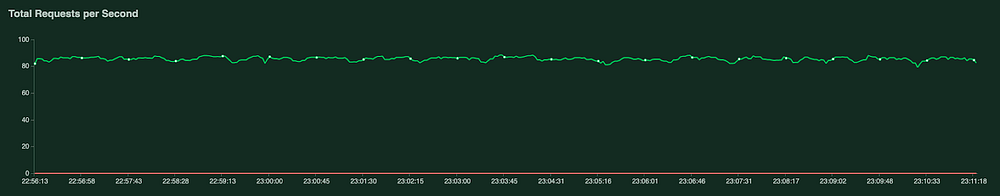
*After. Green: RPS. Red: 5xx*

Latency — Before and After


*Before. Yellow: p95, Green: p50*

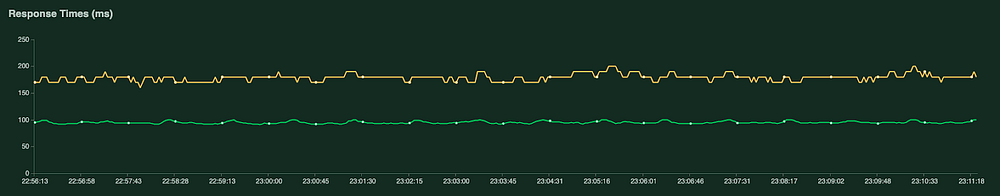
*After. Yellow: p95, Green: p50*

Overall, the throughput increased by approximately 40% and latency deviation fell from 300ms to 10ms.

### Is it the end of all our woes?

No.

Though we could run the combined services as a single process with better throughput and lower latency, during the soak test for these changes, we noticed that all the application servers crashed unexpectedly after a few days of uptime. The log messages before the crash on each of the servers were almost identical, but also equally cryptic. They all crashed while trying to spawn a new thread:

```
libgomp: Thread creation failed: Resource temporarily unavailable
libgomp: Thread creation failed: Resource temporarily unavailable
*** Error in `/usr/lib/jvm/jdk-8-oracle-x64/jre/bin/java’: free(): corrupted unsorted chunks: 0x00007fefe71bd750 ***
```

### Problem 2: Leak in Native Memory

_libgomp_ is a native library used in JNI calls for ranking. Given the error message, our first suspicion was a thread limit placed on our process group by _cgroup_. In the past, we had occurrences of our service breaching the cgroup limit, and immediately being killed by the OS.

Although this time, the kernel logs for cgroup limit breach were missing, indicating it wasn’t the reason for the crash. We identified the source of the issue from the system metrics:

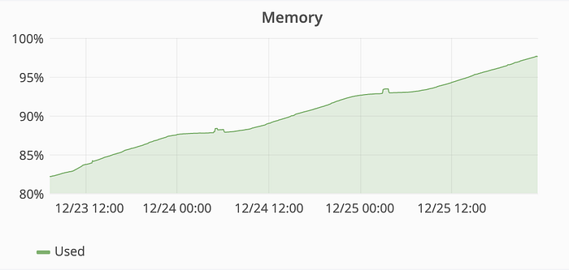

We ran out of the memory on the host, and new threads could not be spawned. However, there were no ‘Out Of Memory’ messages in the process which indicated that a memory leak was happening outside of the application code, and we looked for anything that might allocate memory outside of heap (sockets, metaspace, etc).

We used NMT (Native Memory Tracking), to understand the native memory usage in java.

It gave us visibility into the application’s off-heap native memory usage at a more granular level by giving individual memory footprints of Heap, Class, Thread, Code, Compiler, Symbol etc parts of the Java Runtime.

We noted the baseline memory usage of each of the above modules on server start and recorded periodic updates on the memory added to each of these modules. Here, the _Symbol_ module’s memory kept growing at the same rate, and the rate had a direct correlation with the QPS received on the host. The rate was lower during off hours, and higher during peak hours.

_Symbols_ are where _interned strings_ are stored in Java, and given that we don’t use interned strings in our application code, and Garbage Collector clears them, it was odd to see consistently increasing memory usage. Turns out, the [JVM version we were using had a bug](https://bugs.openjdk.java.net/browse/JDK-8180048) related to how G1GC clears strings, and because of this, strings leaked from the managed memory to the native memory over time, and eventually consumed the entire host’s memory.

Luckily, this was already fixed in an available JVM version, and the issue was resolved once we updated the version:

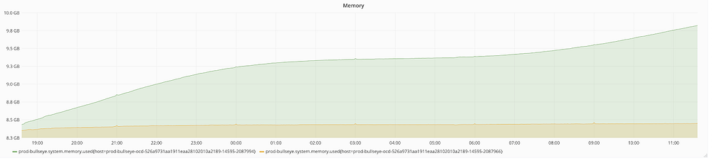
*Memory Usage of two hosts receiving similar traffic*

The yellow line is the host with the updated Java version, and the green line is the host with the Control Java version.

## Conclusion

- In our findings, if a user path system suffers from a performance issue, it’s almost always related to the Garbage Collector. It’s important to understand the nuances of GC, and to build applications that work within those bounds.
- Off Heap Data Structures should be explored when holding a lot of long-lived objects in heap (long-lived caches etc).
- Java has unparalleled support for tooling and telemetry, and it’s useful to know what is available so the right one can be picked to debug.
- Eliminate issues in the most probable order — starting with application code, to libraries, but don’t eliminate JVM / OS issues by default.
- Always keep JVM updated to the latest minor version.

## Appendix:

- [Chronicle-Map: Replicate your Key Value Store across your network, with consistency, persistence and performance.](https://github.com/OpenHFT/Chronicle-Map)
- [FST: fast java serialization drop in-replacement](https://github.com/RuedigerMoeller/fast-serialization)
- [Native Memory Tracking](https://docs.oracle.com/javase/8/docs/technotes/guides/troubleshoot/tooldescr007.html)
- [Apache Flink: Juggling with Bits and Bytes](https://flink.apache.org/news/2015/05/11/Juggling-with-Bits-and-Bytes.html)
- [Introduction to Hazelcast HD Memory](https://hazelcast.com/blog/introduction-hazelcast-hd-memory/)

---
**Tags:** Backend · Java · Memory Improvement · Scalability · Cloud
