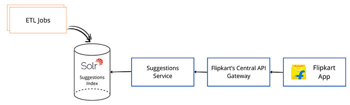
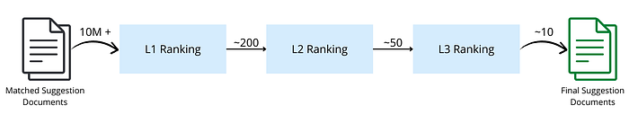
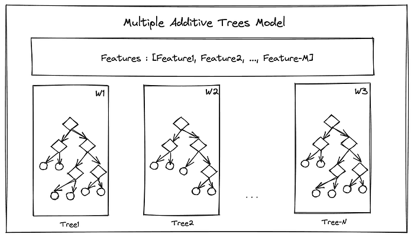
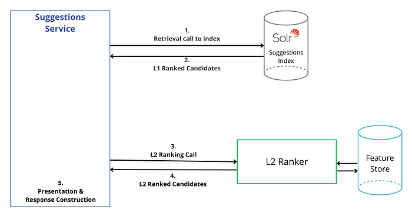
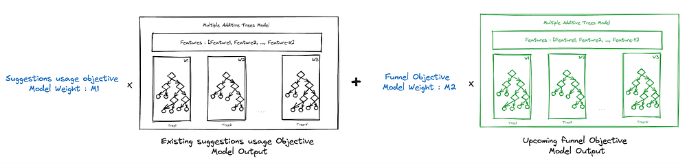
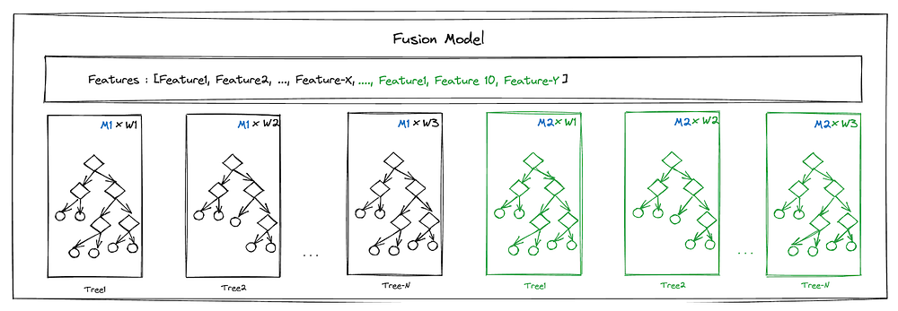

# Multi Objective Optimisation in Suggestions Ranking @ Flipkart

The evolution of LTR ranking models in a high-scale and low-latency system

At the scale of Flipkart’s massive active user base, our autosuggest system prompts about a billion Search queries each day. This increases manifold during sale events such as The Big Billion Days. Autosuggest is a typical Information Retrieval (IR) system that matches, ranks, and presents search queries as suggestions to reduce the users’ typing effort and make their shopping journey easier.

Each of these requests are unique to our system as we aim to provide a perfectly tailored set of suggestions for that user at that point in time. The problem becomes even more interesting for autosuggest as it is a highly latency sensitive system where the results need to change in a blink of an eye while the user is typing the search query.

The above diagram represents the overall shopping journey of a user landing on Flipkart’s home page to reach search results via autosuggest and further funnel into the product page and checkout page.

With our success of moving away from just ‘query popularity’ based suggestion ranking and creating more and more personalized results for each user (find details of one such personalisation initiative [here](./building-personalized-autosuggestion-9e705d5bf5f8.md)), in our AB experiments we noticed that while the users were using autosuggest more than before, the corresponding positive influence on later stages of the funnel ceased to show after some initial interventions.

We realized that ranking of suggestions should also optimize for funnel metrics along with user preference to offer an optimal end-to-end shopping experience to the user.

As part of understanding the solution, it is important to understand the ranking stack.

## Understanding Autosuggest Ranking Stack

Here is a 30000 feet view of the autosuggest architecture :

Each time a user types or deletes a character in the search bar (prefix), the system triggers an API call to the ‘Suggestions Service’ routed via Flipkart’s central API Gateway.

The ‘Suggestions Service’ internally relies on multiple data stores and hosted models for different aspects of forming a final personalized suggestions slate for the user at that moment.

The ‘Suggestions Index’ is hosted on top of Solr. The ETL jobs keep the index updated round-the-clock with the latest searched queries. The offline-generated suggestions reside in the index.

**_Note_**_: There are several other components which handle the autocomplete aspects via generating candidates in real time as well, which are beyond the scope of this blog._

The retrieval flow is like most other standard IR systems involving matching followed by ranking.

Ranking happens in a three-stage cascade, as detailed below.

We calculate the complexity of each stage considering the size of candidates and overall acceptable latency for retrieval in both matching and ranking.

In the initial state, L1 and L2 ranking both happen within Solr. We make use of Solr’s LTR module to host our Learning To Rank (LTR) models within Solr. Hosting this within Solr helped with quick hypothesis testing of the functional need for an additional L2 Ranking stage. Each Solr document also acts as our feature store for that candidate. Initially, the L2 ranking model was a GBDT (Gradient Boosted Decision Trees) model optimizing for increased clicks on auto suggest suggestions or Autosuggest usage / CTR.

## Multi-objective optimization in Suggestion Ranking

As the funnel metrics did not improve with each improvement in the above ranking model, despite the increasing autosuggest clicks, we also needed to identify the correct:

1. **Objectives** that Influence our target metrics, but do not lead to data sparsity issues.
2. **Modeling strategy **to see if the same model can be optimized for both autosuggest CTRs and down-the-funnel metrics.
3. **Engineering solution** to plug in that modeling strategy into our request path which meets the non-functional constraints of a system like autosuggest.

This article is about our engineering solution towards the suggestion ranking that improved the funnel metrics as well.

### Identifying the Objectives

We term success differently on different pages. For example, a product click on the search results page, an Add-to-cart or wishlist action on the product page, and checkout or the final purchase can be called a success, attributed to all the previous stages of the journey. We considered successes at different stages of the funnel as probable objectives for our model alongside the existing objective of successful click on an auto-suggest suggestion.

After analyzing different distributions, sparsities of features/labels, and correlations between success metrics at different stages of the funnel, we settled on one objective to prioritize alongside autosuggest clicks.

### Identifying the Modelling Strategy

We brainstormed several modeling strategies:

- Introducing one more layer in the cascaded setup
- Training a model with a combined objective
- Creating an independent model and using an ensemble of the new and existing model at the L2 stage itself.

From a data science perspective, having an independent model came out to be the most optimum choice. Thus, it was decided that after this change, the final score of the L2 ranking stage should become w1 x AS-CTR-model-score + w2 x Funnel-Objective-model-score aka ensemble model score.

## Hosting multi-objective ensemble model

This brings us to the engineering problem of how to host a multi objective ensemble model in our existing setup.

### Introduction to Solr’s Learning To Rank Module

The [Solr LTR Module](https://solr.apache.org/guide/8_7/learning-to-rank.html) offers the capability to host models that help us re-rank an already ranked list of candidates (L2 ranking after L1 ranking in our case). It currently offers support for different models like linear models, multiple additive tree based models or even neural networks.

The module expects models to be represented in a particular Json format and feature computation logic to be defined as [function queries](https://solr.apache.org/guide/7_7/function-queries.html).

Our model optimizing for autosuggest CTR was a multiple additive tree based model. A typical representation of that model would look like this:

The model primarily comprises:

1. **List of features to be used in the model**: Before the inference begins for a candidate internally, the features mentioned in this list are computed to construct the feature vector with the feature definitions from a separate file. This enables sharing of feature definitions across models that share the same features.
2. **List of decision trees represented in Json format**:

a. Each node of the decision tree represents a condition corresponding to a feature (say, if feature-1-value < X, go left, else go right) and the leaf nodes have floating-point values which become the output of that tree.

b. Each tree has a weight associated with it, representing the importance of the decision conditions within, in formulating the score via that model. So once the leaf node is reached post traversal, that value is multiplied with the weight of that tree.

The final score of the model is the addition of the weighted sum of all the tree outputs.

### Challenges with using Solr LTR Module

The constraint here is that for a particular request, it allows only one model to be engaged and there is no provision for us to re-rank the same set of L1 ranked candidates using 2 different L2 ranking models and then do an ensemble-based scoring.

We explored multiple solutions. The most promising ones were the following :

**Solution 1: Moving L2 Ranking entirely outside the index**

Move L2 ranking entirely outside the index, as a separate component interacting with an external feature store too, to ensure separation of concerns both in terms of responsibility and compute capacity.

This solution was ideal because it provided the following capabilities:

1. Host more complex models on superior hardware (GPUs instead of CPUs even).
2. Update features independently in the feature-store in real-time.
3. Write easily readable feature definitions in widely-adopted languages like Java/Python.

This separated the compute heavy L2 ranking from an index’s primary responsibility to perform core IR operations, giving us the ability to scale both parts horizontally and independently.

The only limitation here was that it did not align with the timelines we had. These changes needed significant effort and non-functional POCs to confirm the latency constraint of L2 ranking in single-digit milliseconds to be met.

Thus, we decided to pick this when we can prove the goodness of adding a more complex L2 ranking step

**Solution 2: Write a custom implementation of the LTR Scoring Model**

Another option was to write a custom implementation of the [LTRScoringModel](https://solr.apache.org/docs/8_7_0/solr-ltr/org/apache/solr/ltr/model/LTRScoringModel.html) class in Solr which could internally orchestrate many existing model inference implementations such as [MultipleAdditiveTreesModel](https://solr.apache.org/docs/8_7_0/solr-ltr/org/apache/solr/ltr/model/MultipleAdditiveTreesModel.html) or [LinearModel](https://solr.apache.org/docs/8_7_0/solr-ltr/org/apache/solr/ltr/model/LinearModel.html), do a final-weighted scoring of all model outputs, and return a final L2 ranked candidate set.

Although possible, this change involved significant changes to a lot of native Solr constructs like LTRScoringQuery, RerankQueryParserPlugin, etc. While Solr provides the capability to plug custom implementations of ScoringQuery or QueryParsers, there were few cons:

1. As we make custom implementations of these core pieces in Solr, those would have to be plugged in every time we undergo a Solr version upgrade, else we miss out on the other improvements in these pieces.
2. If we were to contribute this change back to the Solr open source codebase and make them a part of its evolution, it meant adding a lot more configurability to keep it generic enough with the questions:
3. Should this be an index’s core responsibility?
4. Is this a useful and generic use case?

Since Solution-1 was huge in effort and Solution-2 was not ideal, we had to think about another quick way of enabling this multi model ensemble setup. The next section describes our solution.

**Solution 3: The quick Multi-Objective Optimization (MOO) setup**

We wanted to rank our candidates based on the combined score of the two models. The following is an illustration of our final score:

As Solr gives the capability to engage just one model and ranks candidates based on its output, our candidates cannot go through both independent models for a final score as expected above.

Looking closely at the model representation, we realized that there was one way to enable this setup in Solr. If we could leverage the tree weights in the Solr tree representation to account for not just the tree, but also the model weight, we could represent both models as a single fusion model and get a combined score. The fusion model would be created as outlined below:

1. Features: We can take a union of features in both models and form the list of features.
2. Trees: We’d just append the list of trees and form a combined list.
3. Weights: The weight of each tree would become the tree-weight W multiplied by the model weight M.

Diagrammatically, it’ll look something like this:

The above arrangement works perfectly well for our target use case. There are some obvious cons to the approach. This arrangement does not work if:

1. Model for one objective is linear, and another is tree-based.
2. We deploy two models whose weights would also be known dynamically on the online path and updated in real-time.

These make it less-likely to support our future use cases, but it makes the playground ready to test the multi-objective hypothesis quickly.

## The Conclusive State

We successfully concluded multiple iterations of improving both of our models via the quick MOO solution. We saw significant improvements in the down-the-funnel metrics too.

Having established the goodness and need for a multi-objective ranking setup in the L2 Ranking phase, we have now moved towards Solution-1, since we need the ability to host more complex models, with custom-written feature definitions and engage them in parallel also to keep latencies in check.

Over time, we have moved to performing L2 ranking via a custom implementation which does the same job in half the latency for us, while providing the needed extensibilities, as required for the Solution-1.

---
**Tags:** Apache Solr · Solr · Ecommerce · Optimization · Suggestions Ranking
