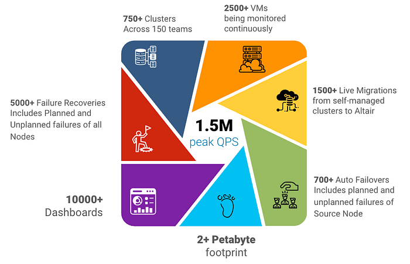
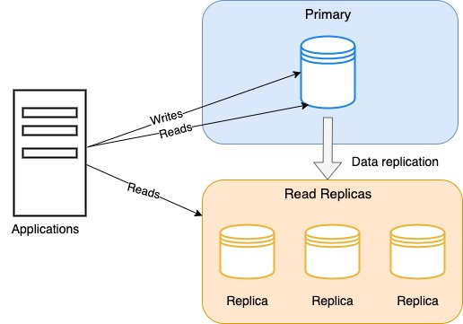
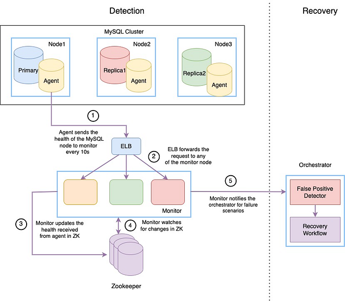
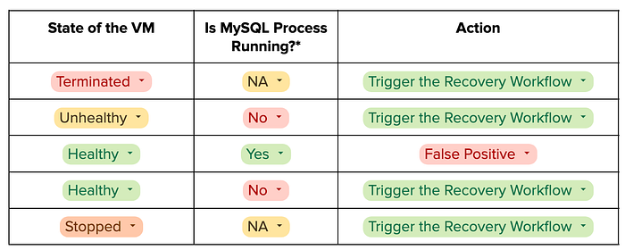
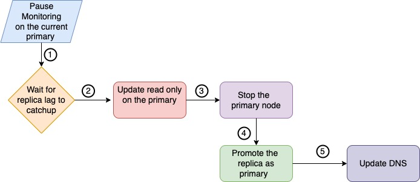
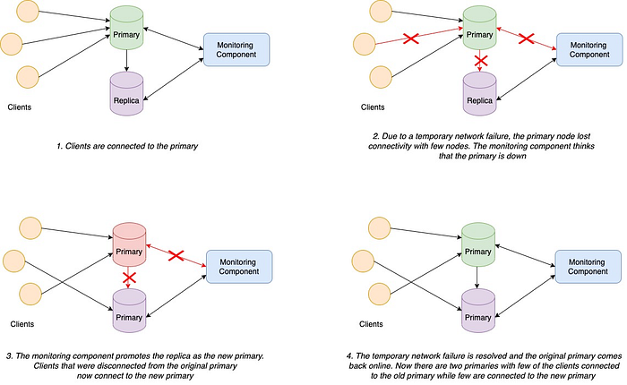
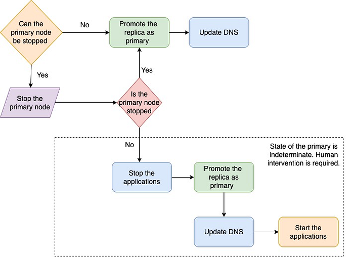

# MySQL High Availability

Flipkart follows a microservices architecture with thousands of services largely divided into systems such as order management, supply chain, logistics, and seller management systems. Logistics and supply chain systems tend to possess data models that are inherently relational and transactional. This makes MySQL one of the most-used data stores in Flipkart for its durability and transactional guarantees.

Flipkart initially started with on-premise data centers, then moved to private cloud, and is now foraying into hybrid cloud. Initially, every team managed its own MySQL clusters. It took significant time in the operational tasks involved in maintaining a MySQL cluster. Further, MySQL skill levels, developer bandwidth, best practice adoption, DB tuning, scalability, performance, security, auditing, and compliance focus varied between teams.

This overhead scales up during heavy-traffic times such as Flipkart’s Big Billion Days (BBD) and festival season sales.

Enter **ALTAIR** — the homegrown managed MYSQL service that manages and maintains the High Availability of MySQL clusters. It enables the developers to spend less time on database operations and focus more on product development.

### ALTAIR - Flipkart’s Managed MySQL as a service

Altair has weathered multiple Big Billion Days, Flipkart’s flagship sale event, and has sailed through the test of times. Here are a few stats which provide a testament to the quality of service.

*Stats as of Sept’23*

This write-up focuses on Altair’s “High Availability” solution that helps to run MySQL clusters reliably with minimum downtime. Let’s first understand the meaning and importance of High Availability and move on to how we achieve High Availability in Altair.

**What is High Availability?**

High Availability (HA) is the ability of the system to operate continuously without failing for a specific period. HA solutions ensure that the system meets the agreed-upon service level agreements (SLAs). Since it is challenging for non-trivial systems to be available 100% of the time, most organizations usually aim for the five nines or 99.999% availability.

**Why is High Availability important?**

Imagine a scenario where the warehouse service goes down during a sale event. Order management service might be affected in the absence of true inventory counts. Resources in the warehouse might not be utilized efficiently. Orders may not get dispatched on time. Eventually, deliveries might get significantly delayed. This can cause significant business impact, resulting in substantial financial losses. This is a good example of why an organization’s critical applications must be highly available.

Let’s look at how we achieved High Availability in ALTAIR.

### High Availability in ALTAIR

Altair serves a wide variety of use cases within Flipkart. The MySQL clusters are mostly set up with a “primary-replica” configuration. The primary accepts the ‘Writes’ and can also handle the ‘Reads’. The replicas in the cluster asynchronously replicate from the primary and serve the ‘Read’ traffic.

The high availability of the primary node is essential for the cluster to continue accepting ‘Writes’. As hardware failures can happen in data centers, the primary node can fail. Upon failure of the primary node, the monitoring system should trigger the recovery workflow to promote one of the replicas as the new primary. This is called the _fail-over_ _process_. **Post the fail-over, clients should be able to identify the new primary node in the cluster and redirect the ‘Writes’ to the new primary.**

Each service might have one or many of these different factors as requirements for a fail-over process based on the SLA. The fail-over process depends on various factors:

1. How much data loss can be tolerated?
2. Is fault detection reliable? How do you reduce false positives?
3. Is the fail-over process reliable? Can it fail?
4. Can it tolerate network partitions?
5. How do you fence off the dead primary? ( Stop the old primary from accepting ‘Writes’ again )
6. How do you mitigate split-brain scenarios?
7. Is the fail-over manual or automatic?

The fail-over process involves multiple steps:

1. Failure Detection
2. Detecting false positives
3. The fail-over
4. Service Discovery
5. Fencing the old primary

Let’s look at each step in detail.

### Failure Detection

The first step in the fail-over process is to detect the failure. Primary nodes can fail for many reasons — power loss, hardware failures, network failures, etc. The primary node can also go down during planned maintenance for reasons such as OS upgrades, hardware replacement, security patches, and network upgrades.

**How does Altair detect the failure?**

Let’s look at the brief architecture of the failure detection process and the role of each of the participating components.

**Agent**

1. Runs as a daemon along with the MySQL process
2. Collects health metrics about the state of the instance, disk usage, replication status and lag, and state of MySQL process
3. Sends the health update to monitor every 10 sec.

**Monitor**

1. The monitor is a microservice written in Golang and acts as a gateway to Zookeeper.
2. Each monitor node is allocated a subset of MySQL nodes to oversee.
3. Updates the health events ( received from an agent ) in Zookeeper every 10s.
4. The monitor node watching the MySQL node gets notified about the update.
5. Monitor compares the previous health with the latest health received from the agent.
6. Determines if there is any MySQL failure or any breach ( disk usage, replication lag, etc.)
7. Notifies the orchestrator about the failure.

**Orchestrator**

1. Orchestrator checks for false positives
2. Triggers the recovery workflow in case the failure is guaranteed.

_To summarise, the agent and monitor are responsible for detecting the failure while the orchestrator checks for false positives and triggers the fail-over process._

### Detecting False positives

The fail-over process in a MySQL cluster with async replication can entail data loss and downtime. It is important to check for false positives before triggering the recovery.

**Naive Approach**

A naive approach could be to probe the primary node and trigger the recovery process if the primary node is not reachable. This approach is susceptible to false positives in case of intermittent network failures or MySQL restarts. An improvement to this approach could be to probe the primary node ‘N’ times, each probe after a duration ‘t’. While this approach might help detect intermittent failures, it can delay the recovery process if there are true positives.

Hence, it is essential to conduct comprehensive health checks before initiating the recovery process. Now, let’s delve into the detailed health check implemented in Altair.

**Deep Health Checks**

The orchestrator uses the following checks before ascertaining the failure:

- What is the state of the underlying VM?
- Is a replica able to connect to the primary node?
- Is the MySQL Primary reachable?

Here’s the ruleset for the orchestrator to decide whether it should trigger the recovery workflow

**_* We consider MySQL to be up if the orchestrator can connect to the MySQL primary node or if a replica can connect to the primary node._**

### Failover

The recovery workflow consists of multiple steps, where each step is an individual executable task. Upon detecting the primary failure, the orchestrator service executes the fail-over job.

Let’s see what entails the fail-over process in Altair.

1. **Pause Monitoring**: Pauses the monitoring of the node while the recovery is in progress.
2. **Replica lag catchup**: **Waits for the SQL thread to process and apply all the log entries.**
3. **Update read_only on the primary**: Updates read_only on the primary node for planned failovers. In case of unplanned failover, where the primary node is unreachable, this step is skipped.
4. **Stopping primary: **Stops the primary node in order to avoid split brain problems. More on this later in the blog.
5. **Promote the replica: **Promotes the replica as the new primary node.
6. **Update DNS: **Updates the DNS of the primary node with the IP of the promoted replica.

### Service Discovery

Altair uses DNS for service discovery. Clients discover the primary node using the DNS which resolves to an IP address of the primary node. On successful fail-over, Altair updates the DNS with the IP of the new primary node. This means that clients don’t need to restart their applications to connect to the new primary.

### The Split Brain Problem

**What is Split Brain?**

Split brain is a state in the MySQL cluster when two nodes in the cluster start accepting ‘Writes’ i.e., there are two primary nodes. A split-brain scenario occurs when the fail-over process is unable to cordon off the primary node before promoting one of the replicas as the new primary.

**How does a split brain occur?**

The split brain generally occurs when different nodes in a MySQL cluster spread across different fault domains get network partitioned. Here is a pictorial representation of one of the scenarios which lead to split brain.

When a network partition causes a split brain, it’s impossible to ensure both consistency and availability as per the [CAP](https://en.wikipedia.org/wiki/CAP_theorem) theorem. In a MySQL cluster with async replication, it cannot guarantee data consistency when the network fails. If we prefer availability over consistency, the fail-over process should promote the replica as the new primary to ensure ‘Write’ availability.

**Why should we prevent the split-brain scenario?**

Imagine the order management service in an e-commerce industry suffers from a split-brain situation. Here, the orders will be split between the two databases. Even though the user has placed an order, the user might not fetch the order details. This leads to a degraded user experience. It also poses a challenge for the service owners to reconcile the data. For instance, Github faced an [outage](https://github.blog/2018-10-30-oct21-post-incident-analysis/) on 21st Oct 2018 because of an issue with the network connectivity between two data centers. While they restored the connectivity in 43s, it took 24 hrs and 11 minutes to reconcile the data that resulted from split writes between the two data centers.

The fail-over process should therefore build guardrails to fence off the old primary before promoting the replica as the new primary.

**How does Altair prevent split brain?**

Here’s a pictorial representation of the workflow to identify and fence off the old primary before promoting the replica.

As discussed in the fail-over section, the fail-over job has the task of stopping the primary node before promoting the replica. If the node cannot be stopped, the fail-over job continues with the next step i.e., promoting the replica as the primary.

In network partitions where the state of the primary is indeterminate, the fail-over job pauses automatically. We notify clients to stop their applications. The fail-over job is then resumed with the next steps of promoting the replica and updating the DNS. Clients now restart the applications to ensure that all the connections point to the newly promoted primary.

So far, we have discussed the various steps in the fail-over process and the complexities involved in each step. Now, let’s look at the different failure scenarios and how Altair detects those failures and recovers from them.

### Different Failure Scenarios

**Node failure**

The roles of each component in node failure detection are as follows:

1. Node dies.
2. Monitor misses three consecutive agent health updates.
3. The monitor marks the node as unhealthy after 30s.
4. The monitor notifies the orchestrator about the failure.
5. The orchestrator validates the failure and then triggers the recovery process.

**MySQL failure**

The following steps describe the role of different components involved in MySQL failure detection:

1. MySQL process fails.
2. Agent sends the state of the MySQL in its health update to the monitor.
3. The monitor identifies that the node is up but the MySQL process does not run.
4. The monitor notifies the orchestrator about the failure.
5. Orchestrator validates that the node is up but the MySQL process has failed.
6. The orchestrator triggers the recovery process.

**Network partition between the primary and the replicas**

This failure scenario is not a candidate for triggering the fail-over.

**Network partition between the control plane and the primary**

Either the orchestrator or the monitor can be partitioned with the primary or both can be partitioned with the primary.

**Orchestrator and primary**

1. The monitor receives the health updates from the agent running in the primary node.
2. For node or MySQL failures, the monitor will notify the orchestrator about the failure. Since the orchestrator is partitioned with the primary node, the ping checks to the node and MySQL will fail.
3. The orchestrator can promote one of the replicas as the new primary, provided the replica is not network-partitioned with the orchestrator.** The fail-over process ensures that the affected primary is fenced off before promoting the replica.**

**Monitor and primary**

1. The monitor doesn’t receive the health updates from the agent and notifies the Orchestrator about the failure.
2. Orchestrator detects that the node is healthy and the MySQL process is running.
3. The orchestrator treats this as a false positive.

**Orchestrator and Monitor are partitioned with the primary**

1. The monitor doesn’t receive the health updates from the agent and considers this as a failure.
2. The monitor notifies the orchestrator about the failure.
3. Now, it’s similar to the case where orchestrator and primary are partitioned.

### Highlights of the High Availability Solution

With the above High Availability architecture, we could:

- **Prevent the split brain situation:** Ensure cordoning off the dead primary before promoting one replica as the primary.
- **Scale our monitoring system: **As the number of clusters to be monitored increases, we can scale our monitor component horizontally.

### Putting it all together

In this blog, we discussed the various steps involved in the fail-over process. We also discussed the high-level architecture of the failure detection and the recovery process in Altair.

Each step in the fail-over process has its own challenges and there are several considerations that go into implementing each of these steps. Altair, with its robust implementation of the fail-over process, has detected and recovered from 500+ primary failovers.

Though our implementation of the fail-over process prevents split-brain scenarios, it requires coordination with the application to cordon off the dead primary. More work is in progress to control it completely from the platform rather than relying on the application.

Thank you for your time on this article.

---
**Tags:** MySQL · High Availability · Split Brain · Altair · Backend
